# Enchron 架构

Enchron 是唯一产品与代码仓库。`Packages/PlaybackCore` 是仓库内独立 Swift Package，拥有媒体会话、时间线、sample 与 renderer graph；Entry App 拥有来源、产品策略、SwiftUI、RealityKit 和空间呈现。模块独立不产生第二套产品、状态机或文档体系。

## 系统主线

```mermaid
flowchart LR
    Sources["来源\nFiles · Photos · SMB · WebDAV"] --> Library["Media Library\n引用 · 分类 · 持久化"]
    Library --> Resolve["Source Resolution\n授权 · 远程流 · provenance"]
    Resolve --> Launch["PlaybackLaunchCoordinator\n续播 · 结束策略 · 启动"]
    Launch --> Runtime["PlaybackRuntime\n应用控制与只读投影"]
    Runtime --> Core["Packages/PlaybackCore\n唯一 Media Session 与 timeline"]
    Core --> Binding["Renderer Consumer Binding\nRealityKit entity"]
    Binding --> Presentation["Playback Presentation\nWindow · Docked · Panorama"]
    Presentation --> UI["Enchron Entry App\nSwiftUI 与场景卡片"]
```



一次产品播放只有一个 `PlaybackCoreController`、一个 Current Media Slot、一个 Media Session 和一个 renderer graph。`PlaybackRuntime` 负责把 App 请求交给核心并把核心状态投影给产品；它不得自行决定 seek 先后、推进媒体时间、伪造 ready/playing/ended，或维护第二个播放会话。

## PlaybackCore 内部结构

```text
Source Admission -> Media Session -> Demux Provider
                                         |-- compressed video samples
                                         |-- audio samples
                                         `-- track and timed metadata facts
                                                    |
                                                    v
                                      Renderer Input Coordination
                                                    |
                                                    v
 AVSampleBufferVideoRenderer + AVSampleBufferAudioRenderer + Synchronizer
```

- `Source Admission` 接受 Entry App 已解析的来源与访问事实，并管理唯一 Current Media Slot。
- `Media Session` 拥有一次 accepted open 到 close/failed 的身份、控制操作、Stream Epoch、Format Revision 与 stale rejection。
- `Demux Provider` 打开容器、建立轨道模型并组装 sample。产品路径由 FFmpeg 解封装；Apple compressed route 只作为验证参考，不是产品 fallback。
- `Renderer Input Coordination` 通过 AVFoundation Receiver 管理 audio/video backpressure、timeline、enqueue、flush、end 和 error。
- `Renderer Graph` 组合 video renderer、audio renderer 与共享 synchronizer。AVFoundation 拥有解码、HDR/Dolby Vision 解释和最终渲染。
- `Diagnostics` 发布与当前 Media Session 可关联的 records、事件和 Debug Snapshot；Snapshot 不是第二套状态机。

## 模块所有权

| 模块 | 拥有 | 不拥有 |
|---|---|---|
| `Packages/PlaybackCore` | container、track、sample、Media Session、播放生命周期、seek/rate/track transaction、renderer graph、诊断事实 | SwiftUI、来源长期授权、续播/下一项策略、RealityKit entity、窗口和空间 |
| `XrPlayer/App` | 来源交接、产品策略、核心控制入口、核心状态只读投影、错误呈现协调 | demux、sample、timeline、renderer queue、第二 Media Session |
| `XrPlayer/PlayerUI` | 生产 SwiftUI 页面、transport 输入、Window 播放 surface | 播放事实与核心调度 |
| `XrPlayer/SpatialScene` | Environment Context、Docked/Panorama 生命周期、目标 surface attach/rollback | renderer graph 与媒体时间线 |
| `XrPlayer/FileBrowsing` | Media Library、本地/Photos/SMB/WebDAV 来源和持久引用 | 媒体字节所有权与播放状态 |
| `Packages/RealityKitContent` | Enchron 使用的 RCP 场景交付 | 播放行为 |

## Entry App 与验证入口

历史 Verify App 的非 SwiftUI 播放控制和断言是 Entry App 播放功能的基准。macOS target 是同一 Entry App application control 的 L2 平台入口；Core scenario 只是绕过产品来源和页面的验证模式，App Adapter scenario 使用生产 `PlaybackRuntime`。二者共享 fixture、renderer consumer、控制矩阵和节点断言，不形成平行 App。

系统节点 01–09 统一位于 `docs/acceptance/nodes/`。节点描述完整产品链，文件位置不随实现模块拆分；每个节点分别声明实现所有者、证据所有者和完成边界。

## 不变量

- 产品只有一条 FFmpeg demux → compressed sample → AVFoundation renderer 路径；验证 route 不进入产品 UI，也不参与失败后的隐藏切换。
- `Playback Lifecycle` 由 PlaybackCore 唯一发布；`Playback Presentation` 由 Entry App 管理，两者不能压成同一个“播放模式”。
- Window、Docked、Panorama 迁移同一个 renderer。目标 surface 与 renderer binding 成功后才提交；失败回滚到原 Presentation，不重开 Media Session。
- 三个 Playback Presentation 统一使用 `VideoPlayerComponent(videoRenderer:)`。每个 `RealityView` 拥有自己的 Video Entity；迁移的是 renderer binding，不把 Entity 实例跨 scene 搬移。Window 位于 WindowGroup 的 RealityView，Docked 与 Panorama 位于 ImmersiveSpace 的 RealityView。
- Docked Video Entity 挂到 Xrplay_scene 交付的唯一 `PlaybackSurfaceAnchor` 下。场景拥有基准位置与朝向；Enchron 拥有 Screen Size uniform scale；RealityKit 拥有视频 mesh、material 与实际呈现模式。
- Media Library 只保存引用。分类、移动或删除引用不得复制、移动或删除媒体字节。
- DesignPreview、SwiftUI Preview 与测试复用生产组件和页面；fixture adapter 不维护平行产品行为。
- L1、macOS L2 Core、macOS L2 App Adapter、visionOS Simulator 与 Vision Pro L3 是递进门槛，上层结果不能反推下层通过。

行为合同见 `docs/core-spec.md` 和 `docs/product-requirements.md`；唯一验证规则见 `docs/acceptance/verification-system.md`。
