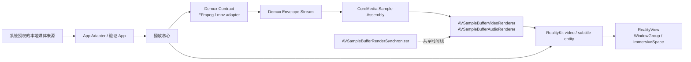

# 播放核心架构地图

## 模型

播放核心的目标路线是：App 取得本地媒体来源，demux adapter 负责容器、轨道、seek 和解封装，播放核心把 provider-neutral 解封装事实组装成 CoreMedia sample，Apple sample-buffer renderer 与 RealityKit 负责系统解码、时钟、显示和 scene 承载。第一套实现使用 FFmpeg adapter；稳定后再接入 mpv fork adapter。

## 目标管线

## 边界地图

| 区域 | 所有权 | 相邻所有者 |
|---|---|---|
| App Adapter / 验证 App | 系统文件入口、SwiftUI scene、`RealityView` 摆放、产品播放形态编排、验证观察。 | 解封装、sample 组装、renderer 时间线和播放状态归播放核心。 |
| 播放核心 | 控制面、状态面、实体面、诊断面、Media Session、Track Model、sample 组装、renderer coordination、RealityKit entity。 | SwiftUI、正式产品 UI、播放列表、续播、网络缓存和体验策略归 App。 |
| Demux Contract | 以 provider-neutral 事件表达容器、轨道、seek、packet、format change、flush、EOF 和 metadata 等解封装事实。FFmpeg 与 mpv 分别作为 adapter。 | 解码和显示归 Apple media，RealityKit 绑定归播放核心。 |
| CoreMedia sample assembly | 把 Demux Envelope 转换成 video / audio `CMSampleBuffer` 或 control marker。 | enqueue 归 renderer graph；硬件解码与可见性分别由 L3 和呈现桥验证。 |
| AVFoundation renderer graph | video / audio renderer、backpressure、flush、renderer error、共享时间线。 | sample 由 assembly 组装，entity 由 RealityKit binding 建立。 |
| RealityKit binding | 把 active video renderer 写入 `VideoPlayerComponent(videoRenderer:)` 并挂到 video entity。 | entity 的 scene 摆放归呈现桥。 |
| RealityView presentation bridge | 把 video entity 和字幕可呈现物放入 SwiftUI scene / `RealityView`，解释 Window、Docked Immersive、Panorama、Portal。 | 真机硬解、Apple Projected Media Profile (APMP)、High Dynamic Range (HDR) / Extended Dynamic Range (EDR)、thermal 和听感由 L3 验证。 |

## 文档边界

| 文档 | 负责什么 |
|---|---|
| `docs/core-spec.md` | 播放核心当前设计规格。 |
| `docs/acceptance/verification-system.md` | 验收规则、测试设计、证据层级和证明方式。 |
| `docs/acceptance/nodes/` | 每个节点是什么、输入输出是什么、边界在哪里。 |
| `docs/acceptance/runtime-control.md` | active Media Session 上的运行时控制地图。 |
| `docs/acceptance/evidence.md` | 已经发生的验收事实和 evidence ID。 |
| `docs/fixtures.md` | 测试素材分类和 registry schema。 |
