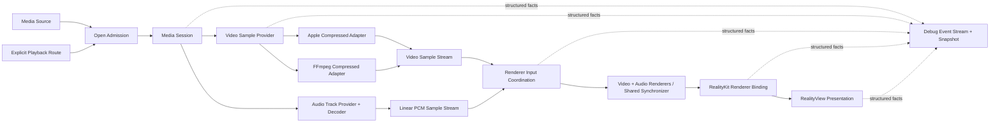

# PlaybackCore 架构地图

## 系统主线



两条路线的差异在 `VideoSampleProvider` 模块内结束。下游只理解统一的 Video Sample Stream 与 input kind，不理解 `AVAssetReader`、`AVFormatContext`、`AVCodecContext` 或其他 Provider 私有对象。

## 模块地图

| 模块 | Interface | Implementation ownership |
|---|---|---|
| Source Admission | `open(source:route:)`、source facts、admission result | App Adapter 提供来源事实；PlaybackCore 决定当前媒体槽位是否接受。 |
| Media Session | session identity、route、lifecycle、node records、Open / Runtime Operation | PlaybackCore 拥有；App 不直接修改内部节点状态。 |
| Video Sample Provider | prepare、event delivery、seek、cancel；输出 route-owned records 与 Video Sample Stream | Apple 对照 adapter 拥有 AVFoundation；FFmpeg 主线 adapter 拥有 demux 与 compressed sample assembly。 |
| Audio Track Provider | enumerate、select、decode、seek、cancel；输出 Linear PCM sample | FFmpeg adapter 拥有 demux / decoder / resampler；两条视频路线共用，不复制音频播放器。 |
| Renderer Input Coordination | accept compressed video sample、Linear PCM sample 与 control marker；play、pause、seek reset、close；输出 video input 与 audio renderer records | PlaybackCore 拥有两条输入 lane 的 readiness、backpressure、共享 timeline、flush、end 和 renderer error。 |
| RealityKit Renderer Binding | active renderer → planar `VideoMaterial` 或 immersive `VideoPlayerComponent` → video entity | PlaybackCore 提供 renderer 并验证/记录 binding；App Adapter 按产品形态选择唯一 active RealityKit 呈现器。任意稳定时刻只有一个 active binding。 |
| RealityView Presentation | renderer-backed entity + presentation context → active `RealityView` | macOS / visionOS App Adapter 拥有 scene 与 `RealityView`。visionOS 只建立一个 Playback Window `RealityView` 和一个使用 progressive `ImmersionStyle` 的 Playback `ImmersiveSpace`；Flat / Portal 复用窗口，Docked / Panorama 复用沉浸空间。PlaybackCore 不 import SwiftUI。 |
| Diagnostics | Debug Event Stream、versioned Debug Snapshot、evidence export | 节点发布结构化事实；Snapshot 只做派生投影，App scene facts 保留 provenance。 |

## 关键 seam

### Provider seam

`VideoSampleProvider` 是真实 seam，已有 Apple Compressed 对照 adapter与 FFmpeg Compressed 主线 adapter。稳定接口以 route-owned event 和 record 为测试面；裸 `CMSampleBuffer` 只是 payload，不足以表达 session、track、epoch、format revision 和来源追溯。

### Renderer seam

Renderer Input Coordination 是深层模块。两条 compressed 视频路线在 enqueue、timeline、backpressure、flush、end 与 error 语义上统一；Projection 与 Stereo override 都在两条路线汇合后的共享 sample-format seam 修改 format description，保留 payload、timing、attachments 与 HDR / Dolby Vision signaling，不复制 Provider 或 renderer。共享 PCM audio lane 在同一 graph 中使用独立 renderer readiness，并与视频共用 synchronizer 时间线。

### App Adapter seam

PlaybackCore 拥有播放事实与 active renderer；App Adapter 拥有 `VideoPlayerComponent`、entity、文件入口、SwiftUI scene、`RealityView` 和产品摆放。visionOS 的 Control Window、Playback Window、Scene Lifecycle、Scene Content、Playback Placement、Projection Intent 与 Stereo Layout 是正交状态。Control Window 独立承载所有 SwiftUI 控件且不含 `RealityView`；Playback Window 与 Playback Immersive Space 是 content-only 承载面。UI 与自动回归只调用统一的 `PresentationCommand`；命令按 target attach → entity migration / binding → target mode acknowledgement → renderer settle → source cleanup 完成一个合法用户意图，失败时按相反所有权恢复来源并显式报告 rollback failure。App Adapter 分开回填 Candidate Product Shape 与经过 binding / renderer 证明的 Presented Product Shape；核心不得猜测 SwiftUI scene 状态，也不得把 desired intent 当作 presented fact。

### Audio seam

音频轨道枚举与选择独立于两条视频 Provider。选中的压缩音轨由 FFmpeg 解码并重采样为交错 Float32 Linear PCM，交给 `AVSampleBufferAudioRenderer`。音频 renderer 与视频 renderer 必须属于同一个 `AVSampleBufferRenderSynchronizer`；seek、倍速和暂停只修改这一条共享时间线。

## 节点推进

```text
1 Source Acquisition
→ 2 Media Session and Route Binding
→ 3 Provider Open Snapshot
→ 4 Video Track Model
→ 5 Route Media Event Stream
→ 6 Video Sample Stream
→ 7 Renderer Input Coordination
→ 8 RealityKit Renderer Binding
→ 9 RealityView Presentation
```

每个实际启动的节点都产出自己的 record，结果只有 `succeeded`、`failed` 或 `terminatedByCleanup`。失败不交给下一个节点补救；cold route switch 创建新的 Media Session，而不是在旧节点链中静默回退。

Audio Track Provider 是绑定到 Media Session 的平行 lane：它不增加视频路线，也不改变节点 3–6 的两 Provider video contract；它在 Renderer Input Coordination 汇入同一个 renderer graph，并由独立音频 records 与验收用例证明。

## 平台验证边界

| 环境 | 负责证明 |
|---|---|
| macOS host tests | 结构化 records、双 Provider 输入、sample facts、控制状态机、stale rejection、Debug Snapshot schema。 |
| macOS Playback Lab | 真实 Provider → renderer → RealityKit → displayed frame 的主要 L2，以及无需重启的运行调试。 |
| visionOS Simulator | macOS 无法等价覆盖的 visionOS scene lifecycle、API availability 和 presentation adapter。 |
| Vision Pro | 真实设备显示、HDR / EDR 观感、设备性能和其他无法等价观察的事实。 |

## 文档边界

| 文档 | 负责什么 |
|---|---|
| `docs/core-spec.md` | 当前系统行为、接口和稳定约束。 |
| `docs/acceptance/verification-system.md` | 节点推进、L1/L2/L3、vertical slices 和 evidence 规则。 |
| `docs/acceptance/nodes/` | 每个节点的输入、输出、完成条件和失败边界。 |
| `docs/acceptance/runtime-control.md` | active Media Session 上的控制准入与执行语义。 |
| `docs/acceptance/evidence.md` | 当前有效验证事实。 |
| `docs/fixtures.md` | fixture 分类、registry 和分路线期望。 |
