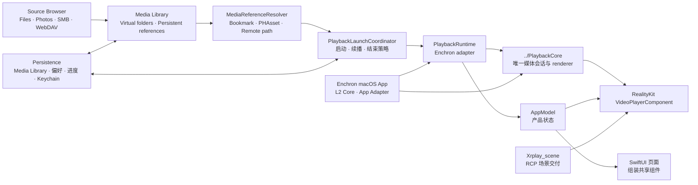

# Enchron 架构

Enchron 是产品 composition root，不是播放后端。一次播放只有一个 `PlaybackCoreController`、一个 `SampleBufferPlaybackSession` 和一个 `AVSampleBufferVideoRenderer`；Window、Docked 与 Panorama 只迁移同一个 renderer 的呈现位置。

Enchron 同时提供 macOS App。它不是另一套产品前端或播放核心，而是进入 visionOS 产品前必须通过的 L2 宿主：Core scenario 直接连接 PlaybackCore 与 macOS RealityKit consumer；通过后，App Adapter scenario 改由同一 `PlaybackRuntime` 接入。两者必须复用同一 fixture、renderer 断言和控制矩阵。

`FileBrowsing` 拥有 Media Library、来源浏览与引用解析；`PlaybackLaunchCoordinator` 是唯一产品播放入口；`PlaybackRuntime` 把 PlaybackCore 的状态、控制和 renderer 映射到 App；`PlayerUI` 组装播放控件；`SpatialScene` 执行 Environment、Docked 与 Panorama 的 RealityKit 生命周期；`Persistence` 保存媒体目录、偏好、进度和凭据；`Shared` 拥有 Design Token 与生产组件。

以下是不变量：

- Enchron 不解封装、不解码、不维护时间线、renderer graph、播放 route 或备用核心。
- PlaybackCore 的 L1 与 Enchron macOS App 的 Core scenario 未通过时，不进入 App Adapter、visionOS Simulator 或 Vision Pro 验收；上层成功不能反推下层通过。
- Media Library 只管理引用。文件 bookmark、Photos identifier 与远程路径始终指向原来源；分类、移动和删除引用不能复制、移动或删除媒体字节。
- Window、Docked、Panorama 是互斥的稳定 `PlaybackPresentation`；Environment Context 是独立状态，Window 可以和已打开场景共存。
- 只允许 Window 与一种空间呈现之间转换。平台 surface 和 renderer 都附着成功后才提交；失败恢复原状态和原 Environment Context。
- Docked 使用 Enchron 的 RealityKit docking adapter，把同一个 `VideoPlayerComponent` 放入 RCP 场景。
- Panorama 使用 Apple `VideoPlayerComponent` 的 immersive viewing behavior。Flat、180°、360° 由 PlaybackCore 写入 Apple 格式描述；Fisheye 只接受带 Apple Immersive Media Embedded（AIME）元数据的来源。
- 修改 UI 视觉效果、参数在组件或 `DesignTokens`，用户页面只拥有产品特有的组合与状态绑定 `Shared/Components`
- `DesignPreview` 只展示同一份生产组件。组件 interface、页面内容和交互细节由代码、Preview 与测试表达，不建立影子文档或平行前端。
