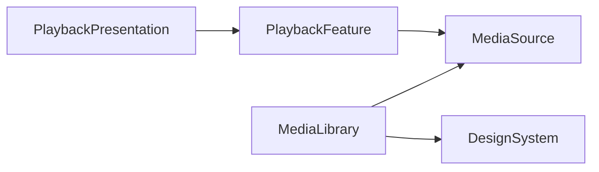

# Enchron 当前代码结构

本文是当前已接受生产代码的导航说明。

## 仓库组成

Enchron 最低运行于 visionOS27

```text
Apps/Enchron/                    产品 App 组合与 visionOS Scene
Apps/DesignPreview/              生产 UI 组件的预览宿主
Modules/MediaSource/             本地与远程来源能力
Modules/MediaLibrary/            媒体库领域与可由 Package 编译的界面部分
Modules/PlaybackFeature/         播放产品状态与策略
Modules/PlaybackPresentation/    呈现领域，以及由 App 编译的平台界面代码
Modules/DesignSystem/            跨 feature 的视觉原语和生产组件
Packages/PlaybackCore/           独立播放核心 Package
Packages/RealityKitContent/      Xcode 工程当前链接的本地 RealityKit 内容 Package
Tests/                           Package、App 与 UI 测试
Scripts/verification/            可重复的结构与证据辅助检查
```

## 编译所有权

根 [`Package.swift`](Package.swift) 当前定义五个 library target。它也是这些 target 依赖关系的直接事实来源：



`MediaLibrary` 的部分 SwiftUI 文件、`PlaybackFeature/PlaybackRuntime.swift`，以及 `PlaybackPresentation` 的 Platform、Resources、Scenes 和 Views 当前被根 Package 排除。这些需要 Apple 平台集成的源码由 Xcode 工程中的 Enchron App 编译。准确的成员关系以两个 Package manifest 和 Xcode project 当前记录为准。

[`Packages/PlaybackCore/Package.swift`](Packages/PlaybackCore/Package.swift) 定义独立的 `PlaybackCore` 模块及其测试。产品 App 中与它连接的代码位于 [`Modules/PlaybackFeature/PlaybackRuntime.swift`](Modules/PlaybackFeature/PlaybackRuntime.swift) 和相关 App 组合代码。核心内部如何建立媒体会话、处理 sample、时间线和 renderer，应直接从该 Package 的生产源码与测试判断。

[`Packages/RealityKitContent/Package.swift`](Packages/RealityKitContent/Package.swift) 定义 Xcode 工程当前链接的本地 `RealityKitContent` library。场景资源实际由哪些生产代码加载，应从当前 import、资源引用和 Xcode 工程判断；该 Package 的存在本身不证明某项场景内容正在被产品使用。

## 产品代码职责

[`Modules/MediaSource`](Modules/MediaSource) 表达来源身份、授权与本地或远程访问。其具体来源实现和依赖由目录中的生产代码给出。

[`Modules/MediaLibrary`](Modules/MediaLibrary) 表达虚拟媒体库、来源浏览和媒体引用。由根 Package 编译的领域代码与由 App 编译的平台界面代码通过 manifest 的 exclude 列表区分。

[`Modules/PlaybackFeature`](Modules/PlaybackFeature) 表达面向产品的播放状态和策略。`PlaybackRuntime` 是 App 当前连接 PlaybackCore 的适配层。

[`Modules/PlaybackPresentation`](Modules/PlaybackPresentation) 表达 Window、Portal、Docked、Panorama 和 Environment 相关的产品状态。平台 Scene、RealityKit 和 SwiftUI 呈现代码由 Enchron App 编译。

UI 生产表面属于承载其产品行为的 feature，跨 feature 的视觉原语和组件属于 [`Modules/DesignSystem`](Modules/DesignSystem)。[`Apps/DesignPreview`](Apps/DesignPreview) 展示这些生产实现，不拥有平行的产品页面或状态。

[`Apps/Enchron`](Apps/Enchron) 组合来源、媒体库、播放 feature、平台呈现和系统 Scene，并承担产品运行入口。

## 查证入口

产品结果从对应生产代码和运行结果查证。测试入口、断言和场景以 [`Tests`](Tests) 与当前 `.xctestplan` 文件为准。

结构检查脚本位于 [`Scripts/verification`](Scripts/verification)
