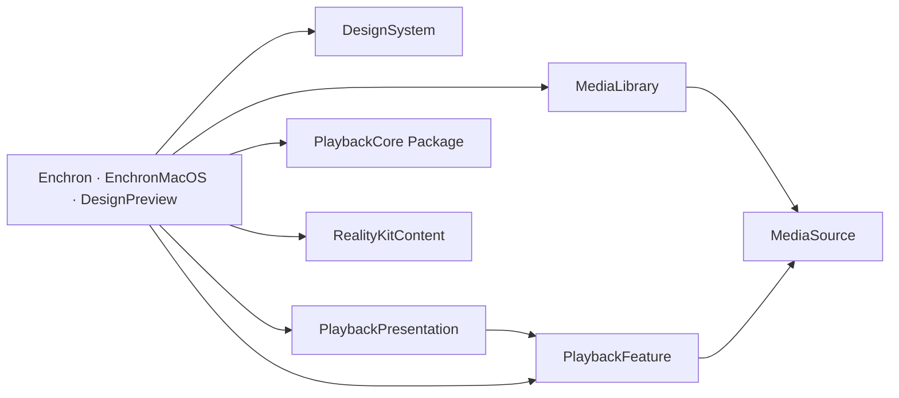

# Enchron 架构

Enchron 是唯一产品与代码仓库。`Packages/PlaybackCore` 是仓库内独立 Swift Package，拥有媒体会话、时间线、sample 与 renderer graph；Enchron App 拥有来源、产品策略、SwiftUI、RealityKit 和空间呈现。产品所有者的分离不产生第二套产品、状态机或文档体系。

## 仓库地图

```text
Apps/       可运行入口，只负责平台生命周期与产品组装
Modules/    产品源码所有者；平台无关核心由根 Package 的 Target 编译，Apple 平台代码由 App Target 编译
Packages/   PlaybackCore 与场景资源的独立编译/交付边界
Tests/      按被验证的 App 入口和证据层组织；PlaybackCore 测试留在 package 内
Scripts/    构建、测试数据生成和验证工具
Config/     构建元数据
docs/       当前合同、验收规则与历史 ADR
```

寻找代码时先确定谁拥有这个产品事实，再进入对应目录；仓库不使用 `Shared`、`Utils` 或全局 `Persistence` 作为模糊归宿。模块内部以一个可完整叙述的行为或组件族为文件边界：相互依赖才能表达完整含义的代码保持在一起，拥有独立状态、约束或复用方向时才拆开。文件行数只用于提示审查，不构成架构规则。

## 由编译器强制的代码边界

`Packages/PlaybackCore` 与 `Packages/RealityKitContent` 是独立 Swift Package。仓库根 `Package.swift` 把 `Modules/*` 中的平台无关产品核心分别编译为五个 Target：`MediaSource`、`MediaLibrary`、`PlaybackFeature`、`PlaybackPresentation` 与 `DesignSystem`。这些 Target 的依赖方向写在 `Package.swift` 中；任何 Target 都不能直接或间接地依赖回自己。Enchron、EnchronMacOS 和 DesignPreview 通过 Package 提供的 Library Product 使用这些核心源码，Xcode Target 不再重复编译同一份文件。

App Target 仍编译两类必须直接使用 Apple 平台能力的代码，而不是第二套产品逻辑：一类是需要 Xcode 27 完整 AVFoundation 接口的 `PlaybackRuntime`；另一类是使用 `AppModel`、SwiftUI Scene 与 RealityKit 场景操作的页面和沉浸空间。`PlaybackLaunchCoordinator`、Resume、End、Format、Queue 规则以及读取播放偏好的协议均由 `PlaybackFeature` Target 编译；`PlaybackRuntime` 只实现该 Target 定义的控制协议。根 Package 使用命令行 Swift 6.2 验证所有平台无关核心；完整的 PlaybackCore 接入代码、visionOS 场景和最终 App 必须使用 Xcode 27 验证。

最终产品 Package 使用五个 Target。划分依据是每类状态和规则由谁拥有，以及代码允许依赖哪个方向；Target 数量不对应界面或功能数量。下图中的箭头表示左侧代码可以使用右侧 Target，图中不存在一条最终返回起点的依赖路径：



- `MediaSource` 是 Media Identity、Content Revision、`ResolvedMediaSource`/`MediaAccessLease`、稳定自然名称顺序与 access lifetime 的唯一权威。远程身份使用协议、主机、规范端口、账号命名空间与媒体路径；等价来源配置共享身份，不同账号默认隔离。MediaLibrary 的 Keychain 键使用相同账号边界，并兼容迁移旧服务器级记录。
- `MediaLibrary` 交付中立的 `MediaPlaybackItem` 与不可变 `MediaCollectionSnapshot`，不创建 Playback 请求、不读写观看策略。
- `PlaybackFeature` 拥有 Queue、Viewing State、Media Format Preference、媒体元数据、播放请求与 launch coordinator；其唯一 Core adapter 是实现 `PlaybackRuntimeControlling` 的 Xcode-only `PlaybackRuntime`，不进入其他 feature。
- `PlaybackPresentation` 拥有 Window/Docked/Panorama、Environment/Appearance、placement 与 transition transaction；具体 Scene/View 壳消费这些状态，不直接定义来源或观看策略。
- `Apps` 只组装各产品状态的所有者，并执行系统提供的 Scene 和 Window 操作；操作结果交回 `PlaybackPresentation` 提交或回滚。
- `DesignSystem` 不依赖产品 feature，只提供稳定复用的视觉原语。

访问控制默认使用 `internal`。只有其他 Target 确实需要调用的入口 View、不可变状态值、操作命令、查询和值类型，以及 App 组装依赖时必须实现的少量协议，才声明为 `public`。只供同一 Package 内验证代码使用、但不属于 App 接口的声明使用 `package`。Media Library 的两个 `@Observable` 模型可以被 SwiftUI 读取，但只能由 `MediaLibraryFeature` 统一创建，外部代码不能自行拼装它们。持久化实现、具体数据源实现、地址解析实现、来源专用身份算法、PlaybackCore Session、页面内部 View 与测试数据不向 App 公开。

本轮已经完成以下收敛：

1. 建立统一 Media Identity、Content Revision、MediaAccessLease 与稳定远程来源身份；删除未进入生产路径的平行 Media Selection/Resolved Media 模型。
2. 删除 MediaLibrary 对 Playback request、progress store 和 profile prefetch 的依赖。
3. 将 Resume、End Behavior 与默认速度的读取合同下沉 PlaybackFeature；Environment/controls/placement 仍由 Presentation 模型与 App 组合层共同消费。
4. 建立五个具有明确单向依赖关系的核心 Target，并删除这些源码在 App Target 中的重复编译。
5. 让 visionOS Scene、页面组装与 PlaybackCore 接入代码继续由 App Target 编译；把 `PlaybackLaunchCoordinator` 编入 `PlaybackFeature`，并通过只包含必要操作的协议连接 `PlaybackRuntime`。App Target 中的平台代码不能反过来拥有产品规则。

`AppModel` 仍同时向界面提供播放呈现状态和少量 App 导航状态；这是下一轮可以继续拆分的已知边界，不代表其他产品状态也可以继续放入 App Target。App Target 中的平台代码只能分别通过 `MediaLibraryFeature`、`PlaybackLaunchCoordinator` 与 `PlaybackPresentationStorage` 访问媒体来源、Resume 与屏幕摆位持久化；具体持久化实现和数据源实现不能被它直接访问。

完整取舍见 [`ADR 0018`](docs/adr/0018-one-way-target-dependencies-and-media-source-ownership.md)。

Bundle ID 以及已有 UserDefaults、Keychain key 中的 `XrPlayer`/`xrplayer` 字符串属于安装身份和用户数据兼容标识，不代表产品或模块名称。只有设计并验证数据迁移时才能替换这些标识。

## 系统主线

```mermaid
flowchart LR
    Sources["来源\nFiles · Photos · SMB · WebDAV"] --> Library["Media Library\n引用 · 分类 · 选择"]
    Library --> Resolve["MediaSource\n身份 · revision · access lifetime"]
    Resolve --> Launch["PlaybackFeature\nQueue · Viewing · Format · commands"]
    Launch --> Runtime["Playback Snapshot\n应用只读投影"]
    Runtime --> Core["Packages/PlaybackCore\n唯一 Media Session 与 timeline"]
    Core --> Binding["Renderer Consumer Binding\nRealityKit entity"]
    Binding --> Presentation["Playback Presentation\nWindow · Docked · Panorama"]
    Presentation --> UI["Enchron App\nSwiftUI 与场景卡片"]
```



一次产品播放只有一个 `PlaybackCoreController`、一个 Current Media Slot、一个 Media Session 和一个 renderer graph。`PlaybackRuntime` 负责把 App 请求交给核心并把核心状态投影给产品；它不得自行决定 seek 先后、推进媒体时间、伪造 ready/playing/ended，或维护第二个播放会话。

## PlaybackCore 内部结构

```text
Source Admission -> Media Session -> Demux Provider
                                         |-- compressed video samples
                                         |-- audio samples
                                         `-- track and timed metadata facts
                                                    |
                                                    v
                                      Renderer Input Coordination
                                                    |
                                                    v
 AVSampleBufferVideoRenderer + AVSampleBufferAudioRenderer + Synchronizer
```

- `Source Admission` 接受 Enchron App 已解析的来源与访问事实，并管理唯一 Current Media Slot。
- `Media Session` 拥有一次 accepted open 到 close/failed 的身份、控制操作、Stream Epoch、Format Revision 与 stale rejection。
- `Demux Provider` 使用 FFmpeg 打开容器、建立轨道模型并组装 compressed sample。核心只维护这一种 provider。
- `Renderer Input Coordination` 通过 AVFoundation Receiver 管理 audio/video backpressure、timeline、enqueue、flush、end 和 error。
- `Renderer Graph` 组合 video renderer、audio renderer 与共享 synchronizer。AVFoundation 拥有解码、HDR/Dolby Vision 解释和最终渲染。
- `Diagnostics` 发布与当前 Media Session 可关联的 records、事件和 Debug Snapshot；Snapshot 不是第二套状态机。

## 产品所有权

| 所有者 | 拥有 | 不拥有 |
|---|---|---|
| `Packages/PlaybackCore` | container、track、sample、Media Session、播放生命周期、seek/rate/track transaction、renderer graph、诊断事实 | SwiftUI、来源长期授权、续播/下一项策略、RealityKit entity、窗口和空间 |
| `Apps/Enchron` | App 入口、依赖组装、系统 window/scene effect、Xcode-only PlaybackCore adapter | 新增领域策略、demux、sample、renderer queue |
| `MediaSource` | Media Identity、Content Revision、来源选择/解析与 access lifetime | Library 分类、播放策略、UI |
| `MediaLibrary` | 虚拟 Library、Source Directory 浏览、Playback Collection 与用户选择 | 媒体字节所有权、进度策略、PlaybackCore 调度 |
| `PlaybackFeature` | Queue、Viewing State、Media Format Preference、媒体元数据、launch coordinator 与 Runtime contract；语义上拥有唯一 Core adapter | demux、sample、renderer queue、空间呈现 |
| `PlaybackPresentation` | Environment/Appearance、placement、Window/Docked/Panorama transaction | renderer graph、媒体 timeline、来源身份算法 |
| `Modules/DesignSystem` | 生产视觉 token、通用控件与平台外观适配 | feature 状态和产品流程 |
| `Packages/RealityKitContent` | Enchron 使用的 RCP 场景交付 | 播放行为与 Environment 产品状态 |

## Enchron App 与验证入口

历史 Verify App 的非 SwiftUI 播放控制和断言是 Enchron App 播放功能的基准。macOS Target 是同一 Enchron App 播放控制代码的验证入口。播放核心场景会绕过产品来源和页面，直接验证 PlaybackCore；产品适配场景则使用生产 `PlaybackRuntime`。二者共享测试媒体、RealityKit 渲染接收方、控制矩阵和节点断言，不形成两个 App。

Enchron、EnchronMacOS 与 DesignPreview 通过同一组 Package Library Product 使用核心生产源码。Xcode 中逐文件指定源文件归属的设置只用于页面、Scene 和 PlaybackCore 平台适配代码；这些文件不得复制五个核心 Target 已拥有的类型或规则。

系统节点 01–09 统一位于 `docs/acceptance/nodes/`。节点描述完整产品链，文件位置不随实现模块拆分；每个节点分别声明实现所有者、证据所有者和完成边界。

## 不变量

- 产品与验证共用一条 FFmpeg demux → compressed sample → AVFoundation renderer 路径；失败不会切换到另一套媒体实现。
- `Playback Lifecycle` 由 PlaybackCore 唯一发布；`Playback Presentation` 由 Enchron App 管理，两者不能压成同一个“播放模式”。
- Window、Docked、Panorama 迁移同一个 renderer。目标 surface 必须绑定同一 Media Session 的 renderer 才能提交；播放中还必须等 RealityKit 报告画面 settled。Paused、Ready 与 Ended 没有新帧可推动该报告，renderer surface 已绑定即为可提交，不得因等待新帧超时而回滚。真正的绑定失败回滚到原 Presentation，不重开 Media Session。
- 媒体的初始或持久化 Media Format 必须在任何 RealityKit surface 挂载和播放启动前完成同一 Session 内的设置；默认播放速度作为打开 Session 的初始 rate 输入，不在 timeline 尚未建立时补发控制命令。
- 三个 Playback Presentation 统一使用 `VideoPlayerComponent(videoRenderer:)`。每个 `RealityView` 拥有自己的 Video Entity；迁移的是 renderer binding，不把 Entity 实例跨 scene 搬移。Window 位于 WindowGroup 的 RealityView，Docked 与 Panorama 位于 ImmersiveSpace 的 RealityView。
- Docked Video Entity 挂到 Xrplay_scene 交付的唯一 `PlaybackSurfaceAnchor` 下。场景拥有推荐基准位置与朝向；Enchron 以用户原点计算 Distance/Elevation 球面位置并转换为该 parent 下的 transform，同时拥有 Screen Size uniform scale；RealityKit 拥有视频 mesh、material 与实际呈现模式。
- Media Library 只保存引用。分类、移动或删除引用不得复制、移动或删除媒体字节。
- DesignPreview、SwiftUI Preview 与测试复用生产组件和页面；fixture adapter 不维护平行产品行为。
- 验证依次覆盖 PlaybackCore 单元验证、macOS 播放核心场景、macOS 产品适配场景、visionOS Simulator 和 Vision Pro 真机。每一层都有不同的证明范围，后面的结果不能代替前面的验证。

行为合同见 `docs/core-spec.md` 和 `docs/product-requirements.md`；唯一验证规则见 `docs/acceptance/verification-system.md`。
