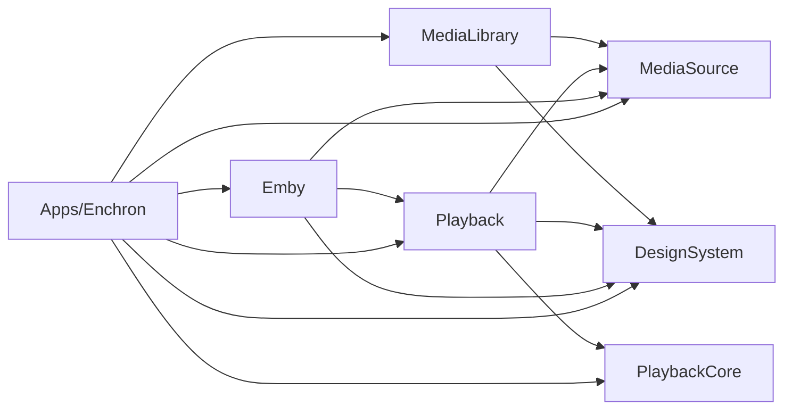

# Enchron 代码结构导航

本文回答两个问题：一段代码现在归谁，以及一段新代码该放到哪里。判据来自 [`Package.swift`](Package.swift)、[`Enchron.xcodeproj`](Enchron.xcodeproj) 与源码里的 import；文中每条都能在这三处指到出处。设计动机与平台约束不在这里，见「设计约束的去处」。

Enchron 最低运行于 visionOS 27。

## 仓库组成

```text
Apps/Enchron/                产品 App：组合、SwiftUI Scene 声明、系统入口
Apps/Enchron/DebugSupport/   整文件 #if DEBUG 门控的调试与诊断子系统
Modules/MediaSource/         公共名词：来源身份、授权与字节访问
Modules/MediaLibrary/        feature：虚拟媒体库与来源浏览
Modules/Emby/                feature：Emby 远程源
Modules/Playback/            feature：播放的领域、呈现与平台代码
Modules/DesignSystem/        公共名词：设计 token 与多消费者组件
Packages/PlaybackCore/       播放引擎，独立 Package
Packages/EnvironmentSceneContract/  观影环境场景的契约：协议、几何、屏幕静止位姿与屏幕状态类型
Packages/OceanEnvironment/   Ocean 场景包：ocean.reality、海面模拟运行时与契约实现
Packages/QuietRoomEnvironment/  Quiet Room 场景包：quiet_room.reality 与契约实现
Tests/                       Package 测试、App 测试、UI 测试与检查器自测
Regression/                  自动回归的 Promise、Journey、Scenario、Operation、Oracle 与 rubric 合同
Scripts/regression/          可移植的回归编译核心、运行时、Operation／Oracle 适配器与 CLI
Scripts/rules/               规则本体、verification 入口与分级器（W3）；规则自测在 Scripts/rules/tests/
Scripts/verification/        驱动器、探针、清单生成器与 harness 的失败分类、等待与预算（W0）
docs/                        术语与外部约束
Config/                      检查器的基线与清单
```

## 编译所有权

`Modules/` 下的每一个 Swift 文件恰好由一个包 target 编译。[`Package.swift`](Package.swift) 声明五个 library target（`MediaSource`、`MediaLibrary`、`Emby`、`Playback`、`DesignSystem`），每个 target 的 `path` 恰为 `Modules/<name>`，`exclude` 为空，不声明 `sources` 子集——即整目录编译，新增文件不需要登记。

[`Enchron.xcodeproj`](Enchron.xcodeproj) 声明四个原生 target：`Enchron` 一个 App，`EnchronDomainTests`、`EnchronAppTests`、`EnchronAppUITests` 三个测试 bundle。`Enchron` target 用同步文件夹方式关联 `Modules` 与 `Apps/Enchron` 两个目录，其中 `Modules` 全量落在 membershipExceptions 里，条目数与 `Modules` 下 Swift 文件数相等，因此 App 一个模块源文件也不编译，只链接包产品。这一条由 [`Scripts/rules/verify_package_membership.py`](Scripts/rules/verify_package_membership.py) 断言：清单缺项、清单陈旧、target 不整目录编译都会失败。

`Modules/Playback` 在清单里带 `.defaultIsolation(MainActor.self)`，其余模块用 Swift 默认的 nonisolated。往 Playback 加纯值类型时要注意它默认被主线程隔离；往 MediaLibrary 加视图时要注意它没有这层默认，主线程隔离来自 SwiftUI 自身。

## 依赖方向



图里只画本仓模块之间的边。此外 `MediaLibrary` 依赖 AMSMB2，`Playback` 依赖 EnvironmentSceneContract、OceanEnvironment、QuietRoomEnvironment 与 RealityKitScripting，`Enchron` 依赖 RealityKitScripting，`PlaybackCore` 依赖它自己的两个 vendored xcframework。场景包只依赖 EnvironmentSceneContract 与 RealityKit，互不依赖，也不依赖本仓模块；Ocean 包内 `Sources/OceanEnvironment/Vendor/OceanProbe` 是从 Xrplay_scene 的 OceanProbePlugin 运行时复制来的海面模拟，去掉了只在 Reality Composer Pro 内有意义的编辑器状态分支。

`MediaSource` 与 `DesignSystem` 不依赖任何本仓模块，是两个公共名词层。`MediaLibrary` 与 `Emby` 互不依赖：Emby 自带完整的浏览与详情实现，不复用 MediaLibrary 的浏览。`Emby` 依赖 `Playback` 是单向的——`EmbyPlaybackBridge` 与 `EmbySessionViewModel` 把 Emby 的播放选择翻成播放启动请求。


## 归属判据

新代码该放哪，按下面的顺序问：

**它是否服务终端用户的播放与附带功能**——是，才继续往下问放哪个生产位置；不是，按用途归位：测试进 [`Tests`](Tests) 下对应套件目录并在 [`Config/test_harness_map.json`](Config/test_harness_map.json) 登记归属；独立的调试与诊断子系统进 [`Apps/Enchron/DebugSupport`](Apps/Enchron/DebugSupport)；自动化、检查器与生成器进 [`Scripts`](Scripts) 对应目录。贴着宿主的调试装饰留在宿主文件，整段置于 `#if DEBUG` 并以 Debug／Harness／Automation／TestHook／Fixture 标记词命名——标记让 [`verify_debug_boundary.py`](Scripts/rules/verify_debug_boundary.py) 能断言带标记的声明不落在 Release 面内，[`verify_release_surface.py`](Scripts/rules/verify_release_surface.py) 兜住不带标记的环境读取与 `print`。注意 Diagnostic／Probe／Trace／Evidence 在本仓是生产领域词汇（媒体探测、用户可见诊断、证据管线），不算标记词。

**它是否只描述来源本身**——地址、凭据、信任、字节读取、媒体身份与版本？属 [`Modules/MediaSource`](Modules/MediaSource)。它不认识库、不认识播放，被所有 feature 依赖。

**它是否是跨 feature 的视觉原语或组件**？属 [`Modules/DesignSystem`](Modules/DesignSystem)。准入门槛是至少两个产品 feature（MediaLibrary、Emby、Playback）在代码里消费它。只有一个 feature 消费的，放进那个 feature；没有 feature 消费而 DesignSystem 自身在用的，降为 internal；两者皆无的，删除。该规则目前由人执行，没有检查器把关；判断消费者数量时必须先剥掉注释与字符串再统计，按名字直接 grep 会把注释里的名字算成消费者。

**它是否是一个观影环境场景本身**——`.reality` 资源、场景内实体名、材质参数名、把屏幕位置与视频纹理写进材质、按亮度压暗自己？属该场景的 Package（[`Packages/OceanEnvironment`](Packages/OceanEnvironment)、[`Packages/QuietRoomEnvironment`](Packages/QuietRoomEnvironment)），并实现 [`Packages/EnvironmentSceneContract`](Packages/EnvironmentSceneContract) 的 `EnvironmentScene`。屏幕的静止位姿由场景交付：场景包在 `load()` 里从 `ScreenPreview` 的世界变换求出 `EnvironmentScreenRestPose`，Enchron 不再要求场景内有空的挂载实体。Enchron 只认契约：身份到场景包的注册表是 `Modules/Playback/Model/CinemaEnvironment.swift` 的 `EnvironmentSceneMapping`，屏幕位姿求解是 `Modules/Playback/Platform/PlaybackDockedPoseSolver.swift`，反射用的低分辨率视频纹理由 `Modules/Playback/Platform/VideoReflectionTextureSource.swift` 从渲染器已显示的像素缓冲生成。纯色占位环境没有场景包，由 `ImmersiveSpaceView` 里的 `EnvironmentSceneAppearanceApplier` 生成球体，静止位姿取内置的回退值。

**它是否属于播放**——解码之外的播放状态、策略、呈现模式、播放界面、播放用的 RealityKit 与 Scene 内容？属 [`Modules/Playback`](Modules/Playback)。目录分层：

- `Domain/` 播放领域状态与策略（媒体格式、状态存储、队列、seek 策略、轨道偏好、观看状态）；
- `Model/` 呈现模式与几何的值类型（Window/Portal/Docked/Panorama/Environment、放置、落位阶段、未满足能力）；
- `Session/` 活动会话驱动、渲染器所有权转移、会话对象与诊断探针（`PlaybackMediaSessionDriver`、`RendererTransferCoordinator`、`PlaybackSessionModel`、`SurfaceInputProbes`、`DebugProbeJournal`）；
- `Views/` SwiftUI 与 RealityKit 视图；
- `Scenes/` 沉浸空间的内容视图与控件附着；
- `Platform/` 平台效果执行与租约；
- `Storage/` 位置持久化；
- 目录根部是启动与运行时装配（`PlaybackRuntime`、`PlaybackLaunchCoordinator`、`PlaybackLaunchRequest`、`PlaybackAudioSession`、`PlaybackMediaMetadataService`）。

**它是否属于本地与网络文件浏览**——库模型、来源浏览、目录扫描、SMB/WebDAV/本地适配器、字幕关联，以及 Files 页的库与来源行为？属 [`Modules/MediaLibrary`](Modules/MediaLibrary)。`Views/FilesScreen.swift` 拥有 Files 页行为；App 只负责产品入口、模态协调与 feature 装配。

**它是否只对 Emby 有意义**——Emby 的 REST 模型、认证、图片与流地址、货架与详情页？属 [`Modules/Emby`](Modules/Emby)。

**它是否是解码、解复用、渲染、时钟、字幕栅格化**？属 [`Packages/PlaybackCore`](Packages/PlaybackCore)。该 Package 只依赖两个 vendored 二进制与自己的 C 桥，不依赖本仓任何模块；`Modules/Playback` 的 `PlaybackRuntime` 是它的适配层，产品语义不要下沉进去。

**它是否只在把上面几件东西拼起来时才需要**——Scene 声明、导航壳、模态协调、设置存储？属 [`Apps/Enchron`](Apps/Enchron)。这里现在很薄：`AppModel` 只剩导航标签页，播放会话状态住在 `Modules/Playback` 的 `PlaybackSessionModel`。全部 `WindowGroup`、`Window` 与 `ImmersiveSpace` 在 `EnchronApp.swift` 里声明，内容视图两边都有——`MainView` 在 App，`ImmersiveSpaceView` 与 `SenseZoneVolumeRoot` 在 Playback。新增或删除一个 Scene 必然要动 App。

**它是否属于自动回归合同、编译或运行控制**？用户可见承诺、自动化范围、Journey 分组、Scenario 裁决合同、Operation／Oracle 合同与 rubric 属 [`Regression`](Regression)。解析、审查、不可变计划、调度、lease、证据接受、ledger 与 replay 属 [`Scripts/regression`](Scripts/regression)。`Scripts/regression/core` 只依赖 Python 标准库，不 import Xcode、设备控制器或 [`Scripts/verification`](Scripts/verification)；外围 Operation／Oracle 适配器可以调用现有驱动，但不能写 core 状态。该工具层不属于产品 Swift 依赖图，不修改 `Package.swift` 的五个产品 target。

## 设计约束

无法从代码读出的外部约束、实测常数与平台行为集中在五份文档：

- [`docs/PLAYBACK_ENGINE_CONSTRAINTS.md`](docs/PLAYBACK_ENGINE_CONSTRAINTS.md) 引擎侧：渲染器超前预算、交付滞后恢复常数、visionOS 时钟与 setRate、解码能力探测、DV/HDR 配置的位置；
- [`docs/PLAYBACK_PRESENTATION_CONSTRAINTS.md`](docs/PLAYBACK_PRESENTATION_CONSTRAINTS.md) 呈现侧：RealityKit 实测行为、场景生命周期、窗口与视频几何、沉浸空间输入、呈现转换的所有权与次序、探针写入纪律；
- [`docs/DESIGN_SYSTEM_CONSTRAINTS.md`](docs/DESIGN_SYSTEM_CONSTRAINTS.md) 设计系统：同心圆角关系、glass 渲染层、注视状态与 hover、系统 Menu 的标识符行为、滑块族共用轨道的约束；
- [`docs/BROWSING_AND_SOURCES_CONSTRAINTS.md`](docs/BROWSING_AND_SOURCES_CONSTRAINTS.md) 浏览与来源：Emby 数据形状、visionOS 列表实测、文件浏览导航栈、字节流与来源身份；
- [`docs/UI_TEST_HARNESS_CONSTRAINTS.md`](docs/UI_TEST_HARNESS_CONSTRAINTS.md) 测试通道：XCUITest 与 visionOS 场景、AX 标识符丢失处、时序容差与状态复位。

术语在 [`docs/CONTEXT.md`](docs/CONTEXT.md)，历史材料在 [`docs/archive`](docs/archive)，两者都不描述当前所有权。

## 测试与验证入口

`EnchronDomainTests` 是无 App 宿主的域测试 bundle，覆盖 [`Tests/MediaSourceTests`](Tests/MediaSourceTests)、[`Tests/MediaLibraryPackageTests`](Tests/MediaLibraryPackageTests)、[`Tests/EmbyPackageTests`](Tests/EmbyPackageTests)、[`Tests/PlaybackFeaturePackageTests`](Tests/PlaybackFeaturePackageTests)、[`Tests/PlaybackPresentationTests`](Tests/PlaybackPresentationTests)、[`Tests/EnchronAppLogicTests`](Tests/EnchronAppLogicTests)、[`Tests/EnchronDomainSupport`](Tests/EnchronDomainSupport) 与 [`Packages/PlaybackCore/Tests/Standalone`](Packages/PlaybackCore/Tests/Standalone)。其中 `Tests/MediaLibraryPackageTests`、`Tests/EmbyPackageTests`、`Tests/PlaybackFeaturePackageTests` 三个目录同时由 `Package.swift` 的 SwiftPM testTarget 编译，改动它们要同时顾及两条编译路径。

`EnchronAppTests` 对应 [`Tests/EnchronApp`](Tests/EnchronApp)，`EnchronAppUITests` 对应 [`Tests/EnchronAppUI`](Tests/EnchronAppUI)。测试计划见仓根四个 `.xctestplan`。引擎自身的测试在 [`Packages/PlaybackCore/Tests`](Packages/PlaybackCore/Tests)，字节流一致性套件是独立 Package [`Tests/MediaByteStreamConformance`](Tests/MediaByteStreamConformance)。

规则本体、W0 与 W1 的入口 [`run_verification.py`](Scripts/rules/run_verification.py) 与分级器都在 [`Scripts/rules`](Scripts/rules)，规则自测在 [`Scripts/rules/tests`](Scripts/rules/tests)，基线与清单在 [`Config`](Config)。放进 `tests/` 的 `test_*.py` 由入口扫描执行，不需要登记；[`verify_scripts_inventory.py`](Scripts/rules/verify_scripts_inventory.py) 要求每个脚本都落进已声明的类别，且文件名与内容一致。测试目录到 harness 的归属以 [`Config/test_harness_map.json`](Config/test_harness_map.json) 为准，[`verify_test_target_membership.py`](Scripts/rules/verify_test_target_membership.py) 断言它与 pbxproj 同步组、Package.swift testTarget 三方一致。[`Scripts/regression`](Scripts/regression) 承担自动回归的可移植核心和适配器，[`Scripts/verification`](Scripts/verification) 留下驱动器、探针、清单生成器与 [`harness`](Scripts/verification/harness) 包：失败领域模型、等待策略与超时预算。自动回归的权威关系与运行不变量见 [`Regression/README.md`](Regression/README.md)；端到端设备操作读 [`.agents/skills/vp-e2e`](.agents/skills/vp-e2e)，级别定义读 [`docs/CONTEXT.md`](docs/CONTEXT.md)。

改动模块目录结构时，有一批文件按路径锚定，必须同一个 commit 一起改：[`Config/design_source_architecture_inputs.xcfilelist`](Config/design_source_architecture_inputs.xcfilelist)、`Enchron.xcodeproj` 的 membershipExceptions、[`Config/reachability_operation_inventory.json`](Config/reachability_operation_inventory.json)、[`Config/test_harness_map.json`](Config/test_harness_map.json)，以及 [`Scripts/verification`](Scripts/verification) 下按源码位置或符号取锚的检查器。
