# Enchron 架构

Enchron 是唯一产品与代码仓库。`Packages/PlaybackCore` 是仓库内独立 Swift Package，拥有媒体会话、时间线、sample 与 renderer graph；Enchron App 拥有来源、产品策略、SwiftUI、RealityKit 和空间呈现。产品所有者的分离不产生第二套产品、状态机或文档体系。

## 仓库地图

```text
Apps/       可运行入口，只负责平台生命周期与产品组装
Modules/    MediaLibrary、PlaybackFeature、PlaybackPresentation、DesignSystem 四个源码所有者
Packages/   有独立编译边界的 PlaybackCore 与 RealityKitContent
Tests/      按被验证的 App 入口和证据层组织；PlaybackCore 测试留在 package 内
Scripts/    build、fixture、verification 三类机械执行工具
Config/     构建元数据
docs/       当前合同、验收规则与历史 ADR
```

寻找代码时先确定谁拥有这个产品事实，再进入对应目录；仓库不使用 `Shared`、`Utils` 或全局 `Persistence` 作为模糊归宿。模块内部以一个可完整叙述的行为或组件族为文件边界：相互依赖才能表达完整含义的代码保持在一起，拥有独立状态、约束或复用方向时才拆开。文件行数只用于提示审查，不构成架构规则。

## 当前边界与下一阶段

目录重建已经建立源码所有权，但没有自动建立编译隔离。当前只有 `Packages/PlaybackCore` 与 `Packages/RealityKitContent` 是独立 Swift Package；`Modules/MediaLibrary`、`Modules/PlaybackFeature`、`Modules/PlaybackPresentation` 与 `Modules/DesignSystem` 仍由 Xcode App target 通过源码 membership 共同编译。因此，四个目录目前是查找与放置代码的权威边界，不是编译器已经强制的 import 边界。

现阶段不能因为同一 target 允许直接访问，就把这种访问视为架构许可。新增跨所有者关系前必须先确认事实和行为的归属，并通过最小接口表达。下一阶段要把以下约束逐步移入构建图、Swift access control、类型系统与测试，而不是继续增加文件放置说明：

- `Apps` 只组装依赖、声明平台生命周期、导航和 scene，不吸收 feature 状态或核心播放行为。
- `DesignSystem` 不依赖任何产品 feature；feature 可以使用它的视觉原语。
- `MediaLibrary` 交付已经解析且带访问事实的媒体，不启动或调度 PlaybackCore。
- `PlaybackFeature` 拥有产品播放请求、策略和核心事实投影；它不能复制 PlaybackCore 的生命周期、时间线或 renderer queue。
- `PlaybackPresentation` 消费应用播放能力并拥有 Window、Docked、Panorama 的 transition 与 surface binding；它不能进入 demux、sample 或 Media Session 内部。
- `DesignPreview` 与 `EnchronMacOS` 复用相同生产所有者，不形成逐渐漂移的源码副本或平行业务实现。

最终的依赖图必须无环。使用本地 Swift Package targets 还是 Xcode framework targets 属于下一阶段需要确认的构建决策；在决定并完成迁移前，本文不会把四个源码目录描述成已经独立编译的模块。

Bundle ID 以及已有 UserDefaults、Keychain key 中的 `XrPlayer`/`xrplayer` 字符串属于安装身份和用户数据兼容标识，不代表产品或模块名称。只有设计并验证数据迁移时才能替换这些标识。

## 系统主线

```mermaid
flowchart LR
    Sources["来源\nFiles · Photos · SMB · WebDAV"] --> Library["Media Library\n引用 · 分类 · 持久化"]
    Library --> Resolve["Source Resolution\n授权 · 远程流 · provenance"]
    Resolve --> Launch["PlaybackLaunchCoordinator\n续播 · 结束策略 · 启动"]
    Launch --> Runtime["PlaybackRuntime\n应用控制与只读投影"]
    Runtime --> Core["Packages/PlaybackCore\n唯一 Media Session 与 timeline"]
    Core --> Binding["Renderer Consumer Binding\nRealityKit entity"]
    Binding --> Presentation["Playback Presentation\nWindow · Docked · Panorama"]
    Presentation --> UI["Enchron App\nSwiftUI 与场景卡片"]
```



一次产品播放只有一个 `PlaybackCoreController`、一个 Current Media Slot、一个 Media Session 和一个 renderer graph。`PlaybackRuntime` 负责把 App 请求交给核心并把核心状态投影给产品；它不得自行决定 seek 先后、推进媒体时间、伪造 ready/playing/ended，或维护第二个播放会话。

## PlaybackCore 内部结构

```text
Source Admission -> Media Session -> Demux Provider
                                         |-- compressed video samples
                                         |-- audio samples
                                         `-- track and timed metadata facts
                                                    |
                                                    v
                                      Renderer Input Coordination
                                                    |
                                                    v
 AVSampleBufferVideoRenderer + AVSampleBufferAudioRenderer + Synchronizer
```

- `Source Admission` 接受 Enchron App 已解析的来源与访问事实，并管理唯一 Current Media Slot。
- `Media Session` 拥有一次 accepted open 到 close/failed 的身份、控制操作、Stream Epoch、Format Revision 与 stale rejection。
- `Demux Provider` 使用 FFmpeg 打开容器、建立轨道模型并组装 compressed sample。核心只维护这一种 provider。
- `Renderer Input Coordination` 通过 AVFoundation Receiver 管理 audio/video backpressure、timeline、enqueue、flush、end 和 error。
- `Renderer Graph` 组合 video renderer、audio renderer 与共享 synchronizer。AVFoundation 拥有解码、HDR/Dolby Vision 解释和最终渲染。
- `Diagnostics` 发布与当前 Media Session 可关联的 records、事件和 Debug Snapshot；Snapshot 不是第二套状态机。

## 产品所有权

| 所有者 | 拥有 | 不拥有 |
|---|---|---|
| `Packages/PlaybackCore` | container、track、sample、Media Session、播放生命周期、seek/rate/track transaction、renderer graph、诊断事实 | SwiftUI、来源长期授权、续播/下一项策略、RealityKit entity、窗口和空间 |
| `Apps/Enchron` | App 入口、页面组装、导航与全局产品策略 | feature 内部状态、demux、sample、renderer queue |
| `Modules/MediaLibrary` | Media Library、本地/Photos/SMB/WebDAV 来源、授权与持久引用 | 媒体字节所有权与播放调度 |
| `Modules/PlaybackFeature` | 播放请求、应用控制边界、核心状态投影、续播与结束策略 | demux、sample、renderer queue、空间呈现 |
| `Modules/PlaybackPresentation` | transport UI、Environment Context、Window/Docked/Panorama 与 surface attach/rollback | renderer graph 与媒体时间线 |
| `Modules/DesignSystem` | 生产视觉 token、通用控件与平台外观适配 | feature 状态和产品流程 |
| `Packages/RealityKitContent` | Enchron 使用的 RCP 场景交付 | 播放行为 |

## Enchron App 与验证入口

历史 Verify App 的非 SwiftUI 播放控制和断言是 Enchron App 播放功能的基准。macOS target 是同一 Enchron App application control 的 L2 平台入口；Core scenario 只是绕过产品来源和页面的验证模式，App Adapter scenario 使用生产 `PlaybackRuntime`。二者共享 fixture、renderer consumer、控制矩阵和节点断言，不形成平行 App。

当前 Enchron、EnchronMacOS 与 DesignPreview 对生产源码的复用仍包含 Xcode target membership。它是目录迁移后的过渡组装方式，不是长期模块合同；建立编译边界后，各入口应依赖同一生产模块产品，而不是继续维护逐文件 membership 清单。

系统节点 01–09 统一位于 `docs/acceptance/nodes/`。节点描述完整产品链，文件位置不随实现模块拆分；每个节点分别声明实现所有者、证据所有者和完成边界。

## 不变量

- 产品与验证共用一条 FFmpeg demux → compressed sample → AVFoundation renderer 路径；失败不会切换到另一套媒体实现。
- `Playback Lifecycle` 由 PlaybackCore 唯一发布；`Playback Presentation` 由 Enchron App 管理，两者不能压成同一个“播放模式”。
- Window、Docked、Panorama 迁移同一个 renderer。目标 surface 与 renderer binding 成功后才提交；失败回滚到原 Presentation，不重开 Media Session。
- 三个 Playback Presentation 统一使用 `VideoPlayerComponent(videoRenderer:)`。每个 `RealityView` 拥有自己的 Video Entity；迁移的是 renderer binding，不把 Entity 实例跨 scene 搬移。Window 位于 WindowGroup 的 RealityView，Docked 与 Panorama 位于 ImmersiveSpace 的 RealityView。
- Docked Video Entity 挂到 Xrplay_scene 交付的唯一 `PlaybackSurfaceAnchor` 下。场景拥有基准位置与朝向；Enchron 拥有 Screen Size uniform scale；RealityKit 拥有视频 mesh、material 与实际呈现模式。
- Media Library 只保存引用。分类、移动或删除引用不得复制、移动或删除媒体字节。
- DesignPreview、SwiftUI Preview 与测试复用生产组件和页面；fixture adapter 不维护平行产品行为。
- L1、macOS L2 Core、macOS L2 App Adapter、visionOS Simulator 与 Vision Pro L3 是递进门槛，上层结果不能反推下层通过。

行为合同见 `docs/core-spec.md` 和 `docs/product-requirements.md`；唯一验证规则见 `docs/acceptance/verification-system.md`。
