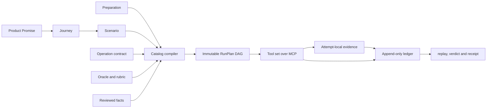

# Enchron 自动回归系统

本文是 Enchron 自动回归系统的权威结构说明。`Regression/` 中的合同定义产品承诺、旅途、场景、成功条件和自动化边界；`Scripts/regression/` 中的代码负责解析、审查、编译和执行这些合同。产品 Swift 源码、旧 Journey 注册表、设备驱动脚本和历史报告都不能反向修改这里的语义。

当前阶段只授权建设合同、编译核心、假 lane 运行时、Catalog 和设计评审材料。完整 Catalog 获得 `HumanCoverageReceipt` 之前，不启动正式 Simulator／真机回归，也不修改产品 Swift 源码。

## 系统关系



各对象的职责如下。

- `Promise` 定义一条可被独立覆盖检查的用户可见保证和自动化范围。每份 feature 文件分组多条带稳定 ID 的 commitment 级 Promise；范围只有 `included` 与 `excluded`，排除项必须有具体理由。
- `Journey` 只负责把 Scenario 分组，并声明产品上有意义的顺序和共享状态。Journey 不直接获得运行 verdict。
- `Scenario` 是最小的独立裁决单元。它必须能在一次 lease 内完成操作、取证和成功判断。
- `Preparation` 是可重试的前置状态生产规则。它可以调用 setup Operation 并生成带 schema、语义 key、lane、tag epoch 与 fingerprint 的 `StateHandle`，但不能覆盖 Promise 或产生产品 verdict。
- `Operation` 是带版本的语义动作。驱动方式、参数合同、支持的 lane、状态失效标签和证据输出只在 Operation 合同及实现中声明。
- `Oracle` 根据已审 rubric 把证据判为 `Satisfied`、`Violated` 或 `Indeterminate`。rubric 里能编成字段谓词的断言走确定性判读，其余仍由 Agent 执行；结构化 Oracle 只读取闭合字段、事件和附件，视觉与音频 Oracle 还可检查相应媒体。两者都不能修改 rubric、适用性或成功表达式。
- 工具集是计划、lease、Operation 授权、证据接受、节点状态与 ledger 的唯一写者。它以 MCP 暴露五个工具：`session` 起停设备会话，`op` 执行一个 Operation Call 并跑 L0 字段谓词与 L1 像素启发，`bundle` 产出异常包，`ledger` 写裁决、读状态、读续跑点、重开节点，`receipt` 把整轮账本算成合并收据。循环不在工具里：它在交互中的 Agent 和 console 前的人那里。
- 判读分三级。L0 是由 rubric 编译出的字段谓词，编不出的 criterion 逐条进覆盖报告（`Scripts/rules/check_rubric_predicate_coverage.py`）。L1 是像素启发，命中的签名取自 `Scripts/regression/tools/signatures.py` 的注册表。L2 是 Agent，只在异常包之后做归因。

人类层静态为空，成员是账本终态为 `deferred(human)` 的节点。进入条件由账本校验：同一节点连续两次 attempt 的 op 结果都是仪器超时类。产品慢是 `Violated`，不可推迟。这些节点由人类收据关闭，收据覆盖哪些节点由 `receipt` 校验。只能由人类主观判断且无法形成 Agent rubric 的内容仍在 Catalog 设计期设为 `excluded`。

## 权威目录

```text
Regression/
  README.md
  semantic-authority.json
  execution-protocol.md
  oracle-protocol.md
  promises/*.md
  facts/*.md
  preparations/*.md
  operations/*.md
  oracles/*.md
  rubrics/*.md
  journeys/<journey>/journey.md
  journeys/<journey>/scenarios/*.md
  review-policy.md
  agent-operability-review-protocol.md
  reviews/<review-class>/*.json  # review stage output, not materializer input

Scripts/regression/
  core/                      # 合同、编译、计划与运行时状态机
  tools/                     # MCP 工具：session、op、bundle、ledger、receipt
  runctl.py                  # prepare-build、freeze、compile、status
  reviewctl.py               # 审查阶段与派生收据
  writectl.py                # 写入集
  rubric_compiler.py         # 由 rubric criteria 编出 L0 字段谓词
  materialize_catalog_v2.py  # 由 blueprint 物化本目录
```

Operation 的分发实现不在 `Scripts/regression/` 下，而在 `Scripts/verification/regression_operation_adapter.py`。

Promise、Fact、Preparation、Operation、Oracle、Rubric、Journey 和 Scenario 文件共同形成 `CatalogDigest`。Digest 由按类型和 ID 排序的 leaf digest 清单计算；review packet 绑定它实际包含的 leaf 集，因此只有内容发生变化的 packet receipt 失效，不要求未变化的 Journey 重审。首版不引入另一套 Oracle compatibility review 或可变的“受影响范围”推断。`reviews/` 中的 receipt 不进入 Catalog digest，否则 receipt 会引用包含自身的摘要。单个 receipt 绑定 packet digest、审查者身份、审查报告 digest、预算用量和结论；`CatalogGateReceipt` 对当前完整 packet 分区重新验覆盖后，再绑定完整 `CatalogDigest` 与本轮采用的全部 receipt digest。这样既不能拼出漏项 Catalog，也不会因无关 leaf 变化废掉仍然有效的审查。

机器合同使用 Markdown 顶部的 JSON-compatible front matter：第一行和结束行均为 `---`，中间必须是一个 JSON object。正文解释产品语义、判读理由和明确不证明的范围。解析器只使用 Python 标准库 `json`，不会按环境是否安装 PyYAML 改变语义。

## 编译阶段

编译按不可跳过的类型门推进：

```text
DraftCatalog
  -> SchemaCheckedCatalog
  -> ReviewedCatalog
  -> CompiledRunPlan
  -> MainRun
  -> replay(RunDirectory)
```

`SchemaGate` 验证 front matter、稳定 ID、引用、表达式和基本类型。`CatalogGate` 额外要求三类审查 receipt：

- `HumanCoverageReceipt` 审查 Promise、自动化范围、Scenario 覆盖、成功语义、MainGate 和全部 Oracle rubric。
- `AgentOperabilityReceipt` 审查每个 Scenario 和 Preparation 是否可执行、是否有歧义、证据是否可取得、状态链是否成立以及成本是否可信。
- `DeterministicCatalogReceipt` 由检查器证明 ID 唯一、引用闭合、included Promise 有覆盖、Operation／Oracle／rubric 存在、evidence type 两端兼容、lane 可满足、Preparation 状态生产者唯一、DAG 无环、success 引用闭合且 setup 不能赚取 coverage。

缺少任一 receipt、receipt 绑定旧 digest、审查预算超限或审查包覆盖不完整时，`ReviewedCatalog` 无法构造。预算耗尽只会停止并重新规划审查，不能减少必审 Scenario，也不能把未完成审查当作通过。

### 适用性白名单

编译器本身不推测“什么是正确或适用的”。Scenario 的 applicability 只能引用 Catalog 中的 `FactID`，`CompileRequest` 只能提供已有审查 receipt 的 fact value。编译器机械求值并拒绝未知事实；运行期的任何工具都不能新增事实或改写范围。

这形成明确分工：人和设计审查决定产品承诺、排除项与事实含义；确定性编译器检查闭包并生成计划；Agent 的灵活性只存在于已审 rubric 内的证据判断。系统不要求把整个世界写成完美白名单，只要求每个会改变本轮计划的事实显式可追溯。

## 通用成功表达式

每个 Scenario 声明一组有稳定 `ObligationID` 的 evidence obligation，并用一个闭合表达式定义成功。表达式中的 `observation` 是节点名称，其值必须是已声明的 `ObligationID`。首版支持五种节点：

```json
{"observation": "obligation:playback-visible"}
{"all": [{"observation": "obligation:a"}, {"observation": "obligation:b"}]}
{"any": [{"observation": "obligation:a"}, {"observation": "obligation:b"}]}
{"not": {"observation": "obligation:error-visible"}}
{"atLeast": {"count": 2, "of": [{"observation": "obligation:a"}, {"observation": "obligation:b"}, {"observation": "obligation:c"}]}}
```

表达式使用三值逻辑：

| 节点 | `Satisfied` | `Violated` | `Indeterminate` |
|---|---|---|---|
| `all` | 所有子项满足 | 任一子项违反 | 其余情况 |
| `any` | 任一子项满足 | 所有子项违反 | 其余情况 |
| `not` | 子项违反 | 子项满足 | 子项不确定 |
| `atLeast(k)` | 已满足数量至少为 k | 已满足加不确定的最大数量仍小于 k | 其余情况 |

编译器要求每个表达式引用都由恰好一个 obligation 产生，且每个 obligation 都被表达式使用。只有最终结果为 `Satisfied` 才能通过；`Violated` 才是产品失败；`Indeterminate` 只能重试或中断运行。

## 逐 tag epoch

每条 lane 维护 `StateTag -> Epoch` 的单调计数。Operation 合同声明它实际调用时会推进哪些 tag；State 声明自己依赖哪些 tag。`StateHandle` 保存生产时相关 tag 的 epoch 快照，只有所有相关当前值仍等于快照时才有效。

Scenario 的 prerequisite 只声明状态的语义 `key` 与 `schema`，不能自行指定如何建立它。Preparation 声明 setup Operation 序列及其产生的状态；编译器必须为每个候选 lane 将 prerequisite 解析到恰好一个兼容的 Preparation。找不到生产者、出现多个生产者、schema 不同、Preparation 依赖成环或跨 lane 借用 handle 都是编译错误。Preparation 在某个 Scenario lease 中按需执行；有效 handle 已存在时直接复用，失效时重新产生 attempt，但不可变 RunPlan 本身不被改写。

```text
Operation invoked
  -> advance only declared tags
  -> invalidate only handles subscribed to those tags
  -> preserve unrelated prepared state
```

Epoch 在 Operation gateway 确认调用时推进，而不是等结果被接受后才推进，因为失败或被拒绝的结果也可能已经改变设备。重启、重装、重连、账号变更、库变更和播放会话变更分别使用不同 tag；不得用一个全局 generation 让无关准备全部失效。

## 关键路径调度

编译器为每个节点保存已审的整数成本，并在 DAG 上反向计算 `criticalRank = nodeCost + max(successor criticalRank)`。`ledger resume` 只把依赖、lane MainGate、状态要求和 lane 锁都满足的节点列为可跑。

同一 lane 的稳定优先级依次为：

1. 只能在该 lane 执行的工作优先于 `either`，避免可迁移任务占住唯一资源。
2. `criticalRank` 较大的节点优先，缩短整个 DAG 的最长剩余路径。
3. 能复用当前有效 StateHandle 的节点优先，减少重复准备。
4. 当前节点成本较大的优先。
5. 用稳定 `NodeID` 打破平局。

Simulator 与真机分别通过自己的 MainGate 后即可解锁各自分支，不需要互相等待。`either` 的候选 lane 写入不可变计划，实际绑定发生在 claim 事件；`both` 编译成两个 lane attempt 和一个 join，两个 attempt 必须绑定同一 `BuildIdentity`。

请求中的每条 lane 必须有且只有一个适用的 MainGate Scenario。MainGate 自身仍是普通 Scenario，有完整 Promise、obligation、Oracle 和 verdict；区别只是它在该 lane 的其他 Scenario 之前运行。某条 lane 的 MainGate 通过只解锁该 lane，失败或不确定不能由另一条 lane 的结果代替。

## Operation 能力白名单

编译器把每个 Scenario 中的 OperationCall 编译为精确的 `AllowedOperationCall`，绑定 call ID、Operation ID、版本、合同 digest、规范参数模板字节及其 digest、实现 locator 及其 digest、失效标签和最大调用次数。参数模板字节进入不可变 RunPlan；运行时不需要重新读取可变 Catalog。`AssignmentLease` 携带该集合。

每条 coverage obligation 还绑定一个 `evidenceType`。编译器同时检查生产该证据的 Operation 声明能输出该类型，Oracle 声明能接收该类型；任一端不匹配都不能生成 RunPlan。Rubric 是所有 Oracle 的必填合同，Agent 只能在 rubric 的 criteria 与 negative controls 内作结构化判断。编译器、能力授权、证据来源与成功表达式保持机械确定；自然语言 rubric 不伪装成没有实现字段谓词的“确定性比较器”。

每次调用必须先经过 gateway。授权时只把完整字符串 `result://<earlier-call-id>/<top-level-field>` 解析为同一 lease 中更早成功调用的结构化输出；缺失调用、失败调用、缺失字段和错误引用语法都会在 adapter 触达目标前中断 lane。普通字符串和仅在字符串中间出现的相似文本保持原值。解析后的规范参数字节及其 digest 与模板 digest、实现身份一起进入 grant。

Gateway 在执行前验证 run、plan、node、lease、lane、call、参数字节、模板与解析后摘要和实现摘要，并写入 `OperationInvoked` 事件；未授权调用在触达设备前被拒绝。`OperationCompleted` 把不可变 JSON object 输出写入 ledger，replay 和重新打开运行后仍从 ledger 恢复后续引用，不维护旁路结果状态。驱动方的提示词可以解释允许做什么，但提示词不是执法边界。最终切换时，设备和 Xcode adapter 只接受 gateway grant，旧的无授权直接入口不再承担正式回归。

Scenario 与 Preparation 中的 OperationCall 数组同时定义严格执行顺序。只有在前一 call 已得到成功的结构化完成结果后才允许下一 call；同一 call 的有界重试只能发生在顺序游标前进之前，游标前进后不得回退。一个 Scenario lease 若需要重建 prerequisite，先按 Preparation 依赖拓扑和各自 call 顺序完成状态生产，再进入 Scenario call 顺序。这样失败不会因后续状态覆盖而被跳过，也不会提前采集本应在产品操作之后取得的证据。

该能力系统防止意外越权和计划漂移，不把驱动方当作恶意攻击者；若执行宿主仍向它暴露任意 shell 或设备控制权限，系统只能拒收未授权证据，不能声称具备操作系统级隔离。

## 类型化评审预算

评审计划由内容寻址的 packet 组成。Packet 可以覆盖全局 Promise／范围、一个 Journey 子树或共享 Operation／Oracle／rubric 注册表，并列出其全部 leaf digest。Catalog 的某个子树变化只使包含该子树的 packet receipt 失效。

预算使用有单位的整数值，不使用无单位数字或浮点金额：`inputTokens`、`outputTokens`、`wallSeconds`、`costMicros` 和 `reviewItems`。每种审查只声明实际使用的单位。`PlannedReview -> BudgetApprovedReview -> CompletedReview` 是三个不同类型；receipt 的实际用量超出任一批准上限时，完成态无法构造。

类型化预算的目的不是减少审查，而是在发出任务前证明资源足够覆盖 packet。系统不采用全量 digest 导致每次全部重审，也不允许为了省预算漏掉 Scenario。

## Oracle 边界

系统没有全局 2-of-3、多数投票或强制多模型共识。每个 obligation 绑定一个 Oracle 合同和一个 rubric；一次有效、确定的结构化结果即可进入 SuccessExpression。`Indeterminate` 可以在明确预算内重新采证或重新判读，但重试不是投票；如果多个有效判读互相冲突，lane 被中断并保留全部结果，不自行选择多数。

Agent Oracle 的模型、prompt、实现和采样参数属于 `EvidenceEnvironmentIdentity`。其中任一项变化都会使旧 Agent Oracle 证据不能用于新计划，但不会要求产品负责人重新审查未改变的 Promise 文案。

## 运行与证据不变量

- `CompiledRunPlan` 不可变，`PlanDigest` 绑定 CatalogGate receipt、selector、reviewed facts、BuildIdentity、EvidenceEnvironmentIdentity、候选 lane、Operation 和 Oracle 实现 digest。
- 一次 attempt 只写 `assignments/<lease-id>/`。证据被收入内容寻址 store 之前要先通过 identity、artifact bytes、SHA-256、evidence type 与 obligation binding 的校验。
- `lease-id + envelope digest` 的重复提交幂等；同一 lease 的不同 digest 必须拒绝。
- ledger 只追加，事件带连续 sequence、前一事件 digest 和自身 digest。`replay(run_directory)` 是 RunView 的唯一来源，不维护 `current.json` 或平行 summary 状态。
- 有效产品证据得到 `Violated` 才产生 `failed`；命中已知缺陷账本的 `failed` 记为 `failed(known)`，它不阻塞收据，也不阻塞运行判定：`Scripts/regression/core/runtime.py:93` 的 `CLOSED_AS_PASSED` 同时含 `passed`、`blockedBy` 与 `failed(known)`，`:1238` 起的结局阶梯只在出现纯 `failed` 时给出 `RunOutcome.FAILED`，因此只含 `failed(known)` 的运行以 `passed` 收尾。无效 envelope、设备断连、控制器故障或 Oracle `Indeterminate` 得到 `indeterminate`。归因为 harness 的 `indeterminate` 可以由 `ledger reopen` 把节点送回 `pending` 再跑一次，一个节点最多两次 attempt。
- 上游 `Failed` 使严格后继成为带非空失败祖先的 `BlockedBy`；独立分支继续。

核心公开接口保持为：

```python
def load_catalog(root: Path) -> DraftCatalog: ...
def plan_reviews(catalog: DraftCatalog, policy: ReviewPolicy) -> PlannedReview: ...
def approve_review_budget(plan: PlannedReview) -> BudgetApprovedReview: ...
def accept_reviews(catalog: DraftCatalog, completed: CompletedReview) -> ReviewedCatalog: ...
def compile_run(catalog: ReviewedCatalog, request: CompileRequest) -> CompiledRunPlan: ...
def open_run(plan: CompiledRunPlan, directory: RunDirectory) -> MainRun: ...
def replay(directory: RunDirectory) -> RunView: ...
```

`MainRun` 只暴露 claim、Operation 授权／调用登记、证据接受、lane 中断和 finalize。它不再驱动任何循环：一次一个 Operation Call 由 `Scripts/regression/tools/op_tool.py` 发起，裁决由 `ledger` 工具写入。纯决策逻辑与磁盘事务分开，测试可以用假 lane 证明状态机，而不需要启动设备。

## 实施关口

实施顺序由依赖关系固定：先完成 schema、ID 和表达式；再完成 review packet／budget；然后完成 compiler、critical path、tag epoch 和 capability；随后完成 ledger、replay、证据接受与假 lane；最后一次性重写完整 Catalog 并执行确定性和 Agent 可执行性审查。

HumanCoverage 的 24 项语义决策已经集中记录在 `semantic-authority.json`。该文件明确禁止运行时人类参与，并以 `sourceDigest` 绑定 `Config/regression/semantic-authority-decisions.tsv` 中恰好 24 条持久批准记录。它不是回归中的人工检查点；任何场景都不得等待人类判断、佩戴者输入或主观验收。

AgentOperability 审查逐 packet 遵循 `Regression/agent-operability-review-protocol.md`。审查 Agent 只能生成逐 leaf assessment；只有主控通过 `reviewctl accept-agent` 验证全包接受、摘要、预算和一对一覆盖后，才会写入报告与收据。被拒绝的 assessment 保留为设计发现，不会被伪装成通过。

三类评审按以下顺序闭合：

```text
当前 Catalog
  ├─ deterministic review ─┐
  ├─ AgentOperability ─────┼─ 全部通过 ─> derive-human
  └─ semantic-authority ───┘                  │
                                               v
                                      CompletedReview
                                               │
                                               v
                                      编译不可变运行计划
```

`reviewctl derive-human` 只在 deterministic 与 AgentOperability packet 全部完成后运行。它从已批准的语义权威机械派生内容寻址的 HumanCoverage 报告和收据，并绑定当前 Catalog、review plan、packet、权威文件及原始决策日志。权威内容或任何 packet 变化都会使旧收据失效；该命令不会生成新的主观判断，也不会为正式回归增加人工中断点。

## 工具层未闭合的缺口

下列十三项在当前 `Scripts/regression/` 工具层仍然成立，2026-09-11 逐条对照代码核实。它们原先只记在 `docs/archive/plans/01-regression-tools/`，而归档材料不得用于推导当前行为（`docs/archive/README.md`），因此结论迁到这里。

- **裁决声明的签名与运行期算出的签名之间没有绑定。** `Scripts/regression/tools/op_tool.py:338` 的 `pixel_signatures` 与 `Scripts/regression/tools/bundle_tool.py:140` 的 `_signatures` 只把算出的签名放进工具返回值，不写入事件；`Scripts/regression/core/runview.py:1951` 只把豁免记录的签名与裁决自称的签名相比，账本里没有「这次 attempt 实际命中了哪些签名」的一侧。
- **`expiresWhen` 只要求非空文本。** `Scripts/regression/tools/known_defects.py:54` 的 `_record` 检查它非空之后，没有任何地方再读它。可检查的替代是必填的 `expiresOn` 日期，`load` 在过期时拒绝。
- **没有 ratchet 看住已知缺陷账本。** `Config/regression/known_defects.json` 的 `defects` 目前为空，`Scripts/rules/` 下没有任何检查读它的条数。对照物是 `Scripts/rules/check_rubric_predicate_coverage.py`：那里下限只能升，这里条数只能降。
- **一条范围划错的豁免冻结整棵下游子树，并把整次运行判成通过。** `failed(known)` 与 `failed` 同在 `Scripts/regression/core/runview.py:93` 的 `BLOCKING_NODE_STATUSES` 内——该元组把 `:88` 的 `PRODUCT_FAILURE_NODE_STATUSES` 整个展开进来——下游节点因此被派生为 `blockedBy`，而不是被放行。冻结不是终点：`blockedBy` 与 `failed(known)` 同在 `Scripts/regression/core/runtime.py:93` 的 `CLOSED_AS_PASSED` 内，`:1238` 起的结局阶梯只在出现纯 `failed` 时给出 `RunOutcome.FAILED`，因此被冻结的子树连同那条 `failed(known)` 一起以 `passed` 收尾。账本按 Scenario 与一次字段读数匹配（`Scripts/regression/tools/known_defects.py` 的 `RECORD_FIELDS` 没有 obligation 或 caseKey 成员），所以划错范围的代价是整个 Scenario attempt 的任何回归都被放行。
- **`failed` 与 `failed(known)` 在收据层等价。** 两者同在 `Scripts/regression/tools/receipt_tool.py:21` 的 `CLOSED_WITHOUT_A_HUMAN` 内，差别只落在 `RunOutcome` 与 finalize 的结局阶梯上，不在收据能否发出。
- **`field_value` 是无锚点的深度优先首命中查找。** `Scripts/regression/core/fields.py:18` 让一条判据无从表达它问的是哪一次调用、哪个元素，而 L0 读数与已知缺陷豁免共用它，因此豁免的作用范围由同一次首命中决定。
- **`negativeControls` 不进编译器。** `Scripts/regression/rubric_compiler.py:72` 的 `compile_rubric` 只编 `criteria`，`Scripts/rules/check_rubric_predicate_coverage.py:46` 的覆盖分母也只数 criteria。
- **人类会话的轮询回路没有接线。** `Scripts/regression/tools/session_tool.py:131` 起的 `mark`、`poll_timeline`、`read_timeline` 只有测试调用；`Scripts/regression/tools/server.py:301` 的 `SESSION_SCHEMA` 只有 ensure 与 halt 两个 stage，没有 mark 动作。
- **仪器故障的整个 evidence 字典进账本。** `Scripts/regression/tools/op_tool.py:116` 把 `InstrumentFault.evidence` 原样合成进一次完成调用的 outputs，它随后可被 `field_value` 检索；需要落账的是故障 kind。
- **`--catalog-root` 与算 digest 的 Catalog 不是同一个。** `Scripts/regression/tools/server.py:146` 接受任意 `catalogRoot`，`Scripts/regression/execution_identity.py:1961` 与 `:2473` 写死 `repository / CATALOG_DIRECTORY`。两者不一致时操作者读到的是「冻结环境里没有某个 Operation 的 digest」。
- **异常包的 before 帧可能来自另一个 Operation。** `Scripts/regression/tools/bundle_tool.py:174` 取上一次完成调用的截图，标题已写明那张图真正的来源，跨 Operation 这一事实本身仍在。
- **人类收据的三个字段没有可比对的一侧。** `Scripts/regression/tools/human_receipt.py:71` 的 `buildDigest`、`deviceId`、`recordingDigest` 只做形状校验，`seal` 也没有工具入口，操作者实际走手写 JSON。
- **`plan.json` 只写不读。** `Scripts/regression/core/plan.py:1396` 只有 `compiled_plan_payload` 与 `compiled_plan_bytes`，没有反向 loader；`Scripts/regression/core/runtime.py:1939` 的 `_write_plan_once` 只做字节比对。

归档记录中已闭合、因此不再列入的两项：豁免依据不进账本（2026-09-05 由 `adjudication.knownDefect` 与回放层的 `_verify_exemption` 闭合），以及 48 条 L0 谓词里 30 条命名的是 Operation 入参（2026-09-05 由字段表移除 `requireMatchedElement` 闭合）。
