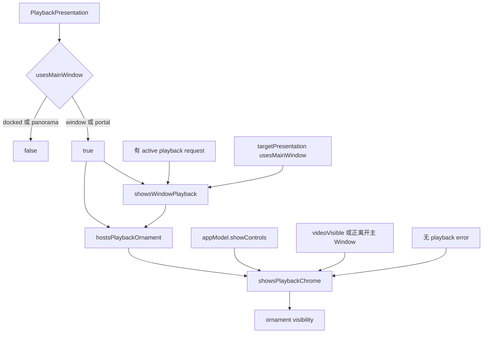

# Window playback ornament 调查与修改报告

## 结论

主 Window 下方的过长间距确实由播放 ornament 内常驻的透明视图造成。它固定为 `728 × 152 pt`，在控件隐藏时仍是可见 ornament 的内容，因此 visionOS 仍按一件挂在 `.scene(.bottom)` 的 ornament 处理它。系统 window bar 由 visionOS 绘制和放置；应用没有直接设置 bar 坐标，而是用底部 ornament 的锚点和内容几何间接影响系统布局。Apple 的公开文档没有披露 window bar 与 ornament 的具体避让算法，所以静态代码能证明多余的 152 pt 几何存在，不能给出系统最终间距的像素公式。

控件斜向飞入飞出不是 `Color.clear` 自身的显隐效果。原实现用条件分支插入和删除 `WindowPlayerDeckView`，同时在其共同祖先 `ZStack` 上施加以 `showsPlaybackChrome` 为触发值的 0.4 秒动画事务。虽然显式 transition 写的是 `.opacity`，条件子树加入和离开时 ornament 内容的布局、系统附着几何与子树中的可动画属性也处于该事务中；这条路径是底部控件代码中除 opacity 之外的运动来源。透明视图负责常驻占位，条件子树与宽泛动画事务负责显隐期间的重新布局，两者是相邻但不同的机制。

“主 Window ornament 必须常驻可见，否则 RealityKit viewport 会重建并黑一帧”没有得到仓库证据支持。仓库中真正量化过的黑屏来自 Panorama 控件每次显隐时打开和关闭独立 `WindowGroup`：提交 `7fc50cf9` 记录四次切换对应四次 compositor blackout；提交 `cb63b07e` 将控件移入 immersive `RealityView` attachment 并删除该控制窗口后，显隐不再触碰 scene 生命周期。后来提交 `daac8ba2` 才在 `MainView` 中加入透明占位；当时的验收记录明确写着黑帧真机验证未完成。后续录屏证明该版本八次切换没有黑帧，但没有与正常 ornament visibility 做前后对照，因此只能证明一次改后结果，不能证明透明占位是必要条件。

本次恢复 Apple 推荐的直接 ornament 结构：modifier 和 `WindowPlayerDeckView` 内容在 SwiftUI 树中保持同一结构，只改变 ornament 的 `visibility`。它不打开或关闭 Window scene，不条件挂载或卸载承载视频的 `RealityView`，也不再保留透明布局面或向 ornament 子树传播自定义动画事务。

## 当前状态链路



各值的实际路径如下。

`PlaybackPresentation.usesMainWindow` 在 `Modules/PlaybackPresentation/Model/PlaybackPresentation.swift` 中只对 `.window` 与 `.portal` 返回 `true`，因此两个主 Window 呈现共享相同的 ornament 路径。

`showsWindowPlayback` 要求存在 active playback request，并且当前 presentation 使用主 Window，或正在转换到使用主 Window 的 target presentation。`hostsPlaybackOrnament` 再要求当前 `appModel.playbackPresentation.usesMainWindow`；因此它在稳定的 Window/Portal 播放期间为真，但不能仅凭转换目标为主 Window 就为真。

`showsPlaybackChrome` 同时要求 `hostsPlaybackOrnament`、`appModel.showControls`、视频已经 `.videoVisible` 或正从主 Window 离开，以及没有 playback error。修改前，ornament visibility 只看 `hostsPlaybackOrnament`，真正 deck 的条件分支才看 `showsPlaybackChrome`。修改后，`showsPlaybackChrome` 直接控制 ornament 的公开 `visibility` 参数。

被删除的 `collapsedWindowControlsOrnamentHeight` 为：

```text
playbackMediaInfoHeight 72
+ Spacing.sm             12
+ ProgressBar.hitHeight  44
+ ControlBar.paddingV × 2 24
=                       152 pt
```

其宽度来自 `DesignTokens.ControlBar.outerWidth`，实际为 `728 pt`。由于 `Color.clear` 只清除像素、不清除布局尺寸，这块几何在控件不可见时仍存在。

`WindowPlayerDeckView` 会把 `appModel.showControls` 继续传给 `FusedPlayerPanel` 的 `controlsVisible`，所以 deck 保持挂载不会改变既有的折叠/复位语义；本次没有修改该组件或受保护的 `PlaybackPanel.swift`。

## Apple 官方做法

Apple 的 [`View.ornament(visibility:attachmentAnchor:contentAlignment:ornament:)`](https://developer.apple.com/documentation/swiftui/view/ornament%28visibility%3Aattachmentanchor%3Acontentalignment%3Aornament%3A%29) 把 `visibility` 定义为 ornament 的可见性控制，官方示例直接把内容放进 `.ornament(attachmentAnchor: .scene(.bottom))`，没有透明占位层。

Apple 的 RealityKit 示例 [`Playing immersive media with RealityKit`](https://developer.apple.com/documentation/visionos/playing-immersive-media-with-realitykit) 明确说明 Shared Space 播放适合使用 ornaments，并采用 `.ornament(attachmentAnchor: .scene(.bottom)) { TransportView() }` 的直接结构。教程 [`Present common controls in an ornament`](https://developer.apple.com/tutorials/develop-in-swift/present-common-controls-in-an-ornament) 同样直接把控件作为 ornament 内容。

[`Ornaments`](https://developer.apple.com/design/human-interface-guidelines/ornaments) 指出 visionOS 用 ornaments 承载视频播放控件，ornament 附着于窗口、略微浮在窗口前方，并可在观看视频时隐藏。[`Playing video`](https://developer.apple.com/design/human-interface-guidelines/playing-video) 也把 visionOS transport controls 描述为 ornaments。Apple 的 [`Windows`](https://developer.apple.com/design/human-interface-guidelines/windows) 指出系统提供窗口控制；应用侧没有用于直接摆放 window bar 的公开 API。

这些资料共同支持的契约是：播放控件本身作为底部 ornament 内容，通过 ornament visibility 显隐。它们没有要求让一个透明的等尺寸 ornament 永久可见，也没有说 visibility 变化会打开、关闭或重建 Window scene。

## 修改与取舍

唯一的生产代码修改在 `Apps/Enchron/MainView.swift`：

1. ornament visibility 从 `hostsPlaybackOrnament` 改为 `showsPlaybackChrome`。
2. `WindowPlayerDeckView` 成为 ornament 的稳定直接内容。
3. 删除常驻 `Color.clear`、deck 的条件插入、局部 `.transition(.opacity)`、祖先 `.animation(...)` 和 152 pt 高度计算。
4. 删除把透明占位解释成黑帧保障的叙述性注释。

这个方案的黑帧依据不是“系统肯定不会做任何内部工作”，而是可审计的生命周期边界：SwiftUI modifier 仍在同一个 `platformContent` 链上，ornament 内容仍是同一个 `WindowPlayerDeckView`，状态变化只进入 Apple 为此公开的 `Visibility` 参数；承载视频的 `primaryContent` 和其中的 `RealityView` 没有条件变化；代码没有 `openWindow`、`dismissWindow`、scene 标识切换或 renderer 重绑。本项目曾测到的 compositor blackout 正是额外 Window scene 的 open/dismiss，而本次路径不执行那种操作。

取舍是放弃未经因果验证的自定义拓扑规避，依赖 Apple 官方 ornament 可见性契约。这样可删除隐藏状态下的 152 pt 几何，并去掉应用自定义的布局动画来源。Apple 文档没有保证 visibility 动画每一帧只有 alpha 变化，因此“佩戴者看到纯淡入淡出”仍必须由真机逐帧录屏确认，不能由编译或静态推理冒充。

## 验证

在未启动 visionOS 模拟器、未连接或操作物理 Vision Pro 的前提下，执行了：

```sh
xcodebuild \
  -project Enchron.xcodeproj \
  -scheme Enchron \
  -destination 'generic/platform=visionOS' \
  -derivedDataPath /Volumes/Cortisol/DevSpace/Xcode/Enchron/DerivedData-portal-controls \
  CODE_SIGNING_ALLOWED=NO \
  build
```

结果为 `** BUILD SUCCEEDED **`，使用的工具链为 `/Volumes/Cortisol/Applications/Xcode-beta5.app/Contents/Developer`，`Xcode 27.0 (27A5237l)`。首次解析包时本 worktree 缺少被忽略的 `PlaybackFFmpeg.xcframework`；为完成编译临时链接了主 worktree 中已有的同名二进制制品，构建后移除该链接。它不进入提交或最终 diff。

静态检查确认：底部 ornament 不再包含固定透明 frame、条件 deck、move/offset/scale transition 或以 `showsPlaybackChrome` 驱动的祖先动画；`.window` 与 `.portal` 仍共用同一门控；受保护的 `Modules/DesignSystem/Components/**` 和 `Modules/PlaybackPresentation/Views/PlaybackPanel.swift` 均未修改。

没有运行 Canvas。现有 `#Preview` 可验证 deck 的静态生产组件外观，但不能复现 visionOS 系统 window bar 的空间避让、系统 ornament visibility 动画或视频 compositor 黑帧，因此打开画布不能关闭本任务剩余的视觉验收缺口。

## 仍需物理 Vision Pro 验证的部分

上层验证应分别在 `.window` 与 `.portal` 播放中录屏，并逐帧核对三件事：控件隐藏后 window bar 与窗口之间不再保留原 152 pt 空区；显示与隐藏期间控件没有横向或纵向位移、仅有透明度变化；每次切换前后视频画面连续且没有 compositor 黑帧。该验证还应区分控件像素、视频像素和 Accessibility 状态；编译成功与静态层级均不能代替佩戴者所见像素。
