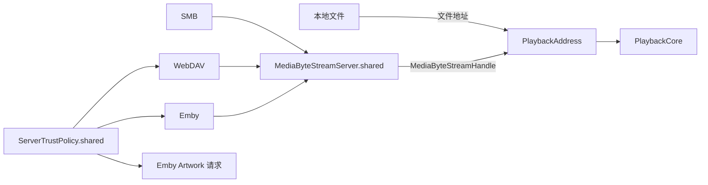

# Media Byte Stream 字节侧重构报告

本次重构把 SMB、WebDAV 与 Emby 的远程媒体字节统一交给 `MediaSource` 的 App 级回环服务。本地文件仍以文件地址直达 PlaybackCore。`PlaybackFeature` 用 `PlaybackAddress` 阻止产品代码把任意 URL 传入播放入口。

## 字节侧判据

| 判据 | 结果 | 取证 |
|---|---|---|
| M1 | 通过 | `Modules/MediaSource/MediaByteStream.swift` 定义 `MediaByteRangeSource`、可空长度、跳转能力、实时属性、建议缓冲深度和区间读取。Local、SMB、WebDAV、Emby 各有实现。 |
| M2 | 通过 | `MediaByteStreamServer.shared` 由 `MediaSource` 持有。SMB、WebDAV 与 Emby 只注册来源。MediaLibrary 原有 `HTTPRangeStreamingServer.swift` 已删除。 |
| M3 | 通过 | 未知长度或第一次读取发现不支持 Range 时，端点返回 `Transfer-Encoding: chunked` 与 `Accept-Ranges: none`。从零开始的 Range 可降级为顺序响应，非零 Range 返回 416。`SMBDataSourceAdapterTests` 覆盖两条顺序路径。 |
| M4 | 通过 | `SMBByteRangeSource` 使用浏览适配器从 `SMBConnectionPool` 取得的同一个 `SMBServerConnection`，播放不创建第二个 `SMB2Manager`。 |
| M5 | 通过 | `WebDAVByteRangeSource` 只实现区间 HTTP 读取。适配器内不再创建或拥有 HTTP 服务。 |
| M6 | 通过 | `EmbyPlaybackBridge` 从 PlaybackInfo 取得带 `api_key` 的 direct-play URL，交给 `EmbyByteRangeSource` 和共享系统 `URLSession`。播放请求得到的是 `127.0.0.1` 回环句柄。旧的直连单测断言已改为句柄断言。 |
| M7 | 通过 | `LocalDataSourceAdapter.resolvePlayableSource` 仍返回文件 URL，不注册回环端点。 |
| M8 | 通过 | `PlaybackLaunchRequest` 的产品初始化方法只接受 `PlaybackAddress`。公开构造仅允许本地文件 URL 或 `MediaByteStreamHandle`。裸 URL 构造仅存在于 `@_spi(Testing)`。 |
| M9 | 通过 | 成功响应不发送 `Connection: close`，连接在响应后继续接收请求。运行测试用同一 URLSession 连续请求两次，`acceptedConnectionCount` 为 1。错误响应仍关闭连接。 |
| M10 | 未完成 | `open_media_source` 的 HTTP 特殊分支仍在 `PlaybackFFmpegBridge.c`。本次未修改该文件，因为该桥接代码与另一路格式构造及解封装线程工作同处，规格允许留到整合阶段。 |
| M11 | 通过 | `SMBConnectionPool` 按标准化 host 与 port 保留一条连接。适配器释放时不主动断开。每次列目录、取属性或读区间前都执行 `connectShare`，让 AMSMB2 确认或恢复连接。 |
| M12 | 通过 | 浏览大小只进入展示、排序和预打开提示。SMB 第一次读取前重新取属性；WebDAV 与 Emby 从第一次 206 的 `Content-Range` 取得当场长度。端点用该长度修正响应范围，不用浏览值截断尾部。 |

## 证书判据

| 判据 | 结果 | 取证 |
|---|---|---|
| S1 | 通过 | `MediaSourceNetwork.shared.session` 使用唯一的 `ServerTrustPolicy.shared`。WebDAV、Emby API、Emby 字节和 App 中的 Artwork 请求使用该 session。 |
| S2 | 通过 | `withConnectionApproval` 只包住 WebDAV 连接验证与 Emby 登录。无法通过系统验证时，`CertificateTrustPrompt` 显示服务器地址、证书名、SHA-256 指纹和有效期。播放读取不在批准作用域内，因此只拒绝，不弹出接受提示。 |
| S3 | 通过 | 策略按 host 与 port 在 UserDefaults 保存指纹。相同指纹可再次使用；指纹改变后旧记录不匹配，播放阶段拒绝，下一次连接来源时重新询问。 |

## 缓存与 Artwork 判据

| 判据 | 结果 | 取证 |
|---|---|---|
| C1 | 通过 | `ContainerIndexCache` 以 `ContentRevision.storageKey` 建目录，只记录 `PlaybackRuntime.open` 期间读取的区间，成功后原子落盘，打开失败时丢弃。运行测试用相同 Content Revision 打开第二个来源，第二个来源的读取列表为空。 |
| C2 | 通过 | 设置页新增 Container Index Cache 行，显示磁盘用量并提供手动清除。实现不设自动容量上限。 |
| C3 | 通过 | 只有持有 `MediaByteStreamHandle` 的远程请求调用索引缓存。本地文件没有句柄，因此不会写该缓存。 |
| A1 | 通过 | `ThumbnailService.swift`、`ThumbnailCache.swift` 及 `AVAssetImageGenerator` 路径已删除。浏览流程只查询已存在的 Artwork 文件，不主动读媒体。 |
| A2 | 通过 | 停止播放或切换媒体前，`PlaybackLaunchCoordinator` 调用 `displayedArtworkImage()`。该方法直接把 renderer 当前显示的 pixel buffer 转成 `CGImage`，不再读取来源字节。 |
| A3 | 通过 | `ArtworkStore` 位于 `MediaSource`。PlaybackFeature 写入，MediaLibrary 读取本地 Artwork，DesignSystem 的 Emby 图片加载器经 App 注入同一存储。 |
| A4 | 通过 | `ArtworkStore.store` 先编码并原子写盘，成功后才写入内存缓存。Emby 图片加载器也先调用可抛错的存储闭包，再放入解码内存缓存。退出路径不派发可丢弃的后台写任务。 |
| A5 | 通过 | Emby 封面继续使用服务器图片 URL，不经过回环端点。完整 URL 包含 image tag，并作为 `ArtworkKey(remoteImageURL:)` 的哈希输入；tag 变化会得到新键。 |

## 防御判据 G3

`Scripts/verification/verify_media_byte_stream.py` 的 NFS 假设清单为三处：

1. `Modules/MediaLibrary/Model/MediaSource.swift`，增加来源类型及其展示元数据。
2. `Modules/MediaLibrary/Sources/NFS/NFSDataSourceAdapter.swift`，实现浏览与 `MediaByteRangeSource`。
3. `Modules/MediaLibrary/FileBrowsingViewModel.swift`，在适配器工厂接入 NFS。

连接表单、侧边栏与文件页都读取 `SourceType` 的元数据，不再需要 NFS 专用分支。清单数量为 3，满足 G3。

## 验证结果

验证使用 Xcode 27.0 beta 5，active developer directory 为 `/Volumes/Cortisol/Applications/Xcode-beta5.app/Contents/Developer`。

| 验证 | 结果 |
|---|---|
| `xcodebuild` 分别构建 MediaSource、MediaLibrary、Emby、DesignSystem、PlaybackFeature 的 generic visionOS scheme | 通过 |
| `xcodebuild -project Enchron.xcodeproj -scheme Enchron -destination 'generic/platform=visionOS' CODE_SIGNING_ALLOWED=NO build` | 通过 |
| `xcodebuild -project Enchron.xcodeproj -scheme EnchronDomainChecks -destination 'generic/platform=visionOS' CODE_SIGNING_ALLOWED=NO build` | 通过，作为根 Package 的 visionOS 构建入口 |
| `SMBDataSourceAdapterTests`，visionOS 27 模拟器 | 12 个测试通过，0 个失败。覆盖 Range、分块、顺序回退、连接复用、索引缓存和取消。 |
| `python3 Scripts/verification/verify_media_byte_stream.py` | 通过 |
| `git diff --check` | 通过 |
| `Packages/PlaybackCore` 的 macOS `swift test` | 201 个测试，8 个失败，13 个 issue，与规定基线逐名一致。 |

PlaybackCore 的八个基线失败为：

1. `appleImmersiveProviderClassifiesSourceWithoutReplacingMismatchedBridgeFormat()`
2. `appleMVHEVCFixtureIsDistinguishedFromOrdinaryHEVC()`
3. `controllerRejectsSecondOpenAndRecordsTheRejection()`
4. `controllerSeekKeepsSessionAndAdvancesStreamEpoch()`
5. `newerSeekSupersedesOlderSeekAndOwnsFinalTarget()`
6. `rapidRelativeSeeksAccumulateInsideTheCore()`
7. `rapidSeeksOnlyPublishCuesAtTheNewestCommittedPosition()`
8. `threeRapidSeeksOnlyAllowNewestWaiterToEnterSession()`

根 Package 的裸 macOS `swift test` 仍会在仓库既有的 macOS 12 deployment target 上遇到 visionOS 产品源码的 API availability 错误，因此不能运行 `EmbyPackageTests`。生产 Emby 模块和整个 App 的 visionOS 构建均已通过。真机画面、物理音频和性能验证不在本次范围内。

## 决策与代价

回环句柄承担注册生命周期，因此远程外挂字幕也必须保留 `MediaByteStreamHandle`。否则只保存 URL 会在临时解析对象析构时注销端点。

Container Index Cache 把 `PlaybackRuntime.open` 作为容器打开区间。该边界避免缓存正常播放阶段的媒体读取，但容器解析为了建立轨道而读取的头部字节也会随索引保存。缓存没有自动上限，用户只能从设置页查看用量并手动清除，这是规格要求沿用的语义。

Artwork 写盘位于退出和换片路径，磁盘写入失败时不更新内存。这个顺序保证不变量，代价是退出动作可能等待一次 JPEG 编码与原子写入。

用户接受的证书指纹只对同一 host 与 port 生效。系统信任失败且当前不在连接来源阶段时，请求直接失败；播放不会为了继续而弹出接受提示。
