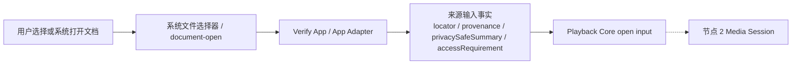

# 节点 1：媒体来源获取

## 作用与边界

节点 1 记录 App 通过系统授权路径取得的本地媒体来源及其 provenance。播放核心准入属于节点 2，媒体结构判断属于节点 3。

## 节点位置

输入边界：系统文件选择器或等价系统 document-open 路径 → Verify App / App Adapter。

输出边界：Verify App / App Adapter → Playback Core 控制面。

完成条件：App 通过可追溯入口获得本地媒体 `file` URL，并向播放核心交付完整的来源输入事实。Media Session 由节点 2 创建，容器由节点 3 读取，长期授权由 App 的授权仓库管理。

## 输入

节点 1 的输入是系统 document-open 类事件。第一轮接受两类入口：

1. 系统文件选择器返回的本地媒体 `file` URL。
2. 系统 document-open 或等价系统授权路径交给 App 的本地媒体 `file` URL。

验证 App 可以模拟入口事件，但必须把 `provenance` 标为 `verificationApp`。验证 App 入口不能冒充用户通过系统文件选择器选择了文件。

## 输出

成功输出是 App Adapter 或验证 App 交给公开 `open(source:)` 入口的来源输入事实。节点 2 接受 open 后才创建 Media Session，节点 3 再判断容器是否可打开。

来源输入事实至少包含：

1. `locator`：本地媒体 `file` URL 或等价 locator。
2. `provenance`：systemFileImporter、documentOpen、testAutomation 或未来稳定入口。
3. `privacySafeSummary`：可进入日志、Snapshot 和证据的脱敏摘要。
4. `accessRequirement`：该来源是否需要 security-scoped access 或等价访问能力。

## 结果提交与节点推进

节点 1 operation 的结果必须记录为 `succeeded`、`failed` 或 `terminatedByCleanup`。

`succeeded` 表示 App Adapter 已经形成来源输入事实，并把它们交给播放核心公开入口。只有此时节点 2 才可以尝试创建 Media Session。

`failed` 表示系统入口没有产出可交付来源，或来源无法满足节点 1 的基本条件。该结果产出 Source Acquisition Failure Record。

`terminatedByCleanup` 表示 App 或验证 App 在来源交付完成前终止本次入口流程；节点 2 不会因该结果推进。

## 验收方向

节点 1 的主要验收层级是 L2。第一轮 L2 使用 Verify App handoff 证明 App 能把来源输入事实交给播放核心公开 `open(source:)`。systemFileImporter 和 documentOpen 是独立入口，不和 Verify App handoff 合并成同一个通过条件。

L1 覆盖来源输入事实的数据结构、脱敏规则和失败记录格式；系统文件选择器行为由 L2 覆盖，媒体可播放性由后续节点覆盖。

实现期测试必须证明三件事：

1. 成功入口会产出来源输入事实，并交给播放核心公开入口。
2. 失败入口会产出 Source Acquisition Failure Record，且不推进节点 2。
3. 入口取消会记录 `terminatedByCleanup`，且不创建 Media Session。

调试投影必须能解释来源入口、locator 脱敏摘要、访问要求、交付目标和失败原因。具体测试文件、fixture、断言字段由实现阶段使用 `$tdd` skill 决定。
