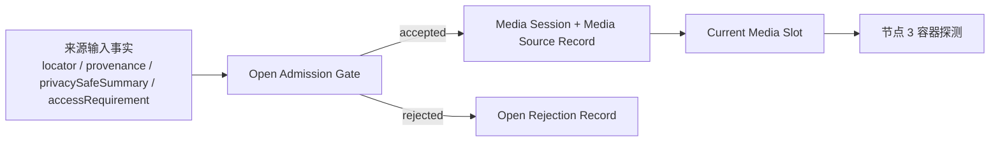

# 节点 2：媒体会话创建与来源接入

## 作用与边界

节点 2 把“用户要打开的来源”变成“当前这一轮播放会话”，并决定这轮会话能不能占用当前媒体槽位。
后续容器、轨道、packet、sample、renderer 和呈现事实都会逐步挂到同一个 Media Session 上。

## 节点位置

输入边界：Verify App / App Adapter → Playback Core 控制面。

输出边界：Playback Core 控制面 → Playback Core 当前媒体会话。

完成条件：播放核心为接受的来源创建可追踪的 Media Session，将 Media Source Record 与该会话不可变绑定，并占用当前媒体槽位。容器、轨道、packet、sample、renderer 和呈现事实由节点 3 至节点 9 逐步追加。

节点 2 的输入不是裸 URL。App Adapter 或验证 App 必须把 `locator`、`provenance`、`privacySafeSummary` 和
`accessRequirement` 作为来源输入事实交给播放核心。播放核心可以验证、记录和绑定这些事实，但不能从裸 URL
推断来源入口、脱敏摘要或读取访问要求。

## 定义

媒体会话是播放核心为一轮 `open → playback lifecycle → close / failed` 创建的轻量上下文。

媒体会话是渐进式的。它在节点 2 只需要包含身份、来源、来源读取准入结果、生命周期摘要和 open 准入关系。
容器信息、轨道信息、解封装事件、CoreMedia sample、renderer 输入和 RealityKit 呈现事实由后续节点逐步挂靠到同一轮媒体会话。

## Media Session ID

Media Session ID 是播放核心为每一次被接受的 open 创建的唯一身份。

它标识后续事实所属的媒体播放轮次。

同一个媒体来源被重复打开，也必须产生不同的 Media Session ID。媒体来源说明“哪个媒体”，Media Session ID 说明“哪一轮播放”。

被拒绝的 open 不创建 Media Session ID。

## Media Source Record

Media Source Record 是被接受的 open 带入媒体会话的来源记录。

媒体会话不直接把裸 URL 当作完整来源事实。裸 URL 只说明媒体位置。Media Source Record 同时说明媒体位置、来源证明、可记录摘要和读取访问要求。

Media Source Record 包含四个字段。节点 2 先定义这些字段的职责，不在本阶段穷举全部取值。

1. `locator` 记录媒体位置，可以是本地文件 URL 或未来等价 locator。授权、可读性和媒体格式分别由其他字段及后续节点确定。
2. `provenance` 回答这个来源是怎么进入系统的。它说明 `locator` 来自系统文件选择、系统 document-open、验证 App 或未来产品入口等来源类别。
3. `privacySafeSummary` 回答证据里可以安全记录什么。它必须能帮助追踪同一个来源，但不能要求记录完整私有路径。
4. `accessRequirement` 记录读取这个来源所需的 security-scoped access 或等价访问能力。实际访问结果由来源读取准入记录，长期授权由 App Adapter 或等价授权仓库管理。

这四个字段共同构成 accepted open 的来源事实：`locator` 表示位置，`provenance` 表示入口，`accessRequirement` 表示读取前提，`privacySafeSummary` 表示可公开记录的摘要。

被接受的 open 必须把 Media Source Record 不可变地绑定到新的 Media Session ID。

不可变绑定表示：同一轮媒体会话不能在生命周期中偷偷更换媒体来源。如果用户或测试要打开另一个媒体来源，播放核心必须先结束当前媒体会话，再创建新的媒体会话。

节点 2 的成功边界止于 Media Source Record 与 Media Session ID 的绑定。`locator` 的实际读取和容器打开结果由节点 3 记录。

## Open Rejection Record

Open Rejection Record 是被拒绝的 open 留下的可观察拒绝记录。

被拒绝的 open 不创建 Media Session ID，不创建 Media Source Record，也不占用当前媒体槽位。它仍然必须留下 Open Rejection Record，使验收能够区分明确拒绝和静默丢弃。

Open Rejection Record 至少包含三类事实：

1. `rejectionReason`：拒绝原因，例如当前媒体槽位已被占用，或来源读取准入不成立。
2. `privacySafeSourceSummary`：可以进入日志、Snapshot 和证据记录的来源脱敏摘要。
3. `slotState`：拒绝发生时当前媒体槽位是否被占用，以及被哪个 Media Session ID 占用。

Open Rejection Record 是准入失败事实，不是媒体会话事实。它可以被日志、事件或 Snapshot 观察到，但不能被后续节点当作媒体会话继续推进。

## 来源读取准入与授权归属

来源读取准入是 open 被接受前的前置判断。

它确认 Media Source Record 是否具备进入当前媒体会话的基础读取前提。

来源读取准入确认本次 open 具备所需的 security-scoped access 或等价读取前提。实际 I/O、容器格式和 demux 结果在节点 3 以后确定；读取前提无法确认时拒绝 open。

长期授权能力不属于单个媒体会话。用户授予 App 的文件或文件夹访问能力可以跨多个媒体会话存在，并由 App Adapter 或等价授权仓库管理。媒体会话结束不能释放用户授予 App 的长期授权。

如果播放核心为了本轮媒体会话创建了临时读取句柄、文件描述符或等价会话本地资源，这些资源必须随当前媒体会话清理。这个清理责任不同于长期授权的撤销。

规则如下：

1. 如果 Media Source Record 不需要额外读取访问，来源读取准入记录为 `notRequired` 或等价事实。
2. 如果 Media Source Record 需要系统授权访问，播放核心接受 open 前必须能观察到当前 open 已经具备可用读取前提。
3. 如果所需读取访问无法建立或确认，open 必须被拒绝。
4. 因读取准入失败而被拒绝的 open 创建 Open Rejection Record。
5. 如果播放核心为这轮媒体会话创建了会话本地读取资源，那么 close 清理完成或 failed 已记录后必须清理这些资源。

本节点不定义 App 如何获取、保存或撤销长期授权。节点 2 关心的是这次 open 的读取准入，以及媒体会话本地读取资源的清理。
如果 open 已经被接受，但后续实际读取文件、打开容器或探测媒体结构失败，这些失败必须挂靠到同一个 Media Session ID 和 Media Source Record，并由后续节点继续分类。

## 当前媒体槽位

播放核心同一时刻只有一个当前媒体槽位。

被接受的 open 会创建新的 Media Session ID，并占用当前媒体槽位。

只要当前媒体槽位被占用，后续 open 都必须被拒绝。被拒绝的 open 不创建新的 Media Session ID，也不能静默吞掉；拒绝结果必须可观察。

当前媒体槽位用于决定播放核心是否接收新的 open。它避免把 open 准入规则写成一个大型状态机。

## open 准入规则

open intent 可以来自系统文件入口、App Adapter、验证 App 或未来产品入口。

Playback Core 不要求外部世界永远只产生一个 open intent。Playback Core 只保证自己同一时刻最多接受一个 open。

规则如下：

1. 当前媒体槽位为空，并且来源读取准入成立时，播放核心可以接受 open。
2. 被接受的 open 创建新的 Media Session ID，并占用当前媒体槽位。
3. 当前媒体槽位被占用时，播放核心拒绝新的 open。
4. 来源读取准入不成立时，播放核心拒绝 open。
5. 被拒绝的 open 不创建新的 Media Session ID。
6. 被拒绝的 open 创建 Open Rejection Record。

## 槽位释放规则

当前媒体槽位只在两类原因下释放：

1. 外部主动关闭当前媒体，并且清理完成。
2. 当前媒体会话进入不可恢复 failed，并且失败已经被记录。

`close` 是外部主动释放当前媒体槽位。它适用于用户退出播放、App 关闭当前媒体或测试显式关闭当前媒体。

`failed` 是播放核心被动释放当前媒体槽位。它适用于来源读取准入已经成立后发生的实际 I/O 失败、容器无法打开、后续管线出现不可恢复错误等情况。

节点 2 暂不定义独立的 `cancel`。如果 opening 过程中外部要求结束当前媒体，本节点将其归入 `close`。
如果未来支持 active session 中打开新媒体并替换旧媒体，再重新讨论是否需要 `cancelled`。

`ended` 不自动释放当前媒体槽位。播放结束只表示当前媒体播到末尾，不表示用户已经退出当前媒体。

## 当前会话事实更新规则

只有当前媒体槽位中的 Media Session 可以更新当前媒体事实。

后续节点产生的事实必须携带或可追溯到 Media Session ID。播放核心用这个身份判断该事实是否属于当前媒体槽位。

如果当前媒体槽位为空，媒体事实不能更新当前媒体状态。

如果当前媒体槽位已经被新的 Media Session 占用，旧 Media Session 的后续事实不能更新当前媒体状态。它可以被忽略，或作为诊断事实记录，但不能被当作当前媒体事实。

如果当前 Media Session 正在 close 清理或 failed 释放流程中，后续事实只能参与清理和诊断，不能把该 Media Session 恢复为 `opening`、`ready`、`playing` 或其他活跃状态。

## 验收方向

节点 2 的主要验收层级是 L1。Media Session、Media Source Record、当前媒体槽位、open 准入、拒绝记录和槽位释放都应由核心测试用结构化断言证明。

L1 覆盖节点 2 的内部状态；L2 补充公开 `open(source:)` 经由验证 App 进入核心后的可观察状态。

实现期测试必须证明四件事：

1. 合法 open 会创建新的 Media Session 和 Media Source Record，并占用当前媒体槽位。
2. 被拒绝的 open 会产出 Open Rejection Record，且不创建新的 Media Session。
3. 同一 Media Session 生命周期内来源绑定不可变。
4. close cleanup 和不可恢复 failed 会在记录完成后释放当前媒体槽位。

调试投影必须能解释会话身份、来源摘要、访问准入结果、槽位变化、拒绝原因和 cleanup 状态。具体测试文件、fixture、断言字段由实现阶段使用 `$tdd` skill 决定。

## implement 时可能遇到的需现场决策的堵点

以下问题留给实现期现场决策并记录 note：

1. Media Session ID 的具体格式是否需要可排序，还是只需要唯一。
2. `privacySafeSummary` 应包含哪些字段，才能既支持追踪，又避免泄露受限素材路径。
3. `provenance` 应使用哪些稳定取值。
4. `accessRequirement` 应如何表达 security-scoped access、无需额外访问能力和验证 App 来源。
5. Open Rejection Record 应该通过错误事件、状态字段、Snapshot 字段，还是三者共同暴露。
6. `failed` 释放槽位前，错误事实必须被哪些出口观察到。
7. 来源读取准入结果和会话本地资源清理结果应使用哪些稳定取值。
