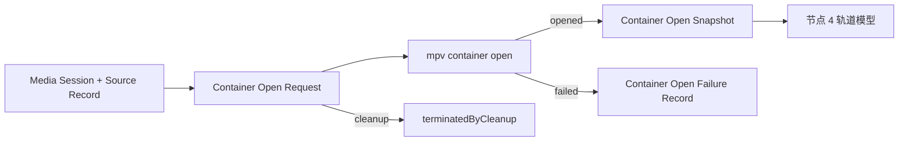

# 节点 3：Container Open Snapshot

## 作用与边界

节点 3 是“在 mpv 打开容器完成时拍一张媒体结构快照”。播放核心从当前 Media Session 和 Media Source Record 派生一个 demux-openable locator，让 mpv / demux layer 打开容器；打开成功后，节点 3 记录 mpv 在这个阶段已经知道的媒体结构事实。

节点 3 只同步事实，不在生产流程中判断这个媒体是否足够继续播放。字段是否足够建立播放核心 Track Model，是节点 4 的输入契约和验收测试要证明的事。

## 节点位置

输入边界：Playback Core 当前媒体会话和 Media Source Record → Container Open Request。

输出边界：Container Open Request → Container Open Snapshot / Container Open Failure Record / cleanup 终止。

完成条件：播放核心为当前 Media Session 发起容器打开，并把 mpv 在 container-open 阶段可观察的媒体结构事实写成稳定快照。连续 packet、CoreMedia sample、renderer 输入和呈现结果分别属于节点 5、6、7 和 9。

节点 3 不产出播放许可判断。如果容器打开成功但没有视频轨、codec 不可用或关键字段不足，节点 3 仍然可以产出快照；后续节点会按自己的输入契约失败或跳过。

## 数据来源

节点 3 的主数据源是 mpv 内部 container-open 结果。实现期应优先在 mpv demuxer 打开成功、`demuxer` 和 `sh_stream` 等结构事实已经建立、持续 `read_packet` 尚未成为节点输出的位置，增加只读 snapshot hook。

外部 libmpv property 不是节点 3 的主数据源。`file-format`、`duration`、`track-list`、`metadata` 等 property 可作为验收对照，确认内部 snapshot 与 mpv 对外可见事实不矛盾。

这个 hook 不属于节点 5 的 packet seam。节点 3 可以修改 mpv 源码以记录只读媒体结构快照，但不得引入 packet、sample、frame 或 renderer 行为。

节点 3 记录媒体事实，不记录 mpv 机器零件。C 指针、mutex、thread 状态、packet 队列、AVIO buffer 内容和 demuxer 私有临时变量默认不进入 Container Open Snapshot。

## Container Open Request

Container Open Request 是节点 3 的核心动作。它由当前 Media Session 发起，用于请求 mpv / demux layer 按媒体容器打开一个 locator。

Container Open Request 是播放核心在节点 2 接受 open 后，根据当前媒体会话和 Media Source Record 派生的 demux 请求；用户 open intent 和 Media Source Record 是它的上游输入。

Container Open Request 至少包含三类事实：

1. `mediaSessionID`：这次容器打开属于哪一轮媒体会话。
2. `sourceSummary`：这次容器打开从哪个 Media Source Record 派生，使用可记录的脱敏摘要表达。
3. `demuxOpenableLocator`：demux layer 实际需要打开的低层 locator。

mpv / demux layer 不需要接收完整的 Media Source Record。Media Source Record 里的 `provenance`、`privacySafeSummary` 和 `accessRequirement` 属于播放核心验收模型；demux layer 真正需要的是它能打开的 locator。

节点 3 不能只证明 mpv / demux layer 收到了一个 URL 或 path。它还必须证明这个 URL 或 path 来自当前媒体会话绑定的 Media Source Record，并且本次容器打开动作属于同一个 Media Session ID。

## demux-openable locator

demux-openable locator 是 Container Open Request 中交给 demux layer 的低层媒体位置。

对本地媒体来说，它通常是 file URL、文件系统路径或等价 locator。具体形态由 demux layer 能接受什么决定。

demux-openable locator 表示 demux layer 已收到可用于尝试打开容器的位置。来源授权由节点 2 记录；文件可读性、容器合法性和 track 由本节点的打开结果确定，packet 与 sample 由节点 5 和节点 6 确定。

## 节点 3 流程

节点 3 按以下流程运行：

1. 当前 Media Session 发起 Container Open Request。
2. 播放核心从 Media Source Record 派生 demux-openable locator。
3. 播放核心只把 demux-openable locator 交给 mpv / demux layer。
4. mpv / demux layer 打开字节来源，探测容器，并建立 container / track 结构事实。
5. 在 container open 完成后，节点 3 捕获 Container Open Snapshot。
6. Container Open Request 以 `succeeded`、`failed` 或 `terminatedByCleanup` 结束。

mpv 在 container open 阶段可能会读取必要字节或调用 stream-info 探测逻辑。只要节点 3 对外产出的是容器和轨道结构事实，而不是连续 packet / sample / frame，就仍属于节点 3。

`succeeded` 产出 Container Open Snapshot。`failed` 产出 Container Open Failure Record。`terminatedByCleanup` 不创建成功或失败记录。

## 结果提交与节点推进

Container Open Request 的结果必须提交回发起它的 Media Session，并遵循总地图的节点推进规则。

`succeeded` 写入 Container Open Snapshot，节点 4 才可以开始。
`failed` 写入 Container Open Failure Record，节点 4 不会开始。
`terminatedByCleanup` 不创建 Container Open Snapshot 或 Container Open Failure Record，节点 4 不会开始。

## Container Open Snapshot

Container Open Snapshot 是 Container Open Request 成功时的输出。

它证明当前 Media Session 的来源已经被 mpv / demux layer 打开为媒体容器，并且节点 3 已经记录 container-open 阶段可观察的媒体结构事实。

Container Open Snapshot 不是播放核心的最终轨道模型。它只描述 mpv / demux layer 看到的原始媒体结构。节点 4 负责把这些事实转换成播放核心自己的 video、audio 和 subtitle 轨道模型。

Snapshot schema 分两层：

1. `normalized`：后续节点和验收可以依赖的稳定字段。
2. `mpvObservedExtra`：mpv 在该阶段暴露、但尚未升格为稳定契约的媒体事实。

字段缺失必须显式表达。通用状态语义沿用总体验证系统中的 `none`、`unknown`、`notExposed` 和 `unsupported`；有值字段可以用 `known` 或直接记录值，但不能静默消失。

Container Open Snapshot 至少包含以下事实组：

1. `schemaVersion`、`mediaSessionID`、`sourceSummary` 和 `capturePhase = afterDemuxerOpen`。
2. `open`：`status = opened`、mpv demuxer 名称、container format、format provenance。
3. `source`：demux-openable locator 的脱敏摘要、文件大小、seekable、isNetwork、isStreaming 和 stream origin；无法确定时显式记录缺失状态。
4. `container`：duration、start time、global metadata、chapters、editions、attachments、fullyRead、timestamp reset 可能性和其他容器层结构事实。
5. `tracks[]`：每条 mpv / demux track 的原始轨道事实。
6. `mpvObservedExtra`：实现期发现但暂未归一化的媒体结构事实。

每条 `tracks[]` 至少按媒体事实表达以下类别：

1. 稳定索引与来源映射：snapshot track index、demuxer id、FFmpeg stream index 或等价来源索引。
2. 轨道类型：video、audio、subtitle、attachment 或 unknown。
3. codec facts：codec name、description、profile、tag、duration、bitrate、extradata size / hash 或等价摘要。
4. label facts：title、language、container flags、program ids 和 track metadata。
5. video facts：width、height、fps、pixel format、aspect ratio、rotation、crop、color info、chroma location、stereo mode、Dolby Vision 摘要。
6. audio facts：sample rate、channels、sample format、block align、replaygain 摘要。
7. subtitle facts：subtitle codec、frame-based hint、extradata size / hash 或等价摘要。

第一版不要求把以上每个字段都提升为手写固定字段；实现可以先把稳定字段归一化，其余媒体事实放入 `mpvObservedExtra`。但测试必须能区分事实不存在、当前无法确定、当前 seam 未暴露和当前播放核心不支持。

## Container Open Failure Record

Container Open Failure Record 是 Container Open Request 失败时的输出。

它证明节点 3 没有产出 Container Open Snapshot，但失败被明确记录，并且挂靠到同一个 Media Session ID。

Container Open Failure Record 至少包含以下事实：

1. `mediaSessionID`：这次失败属于哪一轮媒体会话。
2. `sourceSummary`：这次失败来自哪个 Media Source Record。
3. `failureReason`：失败原因。
4. `failureStage`：失败发生在 locator 派生、stream open、demuxer probe、container open 或 snapshot capture 的哪个阶段。

codec 不支持、无可播放轨道、字幕格式不支持和默认轨道选择不属于节点 3 的失败分类。节点 3 可以记录 snapshot track facts 和 raw codec facts，但是否成为播放核心可用轨道由节点 4 和后续节点判断。

## 验收方向

节点 3 的主要验收层级是 L1。L1 证明 Container Open Snapshot 的结构、mpv container-open 阶段观察事实、外部 property 对照和阶段边界。L2 只证明真实 App 打开路径能触发真实 mpv container open，并把结果归属到同一个 Media Session。

实现期测试必须证明五件事：

1. 合法媒体容器打开成功后，会产出 Container Open Snapshot。
2. mpv container-open 阶段可观察且已归一化的媒体结构事实，会进入 snapshot。
3. 缺失事实会以明确缺失状态记录。
4. 外部 mpv property 能看到的重叠事实，与 snapshot 对应字段一致；需要接受差异时，拆成独立用例并记录差异原因。
5. 节点 3 不输出 demux packet、CMSampleBuffer、decoded frame、pixel buffer 和 renderer 事实。

节点 3 的测试可以证明“某个可播放视频 fixture 的 snapshot 包含节点 4 所需字段”，但这个检查属于验收和节点 4 输入契约，不是节点 3 的生产判断。

调试投影必须能解释 container open request、Media Session 归属、locator 摘要、capture phase、demuxer、format、duration 状态、轨道摘要、property 对照和失败原因。具体 hook 点、fixture 文件、字段命名细节和 hash 算法由实现阶段使用 `$tdd` skill 决定，并在实现 note 中记录。

## implement 时可能遇到的需现场决策的堵点

以下问题留给实现期现场决策并记录 note：

1. `demuxOpenableLocator` 的证据摘要应记录哪些字段，才能既证明输入一致，又避免泄露受限素材路径。
2. Container Open Request 是否需要独立 identity，还是 Media Session ID 加 request timestamp 已经足够。
3. mpv container-open 完成后的具体只读 hook 点。
4. 哪些 `mpvObservedExtra` 字段应在后续版本提升为 normalized schema。
