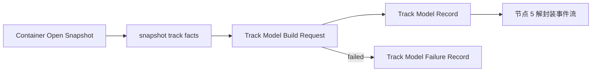

# 节点 4：轨道模型建立

## 作用与边界

节点 4 把 mpv / demux layer 的原始轨道事实转换为播放核心自己的轨道目录和消费选择表。Track Model Record 为后续 packet 路由、sample 组装、renderer 和诊断提供稳定身份；packet 数据从节点 5 开始处理。

## 节点位置

输入边界：Container Open Snapshot 中的 snapshot track facts → Playback Core Track Model Build Request。

输出边界：Playback Core Track Model Build Request → Track Model Record / Track Model Failure Record / cleanup 终止。

完成条件：播放核心将 Container Open Snapshot 中的原始轨道事实转换为当前 Media Session 内稳定、可追踪、可验证的 Track Model Record。packet、sample、renderer 和呈现结果由后续节点记录。

## mpv 轨道事实与播放核心轨道模型

mpv 自己有面向播放控制和前端使用的 track 抽象。它可以通过 `track-list` 和 `current-tracks` 暴露轨道事实，例如轨道类型、轨道 ID、来源 ID、标题、语言、codec、是否被选中、容器宽高、音频声道数、采样率、时长、旋转信息和每轨 metadata。

节点 4 不直接读取 mpv 内部结构，也不直接重新查询 mpv property。节点 4 的输入是节点 3 已经产出的 Container Open Snapshot。mpv property 可以用于节点 3 的外部对照测试，但不能绕过 snapshot 成为节点 4 的主输入。

播放核心不复制 mpv 的内部 track 结构。节点 3 snapshot 已经把 mpv container-open 阶段的媒体事实整理成稳定边界；节点 4 在这个边界上建立自己的 Track Model Record，因为后续节点需要的是当前 Media Session 内稳定、可追踪、可验收的播放核心轨道身份，而不是 mpv 内部对象。

这个边界带来一个重要区别：mpv 的 `selected` 是 mpv 播放管线里的选择状态。播放核心 Track Model Record 中的 `selected`，是播放核心决定哪些轨道进入后续内容管线的结果。两者可以相互参考，但不能被当成同一个事实。

节点 4 不创建 `CMFormatDescription`、`CMBlockBuffer`、`CMSampleBuffer`，也不复制 packet bytes。它只为后续节点提供轨道身份、来源映射、媒体事实和消费选择。真正的 sample 组装发生在节点 6；字幕可呈现物组装发生在节点 6S；renderer 与 synchronizer 进入节点 7。

## Track Model Build Request

Track Model Build Request 是节点 4 的核心动作。它由当前 Media Session 发起，用于把 Container Open Snapshot 中的 snapshot track facts 转换成 Track Model Record。

Track Model Build Request 至少包含以下事实：

1. `mediaSessionID`：这次轨道模型建立属于哪一轮媒体会话。
2. `containerOpenSnapshotSummary`：这次轨道模型建立来自哪一份 Container Open Snapshot。
3. `snapshotTrackFacts`：节点 3 记录的 mpv / demux layer 原始轨道事实。

Track Model Build Request 只能从同一个 Media Session 的 Container Open Snapshot 开始。节点 4 不直接重新解释用户 open intent，也不直接读取 Media Source Record 或 mpv property 来推断轨道。

## snapshot track facts

snapshot track facts 是节点 3 Container Open Snapshot 中记录的 mpv / demux layer 容器轨道事实。它们是节点 4 的输入，不是播放核心的最终轨道模型。

snapshot track facts 至少需要覆盖以下信息类别：

1. 轨道类型：video、audio、subtitle、attachment、unknown 或等价分类。
2. 来源映射：mpv track id、source track id、FFmpeg stream index 或等价来源索引；缺失时必须显式记录为 `unknown`。
3. 可读标签：标题、语言、默认轨道、强制轨道、辅助功能标记和每轨 metadata；缺失时必须显式记录为 `none` 或 `unknown`。
4. codec hint：codec name、codec description、profile 或等价信息；缺失时必须显式记录为 `unknown`。
5. container hint：视频宽高、帧率、旋转、像素宽高比、轨道时长、音频声道数、音频采样率、码率或等价信息；缺失时必须显式记录为 `unknown`。
6. 原始选择事实：mpv / demux layer 是否已经把某条轨道标为 selected 或 current；缺失时必须显式记录为 `unknown`。

snapshot track facts 可以不包含后续 sample assembly 所需的压缩字节、参数集或 packet timing。这些属于节点 5 和节点 6。

attachment 表示容器附带资源，例如封面图、字体、图片附件或 Matroska attachments。HDR、投影、立体布局和色彩信息不是默认 attachment；它们应作为 container facts、track facts、codec facts、bitstream side data、format description extension 或 sample attachment 的媒体解释事实保留。

## Track Model Record

Track Model Record 是 Track Model Build Request 成功时的输出。

它证明播放核心已经把 snapshot track facts 解释成当前 Media Session 内稳定的轨道模型，并且后续节点可以用这份模型来路由 packet、建立 sample、选择 renderer 输入和解释诊断信息。

Track Model Record 至少包含以下事实：

1. `mediaSessionID`：这份轨道模型属于哪一轮媒体会话。
2. `containerOpenSnapshotSummary`：这份轨道模型来自哪一份 Container Open Snapshot。
3. `tracks`：播放核心建立的轨道列表。
4. `selectedTrackIDs`：被播放核心显式选择进入后续内容管线的轨道集合。
5. `primaryVideoTrackID`：初始主视频轨；没有被选中的主视频轨时必须显式记录为 `none` 或失败原因。
6. `selectedAudioTrackID`：初始音频轨；没有选中音频时必须显式记录为 `none`。
7. `selectedSubtitleTrackID`：初始字幕轨；没有选中字幕时必须显式记录为 `none`。

每条轨道至少包含以下事实：

1. `trackModelID`：当前 Media Session 内稳定的播放核心轨道身份。
2. `kind`：video、audio、subtitle、attachment 或 unknown。
3. `rawSourceMapping`：这条轨道对应的 snapshot track facts 摘要。
4. `codecHint`：从 snapshot track facts 得到的 codec 信息。
5. `containerHint`：从 snapshot track facts 得到的容器层媒体提示。
6. `labelFacts`：标题、语言、默认标记、强制标记和每轨 metadata 等可读事实。
7. `consumer`：videoSampleBuffer、audioSampleBuffer、subtitleRenderable 或 none。
8. `selected`：true 或 false。只有 selected 为 true 的轨道会进入后续内容管线。
9. `notSelectedReason`：当 selected 为 true 时记录 none；当 selected 为 false 时记录 unsupported、missingRequiredFacts、noConsumer、notChosen 或 unknown。

Track Model ID 不等同于 mpv 的 track id。mpv 的 track id 可以作为 `rawSourceMapping` 的一部分，但播放核心必须拥有自己的稳定轨道身份，避免后续节点把 mpv UI ID、容器 ID 和播放核心 ID 混在一起。

Track Model ID 应该是不携带业务语义的 opaque stable id。轨道类型由 `kind` 表达，消费路径由 `consumer` 表达，不应把这些语义编码进 Track Model ID。

后续节点的状态机只看两个字段：

1. `selected == true`。
2. `consumer != none`。

`selected = true` 且 `consumer = none` 是无效组合。`consumer = none` 的轨道必须 `selected = false`，并记录 `notSelectedReason = noConsumer` 或更具体原因。

其他字段用于诊断、错误解释、Debug Snapshot 和后续能力扩展，不应引入额外运行时状态分支。

## consumer

`consumer` 表示这条轨道的内容应该交给哪类后续内容管线。第一版只定义四个取值：

1. `videoSampleBuffer`：视频轨进入节点 5 / 节点 6 的视频 sample-buffer 路径。
2. `audioSampleBuffer`：音频轨进入节点 5 / 节点 6 的音频 sample-buffer 路径。
3. `subtitleRenderable`：字幕轨进入节点 5 / 节点 6S 的字幕可呈现物路径。
4. `none`：这条轨道或资源当前没有后续内容消费者。

`consumer` 不是 renderer，也不是 synchronizer。`AVSampleBufferRenderSynchronizer` 是节点 7 的时间协调设施；它管理 renderer 时间线，不消费某条 track 的内容。

## 选择规则

节点 4 记录所有轨道，但只显式选择当前播放核心要消费的轨道。

第一版视频播放链条要求至少选中一条 `consumer = videoSampleBuffer` 的主视频轨。音频和字幕是可选轨道：没有可选音频或字幕时，`selectedAudioTrackID` / `selectedSubtitleTrackID` 记录为 `none`，不导致节点 4 失败。

未被选择的轨道仍保留在 Track Model Record 中，并通过 `notSelectedReason` 解释。`notSelectedReason` 是诊断标签，不是状态机分支。

## 节点 4 流程

节点 4 按以下流程运行：

1. 当前 Media Session 已经写入 Container Open Snapshot。
2. 播放核心从 Container Open Snapshot 取得 snapshot track facts。
3. 播放核心发起 Track Model Build Request。
4. 播放核心把每条 snapshot track fact 归一化为当前 Media Session 内的播放核心轨道。
5. 播放核心为每条轨道确定 `kind`、`consumer`、`selected` 和 `notSelectedReason`。
6. 播放核心计算初始主视频轨、初始音频轨和初始字幕轨。
7. Track Model Build Request 以 `succeeded`、`failed` 或 `terminatedByCleanup` 结束。

`succeeded` 产出 Track Model Record。`failed` 产出 Track Model Failure Record。`terminatedByCleanup` 不创建成功或失败记录。

## 结果提交与节点推进

Track Model Build Request 的结果必须提交回发起它的 Media Session，并遵循总地图的节点推进规则。

`succeeded` 写入 Track Model Record，节点 5 才可以开始。
`failed` 写入 Track Model Failure Record，节点 5 不会开始。
`terminatedByCleanup` 不创建 Track Model Record 或 Track Model Failure Record，节点 5 不会开始。

## Track Model Failure Record

Track Model Failure Record 是 Track Model Build Request 失败时的输出。

它证明节点 4 没有产出 Track Model Record，但失败被明确记录，并且挂靠到同一个 Media Session ID。

Track Model Failure Record 至少包含以下事实：

1. `mediaSessionID`：这次失败属于哪一轮媒体会话。
2. `containerOpenSnapshotSummary`：这次失败来自哪一份 Container Open Snapshot。
3. `failureReason`：失败原因。
4. `failureStage`：失败发生在 snapshot track facts 读取、轨道身份建立、轨道分类、consumer 分配或初始选择的哪个阶段。

codec 不支持、字幕格式不支持、缺少必要字段或没有消费者，通常表现为该轨道 `selected = false`，并带有明确 `notSelectedReason`。只有当当前视频播放链条无法选出任何 `consumer = videoSampleBuffer` 的主视频轨时，它才成为 Track Model Build Request 的失败原因。

## 验收方向

节点 4 的主要验收层级是 L1。第一轮主路径使用真实 fixture 产生的 Container Open Snapshot 建立 Track Model Record。受控 synthetic snapshot 只用于独立 edge-case 用例。

Agent 必须证明 Track Model Record 保留 snapshot 中的轨道和资源项，为每条轨道建立可追溯的 opaque `trackModelID`，并只让 `selected == true` 且 `consumer != none` 的轨道进入后续消费者。未被消费的轨道仍需保留选择结果和原因。第一版视频播放链条无法选出主视频轨时，节点 4 失败。节点 4 不创建 CoreMedia sample，也不复制 packet bytes。

调试投影必须能解释 Track Model Build Request、Media Session 归属、输入 snapshot 摘要、轨道数量、轨道身份、来源映射、consumer、selected、未选择原因和失败原因。具体测试文件、fixture、断言字段由实现阶段使用 `$tdd` skill 决定。

## implement 时可能遇到的需现场决策的堵点

以下问题留给实现期现场决策并记录 note：

1. Track Model ID 的具体格式是什么。
2. 当前阶段是否支持多视频轨切换，还是只识别初始主视频轨。
3. 音频轨和字幕轨的默认选择规则是什么。
4. 文本字幕、图片字幕和当前不支持字幕格式应该如何分类。
5. `notSelectedReason` 是否需要更多稳定取值。
6. audio-only 是否在未来作为非视频播放分支进入后续节点；第一版视频播放链条按没有主视频轨失败处理。
