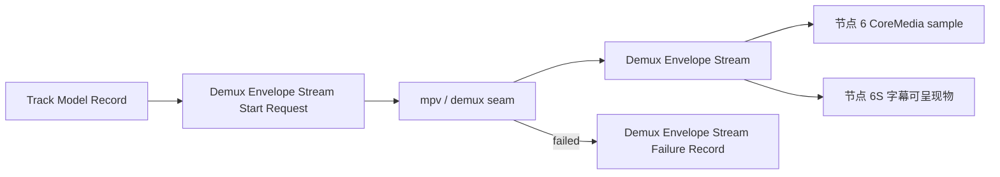

# 节点 5：解封装事件流建立

## 作用与边界

节点 5 根据当前 Media Session 的 Track Model Record 建立解封装事件流。它将选中轨道的 packet 和影响播放时间线的控制事件，转换为具有稳定所有权、明确轨道归属和事件世代的 Demux Envelope。节点 6 和节点 6S 决定下游如何组装、转换或丢弃这些事实。

## 节点位置

输入边界：当前 Media Session 和 Track Model Record → Demux Envelope Stream Start Request。

输出边界：Demux Envelope Stream Start Request → Demux Envelope Stream / Demux Envelope Stream Failure Record / cleanup 终止。

完成条件：播放核心为当前 Media Session 建立 Demux Envelope Stream。每个轨道事件都能追溯到被节点 4 选中的 Track Model，控制事件能够作用于正确的事件世代。sample、renderer 和呈现结果由节点 6 以后记录。

## 能力保真原则

节点 5 只为节点 4 中 `selected == true` 且 `consumer != none` 的轨道建立连续 packet 流。未选轨道的结构事实已经保存在 Container Open Snapshot 和 Track Model Record 中，节点 5 不通过持续复制这些轨道的 packet 再次记录它们。

format changed、flush、EOF 和 error 等影响播放时间线的控制事件不受单条轨道是否被选中的限制。节点 5 保留能够影响当前流或事件世代的控制事件。

对于已经进入事件流的选中轨道，节点 5 不替节点 6 或节点 6S 裁剪输入。

节点 5 负责保真、归属、复制、标注和交付。节点 6 和节点 6S 负责消费、转换、丢弃或忽略。

如果 mpv / demux layer 能通过当前 seam 提供某类事实，节点 5 应该在 Demux Envelope 中保留这类事实，或者记录这类事实已经被明确归一化。节点 5 不能因为下游节点暂时不使用某类事实，就提前删除这类事实。

如果当前 seam 没有暴露某类事实，节点 5 必须记录为 `notExposed`。如果当前节点无法确定上游是否存在这类事实，节点 5 必须记录为 `unknown`。节点 5 不能把缺失事实伪装成已经提供。

进入节点 6 或节点 6S 后，如果某类事实没有被下游使用，它可以被下游节点或后续资源管理策略销毁。这个销毁动作属于下游消费策略，不属于节点 5 的输入裁剪。

## Demux Envelope Stream Start Request

Demux Envelope Stream Start Request 是节点 5 的核心动作。它由当前 Media Session 发起，用于建立 mpv / demux layer 到播放核心的 Demux Envelope Stream。

Demux Envelope Stream Start Request 包含以下事实：

1. `mediaSessionID`：这次解封装事件流属于哪一轮媒体会话。
2. `trackModelRecord`：这次解封装事件流使用哪一份 Track Model Record，以及其中哪些轨道已经被选中。

Demux Envelope Stream Start Request 只能从同一个 Media Session 的 Track Model Record 开始。节点 5 不直接重新解释 Container Open Snapshot，也不直接使用 snapshot track facts 绕过 Track Model Record。

## Demux Envelope Stream

Demux Envelope Stream 是 Demux Envelope Stream Start Request 成功时建立的事件流。

它证明播放核心已经把 mpv / demux layer 交出的解封装事实，转换成当前 Media Session 内可追踪、可复制、可观察、可交给节点 6 或节点 6S 消费的 envelope。

每个 Demux Envelope 分为两类事实：

1. routing facts：播放核心必须理解的归属和路由事实。
2. provider facts：mpv / demux layer 通过当前 seam 提供的原始或半原始事实。

routing facts 包含以下事实：

1. `mediaSessionID`：这个 envelope 属于哪一轮媒体会话。
2. `trackModelID`：packet 或 track-scoped event 对应节点 4 中哪条被选中的播放核心轨道；全局控制事件不要求伪造轨道归属。
3. `eventKind`：packet、format changed、flush、EOF、track metadata、error 或其他稳定事件类型。
4. `streamType`：video、audio、subtitle、unknown 或等价分类。
5. `sourceMapping`：这个 envelope 如何从 mpv / demux layer 的 stream index、demuxer id、FFmpeg stream index 或等价来源映射到 Track Model ID。
6. `streamEpoch`：用于区分 seek、format reset、flush、重新打开或 cleanup 前后的事件世代。

provider facts 至少按当前 seam 能力覆盖以下类别：

1. packet bytes：压缩字节；回调生命周期短于播放核心消费生命周期时，节点 5 必须复制或转移所有权。
2. packet byte format：例如 Annex B、length-prefixed、raw access unit 或 `unknown`。
3. codec facts：codec name、codec config、extradata 或等价事实。
4. timing facts：presentation timestamp (PTS)、decode timestamp (DTS)、duration、timebase 或等价事实。
5. sample flags：keyframe 或等价 sample attachment 输入事实。
6. video format facts：width、height、pixel aspect ratio、rotation 或等价事实。
7. audio format facts：sample rate、channel count、frames per packet 或等价事实。
8. track metadata facts：track-scoped metadata 或格式提示。
9. control facts：format changed、flush、EOF 和 error 等控制边界。
10. subtitle facts：如果当前 seam 能暴露字幕 packet、字幕 event、overlay 查询结果或字幕调度输入，节点 5 必须保留；如果不能暴露，节点 5 必须记录为 `notExposed`。

## 格式与事件世代

节点 5 使用不可变 Track Format Snapshot 表达一条轨道在某一时刻生效的格式事实。每个 snapshot 具有 `formatRevision`；packet envelope 通过 `trackModelID` 和 `formatRevision` 引用对应 snapshot，不在每个 packet 中重复整套格式事实，也不依赖可变的隐式共享格式状态。

format changed 事件创建新的 Track Format Snapshot，并使后续 packet 引用新的 `formatRevision`。节点 6 只能使用 packet 明确引用的格式版本进行 sample 组装。

`streamEpoch` 与 `formatRevision` 表达不同事实。`streamEpoch` 区分 seek、重新打开、reset 或 cleanup 前后的连续事件世代，用于拒绝旧事件；`formatRevision` 区分同一轨道的格式版本。seek 可以只改变 `streamEpoch`，格式变化可以只改变 `formatRevision`。

## 能力投影

能力投影属于 Debug Snapshot 和验收证据，不是生产状态机，也不参与事件流启动协商。

它用于解释每一类事实在当前实现中的位置：

1. mpv 是否能提供。
2. 当前 seam 是否已经暴露。
3. Demux Envelope 是否已经保留。
4. 下游节点是否消费。
5. 未被消费的事实在哪里被销毁或继续转交。

能力投影不是为了要求下游节点使用所有事实。它用于证明节点 5 没有在下游做决定之前提前丢弃已进入事件流的事实，也没有把当前 seam 未暴露的能力写成已经提供。

## 节点 5 流程

节点 5 按以下流程运行：

1. 当前 Media Session 已经写入 Track Model Record。
2. 播放核心发起 Demux Envelope Stream Start Request。
3. 播放核心把当前 Media Session 和 Track Model Record 绑定到 mpv / demux seam。
4. mpv / demux layer 通过当前 seam 交出选中轨道的 packet，以及 format changed、flush、EOF、track metadata、error 或等价事件。
5. 播放核心把每个 mpv / demux event 归属到当前 Media Session。
6. 播放核心把 track-scoped event 映射到 Track Model ID。
7. 播放核心复制或接管 callback 生命周期内不稳定的 bytes 和 metadata。
8. 播放核心把 routing facts 和 provider facts 写入 Demux Envelope；未选轨道的 packet 不进入 Demux Envelope Stream。
9. Demux Envelope Stream Start Request 以 `succeeded`、`failed` 或 `terminatedByCleanup` 结束。

`succeeded` 建立 Demux Envelope Stream。`failed` 产出 Demux Envelope Stream Failure Record。`terminatedByCleanup` 不创建成功或失败记录。

## 结果提交与节点推进

Demux Envelope Stream Start Request 的结果必须提交回发起它的 Media Session，并遵循总地图的节点推进规则。

`succeeded` 建立 Demux Envelope Stream，节点 6 和节点 6S 才可以开始消费 envelope。
`failed` 写入 Demux Envelope Stream Failure Record，节点 6 和节点 6S 不会开始。
`terminatedByCleanup` 不创建 Demux Envelope Stream 或 Demux Envelope Stream Failure Record，节点 6 和节点 6S 不会开始。

## Demux Envelope Stream Failure Record

Demux Envelope Stream Failure Record 是 Demux Envelope Stream Start Request 失败时的输出。

它证明节点 5 没有建立 Demux Envelope Stream，但失败被明确记录，并且挂靠到同一个 Media Session ID。

Demux Envelope Stream Failure Record 至少包含以下事实：

1. `mediaSessionID`：这次失败属于哪一轮媒体会话。
2. `trackModelSummary`：这次失败来自哪一份 Track Model Record。
3. `failureReason`：失败原因。
4. `failureStage`：失败发生在 seam 绑定、事件接收、track 映射、生命周期复制或 envelope 建立的哪个阶段。

## 验收方向

Agent 必须证明真实 FFmpeg demux adapter 能为节点 4 选中的轨道产生 Demux Envelope，并且 envelope 归属于正确的 Media Session 和 Track Model。packet 数据在离开 provider callback 后仍然有效；packet 能解析到同一轨道的有效 Track Format Snapshot；格式变化后的 packet 引用新的 `formatRevision`；seek、flush、EOF、重新打开和 cleanup 前后的事件不会跨 `streamEpoch` 串流。未选轨道不得产生连续 packet envelope，全局控制事件仍必须到达正确的流。

L1 使用真实最小媒体 fixture 和 FFmpeg demux adapter 验证上述核心事实。FFmpeg 实现切片继续使用同一真实 fixture，证明从公开 `open(source:)` 到至少一个 video Demux Envelope 的链条成立。具体测试拆分、fixture 内容、hook 位置、断言和调试命令由实现阶段 Agent 使用 `$tdd` 决定。

Debug Snapshot 应能解释当前 Media Session、Track Model、选中轨道、最近的 envelope 类型、事件世代、packet 所有权状态、轨道映射、控制事件和失败原因。能力投影只用于解释 mpv 能提供什么、当前 seam 暴露什么以及 envelope 保留什么。

## implement 时可能遇到的需现场决策的堵点

以下问题留给实现期现场决策并记录 note：

1. 字幕进入节点 6S 的稳定输入形态是 packet、event、overlay 查询结果，还是独立字幕调度输入。
2. 如果当前 seam 不能暴露字幕事实，`notExposed` 应该记录在能力投影、Track Model Record、Demux Envelope Stream，还是多个位置共同记录。
3. format changed、flush、EOF、track metadata 和 error 应使用哪些稳定 envelope 类型。
4. 能力投影的字段命名和稳定取值集合是什么。
5. 未被下游节点消费的 provider facts 应该立即销毁，还是允许被诊断面短期保留。
