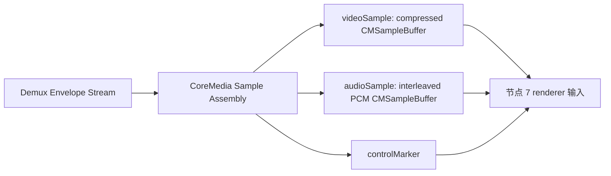

# 节点 6：CoreMedia sample 组装

## 作用与边界

节点 6 按节点 4 已确定的 consumer，把节点 5 的 Demux Envelope 转换为 Apple sample-buffer 路径的输入。视频路径保留压缩样本并组装 compressed video `CMSampleBuffer`；第一轮音频路径统一输出 interleaved PCM `CMSampleBuffer`。renderer enqueue 从节点 7 开始，硬件解码由 L3 验证。



## 目标

节点 6 验证播放核心可以把节点 5 输出的 Demux Envelope 转换成 Apple CoreMedia sample。

完成条件：播放核心为当前 Media Session 中至少一条被选中的 video 或 audio 轨道建立可追溯的 CoreMedia Sample lane。每条实际启动的 lane 独立记录成功、失败或 cleanup 终止；一条 lane 失败不自动否定其他已经成立的 lane。

节点 6 的成功产物称为 CoreMedia Sample Stream。

## 边界

输入边界：Demux Envelope Stream → Playback Core CoreMedia Sample Assembly。

输出边界：Playback Core CoreMedia Sample Assembly → CoreMedia Sample Stream。

节点 6 接收节点 5 提供的能力保真事实。节点 6 可以消费、转换、丢弃或忽略这些事实，但它必须能说明每个输出 sample 来自哪个 Demux Envelope 和哪一版 Track Format Snapshot。

节点 6 不打开 URL、不探测容器、不建立 Track Model，也不从 mpv 取得 packet。它的下游边界停在 CoreMedia Sample Stream；renderer enqueue、硬件解码是否发生、画面可见、声音可听和音频转码都不属于节点 6。

## 第一轮支持范围

第一轮支持六类输入：

| 输入格式 | 节点 6 第一轮路径 | 输出 sample |
|---|---|---|
| H.264 | compressed video sample assembly | compressed video `CMSampleBuffer` |
| HEVC | compressed video sample assembly | compressed video `CMSampleBuffer` |
| AAC | Audio Decode Adapter → PCM sample assembly | interleaved PCM `CMSampleBuffer` |
| PCM | PCM normalizer → PCM sample assembly | interleaved PCM `CMSampleBuffer` |
| MP3 | Audio Decode Adapter → PCM sample assembly | interleaved PCM `CMSampleBuffer` |
| FLAC | Audio Decode Adapter → PCM sample assembly | interleaved PCM `CMSampleBuffer` |

第一轮不要求 AAC、MP3 或 FLAC 压缩音频直通。第一轮要求这些音频最终变成 interleaved PCM `CMSampleBuffer`。

第二轮支持 AV1 和 Apple Lossless Audio Codec (ALAC)。MV-HEVC、ProRes 和其他专业或空间视频格式不属于当前节点 6 设计范围。

## 输入

节点 6 的输入是属于当前 Media Session 的 Demux Envelope。每个输入必须携带或能够追溯以下事实：

1. `mediaSessionID`。
2. `trackModelID`。
3. `sourceEnvelopeID` 或等价 envelope identity。
4. stream kind：video 或 audio。
5. codec facts：H.264、HEVC、AAC、PCM、MP3 或 FLAC。
6. packet bytes 或 decoded PCM frames。
7. byte stream shape：例如 Annex B、length-prefixed、ADTS、raw AAC access unit、interleaved PCM 或 planar PCM。
8. `formatRevision`，以及它引用的 Track Format Snapshot。snapshot 保存 SPS/PPS、VPS/SPS/PPS、`avcC`、`hvcC`、AudioSpecificConfig、sample rate、channel count、channel layout、bit depth、sample format、magic cookie 或当前格式实际具有的等价事实。
9. timing facts：presentation timestamp (PTS)、decode timestamp (DTS)、duration 和 timebase。
10. packet flags：keyframe、dependency、format changed、flush、drain、end of file、discontinuity 和 seek boundary。
11. metadata facts：projection、stereo layout、High Dynamic Range (HDR)、color、side data 和其他可由 CoreMedia 承载或诊断记录的事实。

缺失事实必须显式记录为 `none`、`unknown`、`notExposed` 或 `unsupported`。节点 6 不能把缺失事实伪装成确定事实。

## 输出

节点 6 的输出是 CoreMedia Sample Stream。每个输出 item 是以下三类之一：

1. `videoSample`：H.264 或 HEVC compressed video `CMSampleBuffer`。
2. `audioSample`：interleaved PCM audio `CMSampleBuffer`。
3. `controlMarker`：format changed、flush、drain、end of file、decoder reset 或 cleanup 相关 marker。

每个输出 item 必须携带以下 routing facts：

1. `mediaSessionID`。
2. `trackModelID`。
3. `sourceEnvelopeID`。
4. `streamEpoch` 和 `formatRevision`。
5. output kind。

## 结果提交与节点推进

每条选中 video 或 audio 轨道产生独立的 Track Sample Assembly Result，并写回同一个 Media Session。

`succeeded` 表示该轨道已经建立 CoreMedia Sample lane，节点 7 可以消费这条 lane。
`failed` 表示该轨道的 sample 组装失败，并写入绑定 `trackModelID` 和源 envelope 的 failure record；它不撤销其他轨道已经建立的 lane。
`terminatedByCleanup` 表示 cleanup 终止了该轨道的 sample assembly operation，不是 sample 组装业务失败。

未选轨道和 `consumer == none` 的轨道不会启动 Track Sample Assembly，也不会产生节点 6 operation。

至少一条被选中的 video 或 audio lane 成功时，CoreMedia Sample Stream 成立。所有被选中的 sample lane 都失败或终止时，节点 6 整体不能向节点 7 提交成功产物。

## 总体流程

节点 6 可以被理解为三条 lane：

```text
Demux Envelope
    |
    v
Session and Track Gate
    |
    v
Codec Route
    |
    +-- H.264 / HEVC -> Video Compressed Sample Assembler
    |
    +-- AAC / MP3 / FLAC -> Audio Decode Adapter -> PCM Sample Assembler
    |
    +-- PCM -> PCM Normalizer -> PCM Sample Assembler
```

`Session and Track Gate` 先确认 envelope 属于当前 Media Session、当前 Track Model 和当前 `streamEpoch`，并能解析到 packet 指定的 `formatRevision`。旧会话、旧事件世代、已 cleanup 会话、不匹配 track 或无法解析格式版本的 envelope 不能进入 sample assembly。

`Codec Route` 决定该 envelope 进入视频压缩 sample 组装路径、音频解码路径或 PCM 归一化路径。

## 视频路径

H.264 和 HEVC 走 compressed video sample assembly。

视频路径包含以下步骤：

1. 确认输入是完整 access unit。节点 6 不能把孤立 NAL unit 自动当成完整 frame。
2. 识别 byte stream shape。H.264 / HEVC 常见输入包括 Annex B start-code payload、length-prefixed payload、container extradata 和 in-band parameter sets。
3. 提取或更新参数集。H.264 需要 SPS/PPS。HEVC 需要 VPS/SPS/PPS。
4. 创建或复用 `CMVideoFormatDescription`。H.264 使用 H.264 parameter sets，HEVC 使用 HEVC parameter sets。
5. 在需要时把 Annex B payload 转换成 length-prefixed payload。
6. 创建 `CMBlockBuffer`，并确保 packet bytes 在 sample 生命周期内由播放核心拥有或可靠持有。
7. 创建 `CMSampleTimingInfo`，保留 PTS、DTS 和 duration。存在 B-frame 或解码顺序与显示顺序不一致时，DTS 和 PTS 不能被合并。
8. 创建 `CMSampleBuffer`。
9. 设置 sample attachment，例如 `NotSync`、`DependsOnOthers`、`IsDependedOnByOthers`、`DisplayImmediately`、`DoNotDisplay`、`ResetDecoderBeforeDecoding` 和 `DrainAfterDecoding`。
10. 记录输出 sample 与源 Demux Envelope 的追溯关系。

视频路径主要参考 `HaishinKit.swift` 和 `moq-kit` 的做法。参考重点是参数集解析、Annex B 与 length-prefixed payload 转换、format description 创建、block buffer 创建、timing 和 sample attachment。
节点 6 不复制它们的输入模型。它们的输入来自 RTMP、RTP、MPEG-TS 或 MoQ；节点 6 的输入来自 Demux Envelope。

## 音频路径

第一轮音频统一输出 interleaved PCM `CMSampleBuffer`。

AAC、MP3 和 FLAC 不做压缩音频直通。它们先进入 Audio Decode Adapter，解码成 PCM frame group，再交给 PCM Sample Assembler。
原始 PCM 输入先进入 PCM Normalizer，确保输出为 interleaved PCM。

音频路径包含以下步骤：

1. 确认输入音频属于当前 Media Session 和当前 audio Track Model。
2. 建立输入音频格式事实。AAC、MP3 和 FLAC 需要 sample rate、channel count、channel layout、packet facts 和可能存在的 magic cookie。PCM 需要 sample format、bit depth、endianness、interleaving、sample rate 和 channel count。
3. AAC、MP3 和 FLAC 通过 Audio Decode Adapter 解码成 PCM frame group。
4. PCM Normalizer 把 planar PCM 或不符合输出要求的 PCM 转换成 interleaved PCM。
5. 创建 `CMAudioFormatDescription`。
6. 创建 `CMBlockBuffer`。
7. 创建 `CMSampleTimingInfo`。PCM frame 的单帧 duration 是 `1 / sampleRate`。PCM frame group 的 presentation timestamp 来自解码前 packet 或解码器输出的时间映射。
8. 创建 PCM `CMSampleBuffer`，sample count 等于 PCM frame count，sample size 等于每个 interleaved PCM frame 的 byte stride。
9. 记录输出 sample 与源 Demux Envelope 的追溯关系。

mpv 上游 `ao_avfoundation.m` 是 PCM 路径的重要参考。它展示了 interleaved PCM、`CMBlockBufferCreateWithMemoryBlock`、`CMSampleBufferCreateReady`、每帧 duration 和 `AVSampleBufferAudioRenderer` 的基本关系。
第一轮节点 6 应继承这个边界：音频 renderer 路径使用 interleaved PCM。planar PCM 必须先归一化。

## Audio Decode Adapter

Audio Decode Adapter 是节点 6 音频侧的解码适配层。它的输入是 AAC、MP3 或 FLAC 的压缩音频 envelope。它的输出是可用于 PCM Sample Assembler 的 decoded PCM frame group。

Audio Decode Adapter 的存在不表示播放核心要把音频转码成 AAC。它只做解码到 PCM。

第一轮正式验收要求 Audio Decode Adapter 使用 Apple `AudioConverter`、`AVAudioConverter` 或等价系统解码能力。mpv / FFmpeg decoder 不属于当前正式播放路径；若未来作为实验路径研究，必须另行标记为非正式实验并隔离验收。

Audio Decode Adapter 必须提供稳定的输入输出边界：

1. 输入绑定当前 Media Session 和 audio Track Model。
2. 输出为 interleaved 或可归一化为 interleaved 的 PCM frame group。
3. 输出携带 sample rate、channel count、sample format、frame count、presentation timestamp 和 duration。
4. flush、seek、format changed、drain 和 cleanup 能 reset 或终止 decoder state。
5. 解码失败能产出明确失败原因，并绑定源 envelope。

## 参考代码的使用方式

社区代码作为参考矩阵，不作为节点 6 的直接依赖。

| 参考仓库 | 用途 | 不直接采用的原因 |
|---|---|---|
| `HaishinKit.swift` | H.264 / HEVC 参数集、Annex B 转换、AAC / ADTS、sample timing 和 `NotSync` attachment | 输入模型是 RTMP、RTP 和 MPEG-TS，不是 Demux Envelope；部分 helper 不是公开 sample assembly API |
| `moq-kit` | codec description 与 in-band parameter set 的分支、`SampleBufferFactory` 形态、H.264 / HEVC / AV1 组装思路 | 输入模型是 MoQ catalog/frame；视频 sink 是 `AVSampleBufferDisplayLayer`；音频路径不是当前目标 |
| mpv `ao_avfoundation.m` | interleaved PCM 到 `CMSampleBuffer` 和 `AVSampleBufferAudioRenderer` 的已存在路线 | 它是音频输出实现，不覆盖 H.264 / HEVC compressed video sample assembly |

节点 6 吸收这些仓库的转换步骤，但保持自己的对象模型：

```text
Demux Envelope -> CoreMedia Sample Stream
```

## 验收方向

Agent 必须证明节点 6 只消费节点 4 已选中的 video 和 audio 轨道，并能从真实 Demux Envelope 与 Track Format Snapshot 组装出可被 CoreMedia 检查的 sample。输出 sample 必须保留正确的 Media Session、Track Model、源 envelope、`streamEpoch`、`formatRevision`、PTS、DTS、duration 和同步标志。格式变化后必须使用新的 format description；旧事件世代、缺少必要格式事实或生命周期无效的输入必须产生可定位到轨道和 envelope 的失败记录。

L1 使用真实最小媒体 fixture 关闭至少一条 H.264 compressed video sample lane，并分别验证音频 lane、格式变化、B-frame timing、失败隔离和 cleanup。FFmpeg 实现切片必须从真实 FFmpeg demux adapter 产生的 envelope 组装至少一个 H.264 compressed `CMSampleBuffer`。具体测试顺序、fixture 扩展、CoreMedia 检查方式和失败注入由实现阶段 Agent 使用 `$tdd` 决定。

Debug Snapshot 应能解释每条 selected track 的 assembly lane、最近输入 envelope、format revision、输出 sample 数量、timing 摘要、格式描述摘要、字节所有权、lane result 和失败原因。

## implement 时可能遇到的需现场决策的堵点

- projection、stereo、HDR 和 color metadata 的稳定字段集合应该如何定义。
- 节点 6 与节点 6S 之间是否需要共享 metadata、`streamEpoch` 或 cleanup marker。
- AV1 和 ALAC 进入第二轮时，是否复用同一个 CoreMedia Sample Stream 证据格式。
