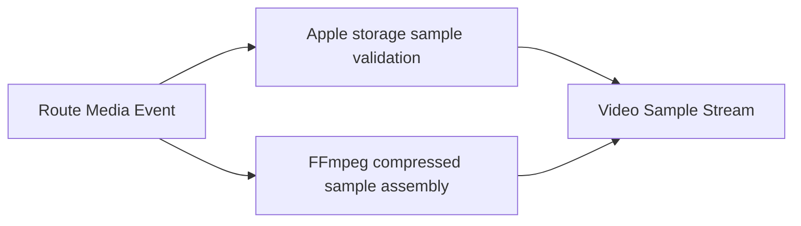

# 节点 6：Video Sample Stream

## 作用与边界

节点 6 将 Route Media Event 标准化为 renderer seam 可理解的 `videoSample` 或 `controlMarker`。它保留 route-specific compressed sample 生产差异，但输出同一个 record schema。

## Route-specific production

### Apple Compressed

保留 `AVAssetReaderTrackOutput(outputSettings: nil)` 交付的 storage-format `CMSampleBuffer`。节点 6 验证 sample count、format description、timing、codec configuration 与 route provenance，不重建 payload。

### FFmpeg Compressed

从 selected stream packet 创建 `CMBlockBuffer`、compressed `CMVideoFormatDescription` 和 `CMSampleBuffer`。必须保留 PTS、DTS、duration、keyframe / `NotSync`、codec configuration、color / HDR extensions 和 bytes ownership。

## Output record

Video Sample Record 至少包含：

- Media Session ID、route、Video Track ID、source event ID。
- Stream Epoch、Format Revision。
- input kind：compressed。
- PTS、DTS、duration、sample count。
- format identity、compressed media subtype、dimensions。
- sync / dependency attachment summary。
- color / HDR / Dolby Vision summary。
- payload ownership state。

Control Marker 至少覆盖 format changed、flush、seek boundary、end 和 cleanup。

## Failure isolation

sample 无 format、timing 不可解释、codec configuration 缺失或 payload ownership 无效时产出 Video Sample Failure Record，并绑定 source event。当前只有一条 selected video lane，因此不可恢复 sample production failure 会使 open / playback failed。

## 完成条件

唯一完成条件：当前 route 已产出至少一个符合 input-kind 合同的 Video Sample Record。renderer 是否接受属于节点 7。

## 验收方向

两条 route 各有独立 L1 首样本合同。首个 sample 必须满足 `CMSampleBufferGetImageBuffer(...) == nil`、`CMSampleBufferGetDataBuffer(...) != nil`，且 format description 的 media subtype 是 compressed codec；不能用 image-buffer sample 冒充 compressed contract。B-frame、format change、missing format、stale epoch 和 cleanup 分别单独测试。L2 通过真实 Provider vertical slice 观察 sample record。
