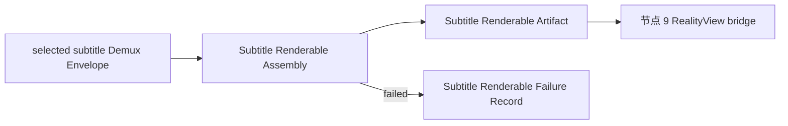

# 节点 6S：字幕可呈现物组装

## 作用与边界

节点 6S 是节点 5 之后的字幕并行分支。它只在节点 4 选中 subtitle track 且指定 `subtitleRenderable` consumer 时启动，把节点 5 提供的字幕 envelope 转换为可与节点 9 presentation binding 对齐的 Subtitle Renderable Artifact。

没有选中字幕轨时，本节点不启动。字幕不是节点 1 到节点 9 第一条 video vertical slice 的完成条件。

## 节点位置

输入边界：选中字幕轨的 Demux Envelope Stream → Playback Core Subtitle Renderable Assembly。

输出边界：Playback Core Subtitle Renderable Assembly → Subtitle Renderable Artifact / Subtitle Renderable Failure Record / cleanup 终止。

完成条件：播放核心把当前 Media Session 中选中的字幕事实转换为具有明确时间范围、来源追溯和事件世代的字幕可呈现物。节点 9 只负责把该产物放入当前 presentation binding。

## 输入

节点 6S 只接受属于当前 Media Session、当前 subtitle Track Model 和当前 `streamEpoch` 的字幕 envelope。具体上游形态可以是字幕 packet、字幕 event、mpv overlay 输出或当前 seam 暴露的等价字幕调度输入；节点 6S 通过内部 adapter 吸收这些差异，不把多种上游形态扩散到节点 9。

如果当前 seam 没有暴露选中字幕轨所需的字幕事实，节点 5 记录 `notExposed`，节点 6S 产生绑定该字幕轨的失败记录。SwiftUI overlay 和测试 sidecar 不能冒充播放核心字幕输入。

## 输出

Subtitle Renderable Artifact 是节点 9 唯一需要理解的字幕输入。它至少说明：

1. `mediaSessionID`。
2. `subtitleTrackModelID`。
3. 源 envelope identity。
4. `streamEpoch`。
5. subtitle timeline range。
6. artifact identity、kind 和 privacy-safe summary。

artifact 的内部实现可以是 bitmap cue、texture、glyph resource 或 RealityKit entity。该选择属于节点 6S 内部实现，不改变节点 9 的输入接口。

## 结果提交与节点推进

`succeeded` 产出 Subtitle Renderable Artifact，节点 9 可以将其绑定到当前 presentation。

`failed` 产出 Subtitle Renderable Failure Record。视频和音频 lane 可以继续，但当前字幕轨不能被写成已呈现。

`terminatedByCleanup` 终止当前字幕组装，旧 artifact 不能继续更新当前 Media Session。

## 验收方向

Agent 必须证明选中字幕轨的真实 seam 输出能够被转换为可追溯、带时间范围的 Subtitle Renderable Artifact；旧 Media Session 和旧 `streamEpoch` 的字幕不能进入当前 presentation；字幕组装失败不会伪装为成功，也不会无条件终止已经成立的视频和音频 lane。

L1 验证字幕时间线、来源追溯、事件世代和失败隔离。L2 验证真实 artifact 能被节点 9 放入当前 presentation binding。具体字幕 fixture、adapter、artifact 形态和断言由实现阶段 Agent 使用 `$tdd` 决定。

Debug Snapshot 应能解释选中字幕轨、当前 stream epoch、最近字幕输入、artifact identity、timeline range 和失败原因。

## implement 时可能遇到的需现场决策的堵点

- 当前 mpv seam 能稳定暴露哪一种字幕输入，以及需要在哪个内部位置建立 adapter。
- 文本字幕和图片字幕分别采用什么内部 artifact 实现。
- seek、字幕换轨和 cleanup 时如何释放旧 artifact 资源。
