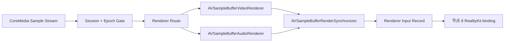

# 节点 7：AVFoundation renderer 输入

## 作用与边界

节点 7 把 CoreMedia sample 交给 Apple renderer graph，并记录 sample 路由、renderer readiness、backpressure、flush、error 和 synchronizer 时间线。RealityKit entity binding 和 `RealityView` 承载分别由节点 8 和节点 9 记录。



## 目标

节点 7 验证播放核心可以把节点 6 输出的 CoreMedia Sample Stream 正确送入 AVFoundation renderer 路径。

完成条件：当前 Media Session 的 CoreMedia sample 已进入 Apple renderer API 路径，并受 renderer queue、backpressure、flush、error 和 synchronizer 时间线管理。

节点 7 的成功产物称为 Renderer Input Record。

## 边界

输入边界：CoreMedia Sample Stream → Playback Core Renderer Input Coordination。

输出边界：Playback Core Renderer Input Coordination → `AVSampleBufferVideoRenderer` / `AVSampleBufferAudioRenderer` / `AVSampleBufferRenderSynchronizer`。

节点 7 接收节点 6 产出的 `videoSample`、`audioSample` 和 `controlMarker`。节点 7 不重新组装 `CMSampleBuffer`，也不改变 sample 的媒体内容。

## API 口径

AVFoundation 同时存在传统 renderer API 和 Swift receiver 风格 API。传统 API 包括 `enqueueSampleBuffer:`、`flush`、`readyForMoreMediaData` 和 `requestMediaDataWhenReadyOnQueue`。SDK 注释中推荐 Swift 侧使用 receiver 的 enqueue / flush 结果模型。

节点 7 的验收模型不绑定具体 API 形态。实现可以使用当前平台可用的 renderer API，但必须暴露统一语义：

1. sample 是否进入正确 renderer。
2. enqueue 是否成功。
3. renderer 是否出现 backpressure。
4. renderer 是否要求 flush 才能恢复。
5. flush 是否执行并完成。
6. renderer 是否报告 decode failure、enqueue failure 或其他 error。
7. renderer 是否绑定到当前 synchronizer。

## 输入

节点 7 的输入是 CoreMedia Sample Stream。每个输入 item 必须携带或能够追溯以下事实：

1. `mediaSessionID`。
2. `trackModelID`。
3. `sourceEnvelopeID`。
4. `streamEpoch` 和 `formatRevision`。
5. output kind：`videoSample`、`audioSample` 或 `controlMarker`。
6. `CMSampleBuffer` 或 control marker payload。
7. sample timing 摘要：presentation timestamp (PTS)、decode timestamp (DTS) 和 duration。
8. sample attachment 摘要。
9. control marker kind：format changed、flush、drain、end of file、decoder reset、seek boundary 或 cleanup。

节点 7 只接受属于当前 Media Session 和当前 `streamEpoch` 的输入。旧 session、旧事件世代或 cleanup 后到达的 sample 不能进入 renderer。

## 输出

节点 7 的输出是 Renderer Input Record。它记录 sample 或 control marker 在 renderer input 层的处理结果。

每条 Renderer Input Record 至少包含：

1. `mediaSessionID`。
2. `trackModelID`。
3. `sourceEnvelopeID`。
4. renderer kind：video、audio 或 synchronizer。
5. `streamEpoch` 和 renderer graph revision。
6. input kind：enqueue、flush、drain、format reset、seek reset、cleanup 或 error。
7. input outcome：accepted、deferredByBackpressure、rejectedAsStale 或 failed。
8. renderer diagnostic summary。

## 结果提交与节点推进

Renderer Input Coordination 的节点级结果必须写回同一个 Media Session。input outcome 是单次输入事件的诊断事实，不扩展节点 operation 的生产状态。

`succeeded` 表示当前 renderer graph、必要 renderer、synchronizer 和 renderer input 记录已经建立，并且节点 8 只能消费这个成功产物。
`failed` 表示 renderer graph、enqueue、flush、timeline 或 renderer error 失败。节点 8 不会开始。
`terminatedByCleanup` 表示 cleanup 终止了 renderer input operation，不是 renderer 业务失败。

节点 6 没有成功 sample lane 时，节点 7 不启动。只有 audio lane 时，节点 7 可以建立 audio renderer graph，但节点 8 不启动。

## Renderer graph

节点 7 的 renderer graph 由三类对象组成：

1. `AVSampleBufferVideoRenderer`：接收节点 6 的 H.264 / HEVC compressed video sample。
2. `AVSampleBufferAudioRenderer`：接收节点 6 的 interleaved PCM audio sample。
3. `AVSampleBufferRenderSynchronizer`：管理 video renderer 和 audio renderer 的共享时间线。

audio-video fixture 必须证明 video renderer 和 audio renderer 由同一个 synchronizer 管理。
video-only fixture 可以只有 video renderer 和 synchronizer，但必须显式记录没有 audio renderer 的原因。
audio-only fixture 可以只有 audio renderer 和 synchronizer，但必须显式记录没有 video renderer 的原因。

节点 7 必须记录 renderer graph 属于当前 Media Session。旧 Media Session 的 renderer graph 不能继续接收当前 sample；当前 renderer graph 也不能接收旧 Media Session 的 sample。

## 总体流程

节点 7 可以被理解为以下流程：

```text
CoreMedia Sample Stream
    |
    v
Session and Epoch Gate
    |
    v
Renderer Route
    |
    +-- videoSample -> Video Renderer Input
    |
    +-- audioSample -> Audio Renderer Input
    |
    +-- controlMarker -> Renderer Flush / Drain / Reset
    |
    v
Renderer Input Record
```

`Session and Epoch Gate` 确认输入属于当前 Media Session、当前 Track Model 和当前 `streamEpoch`。

`Renderer Route` 根据 input kind 把 sample 或 marker 送入 video renderer、audio renderer 或 synchronizer control path。

## Video renderer input

video sample 只能进入 `AVSampleBufferVideoRenderer` 路径。

video renderer input 必须处理以下事实：

1. video renderer 属于当前 renderer graph。
2. video sample 的 `streamEpoch` 与当前 renderer graph 一致。
3. video sample 的 PTS 与 synchronizer 时间线一致。
4. renderer readiness 或 receiver enqueue suspension 被尊重。
5. enqueue result 被记录。
6. renderer decode failure、requires flush to resume、failed status 或等价事件被记录。
7. flush 后的第一批视频 sample 必须满足恢复条件。对于 H.264 / HEVC，这通常意味着从 keyframe 或 sync sample 重新开始。

节点 7 不判断 H.264 / HEVC sample 的内部组装是否正确。这个判断属于节点 6。
节点 7 只记录 renderer 对该 sample 的输入结果和错误反馈。

## Audio renderer input

audio sample 只能进入 `AVSampleBufferAudioRenderer` 路径。

第一轮音频 sample 是 interleaved PCM `CMSampleBuffer`。节点 7 不接受 planar PCM 作为 renderer 输入；planar PCM 应该在节点 6 失败或被归一化。

audio renderer input 必须处理以下事实：

1. audio renderer 属于当前 renderer graph。
2. audio sample 的 `streamEpoch` 与当前 renderer graph 一致。
3. audio sample 的 PTS 与 synchronizer 时间线一致。
4. audio renderer 在 enqueue 前已经加入 synchronizer。
5. enqueue result 被记录。
6. audio renderer 自动 flush、output configuration change、failed status 或等价事件被记录。
7. seek、format changed、audio track change 和 cleanup 必须作用到 audio renderer 队列，并更新对应事件世代或 graph revision。

音频可听性和空间音频听感属于 L3。

## Backpressure

节点 7 必须把 renderer backpressure 建模成正常控制信号，而不是默认播放失败。

backpressure 的表现可以是 renderer `readyForMoreMediaData == false`、receiver enqueue 暂停、enqueue result 提示需要等待，或等价诊断状态。

当 renderer 不需要更多数据时，播放核心不能无界 enqueue。播放核心必须停止或暂停从 CoreMedia Sample Stream 取样，等待 renderer 再次可接收，或者记录样本被明确丢弃的原因。

模拟器中的 renderer `notReady` 可以是 backpressure 证据，不等同于真实失败。只有当 renderer error、decode failure、requires flush、enqueue failure 或队列状态无法恢复时，才进入失败或恢复路径。

## Flush、seek、format changed 和 cleanup

节点 7 必须把控制 marker 作用到 renderer 队列，而不是只改变播放核心状态字段。

控制语义包括：

1. `flush`：丢弃待渲染 sample，并使旧 `streamEpoch` 的输入失效。
2. `seek`：停止旧时间线 sample 继续进入 renderer，flush renderer，并让后续 sample 从新的 timeline position 进入。
3. `format changed`：停止使用旧 `formatRevision` 的输入状态，flush renderer，并等待节点 6 使用新 format description 组装的 sample。
4. `drain`：允许 renderer 处理已入队 sample，并记录 drain marker。
5. `cleanup`：停止 renderer input operation，旧 Media Session 的 sample 不能继续 enqueue。

flush 或 reset 后，旧 `streamEpoch` sample 必须被拒绝并记录为 stale，不得继续进入 renderer。

## Synchronizer

节点 7 必须证明 video renderer 和 audio renderer 受同一个 `AVSampleBufferRenderSynchronizer` 管理，除非当前 fixture 明确只有一种媒体类型。

Synchronizer 证据至少包括：

1. synchronizer identity 或 privacy-safe summary。
2. video renderer 是否 attached。
3. audio renderer 是否 attached。
4. current time。
5. rate。
6. last set-rate or set-rate-at-time action。
7. `streamEpoch` 和 renderer graph revision。

播放控制本身主要属于控制节点或后续控制验收，但节点 7 必须暴露足够事实，让 play、pause、seek 能证明它们确实影响 renderer timeline。

## 验收方向

Agent 必须证明节点 6 的 video 和 audio sample 被送入对应 Apple renderer，video 与 audio renderer 由同一个 `AVSampleBufferRenderSynchronizer` 管理，backpressure 不会导致无界 enqueue，控制 marker 会真实作用到 renderer 队列。旧 Media Session 和旧 `streamEpoch` 的 sample 必须被拒绝；renderer error 必须形成可追溯失败记录。

L1 使用 fake renderer sink 验证路由、backpressure、事件世代、flush 和失败记录。L2 使用 visionOS Simulator 的真实 renderer graph 验证至少一个 video sample 进入 `AVSampleBufferVideoRenderer` 路径，并验证 renderer 与 synchronizer 的结构关系。具体 API 形态、测试拆分和恢复用例由实现阶段 Agent 使用 `$tdd` 决定。

Debug Snapshot 应能解释 renderer graph、attached renderers、synchronizer、stream epoch、graph revision、最近 input outcome、backpressure、flush 和 renderer error。

## implement 时可能遇到的需现场决策的堵点

- 模拟器中 renderer `notReady`、backpressure 和真实失败应该如何使用稳定字段区分。
- audio-only、video-only 和 audio-video fixture 对 renderer 输入的最小证据集合是否需要分别成表。
- renderer error 应映射到哪些播放核心错误、事件或 Debug Snapshot 字段。
