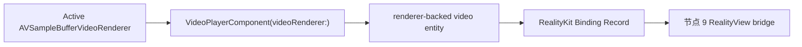

# 节点 8：RealityKit renderer 绑定

## 作用与边界

节点 8 把节点 7 的 active `AVSampleBufferVideoRenderer` 写入 `VideoPlayerComponent(videoRenderer:)`，并把 component 挂到播放核心交出的 video entity。它建立 Apple renderer graph 与 RealityKit entity 之间的绑定，不负责选择 SwiftUI scene、迁移 `RealityView` 或判断画面是否可见。

节点 8 只在节点 7 已建立 active video renderer 时启动。audio-only 播放不会启动节点 8。

## 节点位置

输入边界：active video renderer、当前 Track Model 与媒体呈现事实 → Playback Core RealityKit Binding。

输出边界：Playback Core RealityKit Binding → App Adapter 可承载的 renderer-backed video entity 与 RealityKit Binding Record。

完成条件：当前 Media Session 的 active video renderer 成为 video entity 上 `VideoPlayerComponent` 的视频来源，并且该绑定能够追溯到同一条 video Track Model 和 renderer graph。

## 输入

节点 8 接收：

1. `mediaSessionID`。
2. video `trackModelID`。
3. active `AVSampleBufferVideoRenderer`。
4. `streamEpoch` 和 renderer graph revision。
5. `effectiveProjection`、`effectiveStereoLayout` 和由它们导出的 component viewing configuration。
6. renderer graph reset、cleanup 和 component configuration change。

产品播放形态和目标 scene 不属于节点 8 输入。Window、Docked Immersive、Panorama 和 Portal 由节点 9 解释。

## 输出

节点 8 输出 renderer-backed video entity 和 RealityKit Binding Record。记录至少说明：

1. `mediaSessionID` 和 `trackModelID`。
2. renderer graph 与 active video renderer 的 privacy-safe identity。
3. `streamEpoch` 和 renderer graph revision。
4. video entity 与 binding identity。
5. `VideoPlayerComponent` attached state。
6. component renderer identity summary。
7. component viewing configuration summary。
8. binding 是否 active，以及最后一次绑定失败原因。

节点 8 不要求暴露 Apple 对象指针。结构化 identity 只用于证明 component 引用的是节点 7 的 active renderer。

## 稳定规则

节点 8 必须维持以下规则：

1. renderer、component 和 entity 属于同一个 Media Session。
2. component 引用节点 7 当前 active video renderer。
3. 同一个 active renderer 只有一个 active video binding。
4. renderer graph 被替换后，旧 binding 不再声明 active。
5. cleanup 后，旧 entity 不再代表当前播放。
6. component viewing configuration 来自当前媒体呈现事实，不由 App Adapter 随意推断。

scene 切换不要求节点 8 重建 renderer binding。节点 9 可以迁移同一个 renderer-backed video entity；只有 renderer、component 配置或 entity 本身需要替换时，节点 8 才建立新的 binding identity。

## 结果提交与节点推进

`succeeded` 产出 active RealityKit Binding Record 和 renderer-backed video entity，节点 9 可以消费该 entity。

`failed` 表示当前 video renderer 无法建立有效 component 或 entity binding，节点 9 不能把视频呈现写成成功。

`terminatedByCleanup` 释放当前 binding，旧 entity 不能继续代表 active playback。

## 验收方向

Agent 必须证明 `VideoPlayerComponent` 使用节点 7 的 active video renderer，component 已挂到当前 Media Session 的 video entity，同一个 active renderer 不会形成两个最终绑定。renderer graph 替换和 cleanup 后，旧 binding 必须失效。

L2 使用 visionOS Simulator 或等价 RealityKit 验证环境证明真实 `VideoPlayerComponent(videoRenderer:)` binding。L1 可以验证 binding record、identity、唯一性和 stale rejection，但不能替代真实 RealityKit binding。具体 entity 类型、identity 生成和测试 hook 由实现阶段 Agent 使用 `$tdd` 决定。

Debug Snapshot 应能解释 active renderer、component、video entity、stream epoch、renderer graph revision、binding identity、viewing configuration 和失败原因。

## implement 时可能遇到的需现场决策的堵点

- RealityKit 环境中如何稳定读取或旁证 component 与 renderer 的关联。
- renderer graph reset 时复用 entity 还是替换 entity。
- component viewing configuration 的平台版本差异如何隔离在 adapter 内部。
