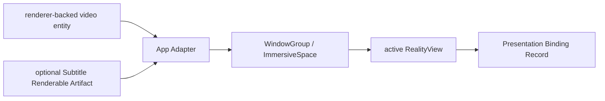

# 节点 9：RealityView 呈现桥

## 作用与边界

节点 9 由 App Adapter 把节点 8 的 renderer-backed video entity 和节点 6S 的可选 Subtitle Renderable Artifact 放入当前 SwiftUI scene 的 active `RealityView`。它负责 scene lifecycle、承载位置和产品播放形态，不负责 renderer 输入、component 绑定、字幕组装或真机显示质量。

真机可见画面、Apple Projected Media Profile (APMP)、High Dynamic Range (HDR)、Extended Dynamic Range (EDR)、刷新率、thermal 和听感由 L3 验收。

## 节点位置

输入边界：renderer-backed video entity、可选字幕 artifact、媒体呈现事实和 App scene context → App Adapter。

输出边界：App Adapter → active SwiftUI scene、`RealityView` content 和 Presentation Binding Record。

完成条件：节点 8 的 video entity 已加入目标 active `RealityView`，并且当前产品播放形态能够由 scene container、RealityView binding 和媒体呈现事实共同解释。

节点 8 没有成功 video binding 时，节点 9 的视频分支不启动。字幕是否存在不影响视频 binding 成立；存在选中字幕轨时，字幕结果独立记录。

## 输入

节点 9 接收：

1. `mediaSessionID`。
2. 节点 8 的 active binding identity 和 renderer-backed video entity。
3. Subtitle Renderable Artifact，如果节点 6S 已成功。
4. `effectiveProjection`、`effectiveStereoLayout` 和 component viewing configuration summary。
5. App Adapter 提供的 scene container、scene lifecycle、active `RealityView` identity 和产品形态请求。

App Adapter 是 scene context 的权威提供方。验证 App 可以采集这些事实，但必须保留 provenance，不能把测试观察冒充正式 App Adapter 输入。

## 产品播放形态

产品播放形态在节点 9 被解释，不是播放核心内部单个 enum 或 `VideoPlayerComponent` 单独决定的结果。

第一轮验收保留四种形态：

| 产品播放形态 | scene container | 承载关系 |
|---|---|---|
| Window | `WindowGroup` | video entity 位于窗口中的 active `RealityView`。 |
| Docked Immersive | `ImmersiveSpace` | video entity 位于自制沉浸场景的 active `RealityView`。 |
| Panorama | `ImmersiveSpace` | 全景投影与 immersive viewing request 在沉浸承载面中一致。 |
| Portal | `WindowGroup` | 全景投影通过 portal viewing request 进入窗口承载面。 |

Window 和 Docked Immersive 不能仅由 immersive viewing request 证明。Panorama 和 Portal 不能仅由产品形态名称证明。Presentation Binding Record 必须同时记录 scene container、RealityView、entity binding、projection、stereo layout 和相关 viewing configuration。

## Presentation Binding Record

成功记录至少说明：

1. `mediaSessionID`。
2. 节点 8 binding identity 和 video entity identity。
3. scene container 与 scene lifecycle state。
4. active `RealityView` identity。
5. video entity attached state。
6. subtitle artifact attached state；没有选中字幕时记录 `none`，字幕组装失败时引用节点 6S failure。
7. product playback shape 及其依据。
8. presentation binding identity。
9. 最近一次 scene attach、detach 或 migration 的诊断摘要。

## 稳定规则

节点 9 必须维持以下规则：

1. presentation、video entity 和可选字幕 artifact 属于同一个 Media Session。
2. video entity 只在 active scene 和 active `RealityView` 中声明最终呈现绑定。
3. scene 尚未打开、正在关闭或打开失败时，不能写成绑定成功。
4. scene 迁移完成前，旧 binding 与新 binding 的关系必须可诊断；任意稳定时刻只能有一个最终 active presentation binding。
5. cleanup 后，旧 scene binding 不再代表当前播放。

迁移的具体 phase 属于 App Adapter 内部实现和 Debug Snapshot，不形成跨模块稳定状态枚举。节点 9 的接口只要求迁移结果可追溯，并且不会留下两个最终 active binding。

## 字幕绑定

节点 9 只绑定节点 6S 已组装的 Subtitle Renderable Artifact，不解释字幕内容，也不重新建立字幕时间线。字幕 artifact 必须与当前 presentation binding 和 `streamEpoch` 对齐。SwiftUI overlay 不能冒充播放核心字幕产物。

## 结果提交与节点推进

`succeeded` 表示 renderer-backed video entity 已进入目标 active `RealityView`，并且产品播放形态可解释。

`failed` 表示当前视频呈现所需的 scene、RealityView、entity attach 或 route 无法成立。

`terminatedByCleanup` 终止当前 presentation binding，旧 scene 和 entity 不能继续代表 active playback。

## 验收方向

Agent 必须证明节点 8 的真实 video entity 被加入 App Adapter 指定的 active `RealityView`，Presentation Binding Record 与实际 scene context 一致，产品播放形态能够由结构化事实解释。scene 不可用、旧 Media Session、重复最终绑定和 cleanup 后更新必须被拒绝或形成明确失败记录。

L2 使用 visionOS Simulator 验证真实 scene、`RealityView` 和 entity attach，并关闭第一条从 `open(source:)` 到可解释 presentation binding 的 vertical slice。L3 只验证模拟器无法证明的真机显示、性能和体感事实。具体 scene fixture、截图、结构化快照和迁移用例由实现阶段 Agent 使用 `$tdd` 决定。

Debug Snapshot 应能解释 scene container、scene lifecycle、RealityView、video entity、subtitle artifact、产品播放形态、presentation binding、最近迁移和失败原因。

## implement 时可能遇到的需现场决策的堵点

- 四种产品播放形态在验证 App 中使用哪些最小 scene fixture。
- RealityView identity 与 entity attach 的结构化旁证如何实现。
- 字幕 artifact 在不同产品播放形态中的空间摆放规则。
- L3 真机证据如何与同一次 Media Session 的 L1 / L2 证据关联。
