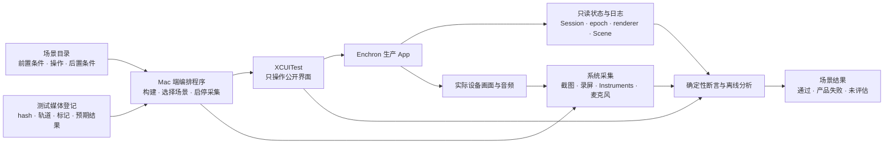

# Enchron Vision Pro 真机回归矩阵

本矩阵列出 Enchron 在物理 Vision Pro 上必须验证的用户路径、播放管线行为、空间呈现、媒体组合、异常输入和长时运行行为。它是 [`regression-suite.md`](regression-suite.md) 的可执行场景目录；后者定义通过含义、性能统计、远程来源和物理声学规则。本文档只定义要求和检查意图，不表示任何场景已经通过。

## 真机自动化组成

真机回归不是一段持续点击的 XCUITest，也不由截图单独判断。它由相互独立但使用同一场景记录和时间基准的部分组成：

预先写好的 XCTest/XCUITest 代码负责稳定的公开用户路径、Accessibility 断言和操作后的产品状态断言。Mac 端编排程序负责设备前置检查、选择和分组场景、传入已登记的媒体、控制受控服务器故障、启动截图/录屏/Instruments/麦克风采集，以及把附件归入同一个结果。它不得通过测试专用按钮直接改变播放或 Presentation 状态。

状态探针只读出生产 App 已经形成的事实，例如 Media Session identity、stream epoch、renderer binding、Playback Lifecycle、Playback Presentation、Environment Context、sample 进度和资源数量。它不能代替公开界面操作，也不能让测试强制 App 进入一个用户无法到达的状态。截图和音视频分析由固定区域、已知标记、时间容差与测试媒体的预期结果进行确定性判断；LLM 可以查看失败附件、归纳症状和提出下一步诊断，但不凭一次主观观图决定发布通过。

系统最终保存一份机器可读的场景结果，逐项连接用户操作、后置条件和直接证据。任何必需采集链未工作时，该项是未评估；只有全部必需断言都已执行且成立时，场景才通过。

## 覆盖方法

视频编码、容器、色彩与 HDR、音频编码、音轨、字幕、来源、Playback Lifecycle、Playback Presentation 和 Environment Context 不执行完整的全部组合。这些维度会产生大量重复场景，而大多数组合并不经过新的系统边界。回归集按以下规则压缩：

1. 每个已接入的单独取值都至少由最适合直接证明它的测试完整执行一次。编解码、sample、timeline、track 和取消先由 PlaybackCore 单元与合同测试覆盖，不在 Vision Pro 上重复枚举所有内部分支。
2. 高风险维度使用两两组合覆盖：例如每种 video codec 都与每种来源类型在某条真机场景中共同出现，每种 Playback Presentation 都与每种 Playback Lifecycle 在某条场景中共同出现。具体用例由程序根据兼容性约束生成，并把最终组合清单保存在结果中。
3. 已知容易相互影响的三个以上维度保留指定组合。必须保留的组合至少包括 H.264 B-frame + 多音轨 + 字幕、HEVC 10-bit + HDR + 空间呈现、AV1 + 需要 PCM 解码的 FLAC、远程 Range 读取 + 大幅 Seek + Close，以及 Panorama + Stereo Layout + 方向标记。
4. Window、Docked 和 Panorama 的合法转换、返回、回滚与系统中断属于有限的产品状态空间，按规格覆盖全部转换，不使用抽样代替。
5. 同一个带有可视时钟、方向标记、双音轨音频脉冲和字幕标记的受控媒体，承担大部分真机播放控制、Presentation 转换和压力场景。编码、HDR、Dolby Vision 和特殊字幕的专项媒体只执行它们所独有的断言。
6. 可重复的混合操作使用固定随机种子生成。失败结果必须记录种子与完整操作序列，使同一失败可以精确重现。没有保存操作序列的随机点击只能用于探索，不能形成回归结论。
7. 任何人工验收发现的可重复问题，都必须转化为新的诊断媒体标记、状态断言、图像判定或可重复操作序列。修复后把该场景加入固定回归集。

## 执行频率与成本

| 执行时机 | 执行范围 | 主要目的 |
|---|---|---|
| 每次相关代码变化 | PlaybackCore 和 App 合同测试；变化所属风险维度的短真机路径 | 尽快定位引入失败的最低节点 |
| 固定周期真机回归 | 所有必过用户路径、两两组合、短时混合操作、远程失败恢复和低开销性能指标 | 发现跨模块、跨 Scene 和设备特有问题 |
| 发布候选版本 | 完整真机矩阵、规定次数的重复操作、长时播放、Instruments、触发条件成立时的物理声学和人工感知验收 | 形成候选版本的发布结论 |

代码内部能直接验证的并发、取消、资源释放和错误分支允许执行数百或数千次。物理 Vision Pro 只保留必须经过真实 App、RealityKit、Scene 和硬件边界的用户操作：相关变化执行短序列，固定周期执行中等序列，发布候选执行长序列。具体次数在第一轮真机试运行后，根据完成时间、失败发现率和资源测量确定；在此之前不把一个为方便而假定的次数当成发布门槛。

## 证据如何共同判定

每条真机场景在用户操作前、操作已被 App 接受后、目标状态达成后和稍后的持续输出检查点，保存同一时间基准下的产品状态、Accessibility hierarchy、截图和日志。仅在一项声明必须使用其他证据才能证明时，才增加录屏、数字音频、麦克风录音或 Instruments。

| 要证明的事实 | 必须使用的证据 | 不足以代替的证据 |
|---|---|---|
| 用户确实可以操作控件 | 元素存在、启用且可命中；语义点击后产生预期产品状态 | 坐标点击成功、元素只是存在 |
| Playback Lifecycle 与 Presentation 正确 | 生产状态探针、Media Session identity、stream epoch、renderer binding 和 Scene 生命周期 | 按钮图标、加载界面消失、没有 crash |
| 视频在持续播放 | 同一 Media Session 与 stream epoch 的两次以上观测，时间线、video sample、renderer accepted input 和显示标记共同前进 | 单张截图、单个 displayed pixel、Lifecycle 文本 |
| 界面布局、字幕文字和静态画面正确 | 原尺寸截图、Accessibility 文本、预先定义的区域与允许误差 | 内部状态、只比较整张图的单一差异数值 |
| 卡顿、停帧和动态错位不存在 | 定时状态观测、连续帧标记或录屏、renderer metrics 和 hang/hitch 数据 | 两张无时间对齐的截图 |
| 音轨正确且音频在播放 | 所选 track identity、该音轨独有的频率或时间标记、audio sample 与 renderer 状态、系统音频路由 | 视频时间线、音量按钮状态 |
| 声音确实离开 Vision Pro 扬声器 | 与 XCUITest marker 对齐的外置麦克风 WAV 和声学分析 | 数字 sample、renderer rendering、人未听见时的日志 |
| HDR/EDR、Stereo Layout 与空间舒适度正确 | 专用诊断媒体、设备帧证据和佩戴者验收；可观测的 sample/pixel metadata 作为结构证据 | 普通 XCUIScreen 截图 |
| 性能、功耗和资源释放正确 | XCTest metric、OSSignposter、Instruments 原始记录和规定统计判断 | 主观觉得流畅、一次运行数值 |

截图坐标点击只是诊断后备。正式用户路径中，产品控件不可命中必须失败；不得通过根据截图坐标发送点击后把场景标记为通过。

## 每条场景的记录结构

后续实现的场景目录为每条用例保存稳定编号，但该编号不形成产品术语。每条记录至少包含：

- 候选版本与测试环境身份；
- 稳定的测试媒体编号、内容摘要和预期结果；
- 前置 Playback Lifecycle、Playback Presentation、Environment Context、Immersive Space residency 与来源状态；
- 通过公开界面执行的用户操作；
- 产品状态、时间、视觉、音频、资源和性能的成功后置条件；
- 每项后置条件必须使用的证据与允许误差；
- 超时、产品失败、测试基础设施失败和未评估的分类规则；
- 适用的执行时机和触发变化类型。

## 真机前置检查

任何产品场景开始前，编排程序先证明设备、测试媒体和采集链可用。设备锁定、XCTest worker 未启动、测试媒体的内容摘要不匹配、录音设备未就绪或 Instruments 无法附加都记为未评估，不形成产品失败或通过。

| 检查项 | 成功标准 |
|---|---|
| 候选版本 | 已记录实际产品树、Release/Debug 配置、Xcode、visionOS 和设备身份 |
| 设备可用性 | Vision Pro 已解锁、佩戴条件符合所需场景、App 可以启动，系统音量和输出 route 被记录 |
| 测试媒体 | 每个文件均与登记文件中的内容摘要、许可、轨道、编码、时长和预期结果一致 |
| 来源基础设施 | Local、SMB 和 WebDAV 场景所需文件可读；服务器可以记录 Range、中断、revision 和资源释放事件 |
| 证据输出 | `.xcresult`、截图/录屏、日志、状态 JSON、Instruments 与录音目录可写，并可使用同一实际时间基准对齐 |
| 初始产品状态 | 空间 Scene、Main Window、Media Session、恢复意图和测试所需缓存处于场景明确要求的状态 |

## 基础播放与渲染

| 场景 | 公开界面操作 | 成功标准 | 真机证据 |
|---|---|---|---|
| Local 媒体冷打开 | 从 Media Library 选择当前进程未打开过的媒体 | 唯一 Media Session 从 loading 到 ready/playing；加载界面消失；画面、时间线与存在音轨时的音频持续推进 | 启动前后截图、成对输出观测、延迟阶段、数字音频 |
| Local 媒体热重开 | 完整关闭同一媒体后再次选择 | 旧 Session 的 provider、renderer input、binding 与访问资源已释放；建立全新 Session 并正常输出 | 前后 Session identity、cleanup barrier、截图与持续输出观测 |
| 无音轨视频 | 打开只含视频的受控媒体 | 视频正常播放；不创建无效音频失败；不显示空音轨选择 | 成对视频观测、More 菜单 hierarchy、截图 |
| 支持的视频/音频编码与容器 | 使用媒体矩阵中的每个必过项打开、播放、Seek 并关闭 | 不出现纯音频、黑板、加载常驻或半启动；媒体 metadata 与实际 sample/pixel 一致 | 每个测试媒体的状态、首帧和播放中截图、sample/pixel metadata |
| 明确不支持的 codec/profile | 从正常 Media Library 打开 | 在 renderer graph 启动前显示指向具体 codec/profile 的错误；不留下活动 Session、声音或空板 | 失败界面、状态、资源释放与日志 |
| 损坏、截断或时间信息异常的媒体 | 分别打开并在错误发生前后尝试 Close | 可识别的媒体错误；无 hang、无限重试或仅音频播放；Close 总能收敛 | 失败节点、超时记录、Session/cleanup 证据 |
| 显示几何与色彩 | 播放带边界、圆形、灰阶、方向和动态时钟的诊断媒体 | 宽高比、裁剪、旋转、像素范围、色彩标记与动态前进符合测试媒体的预期 | 原尺寸截图、标记区域分析、sample/pixel metadata；HDR/EDR 还需佩戴者验收 |

## 播放控制与 Playback Lifecycle

| 场景 | 操作 | 成功标准 |
|---|---|---|
| Play / Pause / Resume | 播放中暂停，等待输出停止，再恢复 | 暂停时 actual timebase rate 为零、media time 与画面不前进、无媒体音频；恢复使用同一 Session/epoch 和原 rate，音画继续前进 |
| 普通 Progress Bar Seek | Playing 和 Paused 分别拖动到前、中、后部 | 新 stream epoch 达到容差内目标；旧 epoch 画面、音频与字幕不再出现；保持原 Playing/Paused 意图 |
| 前后跳转 | 在开头、中间和结尾执行前进/后退 | 目标正确裁剪到有效时间范围；按钮启用状态符合 Ended 合同 |
| Precision Timeline 与逐帧 | 展开时间轴，精确 Seek，前后单帧 | 每次完成后保持 Paused；帧时间与显示标记对应；控件展开和收起不影响 Session |
| 连续 Seek | 在前一次尚未完成时发送多个不同目标 | 只最后一个未被取代的请求可提交；旧结果、字幕和音频不能迟到回写；不出现第二时间线 |
| 播放速度 | 遍历产品提供的 rate，其间暂停、Resume 和 Seek | 实际 timebase rate 与选择一致；Resume 恢复选定 rate；音画不停止、不累积明显偏移 |
| End / Replay | 播放自然结束、Seek 到结尾，然后 Replay | Ended 显示纯黑、停用音频 session、保留同一 Media Session 和 Replay 语义；Replay 从零重新推进 |
| Close / Reopen | 分别在 loading、playing、paused、seek 中、ended 执行 Close | 任何阶段都在超时内取消任务、分离 consumer、释放访问资源并返回 Media Library；重开创建新 Session |
| Playback Queue | 从 Episodes 选择、自然结束 Play Next、Repeat One | 固定 Queue 顺序不受后续浏览/排序影响；新媒体使用自身 Format Preference 与新 Media Session |

## Playback Presentation 与 Environment

[`regression-suite.md`](regression-suite.md#playback-presentation-真机成功矩阵) 已规定 Window 进入 Docked/Panorama 时 Environment Context 为 none/active 的四个分支，以及 Playing/Paused/Ended 的六条真机往返。本矩阵对每次转换使用同一组通过条件：

- 转换前记录 Media Session identity、stream epoch、Playback Lifecycle、播放意图、renderer binding、Environment Context、Environment Effect、Immersive Space Open Cycle 和 Progressive Immersion Amount。
- 用户操作必须来自当前公开界面且可命中。重复点击在前一个转换未完成时不能创建第二个平台操作或第二 Media Session。
- Playing 转换只在平台操作开始前暂停，目标 surface 已绑定原 renderer、且达到目标 Presentation 的视觉后置条件后才恢复。Paused 和 Ended 不发出多余的 pause/resume。
- 转换全程保持原 Media Session；只有一个 RealityKit consumer 使用 renderer；迟到的平台结果不能改写新状态。
- 进入 Docked 前 Environment Context 为 active 时复用当前 Environment 与 Effect；进入前为 none 时使用 Default Environment，并在返回 Window 后清除这次自动打开的 Environment。Panorama 必须只显示黑色周围环境与投影球面，当前 Environment Context 为 none。
- 进入空间呈现后，Player Control Dock 是唯一 App 界面；它必须提供播放控制、Settings 与 Return to Window，且不存在直接返回 Media Library 的 Back。
- Return to Window 后同一 renderer 绑定 Window，恢复进入前应保留的 Environment Context 和播放意图。只有 Window Back 可以关闭 Media Session 并返回 Media Library。
- 转换失败必须恢复转换前的稳定 Presentation、Environment Context、renderer binding 和播放意图。失败证据必须指向首个未完成的平台或渲染边界。

另外必须执行三类系统中断：转换正在进行时 Immersive Space 消失、空间播放稳定后进入 Home View、以及 App 进程仍存活时重新激活。每条都要求只对原 Session 恢复一次；失败则回到 Window 并停止自动重试。

## 音轨与字幕

| 场景 | 必须覆盖的内容 | 成功标准 |
|---|---|---|
| 默认音轨 | 单音轨、多音轨、带/不带 default 与 language metadata | 初始选择可预测；More 菜单名称与实际 track identity 一致；不因缺失标签崩溃 |
| 音轨切换 | 播放、暂停、Seek 后，以及 Window、Docked、Panorama | 当前轨道 identity 变更；旧音轨不再输出；新音轨的独有音频标记出现；不重开 Media Session，不改变当前 Presentation |
| 文本字幕 | 内嵌 SubRip、WebVTT、MOV_TEXT、ASS/SSA | 轨道列表、Off、默认选择、cue 起止、换行、样式和字符全部与测试媒体的预期一致 |
| 位图字幕 | PGS、DVD 与 DVB 位图字幕 | 像素内容、canvas 尺寸、安全区、时间和透明度正确；不用 Accessibility 文本代替像素验证 |
| 字符与字形 | 简体/繁体中文、日文、韩文、英语、法语、德语、西班牙语、西里尔字母、阿拉伯语/希伯来语方向、组合变音符号和缺失字形回退 | 无替换方框、乱码、截断、错误方向或异常行距；截图文字与 Accessibility cue 一致 |
| 字幕时间线 | Play/Pause/Resume、Seek、连续 Seek、速度切换、End/Replay | cue 只由当前 synchronizer time 决定；旧 epoch 或旧 track 的 cue/frame 不延迟出现；Off 立即清空 |
| 字幕空间呈现 | Window、Docked、Panorama；控件显示/隐藏与不同视频宽高比 | 字幕跟随当前播放表面，比例、深度、安全区与可读性符合预期；不留在旧 Presentation |
| 独立字幕文件自动关联 | Local、SMB、WebDAV 同目录中的 `.srt`/`.vtt`/`.ass`/`.ssa`；精确主名称、语言/地区/用途后缀、大小写不同的扩展名、相似但不匹配的文件名和多个候选 | 只关联命名规则允许的候选；全部候选具有不同稳定 track identity；多个候选不被任意启用；Photos 不执行不存在的同目录枚举；媒体只建立一个 Media Session |
| 独立字幕文件手动选择 | Window、Docked、Panorama 分别从已授权 Local、SMB、WebDAV 选择同目录和其它目录中的文件 | Choose Subtitle File 可命中；选择后保持当前 Session、Lifecycle、Presentation、位置和音视频输出；字幕立即按当前 media time 显示；Close 或换媒体后释放字幕访问资源 |
| 独立字幕文件失败 | 权限撤销、文件消失、Content Revision 变化、格式不支持、损坏、远程读取中断 | 显示可恢复的字幕错误并使该轨不可用；旧 cue 清除；视频、音频和其它字幕轨继续工作；不产生第二 Session 或静默空字幕 |

## 媒体组合

每个测试媒体只在 `fixture-registry.json` 记录许可、内容摘要、轨道、编码、色彩、时长、预期结果与允许误差后，才可以形成发布通过结论。当前目录中的其他媒体只能用于诊断，直到完成登记。

| 维度 | 覆盖集 |
|---|---|
| 视频编码 | H.264、H.265/HEVC、AV1 必须通过；VP9 在设备没有对应硬件路径时必须明确拒绝 |
| 容器 | 对已正式接受的 MP4/MOV、Matroska、WebM 与 MPEG-TS 组合分别登记；不从 FFmpeg 能够解析反向推定为产品承诺 |
| 像素与色彩 | 8-bit SDR BT.709、10-bit HDR10/PQ、HLG、受支持的 Dolby Vision profile；video/full range、不同分辨率和帧率 |
| 音频 | 无音轨、AAC、AC-3、E-AC-3、MP2、MP3、ALAC、Opus 的压缩 sample 路径，以及 FLAC 解码为 PCM 的路径；正式支持范围需与产品规格对齐 |
| 轨道结构 | 单音轨、多音轨、无默认轨道、无语言/标题 metadata、音频比视频长/短 |
| 字幕 | 无字幕、内嵌文本、ASS/SSA、位图、多字幕轨、无语言 metadata，以及自动关联和手动选择的 SubRip、WebVTT、ASS/SSA 独立字幕文件 |
| 来源 | Local、Photos、SMB、WebDAV；远程来源还覆盖正常受控网络、Range、Seek、中断和 revision 变化 |
| 呈现 | Window、Docked、Panorama；Flat、180°、360°、Fisheye 与 Mono、Side-by-Side、Top-Bottom 的合法组合 |

真机组合使用以下分工：

| 媒体用途 | 内容 | 执行范围 |
|---|---|---|
| 主诊断媒体 | H.264 B-frame、SDR、双 AAC 音轨、可视时钟/方向/音频脉冲、多种内嵌字幕 | 全部播放控制、三种 Presentation、字幕/音轨切换和重复操作 |
| HDR 专项媒体 | HEVC Main 10 + PQ 与 HLG，以及已授权的 Dolby Vision profile | Window 全部输出证据；两两组合分配的一种空间 Presentation；HDR/EDR 人工验收 |
| codec 隔离媒体 | H.264、HEVC、AV1 与受支持 audio codec 的最小组合 | Window 打开、持续播放、Seek、Pause/Resume 与 Close；两两组合中选定的空间场景 |
| 全景与立体诊断媒体 | 等距柱状网格、方位/极点文字、左右眼独立标记、Fisheye 资格 metadata | 每个合法 Projection × Stereo Layout；黑色周围环境、球面方向、左右眼归属和 Return to Window |
| 错误媒体 | 损坏、截断、不支持 profile/codec、无效 track metadata、时间信息不连续 | 错误分类、失败界面、Retry/Close、资源释放和无半启动 |

## Remote Source

SMB 与 WebDAV 的适配器、真实服务器和真机用户路径按 [`regression-suite.md`](regression-suite.md#remote-source-验证职责) 分别执行。真机矩阵至少包含：

- 从公开界面创建来源、输入凭据、浏览多层目录、刷新、Add to Media Library、播放、Seek、Close 和从保存的 Media Reference 重开；
- 同一媒体通过 Local、SMB 和 WebDAV 时，内容预期结果相同，仅来源身份、访问租约与网络阶段不同；
- 网络临时不可用、超时、连接重置、SMB 会话断开，以及 WebDAV 408/429/5xx 只在规定范围内自动重试；
- 凭据错误、权限拒绝、路径/文件不存在、证书信任失败、不支持编码和媒体损坏立即失败，不消耗自动重试次数；
- 首次可用音视频输出前与之后的中断使用不同恢复规则，并断言每个失败尝试的 Session 与来源访问资源完整释放；
- 持续播放后中断时不在背景替换 Media Session；Retry 重新解析 Media Reference 与 Content Revision，按已确认的位置规则重开；
- Presentation 转换期间的远程读取保持同一 Session 和访问租约，不因浏览连接结束而中断。
- SMB 与 WebDAV 媒体的同目录独立字幕候选由同一来源目录事实产生；手动选择其它远程字幕时建立独立但同属当前 Media Session 的访问租约。字幕权限、revision 或读取失败不得中断媒体音视频，也不得在 Close 后保留访问。

受控服务器负责产生精确错误，XCUITest 只通过产品 UI 操作 App。服务器控制不得经过产品隐藏按钮或测试专用播放路径。

## 重复操作与资源稳定性

重复操作不只检查“没有 crash”。每次迭代后都要断言 Media Session 数量、stream epoch、renderer consumer 数量、待执行平台操作、Playback Lifecycle、Playback Presentation、来源访问租约和错误状态。序列结束后再检查任务取消、资源释放、内存趋势、CPU/GPU 活动和设备热状态。

| 序列 | 包含的操作 | 主要预期问题 |
|---|---|---|
| 重复打开与关闭 | 从 Media Library 打开、等待可用输出、在 loading/playing/paused 不同阶段 Close，再重开 | Session 泄漏、旧 callback 修改新 Session、访问租约未释放、加载界面卡住 |
| 刷新与播放并行 | 播放远程媒体时刷新目录、离开来源界面、切换来源，之后继续 Seek | 浏览 adapter 错误释放播放租约、凭据串用、队列被刷新改写 |
| 连续 Seek 与速度变化 | 快速拖动、前进/后退、Precision Timeline、逐帧、速度切换和 Pause/Resume 混合 | 过时 epoch 回写、两条 timeline、音频 flush 错误、字幕残留、控件与实际位置分离 |
| Window / Docked 反复往返 | none/active Environment 分别执行，在 Playing/Paused 中交替 | 重复打开 Immersive Space、两个 renderer consumer、Environment 未恢复、播放意图丢失、控制面板不可用 |
| Window / Panorama 反复往返 | none/active Environment、两种 Stereo Layout 和 Playing/Paused 交替 | 自制 Environment 残留、投影球面重复、左右眼颠倒、Return Environment 丢失、Window binding 未恢复 |
| 转换与 Close 竞争 | 进入 Docked/Panorama 时立即返回、Close、进入 Home View 或重新激活 | 迟到结果覆盖新状态、无界面的空间内容、死锁或无限恢复 |
| 音轨/字幕反复切换 | 多轨快速轮换、字幕 Off/On、与 Seek/Presentation 转换交错 | 旧轨道继续发声、cue 或位图残留、选择丢失、重开 Session |

真机录屏不需要覆盖全部长时序列。每个状态转换保存状态附件；视觉采样只保存开始、固定间隔、失败前后和结束检查点。只有排查卡顿、动态错位或无法用定时观测表达的问题时，才保存完整录屏。

## 预先检查的问题类型

完整的跨层失效分析见 [`regression-risk-catalog.md`](regression-risk-catalog.md)。以下内容是执行矩阵使用的索引，不需要逐项向人类确认。每一类都必须继续展开成可执行断言；新发现的症状先归入风险目录，再补充能够复现它的固定场景。

| 方向 | 预先查找的问题 | 主要检测手段 |
|---|---|---|
| 启动与渲染 | 黑板、仅音频、首帧卡住、LoadingSpinner 常驻、宽高比/旋转/裁剪错误、重复画面、错误色彩范围、HDR 发灰或过曝 | 输出观测、诊断媒体、截图区域分析、pixel metadata、佩戴者 HDR/EDR 验收 |
| 时间线与同步 | media time 不前进、Seek 后旧帧/旧音频出现、快速 Seek 提交中间结果、音画累积偏移、End 过早/过晚 | stream epoch、PTS/DTS 标记、视觉闪光与音频脉冲、长时播放观测 |
| Presentation 转换 | 两个 Session/consumer、目标画面未绑定即提交、Playing 意图丢失、Paused/Ended 被自动播放、回滚到错误状态、返回 Window 重开媒体 | Session/binding/effect identity、转换时序、目标画面标记、失败注入 |
| Environment 与 Panorama | Docked 使用错误 Environment/Effect、Panorama 仍显示自制 Environment、黑色周围环境不完整、返回时丢失进入前 Environment、重开 Immersive Space 或重置沉浸量 | Environment/Effect/Space 状态、设备帧、返回后状态差异 |
| Panorama 几何与立体 | 前后/上下方向错误、接缝、球面内外翻转、180° 空白区错误、左右眼互换、Top-Bottom/Side-by-Side 解释错误、非法 Fisheye | 网格、方位和单眼标记媒体；左右眼证据；佩戴者空间验收 |
| 播放控件 | 控件存在但不可命中、透明层遮挡、展开面板互相覆盖、自动隐藏丢失状态、Window 与空间控件职责混淆、无效按钮仍可点 | `exists/isEnabled/isHittable`、hierarchy、点击后状态、布局截图 |
| 字幕 | 乱码、缺字、错误换行/方向/字体回退、旧 cue 残留、ASS 样式丢失、位图位置错误、字幕跟错 Presentation | 可控 cue 文本、Accessibility 值、原尺寸截图/像素区域、epoch 与 track identity |
| 音频 | 默认轨错误、切换后旧轨继续、暂停仍发声、Resume/Seek 无声、多个 audio renderer、错误 channel/sample format | 独有频率标记、audio track/sample/renderer/session/route 状态、触发条件成立时的麦克风录音 |
| Remote Source | Range 错误、Seek 后读取旧位置、浏览断开释放播放租约、隐藏重试、凭据泄漏、Retry 使用旧 revision/错误位置 | 服务器请求日志、Session/access identity、错误界面、结果文件敏感信息扫描 |
| 长时运行与资源 | 内存/任务/Session/Entity 增长、CPU/GPU 不恢复、暂停后继续无限读取、热降频导致卡顿、长时后控件失效 | 稳态资源计数、Instruments、温度/帧截止、定时用户操作检查 |

真机 UI 自动化源码位于独立的 `EnchronAppUITests` Target。长期用例按公开用户旅程、空间呈现、媒体切换、系统中断和重复操作组织；共享代码只提供等待、只读状态解析、截图附件和公开界面操作，不提供直接改写 Playback Lifecycle、Playback Presentation、Environment Context 或 RealityKit Entity 的测试入口。Xcode Test Plan 负责选择执行范围、重复次数、超时和截图/录屏策略，Mac 端编排脚本只负责真机前置检查、构建、运行和归档结果。

当前稳定基础集由 `VisionProCoreRegression.xctestplan` 选择，并通过 `Scripts/verification/run_visionpro_core_regression.sh` 在显式指定的物理 Vision Pro 上执行。脚本要求提供设备可读取的登记媒体 URL 和至少两个 Media Library 条目标识，先构建一次测试包，再在同一构建产物上顺序运行；每次运行保存独立 `.xcresult` 和当前产品树 manifest。它拒绝没有明确物理设备、媒体或条目标识的调用，不允许测试因缺少夹具而以 skip 形成伪通过。

基础集目前包含 App 启动、Window → Docked、Window → Panorama、Docked 摆位与持久化、Restore Defaults，以及两个登记媒体依次打开和关闭。诊断、声学、性能、远程故障与长时间压力场景不混入这一基础 Test Plan；它们使用相同断言支持和证据规则，但由各自的执行条件触发。

## 当前已有能力与显式缺口

以下状态来自对当前测试源码和测试媒体登记文件的有范围审阅，不是实际运行证据：

- `VisionProDeviceAcceptanceUITests` 已能保存真实播放状态、Accessibility hierarchy、截图、声学 marker 和部分 Docked/Panorama 往返。
- `SpatialPresentationAcceptanceUITests` 已断言真实 Media Session、renderer binding 和持续播放，但使用 `ENCHRON_AUTOPLAY_FILE` 绕过了 Media Library 用户入口，不能单独形成真实用户路径的发布证据。
- 空间测试已要求正式产品控件可命中；不可命中时保存截图并使场景失败，不再通过坐标点击继续形成通过结论。
- `SpatialPresentationAcceptanceUITests` 和 `VisionProDeviceAcceptanceUITests` 已在 Docked 与 Panorama 中断言不存在直接返回 Media Library 的 Back。
- `SpatialHandoffUITests` 已定义 Window 在目标 Player Controls Window 与实际空间 surface 就绪前不得消失、两套 Presentation 入口不得同时可操作、转换保持同一 Media Session，以及 Docked/Panorama 各自的 Environment 与 Anchor 后置条件。
- 当前 `SpatialPlatformEffectExecutor` 在空间 surface settled 后调用打开 Player Controls Window，随后立即请求关闭 Main Window，没有等待 Player Controls Window 已出现且可操作；返回 Window 也只等待视频 surface，没有直接等待 Window 播放界面可操作。该交接规则仅部分实现。
- `DockedPlacementUITests` 已定义 Screen Size、Distance 与 Elevation 的公开 Slider 操作、产品值与实际 Entity world transform 的一致性、返回后持久化和 Restore Defaults。当前代码把规格规定的 4 米默认距离取整为 3.825 米，因此精确默认值用例预期失败，直到实现修正。
- `SequentialMediaPlaybackUITests` 已定义两个登记媒体逐个从 Media Library 打开、持续输出、返回并重新建立新 Media Session；它尚未覆盖不同宽高比、HDR、字幕与音轨结构的完整登记组合。
- `VisionProCoreRegression.xctestplan` 和真机编排脚本已经能够为当前真机目标构建。最近一次仅枚举测试的设备尝试在 visionOS 开启自动化模式时超时，因此本轮没有产生产品通过或失败结论。
- 当前真机往返主要覆盖 Playing 与单一 Environment 路径，没有执行规定的 Playing/Paused/Ended × Docked/Panorama × Environment Context 组合。
- 容器内字幕提供路径已有 SubRip、WebVTT、MOV_TEXT、ASS/SSA、PGS、DVD 与 DVB 位图支持；当前登记文件只有 SubRip、ASS 和 DVB 位图的组合测试媒体，且没有真机字幕选择、字符、Seek、空间呈现回归。
- V1 已确认支持同目录自动关联和手动选择 SubRip、WebVTT、ASS/SSA 独立字幕文件；当前生产代码没有独立字幕的匹配、授权、来源接入或菜单操作，因此该能力尚未实现，也没有运行证据。
- Window More 已连接容器内字幕与音轨选择；空间 Player Controls 的数据模型已经取得字幕和音轨菜单项，但当前菜单只呈现 Playback Speed 与 Episodes，因此 Docked 与 Panorama 的字幕和音轨选择只部分实现。
- 音轨选择已连接生产 More 菜单和 PlaybackCore，但没有真机 UI 切换与音轨独有输出证据。
- 当前 `fixture-registry.json` 只登记了少量 SDR/H.264/AAC、HEVC/PQ、HEVC/HLG 与字幕组合。AV1、更多音频编码、无音轨、更多字幕编码、立体与错误媒体尚未形成可发布判定的登记集合。

## 发布结论

发布候选版本只在以下条件同时成立时通过：必过场景全部执行，媒体组合对正式支持范围没有空缺，每项声明取得所需证据，没有正确性失败，性能与功耗按 [`regression-suite.md`](regression-suite.md) 通过，且所有标记为“需产品决策”的内容已被排除出当前发布范围或完成决策与实现。
