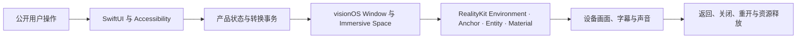

# Enchron 回归风险目录

本目录在编写和维护真机回归用例时系统地寻找可能跨越 PlaybackCore、SwiftUI、visionOS Scene 与 RealityKit 的失效方式。它定义需要主动排查的问题及其直接证据，不表示问题已经存在，也不表示相应场景已经通过。可执行场景与发布范围仍由 [`regression-matrix.md`](regression-matrix.md) 和 [`regression-suite.md`](regression-suite.md) 负责。

风险分析从公开用户操作开始，沿实际产品路径检查每个所有权边界：

每个固定回归场景必须至少检查用户操作是否可达、产品状态是否正确、目标 Scene 是否实际存在、RealityKit 内容是否属于正确所有者、设备输出是否符合测试媒体的预期，以及离开场景后旧资源是否已经失效。任何一段都不能用后一段的成功反向推定。

## 优先阻止会造成大量返工的问题

以下问题一旦在产品后期出现，通常会同时影响多个 Presentation、测试工具和恢复路径，因此优先建立直接观察与基础用例。

| 风险边界 | 可能的问题 | 成功标准 | 最早可以取得的直接证据 |
|---|---|---|---|
| Media Session 与 renderer 所有权 | Presentation 转换重开媒体、建立第二个 Session、两个 Entity 同时使用 renderer、旧 callback 修改新媒体 | 一次播放始终只有一个 Media Session 和一个 active renderer consumer；返回和转换保持 Session identity；打开下一媒体才建立新 Session | 只读状态、consumer identity、stream epoch、关闭后重开记录 |
| Presentation Transition | 切换开始后仍播放、目标准备没有与源淡出并行、目标错过淡入边界、源内容未淡出就突然消失、目标突然出现或一直透明、两套界面同时接收输入、LoadingSpinner 代替过渡、目标完成或回滚后自动播放、迟到平台结果覆盖当前状态 | 请求接受后 Lifecycle 与 Core timebase 立即暂停，音频和显示帧停止；源内容淡出与透明目标的准备同时开始；目标在淡入边界前完成 Scene、视频表面、renderer 与播放控件准备；源消失后目标连续淡入并保持暂停；失败让源 Presentation 重新淡入且保持暂停；只有目标或恢复后的源 UI 显式 Play 才继续 | 时间对齐的 Lifecycle、timebase、音频、显示帧、Window/Controls 可见性、准备阶段、surface settled、XCUITest 截图、完整录屏及抽帧 |
| Scene 生命周期 | 重复打开 Immersive Space、错误关闭仍需保留的 Environment、Home View 后恢复两次、App 激活后卡在无 Window 状态 | 每次系统操作只由当前 effect 执行一次；Scene appeared/disappeared 事实与产品状态一致；恢复失败一次性回到 Window | effect request/execution identity、Scene residency、Window hierarchy、OSLog |
| Environment 内容 | Docked 载入错误 Environment/Effect、进入 Docked 前没有活动 Environment 时自动打开的 Default Environment 在返回 Window 后仍然存在、Panorama 残留自制 Environment、返回丢失原 Environment | Docked 使用规定的 Environment 与 Effect；Panorama 只保留黑色周围环境和投影球面；返回准确恢复进入前状态 | Environment identity、Effect、Immersive Space Open Cycle、设备帧 |
| Playback Surface Anchor | Anchor 缺失、重名、来自旧 Environment、含残留播放几何、Entity 没有成为目标 Anchor 子实体 | 当前 Environment 只有一个语义有效的 `PlaybackSurfaceAnchor`；Docked Video Entity 直接属于它；失败不提交 Docked | 实际 parent identity/name、Anchor 解析结果、Entity 层级附件 |
| Docked Placement | Distance 退化为局部 Z 偏移、Elevation 退化为 Y 平移、屏幕不再面向用户、缩放不等比、Slider 与 Entity 不一致 | Entity 的实际距离、球面仰角、朝向和三轴缩放分别符合当前 Screen Size、Distance 与 Elevation；最后一次合法输入获胜 | UI 值、产品摆位值、Entity world transform、朝向点积、截图/录屏 |
| 摆位持久化 | Day/Night 保存两份值、返回再进入丢失、Restore Defaults 只重置 UI、前一个 Environment 的值污染新 Environment | 摆位按 Environment 保存并由 Effect 共享；返回再进入保持；Restore Defaults 同时恢复产品值、Entity transform 与持久化值 | 进入前后状态、Entity transform、重开 App 后的同 Environment 值 |
| Panorama 投影 | 球面内外翻转、经纬方向错误、接缝、180° 空白区错误、Stereo Layout 交换、旧球面重复存在 | 每个合法 Projection × Stereo Layout 都符合方位、极点、边界和左右眼标记；只有一个投影 Entity | 专用网格/单眼标记媒体、rendering status、实际模式、设备帧与佩戴者检查 |
| 独立字幕来源 | 相似文件名误关联、多个候选被任意启用、Local/SMB/WebDAV 权限混用、旧 cue 残留、字幕失败拖垮音视频、Close 后来源租约泄漏 | 只从可枚举 Source Directory 关联命名合同允许的同目录文件；没有候选或来源不可枚举时静默略过；失败隔离在字幕轨；旧 cue 和访问资源按 Session 清理 | 候选与 track identity、来源与 Content Revision、Session/epoch、cue 时间线、访问租约记录、真机截图 |
| 音轨与字幕选择偏好 | 只保存 UI index、字幕 Off 丢失、复开后回到默认轨、内容变化后套用旧轨、缺失轨道阻塞播放 | 按 Media Identity、Content Revision 与稳定 track identity 保存；Off 单独表示；完整轨道列表发布后恢复；缺失轨道保持默认且不猜测 | 保存与复开前后的 identity/revision、两个不同 Session、公开菜单选择、音频独有标记、字幕文字或 Off、缺失与版本变化分支 |
| SwiftUI 与 RealityKit 输入 | 透明 RealityView 遮挡 Chrome、Ornament/Panel 重叠、二级面板偏移到父控件布局范围外后显示范围与命中范围分离、存在但不可命中、控件隐藏后展开状态残留、视频表面无法接收 Pinch、一次输入反复触发显隐、控件 action 又触发表面显隐 | 每个实际显示的按钮和菜单项由 XCUITest 完成合法操作闭环；Docked/Panorama 视频表面由真实 gaze + pinch 完成 shown → hidden → shown，且每次输入只改变一次；视频点击区不侵入 Chrome，控件 action 不穿透到视频表面；隐藏后面板状态复位 | XCUITest hierarchy、`isHittable`、元素 frame 与控件操作结果；空间表面的 InputTarget/Collision 状态、handler trace、真实 pinch 和时间对齐录制 |
| 跨 Presentation 输入回归 | Window 中可用的输入在进入 Docked/Panorama 后失效，或从空间返回 Window 后遗留透明命中层、旧控件状态或错误手势路由 | 每次转换提交、回滚或系统恢复后，Window 使用可达的 XCUITest 表面输入、Docked/Panorama 使用真实 gaze + pinch，重新完成视频表面 shown → hidden → shown，再验证目标可见控件的自动操作闭环 | XCUITest 导航与 Deck 状态、空间 surface hit-test 状态、真实 pinch、逐次操作结果、录制帧 |
| 目标显式播放后的画面冻结 | 用户在完成切换的目标 UI 点击 Play 后，timeline 或播放标签继续变化但 Window/Docked/Panorama 的纹理停在旧帧；再次 Pause/Play 偶然修正画面 | 目标稳定时保持暂停；第一次显式 Play 后，同一 Session/epoch 的 timeline、video sample、renderer input 与录制连续帧标记共同变化，不依赖第二次 Pause/Play 修复 | 显式 Play 前后的时间对齐状态、诊断媒体连续帧标记、原始录制与抽帧 |
| 观察能力 | 测试只能看到按钮文本，无法判断 Anchor、Entity、renderer 或 Scene 的实际结果 | 生产运行形成的只读观察值能够报告实际 Scene、surface parent、transform、rendering status 与 session/consumer；观察值不能改写产品 | Accessibility 附件、状态 JSON、OSLog；观察入口源码审阅 |

### 当前仍存在的规范与实现分歧

V1 的同目录自动关联覆盖可枚举的 Local、SMB 与 WebDAV Source Directory；单文件授权与 Photos 静默略过。当前仍缺少在 Session 期间主动检查已接入字幕的 Content Revision 并使旧轨失效。独立字幕的真机选择、像素输出、失败恢复与访问资源释放仍没有当前运行证据，因此实现状态只能记为部分实现，验证状态保持未取得证据。

## SwiftUI 与播放界面

需要主动生成而不是等待人工偶然发现的问题包括：

- Window Chrome、Player Controls Ornament、Player Controls Window、展开的 Settings、More 和 Precision Timeline 的层级、位置和命中区域在显示、隐藏、窗口缩放及 Presentation 返回后保持一致。
- 控件自动隐藏计时只在 Playing 且没有焦点或持续交互时生效；拖动、Hover、展开面板和 Accessibility 操作期间不会消失；重新显示后不保留失效的拖动状态。
- Play/Pause/Replay、前后跳转、Progress Bar、Precision Timeline、Settings 和 More 的标签、启用状态与实际 Playback Lifecycle 一致；禁用操作不会通过透明父层仍然收到输入。
- 菜单和面板连续打开、关闭或互相切换时没有多个浮层、失去焦点、布局跳变、Window 尺寸变化或无法恢复的半展开状态。
- 视频表面在 Window、Docked 与 Panorama 中都接受目标化 RealityKit Pinch；没有命中实体时只允许同一 surface 的回退点击处理一次。两条手势路径不得在一次输入中分别切换控件，造成闪烁或相互抵消。Docked/Panorama 的这项结论必须来自佩戴者或系统级真实 gaze + pinch，XCUITest 在 Accessibility 树中发现 Entity 不能替代空间 hit-test。
- 每次进入 Docked、Panorama、通过空间 Deck 双向往回箭头返回 Window、转换回滚或系统恢复后，Window 使用可达的 XCUITest 表面输入、Docked/Panorama 使用真实 gaze + pinch，先复验视频表面 shown → hidden → shown，再继续执行 Settings、More、传输和时间线操作。XCUITest 自动操作全部实际显示的公开按钮、菜单项和 Slider；控件本身的 action 不得顺带改变视频表面或 Player Controls 的可见性。
- `InputTargetComponent` 与有效 `CollisionComponent` 只证明 Entity 具备接收空间输入的结构条件，gesture handler trace 证明输入到达产品处理器，录制证明 Deck 发生一次对应显隐。`AccessibilityComponent` 的 Activate handler 单独证明无障碍语义操作；Accessibility discovery、Activate 与真实 gaze + pinch 三者不能互相替代。
- 不同语言、长文件名、缺失 metadata、字幕字符和不同视频宽高比不会挤压 transport、截断必要操作或改变控件顺序。
- Subtitles 菜单在容器轨、多个自动关联的同目录文件、Off 和读取失败之间切换时不会关闭播放面板、改变 Presentation、丢失当前媒体位置或留下旧 cue；Window、Docked 与 Panorama 提供相同操作。
- SwiftUI View 重建不会重新创建 Media Session、重置本地拖动预览、重复注册 Scene capability 或使旧 Task 在新 View 上提交结果。

SwiftUI Window 与 Player Control Dock 的自动测试以 Accessibility identifier、可命中性、frame 关系、点击后状态与原尺寸截图为主。Docked/Panorama 视频表面的空间输入专项使用真实 gaze + pinch、InputTarget/Collision 状态、handler trace 与时间对齐录屏；无障碍 Activate 单独执行。普通截图不能证明控件在整个动画过程中始终可用，也不能证明空间命中测试已经发生。

## Window、Player Controls Window 与 Immersive Space

Window → Docked、Window → Panorama、Docked → Window 和 Panorama → Window 都必须检查以下时间关系。Docked 与 Panorama 使用空间 Deck 的双向往回箭头 `PlayerPanel-button-exit-spatial` 返回 Window：

1. 用户操作被接受后，Playback Lifecycle 与 Core timebase 立即暂停，音频和显示帧停止推进；原 Presentation 不再接受第二个 Presentation 请求并开始连续淡出。
2. 源淡出开始时，目标内容同时以完全透明且不接收输入的状态准备；它必须在源淡出结束、目标淡入开始前取得正确 Environment 或黑色周围环境、surface、renderer binding、settled 和播放控件事实。
3. 目标按时准备完成后，关闭源 Window 或不再需要的空间内容，再让目标视频表面与播放控件连续淡入。转换期间不出现 `LoadingSpinner`。
4. 输入归属与视觉顺序一致，不同时向源和目标提供可操作的播放界面；目标淡入完成后才成为稳定 Presentation。
5. 源淡出、目标准备、目标淡入和稳定目标的 product Lifecycle、Core timebase、音频与显示帧都保持暂停。
6. 目标稳定后只有用户在目标 UI 显式点击 Play 才进入 Playing；随后 actual rate、sample、renderer input、音频和录制连续帧标记共同推进。
7. 目标错过准备截止点或任一步失败时，源 Presentation 重新淡入并保持 Paused；只有恢复后的源 UI 显式 Play 才继续，旧 effect 的迟到结果不能改变恢复后的状态。

能够满足上述时序时使用 visionOS 系统过渡，否则由 Enchron 控制 SwiftUI 内容与 RealityKit Entity 的透明度。自动回归把 XCUITest 操作、目标准备事实、定点截图和录屏帧对齐，判断准备与源淡出是否并行、目标是否在淡入边界前完成、源透明度是否连续下降、目标透明度是否连续上升，以及是否发生突然消失或出现、重复内容、错误界面闪现或黑帧。切换接受至显式 Play 前，录制中的媒体帧保持不变是暂停合同的一部分；显式 Play 后仍不变化才记录为停帧。固定持续时间、目标准备截止时间与响应上限在真机校准后进入性能门槛。

## RealityKit Environment、Anchor、Entity 与纹理

每次空间呈现都检查实际内容结构，而不是只读取目标请求：

- 当前 Environment 加载完成后才解析 Anchor；缺少 Anchor、资源载入失败或 Scene 已失效时不创建半完成的 Docked Presentation。
- 更换 Environment、返回 Window、进入 Panorama、关闭媒体和系统关闭 Immersive Space 后，旧 world、Anchor、Video Entity、Subtitle Entity、事件订阅和 renderer binding 都被移除或失效。
- Docked Video Entity 的 parent、world position、orientation、local/world scale 与 `VideoPlayerComponent.playerScreenSize` 共同符合摆位和最终显示尺寸；视频宽高比改变后重新计算，不沿用旧媒体几何。
- Panorama Video Entity 不属于 Environment Anchor；它使用当前 renderer、正确投影与 Stereo Layout，并且自制 Environment、Docked Entity 与旧字幕平面均不可见。
- Material/Component 更新不产生一帧旧纹理、纹理方向突变、纯黑遮挡、重复 Entity 或字幕落在旧 Presentation。
- rendering status、desired/actual immersive viewing mode、viewing mode 和 spatial video mode 全部达到该 Presentation 的后置条件；请求值不能替代实际值。

结构条件由只读 RealityKit observation 和状态附件自动判断；纹理、接缝、方向、双眼归属和动态连续性使用专用诊断媒体、设备帧、录屏与必要的佩戴者检查。

## Docked Placement 连续操作

Screen Size、Distance 与 Elevation 的基础场景必须分别覆盖最小值、中间值、最大值、相邻档位、快速跨越多个档位和 Restore Defaults。组合场景不枚举全部档位，而保留下列高风险操作：

- 依次调整三项后再次反向调整，确认最后一次输入同时出现在 UI、产品摆位和 Entity transform 中。
- 调节过程中播放、暂停、Seek、显示/隐藏 Player Controls，确认摆位不影响 Media Session、timeline 或 renderer consumer。
- 调节后通过空间 Deck 返回 Window 并再次进入同一 Environment 的 Docked，确认摆位保持；Day/Night 切换共享同一值。
- 调节后依次打开另一媒体，确认视频宽高比改变但摆位语义保持；旧 Entity、纹理和字幕不残留。
- Restore Defaults 后立即返回、再次进入并重新启动 App，确认默认值已经写入持久化且实际 Entity 同步恢复。

正式测试通过从 Accessibility 元素 frame 推导的相对坐标执行 Slider 拖动。这是对公开控件的用户手势，不是根据截图猜测全局坐标；元素不存在、不可命中或拖动后状态没有改变时直接失败。

## 连续打开不同媒体

连续媒体场景从 Media Library 逐个选择已经登记的媒体，不同时发起用户无法通过界面产生的并行 Open。每次循环检查：

- 前一个媒体在 loading、playing、paused、seek 中或 ended 退出时都完成 consumer detach、Session cleanup、来源租约释放和界面返回。
- 下一媒体建立新的 Media Session；旧 stream epoch、sample、音轨、字幕、错误、Resume Decision、Media Format Preference 和 Queue 状态不会写入新 Session。
- 不同分辨率、宽高比、HDR、音轨与字幕结构使当前 Entity、窗口尺寸和菜单内容重新计算；旧纹理和字幕不闪现。
- 前一个媒体使用 Docked/Panorama 后，下一媒体仍按自己的保存格式和当前 Environment Context 打开；Docked 不被持久化为下一媒体的初始 Presentation。
- 多轮以后 Media Session、renderer consumer、RealityKit Entity、Task、内存、CPU/GPU 和远程访问租约不持续增长。

媒体身份和执行顺序必须来自登记文件或显式测试配置；枚举设备中未知内容并把失败解释为“可能不支持”只能用于诊断，不能形成发布通过。

## 中断、竞争与迟到结果

只测试用户或系统能够真实产生的竞争，不生成产品 UI 不可能产生的非法并发：

- 前一个 Presentation 转换尚未完成时重复点击同一入口、关闭当前媒体、进入 Home View 或让系统关闭 Immersive Space。
- Slider 连续拖动、Seek 与 Panel 显隐交错、音轨/字幕切换与 Presentation 转换相邻发生。
- 媒体在转换期间自然结束、来源在目标 surface 准备期间失败、App 在 Scene effect 等待期间变为 inactive 后重新激活。
- 通过空间 Deck 返回 Window 后立即退出媒体并打开下一媒体，确认旧 execution、Scene callback 和 renderer observation 被拒绝。

每次结果都按 request identity、execution identity、Media Session、stream epoch 和当前稳定 Presentation 判断。没有身份的日志顺序不能证明迟到结果已被拒绝。

## 性能、功耗与长时稳定性

正确性场景同时记录异常等待、主线程无响应、动画卡顿、RealityKit 帧截止失败和资源计数。出现以下信号时升级为 Instruments 或长时间专项测试：

- 同一操作的延迟分布、SwiftUI body 更新、CPU/GPU、内存或 Entity 数量相对已接受基准明显上升。
- 进入 Paused 后解码、网络读取或 CPU/GPU 工作没有在有界缓存条件下收敛。
- 多次 Presentation 往返或媒体切换后恢复不到相同静息资源范围。
- 设备升温后出现新的掉帧、音画不同步、输入失效或系统主动关闭 Scene。

性能数值按 [`regression-suite.md`](regression-suite.md) 的校准和统计规则确定。本目录只定义触发测量的问题，不临时发明发布阈值。

## 从风险生成稳定用例

新增用例时按以下顺序决定位置和成本：

1. 能通过纯函数、状态模型或 PlaybackCore 合同直接证明的条件留在相应单元/集成测试，不在 Vision Pro 上重复大量枚举。
2. 涉及公开界面、Window、Immersive Space、RealityKit、硬件输出或实际动画的条件进入物理 Vision Pro XCTest/XCUITest。
3. 同一风险先建立一个最短的确定性场景；只有它发现耦合问题时，才扩展媒体、Environment、Lifecycle 或来源组合。
4. 新发现的可重复缺陷必须保存最小操作序列、前置状态、第一处错误边界与附件，并转化为固定回归用例。
5. 人工判断能够转成标记媒体、状态、几何或时序条件时立即自动化；HDR/EDR、双眼感知、空间舒适度和物理声学仍保留必要的人类或外部测量。

方向性产品标准仍由产品规格确认。实现方式、测试组织、已确认合同的边界条件和可直接推导的异常场景由维护测试的 Agent 完成内部审查并直接记录；只有不同答案会改变产品行为、发布承诺或显著资源投入，且现有规范无法确定时，才需要人类决策。
