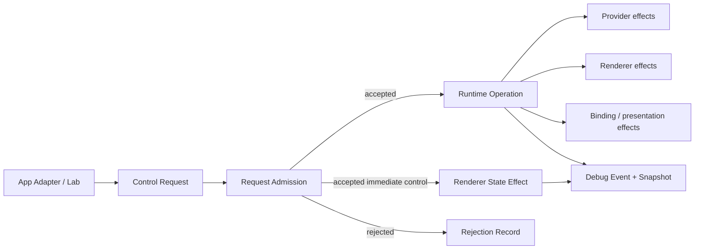

# 运行时控制

运行时控制只作用于 active Media Session。外部发出 Control Request；PlaybackCore 先做 admission。open、play、pause、setRate、seek、switchRoute 和 close 创建 Runtime Operation；volume、mute 与 audio-track transaction 记录 renderer-state effect；reopen 是等待旧 cleanup 后的新 Open Operation。presentation transition 由 App Adapter 执行并写 Presentation State Record，不冒充核心 Runtime Operation。



## Control Request 与 admission

Request 至少携带 `requestID`、目标 Media Session ID、kind、typed payload 和 source。admission 结果是 `accepted` 或 `rejected(reason)`；创建 Runtime Operation 时再返回 `operationID`。volume、mute 与 audio-track transaction 使用 request identity 关联 renderer-state effect。执行结果不混入 admission。

以下情况 rejected：没有 active Media Session、session identity 不匹配、当前 lifecycle 不允许、payload 无效、请求的 route 等于当前 route 且没有实际操作，或另一个不允许并发的 timeline operation 正在执行。seek 尚未完成时，非 seek timeline control 使用稳定的 `operationInProgress(.seek)` reason；更新的 seek request 可以 supersede 旧 seek。

## Runtime Operation

state 为 `running`、`completed`、`failed` 或 `terminatedByCleanup`。连续 seek 可以合并；合并是 scheduling policy，不是新 admission state。Snapshot 必须说明被覆盖 request 和最终生效 request。

## Node effect map

| Request | Main effects | Completion boundary |
|---|---|---|
| `play` | Renderer Input Coordination | synchronizer 记录目标 rate，lifecycle 更新。 |
| `pause` | Renderer Input Coordination | synchronizer rate 为零，lifecycle 更新。 |
| `setRate` | Renderer Input Coordination | 合法 rate 被 synchronizer 接受。 |
| `seek` | Provider、nodes 5–7 | Provider seek 完成或被接受；Stream Epoch 更新；renderer flush；synchronizer target time 恢复。 |
| `setVolume` | active audio renderer | 合法 volume 写入 renderer 和 Snapshot；没有 audio renderer 时只保留偏好，不伪造可听输出。 |
| `setMuted` | active audio renderer | mute state 写入 renderer 和 Snapshot。 |
| `selectAudioTrack` | Shared Audio Lane、node 7 | 在当前时间准备并替换 audio input；成功后恢复原 rate / paused state，失败时恢复旧轨和旧 delivery。 |
| `switchRoute` | nodes 2–9 | 旧 session cleanup，新的 route / Media Session open；不复用旧 node records。 |
| `reopen` | close barrier、nodes 2–9 | 旧 cleanup 完成后，以同一 source、route 与 access requirement 建立新 Media Session。 |
| `close` | 当前所有 active operations | delivery 停止、Provider cancel、renderer flush、binding / presentation 失效、slot 释放。 |

## PresentationCommand（App Adapter）

`PresentationCommand` 不属于 active Media Session 的 Runtime Operation。它可以在没有媒体时打开或关闭 Playback Window 与自制 Scene；这些命令不得创建 Media Session。存在 active renderer 时，跨 surface 命令固定按 target attach → entity migration / target binding → target mode request / 必要 acknowledgement → target renderer settled → source cleanup 执行；旧 view identity 的迟到事件无效，打开超时后的迟到 surface 被拒绝并关闭。失败回滚固定按 ensure source containers → restore intent / binding → source mode → source settled → failed-target cleanup → exact lifecycle / facts validation 执行，并区分 command error 与 `rollbackFailed`。SwiftUI 与代码驱动集成回归调用同一个公开 handler；测试端不增加命令、不建立非法转换图，也不拥有另一套 scene 或 binding 编排。`closeMedia` 是核心 close 加 App Adapter 对 `blackPanorama` / Custom Scene Intent 的恢复，不是 probe 专属命令。

## Cold route switch

switch 前记录 source、current time、preferred rate / paused state、volume、mute、可匹配音轨选择和 requested route。App Adapter 在 visionOS 保持 security-scoped access。旧 session 先停止 delivery、detach binding、cancel Provider、flush audio/video renderer 并失效；cleanup barrier 完成后新 route 创建新的 Media Session，从记录的时间点 prepare。切换失败保留新 route 与原始错误，不恢复旧路线，也不静默 fallback。

## Seek

seek 固定协调顺序为：

```text
accept latest request
→ pause / gate old delivery
→ active Provider seek or rebuild at target
→ increment Stream Epoch
→ flush renderer input
→ set synchronizer rate at target time
→ resume delivery according to previous rate
```

Provider seek 的具体实现是 adapter 私有细节：Apple Compressed 可以重建 reader time range；FFmpeg Compressed 可以 seek format context 并重建 compressed packet stream；共享音频 lane 在同一目标时间重建或 flush FFmpeg decoder / resampler。公共合同不写死 mpv。

连续 seek 采用最后一次请求优先。旧 request 可以 `terminatedByCleanup` 或记录为 superseded；最后一个 accepted request 必须 completed 或 failed。seek 进行中，play、pause、setRate、volume、mute 和 audio track selection 不与它交错更新 timeline，而是明确 rejected；close 或 cold route switch 可以终止 seek 并接管 cleanup。

## Audio controls

volume 与 mute 只更新 active audio renderer 和对应状态，不创建第二条时间线。audio track selection 是可回滚事务：先保存旧 raw stream index、rate / paused state 和当前时间，再准备新轨并替换输入；准备失败时恢复旧轨和 PCM delivery，只有 rollback 也失败时才进入 terminal failed。

## Reopen

`reopen()` 先等待旧会话 Provider cancel、audio/video renderer flush、binding invalidation 与 Current Media Slot release，再以同一 source、route 和 access requirement 调用新的 open。新会话具有新的 Media Session、Stream Epoch、renderer graph 和 node records；旧 callback 只能记录为 stale。

## Close 与 stale isolation

close 设置 cleanup gate 后停止 audio/video renderer media request、取消 Provider、将 synchronizer rate 设为零、flush 两个 renderer，并使 RealityKit / Presentation Binding 失效。Current Media Slot 只在这些异步 cleanup effect 完成后释放；新 open 必须等待同一个 barrier。cleanup gate 后到达的 provider event、sample、renderer callback 或 App presentation update 只能记录为 stale，不能恢复旧 lifecycle。

## Debug 输出

每个 request 至少发布 admission、重要 effect 和 completed / failed 事件；创建 Runtime Operation 的 request 另外发布 operation started / completed / failed / terminated。默认日志不逐 sample 输出。Debug Snapshot 保留当前 operation、last completed operation、target time、last completed seek、route switch source / target、audio renderer state、flush count 和 stale rejection count。

macOS Playback Lab 通过文件型 command inbox 接收外部控制；CLI 只有在 handler 与对应 operation 完成后才收到 `completed` acknowledgement，执行错误返回 `failed` 与 message。该传输层不改变 PlaybackCore 的 Control Request / Runtime Operation 语义，具体协议见 [live-debug.md](live-debug.md)。
