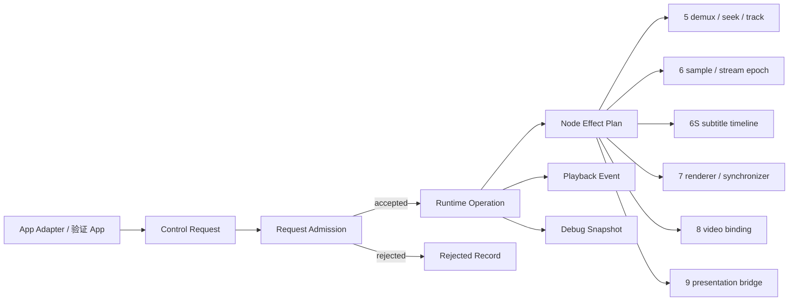

# 运行时控制验收草案

## 作用与边界

打开链条证明媒体从来源进入首个可呈现绑定。运行时控制证明：在 Media Session 已经 active 之后，外部请求如何被播放核心接收、裁决、执行，并影响节点 5、6、6S、7、8 和 9。

运行时输入不是无条件通知。App Adapter 或验证 App 发出 Control Request；播放核心先做准入和状态机决策，再把影响分发到相关节点。



## 边界

运行时控制只在 active Media Session 上讨论。没有当前 Media Session 时，Control Request 只能被拒绝或记录为空操作，不能直接驱动节点 5、6、6S、7、8 或 9。

Control Request 是外部输入。Playback Event 是播放核心输出。两者不能混用。

```text
Control Request: 外部希望播放核心做什么。
Playback Event: 播放核心已经接受、拒绝、完成或失败了什么。
```

## Control Request

Control Request 至少需要携带以下事实：

1. `requestID`：请求身份。
2. `mediaSessionID`：请求希望作用的媒体会话。
3. `kind`：请求类型，例如 `play`、`pause`、`seek` 或 `close`。
4. `payload`：请求参数，例如 seek 时间、目标轨道或目标 scene。
5. `source`：请求来源，例如 App Adapter、验证 App 或系统恢复。

## Request Admission

Control Request 的即时准入结果只有两类：

| 结果 | 含义 |
|---|---|
| `accepted(operationID)` | 播放核心接受请求，并创建或加入一个 Runtime Operation。 |
| `rejected(reason)` | 播放核心拒绝请求，并记录拒绝原因。 |

Request Admission 记录播放核心是否接收外部请求；请求执行结果由 Runtime Operation 记录。

拒绝边界包括：

1. 当前没有 active Media Session。
2. request 的 `mediaSessionID` 不是当前 Media Session。
3. 当前状态不允许该请求。
4. request payload 无法解释。

## Runtime Operation

被接受的 Control Request 会创建或加入 Runtime Operation。Runtime Operation 才描述执行过程。

第一轮 operation state 保留四类：

| 状态 | 含义 |
|---|---|
| `running` | operation 已接受，正在影响一个或多个节点。 |
| `completed` | operation 影响的节点已经达到本次请求的完成边界。 |
| `failed` | operation 无法完成，并写入可解释失败边界。 |
| `terminatedByCleanup` | cleanup 终止了 operation。 |

如果后续证明需要等待安全点，可以再讨论是否加入 `waiting`。

连续 seek、连续 scene switch 或连续 projection switch 可以被合并。合并是调度策略，不是 request 顶层结果。验收只要求 Snapshot 或 Event 能说明旧请求是否被新请求覆盖，以及最终生效的是哪一个 request。

## Node Effect Plan

Runtime Operation 必须说明影响的节点；外部只能通过 Control Request 驱动运行时控制。

| Control Request | 主要影响节点 | 第一轮验收关注点 |
|---|---|---|
| `play` | 7 | synchronizer rate、renderer readiness、状态事件。 |
| `pause` | 7 | synchronizer rate 归零或等价暂停事实。 |
| `setRate` | 7 | rate 变更、非法 rate 拒绝或失败边界。 |
| `seek` | 5、6、6S、7 | demux seek、`streamEpoch`、字幕时间线、renderer flush。 |
| `selectAudioTrack` | 4、5、6、7 | Track Model selection、audio `streamEpoch`、audio sample、audio renderer flush。 |
| `selectSubtitleTrack` | 5、6S、9 | subtitle envelope、字幕 artifact、presentation binding。 |
| `selectVideoTrack` | 5、6、7、8、9 | video sample、renderer graph、entity binding、presentation binding。 |
| `setProjection` / `setStereoLayout` | 8、9 | component configuration、产品播放形态解释。 |
| `switchScene` / `switchProductShape` | 9 | scene container、`RealityView` 迁移、presentation transition。 |
| `close` | 当前所有 active operation | cleanup、槽位释放、旧事件隔离。 |

这张表是影响地图，不是完整状态机。每个 request 的详细状态迁移仍待讨论。

## 反例

- App Adapter 直接修改节点状态，绕过播放核心准入。
- 旧 Media Session 的 request 影响当前 Media Session。
- request 被接受，但没有 operation identity 或受影响节点摘要。
- seek、track switch 或 close 期间旧 `streamEpoch` 继续更新当前状态。
- UI 状态变化被当成播放核心已经完成控制操作的证据。

## 待讨论

1. 每类 Control Request 的完整状态机。
2. 连续 seek、连续 projection switch 和 scene switch 的合并策略。
3. `play`、`pause`、`setRate` 与生命周期状态 `playing`、`paused`、`ended` 的关系。
4. close 与节点 2 当前媒体槽位释放规则的衔接。
5. 音频会话和系统中断是否进入本运行时地图，还是拆成独立验收文档。
