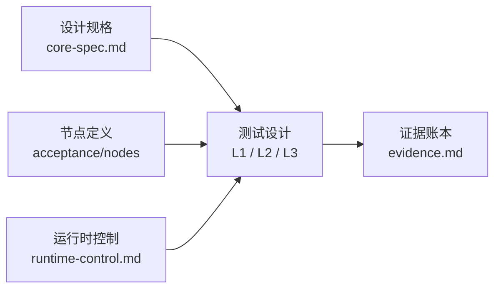

# 验收系统：播放核心

这里规定播放核心的测试层级、验收边界和可追溯证据格式。系统结构见 `../../ARCHITECTURE.md`，完成状态见 `evidence.md`。

## 文档关系

架构地图说明系统有哪些边界；验收系统说明每个边界怎样被证明。

## 打开链条执行骨架

第一轮实现以 Open Operation 推进打开链条。Open Operation 是播放核心接受一次
`open(source:)` 后创建的父级执行记录，属于内部执行记录，不是公开 API 或单个节点记录。

Open Operation 负责把节点 2 到节点 9 的节点 operation、失败、cleanup 和 Debug Snapshot 归属到同一个
Media Session。它的第一轮完成边界是 L2 可解释绑定：验证 App 能通过公开接口接住核心实体输出，
`RealityView` 承载、`VideoPlayerComponent(videoRenderer:)` binding 和 productShape 解释都能在
Snapshot 或等价结构化记录中说明。

Runtime Operation 只用于 active Media Session 上的运行时控制请求，例如 `play`、`pause`、`seek`、
选轨、投影覆盖或 scene switch。Open Operation 不替代 Runtime Operation。

第一轮 Open Operation state 保留四类：

| 状态 | 含义 |
|---|---|
| `running` | open 已接受，正在推进一个或多个节点。 |
| `completed` | 节点 2 到节点 9 已经达到第一轮 L2 可解释绑定边界。 |
| `failed` | 打开链条无法完成，并写入可解释失败边界。 |
| `terminatedByCleanup` | cleanup 终止了打开链条。 |

节点进展由各节点 Record 表达；Open Operation 不增加 `probing`、`binding` 或 `rendering` 等细状态。

## 第一条 vertical slice

第一条 vertical slice 先走 `AVAssetReader` 基准路径。它使用 `fixtures.md` 定义的最小 contract fixture，
把 Apple 产生的 compressed `CMSampleBuffer` 送入 macOS Playback Lab 的 renderer harness。

第一条 vertical slice 的目标是先证明 renderer harness 成立：同一素材能由 `AVPlayer` 播放，
`AVAssetReader` 输出的 sample 能进入 `AVSampleBufferVideoRenderer`，renderer 能绑定到
`VideoPlayerComponent(videoRenderer:)` 并由 macOS `RealityView` 承载。

第一条 vertical slice 的 `completed` 边界是首个可解释绑定：

1. `open(source:)` 被接受，并创建 Media Session。
2. 同一素材能通过 `AVPlayer` 基准路径播放。
3. `AVAssetReader` 产出至少一个 ready video `CMSampleBuffer`。
4. sample 的 format description、timing 和 data readiness 可被结构化记录。
5. 节点 7 把至少一个 video sample 送入 `AVSampleBufferVideoRenderer` 路径。
6. 节点 8 把 active video renderer 绑定到 `VideoPlayerComponent(videoRenderer:)`。
7. 节点 9 证明 video entity 已进入验证 App 的 active `RealityView`。
8. Debug Snapshot 能解释 Media Session、renderer binding、`RealityView` 承载和 productShape。

第一条 vertical slice 不要求 FFmpeg、自组装 sample、连续播放、renderer drain、`ended` 语义、seek、音频同步、字幕、场景切换、
真机可见画面、APMP、HDR 或 EDR。

第二条实现切片使用 FFmpeg demux adapter 产生真实 Demux Envelope，并由节点 6 自行组装至少一个
H.264 compressed `CMSampleBuffer`，送入第一条切片已经证明的同一个 renderer harness。

## Cleanup vertical slice

Cleanup vertical slice 验证 close cleanup 和状态释放。它以前一条 slice 已经达到首个可解释绑定为前提，
通过公开 `close()` 结束当前 Media Session。

Cleanup vertical slice 的目标是证明播放核心能释放当前媒体槽位、停止旧 session 继续更新当前事实，并让
Debug Snapshot 解释 close 后的空槽位状态。

Cleanup vertical slice 的 `completed` 边界至少包括：

1. `close()` 被接受，并作用于当前 Media Session。
2. 当前 active Open Operation 或节点 operation 被完成、失败或 `terminatedByCleanup` 到可解释边界。
3. 当前媒体槽位释放，后续新的 `open(source:)` 可以被接受。
4. 旧 Media Session 的后续 demux、sample、renderer 或 presentation 事实不能更新当前媒体事实。
5. renderer input、RealityKit binding 和 presentation bridge 不再代表旧 Media Session 的 active playback。
6. Debug Snapshot 能解释 close 后的 `idle` 或等价空槽位状态。

## Debug Snapshot 投影规则

Debug Snapshot 是由 Media Session 中的结构化事实、播放核心当前状态和 App Adapter 回填事实派生的诊断投影。
节点 operation 产出自己的事实记录；Snapshot 把这些事实组织成测试、验证 App、日志和证据记录可以稳定读取的 JSON。

L1 先验证播放核心事实记录，再验证 Debug Snapshot 与这些事实一致。L2 可以合并 App Adapter 回填的 scene 和
productShape 事实，但必须保留 provenance。

## 记录粒度规则

每个实际启动的节点都必须产出稳定记录。稳定记录至少说明：输入属于哪个 Media Session，输入来自哪个上游记录，
节点结果是 `succeeded`、`failed` 还是 `terminatedByCleanup`，以及成功或失败的下游边界。上游没有选择对应 consumer 时，下游节点不启动，也不制造“未执行成功”的运行状态。

节点内部细节默认不进入 Media Session，也不默认进入 Debug Snapshot。只有当某个内部字段影响验收结论、
跨节点定位、平台边界判断或用户可见结果时，才提升为稳定诊断事实。其他内部细节使用测试日志、结构化日志或
局部断言定位实现问题。

## 视频管线节点推进规则

每个实际启动的节点都可以被建模为一次 operation。operation 的结果只有三类：

| 结果 | 含义 | 是否推进 |
|---|---|---|
| `succeeded` | 节点产出自己的成功记录，并写回同一个 Media Session。 | 是 |
| `failed` | 节点产出自己的失败记录，并写回同一个 Media Session。 | 否 |
| `terminatedByCleanup` | 当前 Media Session 进入 close 或 failed 清理流程，导致节点 operation 被终止。 | 否 |

失败不会交给下一个节点处理。后续节点不能替前面的失败补救。
节点不适用由 Track Model 的 consumer 选择和节点是否启动表达，不作为 operation 结果。

## 测试层级

| 层级 | 目标 | 主要证明方式 | 证据范围 |
|---|---|---|---|
| L1 核心事实层 | 验证播放核心自己产生的事实是否正确：Media Session、Container Open Snapshot、Track Model、Demux Envelope、`CMSampleBuffer`、metadata、state 和 Debug Snapshot。 | macOS host test、fixture、fake sink、结构化断言。 | SwiftUI / RealityKit 承载、用户可见结果。 |
| L2 承载集成层 | 验证核心公开接口和实体输出能否在 visionOS Simulator 验证 App 中被接住：`open(source:)`、App Adapter 回填、`RealityView` 承载、`VideoPlayerComponent` binding 和 productShape 解释。 | visionOS Simulator、验证快照、日志、截图辅助证据。 | 真机硬解、APMP 真实显示、HDR / EDR、性能和体感。 |
| L3 真机事实层 | 验证 host 和模拟器无法证明的设备事实。 | Vision Pro、人工观察协议、设备日志、L1 / L2 surrogate 引用。 | 复用 L1 / L2 的基础管线证据。 |

L2 Snapshot 不能被写成 L3 真机事实。L3 可以引用 L1 / L2 surrogate 作为前置条件，但不能替代前面结构化节点证据。

## 节点与测试层级

| 节点 | 主要层级 | 说明 |
|---|---|---|
| 1 媒体来源获取 | L2 | 系统文件选择器或 document-open 入口需要 App 或验证 App 证明；L1 只能证明数据模型。 |
| 2 媒体会话创建与来源接入 | L1 | Media Session、Media Source Record 和当前媒体槽位可由核心测试证明。 |
| 3 Container Open Snapshot | L1 / L2 | snapshot schema、阶段边界和 property 对照可由 L1 证明；真实 App 打开路径可由 L2 补充。 |
| 4 轨道模型建立 | L1 | Track Model Record 可由核心测试和 fixture 证明。 |
| 5 解封装事件流建立 | L1 | 真实 demux seam、选中轨道的 Demux Envelope、packet 所有权、事件世代和控制事件顺序可由核心或 seam 测试证明。 |
| 6 CoreMedia sample 组装 | L1 | 真实 envelope 的 sample 组装、格式版本、timing、轨道级失败隔离和 Audio Decode Adapter 可由核心测试证明。 |
| 6S 字幕可呈现物组装 | L1 / L2 | 字幕 cue、时间线和 artifact 模型可由 L1 证明；RealityKit 字幕实体或纹理集成可由 L2 补充。 |
| 7 AVFoundation renderer 输入 | L1 / L2 | renderer 输入语义可由 fake sink 和模拟器 renderer 证据共同证明。 |
| 8 RealityKit renderer 绑定 | L2 | `VideoPlayerComponent(videoRenderer:)` binding 需要 RealityKit 环境或等价验证 App 证明。 |
| 9 RealityView 呈现桥 | L2 | `RealityView`、scene container 和 presentation binding 是模拟器结构化证据。 |

## 测试设计

节点文档规定验收方向和调试投影。完整测试用例、fixture、断言 helper、命令和源码 hook 点在实现时通过 `$tdd` 细化，现场决定写入实现 note 或测试注释。

评审检查节点所有权、成功与失败证据以及下游边界。

实现按 `$tdd` 的 tracer bullet 方式推进：一次证明一个行为，先写节点契约的 L1 测试，再补真实入口和承载路径的 L2 测试；发现边缘情况时补测试并更新实现 note。

通用测试规则：

1. 先测节点事实记录，再测 Debug Snapshot 投影。Debug Snapshot 不能替代节点 Record。
2. 每个验证用例只能有一个预期结果。不要把 `A 或 B 都算通过` 写进同一个用例；如果多个分支都合法，必须拆成多个命名用例。
3. 节点模型定义的适用分支必须被测试覆盖；不适用分支在节点文档中说明。
4. 节点测试必须断言上游归属：当前记录属于哪个 Media Session、来自哪个上游记录。
5. 节点测试必须断言下游边界：本节点不应提前产出后续节点的事实。
6. 缺失字段必须使用 `none`、`unknown`、`notExposed` 或 `unsupported`，不能静默消失。
7. 调试输出必须 privacy-safe。测试可以使用真实路径，但证据、Snapshot 和日志默认只能使用脱敏摘要。

节点 1 到节点 4 的第一轮验收方向：

| 节点 | L1 方向 | L2 方向 | 调试投影方向 |
|---|---|---|---|
| 1 媒体来源获取 | 来源输入事实结构、脱敏摘要和失败记录。 | Verify App handoff 到 `open(source:)`，系统文件入口作为独立用例。 | 能解释来源入口、locator 摘要、访问要求和交付目标。 |
| 2 媒体会话创建与来源接入 | Media Session、Media Source Record、当前媒体槽位、拒绝和释放。 | Verify App open 后能观察当前槽位和 Snapshot 投影。 | 能解释会话身份、来源摘要、槽位变化和拒绝原因。 |
| 3 Container Open Snapshot | snapshot schema、provider 观察事实和阶段边界。 | 真实 App 打开路径能触发 FFmpeg container open。 | 能解释 provider、format、duration 状态和轨道摘要。 |
| 4 轨道模型建立 | Track Model Record、opaque ID、consumer / selected 和失败语义。 | 通过第一条 vertical slice 被观察，不要求独立 L2。 | 能解释轨道身份、来源映射、consumer、selected 和未选择原因。 |

节点 5 到节点 9 的第一轮验收方向：

| 节点 | L1 方向 | L2 方向 | 调试投影方向 |
|---|---|---|---|
| 5 解封装事件流 | 真实 seam、选中轨道 envelope、packet 所有权、格式版本和事件世代。 | 通过第一条 vertical slice 被观察。 | 能解释轨道映射、stream epoch、format revision、控制事件和失败。 |
| 6 CoreMedia sample | H.264 sample 组装、timing、格式变化、音频 lane 和轨道级失败隔离。 | 通过第一条 vertical slice 被观察。 | 能解释 assembly lane、来源 envelope、format description、timing 和失败。 |
| 6S 字幕可呈现物 | 字幕来源、时间范围、artifact 和失败隔离。 | 真实 artifact 能进入 presentation binding。 | 能解释字幕轨、stream epoch、artifact、时间范围和失败。 |
| 7 renderer 输入 | sample 路由、synchronizer、backpressure、flush、stale rejection 和 renderer error。 | 真实 Apple renderer graph 接收 video sample。 | 能解释 graph、renderer、synchronizer、input outcome 和错误。 |
| 8 RealityKit 绑定 | binding record、identity、唯一性和 stale rejection。 | 真实 `VideoPlayerComponent(videoRenderer:)` 挂到 video entity。 | 能解释 renderer、component、entity、binding 和配置。 |
| 9 RealityView 呈现桥 | presentation record 与路由事实模型。 | 真实 scene、RealityView、entity attach 和产品形态解释。 | 能解释 scene、RealityView、entity、字幕、产品形态和失败。 |

## 跨节点缺失状态

字段没有确定值时使用以下通用语义。节点是否启动不属于字段缺失状态。

| 取值 | 含义 | 禁止替代关系 |
|---|---|---|
| `none` | 该字段被检查过，当前媒体明确没有对应事实。 | 不能替代 `unknown`。 |
| `unknown` | 该事实理论上可能存在，但当前节点无法确定。 | 不能替代 `none`、`notExposed` 或 `unsupported`。 |
| `notExposed` | 上游可能知道该事实，但当前 seam 没有暴露给播放核心。 | 不能写成 `unknown` 来掩盖接缝缺口。 |
| `unsupported` | 事实已经知道，但播放核心当前不支持该格式、轨道或能力。 | 不能写成 `unknown` 或 `notExposed`。 |
