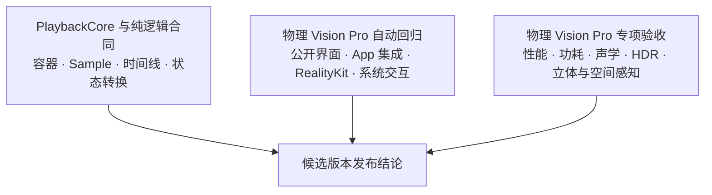

# Enchron 验证规则

这是 Enchron 从来源到 Vision Pro 的唯一验证系统。验证对象是完整产品播放链，而不是某个仓库、Target 或构建结果。当前验证工作按所证明的事实划分；App、UI、RealityKit 与系统 Scene 的运行验证直接使用物理 Vision Pro。

## 验证工作与发布门槛

这三类工作没有先后替代关系。PlaybackCore 与纯逻辑合同负责能够直接、快速、确定地检查的大量输入、并发、取消和错误分支；物理 Vision Pro 自动回归负责生产 App、平台 API、真实用户操作、硬件播放和空间呈现；专项验收只在相应声明需要时增加 Instruments、外置麦克风或佩戴者判断。某类证据不能证明另一类事实，但同一候选版本的发布结论必须取得所有适用证据。

### PlaybackCore 单元与合同验证

在 `Packages/PlaybackCore` 运行 `swift test`。可重复生成且预期结果明确的测试媒体、受控 Receiver 测试入口与真实媒体容器集成共同证明 Media Session、Provider records、sample contract、轨道、控制、backpressure、timeline、stale rejection、failure 和 cleanup。

真实媒体容器检查仍属于 PlaybackCore 合同验证：它可以证明 FFmpeg 解封装和压缩 `CMSampleBuffer` 的数据、时间信息、编解码器配置、颜色与 HDR 信令和版本归属，但不能证明 Renderer 已显示画面或输出声音。

### 物理 Vision Pro 自动回归

Enchron App 的产品适配、Window、Docked、Panorama、来源界面、持久化、可访问交互、RealityKit 生命周期和系统 Scene 行为全部在物理 Vision Pro 上验证。设备保持解锁并允许 XCUITest 启动生产 App；测试通过公开界面完成用户操作，同时读取只读产品状态、保存 Accessibility hierarchy、截图、OSLog 与 `.xcresult`。

- 产品集成必须证明真实媒体经过生产 `PlaybackRuntime`、当前 Media Session、renderer graph 与唯一 RealityKit consumer；状态投影、来源访问、控制和清理均属于同一条产品路径。
- 空间呈现必须证明目标 Scene、`PlaybackSurfaceAnchor`、Video Entity、同一 renderer binding 与 Media Session 连续性符合合同；Panorama 的 rendering status 与 desired/actual immersive、viewing、spatial video mode 必须在设备上达到成功后置条件。
- RealityKit 输出必须使用带方向、几何、双眼和连续帧标记的测试媒体，证明视频实际位于目标表面并持续推进。设备截图用于检查静态画面与界面；动态卡顿、停帧和空间错位增加定时观察或录屏。
- XCUITest 只有在 Accessibility 元素存在、启用且可命中，并且语义点击使产品状态达到预期结果时才通过。截图坐标点击只用于继续收集故障信息，不能把不可命中的正式用户路径改判为通过。

物理设备未解锁、XCTest worker 未启动、测试媒体不可用或必需采集链未工作时，场景记为未评估，不形成产品通过或失败。通用 device build 只能证明代码能够为目标 SDK 编译和链接，不能代替真机运行断言。

`RealityRenderer` component probe 若继续保留，必须作为物理 Vision Pro 上的 XCTest 运行，以固定 camera 与 texture 隔离投影、方向、stereo、比例、裁剪和帧推进。它只承担组件问题定位；完整 App 的 Window、Immersive Space、RCP anchor、Screen Size 与 Presentation Transition 仍由同一设备上的生产 App XCUITest 证明。

空间播放使用 `EnchronAppUITests` 中的 Vision Pro 场景集，并通过明确指定的物理 Vision Pro destination 执行。测试必须使用真实 FFmpeg → PlaybackCore 媒体，不得通过测试替代内容建立第二条播放路径。

Window、Docked 与 Panorama 都必须证明唯一 active consumer 是绑定当前 renderer 的 `VideoPlayerComponent`，不允许 `ModelComponent + VideoMaterial` 产品分支。Docked 还必须证明 Video Entity 是目标 `PlaybackSurfaceAnchor` 的子实体、world position 与用户原点的距离符合 Distance、Elevation 符合球面角度、屏幕始终朝向用户、scale 三轴一致，并由 `playerScreenSize × uniform scale` 得出最终尺寸。Panorama 必须观察 rendering status ready，以及 desired/actual immersive、viewing、spatial video mode 全部收敛；没有取得这些设备事实时不得提交实际空间呈现通过结论。

视觉自动判定不使用普通电影画面或要求逐像素完全一致的参考图作为主要通过条件。标准 Diagnostic Media 必须提供可定位的四角与中心标记、圆形或网格、方向标记、左右眼标记和连续帧标记；测试判断这些标记是否存在、顺序是否正确，以及几何比例、方向、双眼归属、画面边界和时间推进是否在分别规定的误差范围内。逐像素参考图只作为失败诊断附件。

### 物理 Vision Pro 专项验收

使用与自动回归相同的候选版本、测试媒体身份和预期结果，在物理 Vision Pro 上增加 Instruments、外置麦克风或佩戴者验收，证明硬件解码、HDR/EDR、受支持的 Dolby Vision Profile、物理音频、立体方向、空间舒适度、性能和功耗。只有相应专项证据完成，才能声明这些设备体验已经通过；单张截图、AirPlay、日志无错误或可以拖动进度条都不足以代替。

人工验收发现的可重复画面问题必须转化为 Diagnostic Media 中的明确标记、针对这些标记的判断方法，或可直接观察的界面与场景结构条件，使同类问题进入后续无人值守回归。

## 系统节点

节点文档统一位于 `docs/acceptance/nodes/`，描述一条跨模块产品链。实现所有者不决定文档位置。

| 节点 | 完成事实 | 实现所有者 | 最低证据 |
|---|---|---|---|
| [01 Source](nodes/01-source.md) | 来源身份、授权范围与访问事实交给公开 Open 操作 | Enchron App → PlaybackCore 交界处 | PlaybackCore 合同验证 + App 集成验证 |
| [02 Media Session](nodes/02-session.md) | Open 被接受，唯一 Session 与初始播放意图成立 | PlaybackCore | PlaybackCore 合同验证 |
| [03 Provider Open](nodes/03-provider-open.md) | 容器、时长、能否 Seek、轨道与编解码器事实固定 | PlaybackCore | PlaybackCore 合同验证 |
| [04 Track Model](nodes/04-track-model.md) | 视频和音频轨道的稳定身份、格式与选择正确 | PlaybackCore | PlaybackCore 合同验证 |
| [05 Media Events](nodes/05-media-events.md) | Sample、格式、Flush、Ended 和 Error 带有正确的 Session 版本 | PlaybackCore | PlaybackCore 合同验证 |
| [06 Renderer-ready Sample](nodes/06-compressed-sample-stream.md) | 视频压缩数据与音频 compressed/decoded-PCM 数据、时间信息、依赖、编解码器配置和颜色/HDR 信令正确 | PlaybackCore | PlaybackCore 合同验证 |
| [07 Renderer Input](nodes/07-avfoundation-renderer-input.md) | 当前 Sample 被 Receiver 接受，共享时间线正确推进 | PlaybackCore | PlaybackCore 合同验证 |
| [08 RealityKit Binding](nodes/08-realitykit-renderer-binding.md) | 当前 Renderer 只有一个正在使用它的 RealityKit Entity | Enchron App | 物理 Vision Pro XCTest 与 XCUITest |
| [09 Enchron App Presentation](nodes/09-enchron-app-presentation.md) | Entity 位于目标播放表面，显示帧与音频持续推进 | Enchron App | 物理 Vision Pro XCUITest、状态、截图与录屏 |

证据必须报告第一处失败节点。Provider metadata 正确不等于 sample 或 displayed pixel 正确；renderer enqueue、renderer rendering、displayed pixel、持续推进、可听输出和颜色正确是独立事实。

## 播放管线边界

产品与验证只使用 FFmpeg demux → renderer-ready sample → AVFoundation renderer 管线。视频 sample 保持压缩编码；音频 sample 在 AVFoundation 能直接接收时保持压缩编码，否则由同一个 FFmpeg provider 解码为线性 PCM。验证入口可以绕过产品来源与页面来隔离 PlaybackCore，但不得替换 provider 或把另一套实现的结果当作当前管线的证据。

## 播放控制与媒体矩阵

每个会影响 sample assembly、Receiver、timeline、renderer graph 或产品集成的 revision，都必须通过当前播放管线验证：

| 切片 | 唯一通过条件 |
|---|---|
| 启动与持续播放 | 从首个有效 PTS 建立停止的 timeline；当前 video epoch 从可解码起点到第一个到达或越过目标 decode time 的 sample 都被 renderer 接受，存在音轨时当前 audio epoch 已提交覆盖启动时间且至少 0.25 秒提前量的音频，然后才应用播放 rate；越过目标的 DTS 不要求精确相等；displayed frame 与 audio 持续推进，无 renderer error |
| Pause / Resume | 暂停期间 media time 与 displayed frame 不前进；以相同 rate 恢复时保留当前 audio Receiver queue，不进行无重新定位和 preroll 配套的 flush；恢复后沿同一 session 继续且物理音频重新可听 |
| Seek | Progress Bar 与前后跳转保持原 Playing/Paused 意图，Precision Timeline 与逐帧保持 Paused，从 Ended 离开结尾保持 Paused；到达容差内目标，旧 epoch sample 不再显示或播放 |
| 连续 Seek | 快速连续请求只提交最终未 superseded 操作，不产生第二 timeline |
| 快进 / 快退 | 跳转与非 1.0 rate 符合核心控制语义；恢复后音画继续同步 |
| 音频核心 | verification harness 可用内部 gain/mute seam 验证当前 graph 与音轨切换；它不构成 Enchron 产品 Volume/Mute 控件。产品最终音量由 visionOS 系统控制 |
| Close / Reopen | delivery task 取消、Receiver flush、consumer detach 与资源释放完成；reopen 建立新 session |
| End | 所有 active lane 完成且 synchronizer 越过最终 presentation end 后发布 natural-completion ended；seek 到总时长发布 seek-to-end ended，二者在产品持久化前可区分 |
| 颜色与 HDR | sample 和 displayed pixel 的 primaries、transfer、matrix、range 符合该测试媒体预先记录的预期值与允许误差 |
| 稳定性 | 规定时长内 sample、displayed frame、audio 与 timeline 持续推进，资源不无界增长 |

最低媒体集合覆盖 H.264、H.265/HEVC、AV1、SDR、HDR10/PQ、HLG、受支持的 Dolby Vision profile、B-frame、至少双音轨、compressed audio、需要解码为 PCM 的 FLAC、可 seek 长媒体与远程 range source。每种媒体必须在 `fixture-registry.json` 中具有稳定 ID、hash、许可、codec/container、颜色/HDR、音轨、时长，以及在 `oracle` 字段中明确记录的预期结果和允许误差；许可、预期结果或允许误差不完整的素材只能用于诊断，不能让完整矩阵标记为 passed。

## Enchron App 集成合同

Enchron App 的产品集成验证必须证明：

- `PlaybackRuntime` 发布的 lifecycle、position、duration、rate、track 和 error 是 PlaybackCore 的只读投影。
- `PlaybackRuntime` 不维护独立 Media Session、第二 timeline 或与核心竞争的 seek generation。
- Window、Docked、Panorama 迁移同一个 renderer；目标 binding 成功后才提交，失败保留原 session 并回滚 Presentation。
- 来源授权和远程 streaming 生命周期覆盖整个 Media Session，cleanup 后才释放。
- 测试专用输入和诊断入口不会进入产品 UI 或改变产品失败语义。

### 播放输出诊断合同

每个物理 Vision Pro 运行都必须从生产 Debug Snapshot 和当前 `VideoPlayerComponent` 记录生成 `PlaybackOutputObservation`，不得用另一套播放状态机推断结果。单次观察按固定顺序报告第一处未完成边界：Media Session、video sample、renderer input、decoder bootstrap、底层 timebase 的实际播放 rate 大于零、RealityKit binding、component ready、displayed pixel、audio sample、audio renderer、系统 audio session、系统 audio route。音频 renderer 完成要求实际 status 为 `rendering`、error 为空且没有静音或零 renderer volume；系统 audio route 完成要求 session category 为 playback、mode 为 movie playback、至少存在一个输出 port 且系统输出音量大于零。请求给 synchronizer 的 rate 只表达控制意图，不能作为实际播放证据。Lifecycle 为 Playing 时还必须取得同一 Media Session、同一 stream epoch 的第二次观察，并分别证明 timeline、video sample、renderer accepted input，以及存在音轨时的 audio sample 均持续增加。Lifecycle 为 Ended 时改为证明 displayed image 已清除且系统 audio session 已停用，不要求一个与纯黑语义冲突的 displayed pixel。

因此，`renderer bound` 只能完成节点 08，`component ready` 不能替代 displayed pixel，单个 displayed pixel 不能替代持续播放，audio sample enqueue 也不能替代 audio renderer rendering、有效系统路由或物理听音。真机 XCUITest 必须把启动、暂停、恢复、播放态 Seek 后的成对状态观察、Accessibility hierarchy 和 `XCUIScreen` 截图保存在同一 `.xcresult`；自动通过至少要求实际 timebase rate、position、video sample、renderer accepted input 和存在音轨时的 audio sample 共同推进，并保存 renderer status/error、session category/mode、输出 port 与系统音量。相邻截图用于视觉确认画面并非持续停留在同一帧；物理麦克风录音或佩戴者听音仍是唯一能证明声音最终离开设备的证据。失败诊断首先读取上述第一未完成边界。

UR12 声学验收在录音开始时保存 wall-clock，XCUITest 在 initial play、pause、resume、playing seek 与 final pause 的起止点保存同一时钟的 marker。`Scripts/verification/analyze_acoustic_timeline.py` 将 `.xcresult` marker 与 PCM WAV 对齐，分别计算各区间 RMS/peak；每个播放区间必须至少比两个暂停区间的平均 RMS 高 6 dB，否则自动判定为无可听输出。原始 WAV、录音开始时间、`.xcresult` 与分析 JSON 必须共同保存，单独的分析结论不是可复核证据。

## 证据

每次记录必须包含 Enchron Git revision、toolchain/OS、fixture ID 与 hash、scenario、命令或 test identifier、节点结果、控制矩阵、第一失败边界、日志/`.xcresult`/机器 artifact 路径。只有当前 revision 的完整必测矩阵可以标记 `passed`；历史结果标记为 `reference` 或 `stale`。

工作树包含未提交或未跟踪文件时，Git revision 不足以标识被验证代码。此时使用 `Scripts/verification/capture_validation_manifest.py` 对全部 tracked 与 untracked 产品文件计算 tree identity，并记录验证 artifact 的独立摘要；`docs/acceptance/evidence/` 从产品树哈希中排除以避免自引用。任何后续代码变化都会使 manifest 变为 `stale`，必须在统一验证后重新生成。

当前记录位于 `evidence.md`，产品 UI 用例位于 `../ui/acceptance.md`。构建成功、测试数量、某一条 scenario 成功、来源 metadata 正确或日志没有错误都不能替代完整播放证明。

## 回归路由

- 节点 01 失败：检查 Enchron App 来源授权、Media Reference 解析或远程 range bridge。
- 节点 02–06 失败：先修复并重新验证 PlaybackCore，不修改 UI 来掩盖问题。
- 节点 07 失败：检查 sample、Receiver、timeline 与 renderer graph。
- 节点 08–09 在物理 Vision Pro 自动回归中失败：检查 `PlaybackRuntime`、consumer binding、状态投影、visionOS 平台接口、Scene 生命周期与空间呈现状态转换。
- PlaybackCore 与纯逻辑合同通过而设备自动回归或专项验收失败：检查设备解码器、HDR/EDR、音频路线、空间呈现与性能，不反向宣称所有播放核心节点失效。
