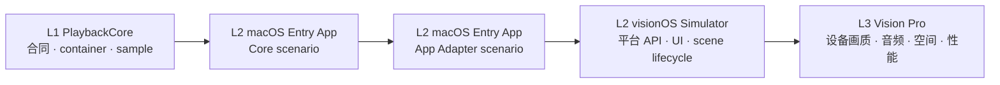

# Enchron 验证规则

这是 Enchron 从来源到 Vision Pro 的唯一验证系统。验证对象是完整产品播放链，而不是某个仓库、target 或构建结果；任何上层证据都不能替代尚未通过的下层门槛。

## 顺序与门槛

### L1 PlaybackCore

在 `Packages/PlaybackCore` 运行 `swift test`。确定性 fixture、受控 Receiver seam 与真实 container integration 证明 Media Session、Provider records、sample contract、轨道、控制、backpressure、timeline、stale rejection、failure 和 cleanup。

真实 container probe 仍属于 L1：它可以证明 FFmpeg demux 与 compressed `CMSampleBuffer` 的 payload、timing、codec configuration、color/HDR signaling 和世代归属，但不能证明 renderer 已显示画面或输出声音。

### L2 macOS Entry App

`EnchronMacOS` 是 Entry App 播放功能的 macOS platform entry，不是平行 Verify App。它使用真实媒体、真实 `AVSampleBufferVideoRenderer`、`AVSampleBufferAudioRenderer`、共享 synchronizer、AVFoundation Receiver 和 RealityKit consumer，并提供两个按顺序执行的 verification scenario：

1. Core scenario 直接连接 PlaybackCore，隔离产品来源、持久化、SwiftUI 页面和空间转换，先证明核心可播放。
2. App Adapter scenario 使用生产 `PlaybackRuntime` 连接同一 fixture、renderer consumer 和断言，证明 Entry App 接入没有改变时间线、sample、颜色或控制语义。

Core scenario 不是第二套长期应用控制。可复用的控制、状态投影与 attach 规则必须迁入生产 application control；scenario 只保留驱动和断言。Core scenario 未通过时不得修改 App UI 掩盖失败，App Adapter scenario 未通过时不得进入 visionOS 首验。

### L2 visionOS Simulator

Simulator 验证平台 API、Window/Docked/Panorama 状态机、失败回滚、来源与持久化、可访问交互和基础 RealityKit 生命周期。自动验收分开报告两个不能互相替代的结果：

- Structural Presentation Success：目标 scene、`PlaybackSurfaceAnchor`、Video Entity、同一 renderer binding、Media Session 连续性、RealityKit actual mode 与 rendering status 符合合同。
- Rendered Presentation Success：真实产品 sample 路径进入 `VideoPlayerComponent` 后，在规定 camera pose 下通过 Diagnostic Media 的 Visual Oracle。

`RealityRenderer` component probe 使用固定 camera 输出 texture，验证投影、方向、stereo、比例、裁剪与帧推进；完整 App integration 验证 WindowGroup / ImmersiveSpace、RCP anchor、Screen Size 和 Presentation Transition。若 `VideoPlayerComponent` 在离屏宿主中无法确认依赖 ImmersiveSpace 的 actual mode，该事实属于 probe 能力边界，actual mode 留在 App integration 断言，不扩建第二套 renderer。

空间播放的标准验收入口是 `scripts/verify-spatial-presentations-simulator.zsh`。它必须用真实 FFmpeg → PlaybackCore 媒体而不是 `ENCHRON_UI_TESTING` fixture，在同一次 App 启动中完成 Window → Docked → Window → Panorama → Window，并同时保存三类不能相互替代的证据：XCUIAutomation 语义与截图、PlaybackCore/Presentation 机器状态、OSLog 与 `.xcresult`。点击先使用 accessibility identifier；元素存在但不可直接命中时，测试先保存当前截图，再以该语义元素的几何中心执行坐标 fallback，并继续以目标状态断言结果。无人值守测试没有语义目标或有效几何时必须失败；交互式 agent 可以基于当次截图视觉定位后点击，但必须保存点击前后截图、验证相同机器状态后置条件，并把结果标记为 `agent-assisted`，不能用盲点固定坐标或冒充无人值守绿色结果。

Window、Docked 与 Panorama 都必须证明唯一 active consumer 是绑定当前 renderer 的 `VideoPlayerComponent`，不允许 `ModelComponent + VideoMaterial` 产品分支。Docked 还必须证明 Video Entity 是目标 `PlaybackSurfaceAnchor` 的子实体、local transform 符合用户 placement、scale 三轴一致，并由 `playerScreenSize × uniform scale` 得出最终尺寸。Panorama 必须观察 rendering status ready，以及 desired/actual immersive、viewing、spatial video mode 全部收敛。测试宿主未启动、Simulator 未完成 BackBoard 启动或 XCTest worker 未 materialize 属于基础设施失败；它既不是产品失败，也不能标记 Simulator passed。

Visual Oracle 不使用普通电影画面或逐像素 golden image 作为主断言。标准 Diagnostic Media 必须提供可定位的四角与中心标记、圆形或网格、方向标记、左右眼标记和连续帧标记；断言标记存在与顺序、几何比例、方向、双眼归属、画面边界和时间推进，并为色彩转换、抗锯齿与 SDK renderer 差异保留明确容差。逐像素参考图只作为失败附件。

### L3 Vision Pro

使用与 L2 相同的 fixture identity 和 oracle，在物理 Vision Pro 上证明硬件解码、HDR/EDR 与受支持 Dolby Vision profile、设备音频、Window/Docked/Panorama、空间舒适度、性能和最终交互。该结论命名为 Wearer Experience Success，仅在里程碑、发布前及设备专属回归时要求人员佩戴；日常提交以 Structural Presentation Success 与 Rendered Presentation Success 为门槛。generic device build、Simulator、AirPlay、单张截图、日志无错误或可拖动进度条都不是 Wearer Experience Success。

人工验收发现的可重复画面问题必须转化为 Diagnostic Media、Visual Oracle 或结构断言，使同类问题进入后续无人值守回归。

## 系统节点

节点文档统一位于 `docs/acceptance/nodes/`，描述一条跨模块产品链。实现所有者不决定文档位置。

| 节点 | 完成事实 | 实现所有者 | 最低证据 |
|---|---|---|---|
| [01 Source](nodes/01-source.md) | 来源身份、授权范围与访问事实交给公开 open | Entry App → PlaybackCore seam | L1 + App integration |
| [02 Media Session](nodes/02-session.md) | open 被接受，唯一 session 与初始播放意图成立 | PlaybackCore | L1 |
| [03 Provider Open](nodes/03-provider-open.md) | container、duration、seekability、轨道与 codec facts 固定 | PlaybackCore | L1 |
| [04 Track Model](nodes/04-track-model.md) | video/audio 稳定身份、格式与选择正确 | PlaybackCore | L1 |
| [05 Media Events](nodes/05-media-events.md) | sample/format/flush/end/error 带正确 epoch/revision | PlaybackCore | L1 |
| [06 Compressed Sample](nodes/06-compressed-sample-stream.md) | payload、timing、dependency、codec config、color/HDR signaling 正确 | PlaybackCore | L1 |
| [07 Renderer Input](nodes/07-avfoundation-renderer-input.md) | 当前 sample 被 Receiver 接受，共享 timeline 正确推进 | PlaybackCore | L1 seam + macOS L2 |
| [08 RealityKit Binding](nodes/08-realitykit-renderer-binding.md) | 当前 renderer 只有一个 active RealityKit consumer | Entry App | macOS L2 |
| [09 Entry App Presentation](nodes/09-entry-app-presentation.md) | entity 位于目标 surface，displayed frame 与音频持续推进 | Entry App | macOS L2；设备事实升 L3 |

证据必须报告第一处失败节点。Provider metadata 正确不等于 sample 或 displayed pixel 正确；renderer enqueue、renderer rendering、displayed pixel、持续推进、可听输出和颜色正确是独立事实。

## 路线边界

产品只使用 FFmpeg demux → compressed sample → AVFoundation renderer 路线。Apple compressed route 使用 `AVAssetReaderTrackOutput(outputSettings: nil)` 生成 storage-format sample，是同一 downstream renderer 的验证参考，不是产品 route、fallback 或第二套 App。

两条验证路线在 Provider seam 前可以不同；从节点 7 开始必须复用相同 renderer graph、RealityKit consumer、控制矩阵和断言。Apple reference 通过不能替 FFmpeg 产品路线出具通过结论。

## L2 控制与媒体矩阵

每个会影响 sample assembly、Receiver、timeline、renderer graph 或 App Adapter 的 revision，都必须在 FFmpeg 产品路线验证：

| 切片 | 唯一通过条件 |
|---|---|
| 启动与持续播放 | 从首个有效 PTS 建立 timeline；displayed frame 与 audio 持续推进，无 renderer error |
| Pause / Resume | 暂停期间 media time 与 displayed frame 不前进；恢复后沿同一 session 继续 |
| Seek | 前后 seek 到达容差内目标；旧 epoch sample 不再显示或播放 |
| 连续 Seek | 快速连续请求只提交最终未 superseded 操作，不产生第二 timeline |
| 快进 / 快退 | 跳转与非 1.0 rate 符合核心控制语义；恢复后音画继续同步 |
| 音频 | volume、mute、音轨选择作用于当前 graph；切换后无旧音轨串音 |
| Close / Reopen | delivery task 取消、Receiver flush、consumer detach 与资源释放完成；reopen 建立新 session |
| End | 所有 active lane 完成且 synchronizer 越过最终 presentation end 后发布 ended |
| 颜色与 HDR | sample 和 displayed pixel 的 primaries、transfer、matrix、range 符合 fixture oracle |
| 稳定性 | 规定时长内 sample、displayed frame、audio 与 timeline 持续推进，资源不无界增长 |

最低媒体集合覆盖 SDR、HDR10/PQ、HLG、受支持的 Dolby Vision profile、B-frame、至少双音轨、可 seek 长媒体与远程 range source。每种媒体必须在 `fixture-registry.json` 中具有稳定 ID、hash、许可、codec/container、颜色/HDR、音轨、时长和 oracle；许可或 oracle 不完整的素材只能作为 diagnostic，不能让完整矩阵标记为 passed。

## Entry App 等价性

App Adapter scenario 必须证明：

- `PlaybackRuntime` 发布的 lifecycle、position、duration、rate、track 和 error 是 PlaybackCore 的只读投影。
- `PlaybackRuntime` 不维护独立 Media Session、第二 timeline 或与核心竞争的 seek generation。
- Window、Docked、Panorama 迁移同一个 renderer；目标 binding 成功后才提交，失败保留原 session 并回滚 Presentation。
- 来源授权和远程 streaming 生命周期覆盖整个 Media Session，cleanup 后才释放。
- verification-only route、fixture 和诊断入口不会进入产品 UI 或改变产品失败语义。

## 证据

每次记录必须包含 Enchron Git revision、toolchain/OS、fixture ID 与 hash、scenario、命令或 test identifier、节点结果、控制矩阵、第一失败边界、日志/`.xcresult`/机器 artifact 路径。只有当前 revision 的完整必测矩阵可以标记 `passed`；历史结果标记为 `reference` 或 `stale`。

当前记录位于 `evidence.md`，产品 UI 用例位于 `../ui/acceptance.md`。构建成功、测试数量、某一条 scenario 成功、来源 metadata 正确或日志没有错误都不能替代完整播放证明。

## 回归路由

- 节点 01 失败：检查 Entry App 来源授权、Media Reference 解析或远程 range bridge。
- 节点 02–06 失败：留在 PlaybackCore L1，不修改 UI。
- 节点 07 在 Core scenario 失败：检查 sample、Receiver、timeline 与 renderer graph。
- Core scenario 通过而节点 08–09 或 App Adapter 失败：检查 `PlaybackRuntime`、consumer binding 与状态投影。
- macOS L2 通过而 Simulator 失败：检查 visionOS API、scene lifecycle 与 presentation transaction。
- L2 全通过而 Vision Pro 失败：检查设备 decoder、HDR/EDR、音频 route、空间呈现与性能，不反向宣称所有核心节点失效。
