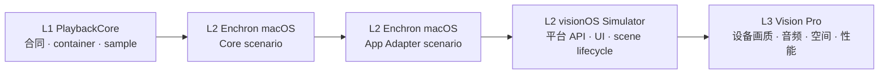

# Enchron 验证规则

本文件是 Enchron 从 PlaybackCore 到 Vision Pro 的唯一分层验证规则。产品 UI 的具体用例和当次结果记录在 `../ui/acceptance.md`；PlaybackCore 的 sample、renderer 与控制合同由相邻仓库 `docs/acceptance/verification-system.md` 定义。

## 顺序与门槛

每个箭头都是硬门槛。核心 L1 只证明 container/sample 与确定性状态合同；Enchron macOS Core scenario 首次证明真实 renderer graph、RealityKit consumer、可见视频和可听音频；App Adapter scenario 才证明 `PlaybackRuntime` 没有改变核心行为；Simulator 只补平台与 UI；L3 承担设备事实。

## Enchron macOS App

macOS 与 visionOS App 位于同一 Enchron 仓库，共享生产 `PlaybackRuntime` 和可移植的 RealityKit surface 组装。macOS App 不维护 fixture 专用播放状态机，也不在失败时切换路线。

Core scenario 绕过产品来源、持久化、presentation state 和空间 scene，直接执行 PlaybackCore 的完整 L2 矩阵。它必须至少显示当前 fixture、session、节点 1–9、media time、displayed-frame 计数、audio renderer 状态、sample/displayed pixel 色彩字段和首个失败边界；这些是测试证据，不是产品调试 UI。

App Adapter scenario 使用相同 fixture、相同 renderer consumer 和相同断言，只把控制入口与状态观察替换为生产 `PlaybackRuntime`。两次结果出现差异时，Core scenario 是核心边界，App Adapter scenario 是 Enchron 接入边界。

两个 scenario 都通过后，才允许把相同 PlaybackRuntime 连接到 visionOS Window、Docked 与 Panorama。

执行入口保持在同一个 target 与脚本中：`./script/build_and_run.sh --l2-core MEDIA OUTPUT` 运行 Apple/FFmpeg Core 对照，`./script/build_and_run.sh --l2-app MEDIA OUTPUT` 运行生产 `PlaybackRuntime` 的 FFmpeg product route。两者都要求 fixture registry 的 ID/hash，写出相同 schema 的 JSON，并在任何 route 或断言失败时返回非零状态。App Adapter 不能通过复制 `PlaybackRuntime` 源码或建立验证专用 adapter 实现；`EnchronMacOS` target 必须直接编译生产文件。

## Enchron L2 矩阵

| 阶段 | 必须证明 | 不得据此声明 |
|---|---|---|
| macOS Core | 真实 FFmpeg product route 的视频、音频、控制、颜色信令、RealityKit displayed frame 与稳定性 | visionOS 设备画质或空间呈现 |
| macOS App Adapter | `PlaybackRuntime` 的 renderer identity、状态、控制、错误与 cleanup 与 Core scenario 等价 | 产品 UI 与 scene lifecycle |
| visionOS Simulator logic | Window/Docked/Panorama 状态机、失败回滚、来源与持久化 | renderer 已显示正确视频 |
| visionOS Simulator UI | Window 页面、transport、菜单、可访问性与基础 RealityKit 生命周期 | 硬件解码、HDR/EDR、真机空间交互 |
| RealityRenderer | 实体、材质、camera 与 Metal texture 的程序化输出 | `AVSampleBufferVideoRenderer` 已持续显示产品媒体 |

macOS Core 和 App Adapter 的媒体矩阵与控制矩阵直接服从 PlaybackCore 验证规则，不在本文件复制。Enchron 额外断言 renderer consumer 在 Window/Docked/Panorama 迁移前后身份唯一，失败回滚保留同一 Media Session，产品状态不伪造 core ready/playing/ended。

## L3 Vision Pro

L3 使用与 macOS L2 相同 fixture ID 与 hash，至少验收 SDR、HDR10/PQ、HLG、受支持的 Dolby Vision profile、多音轨和长媒体。必须人工或仪器证明设备视频持续播放、颜色与系统参考一致、音频可听且同步、seek/快进/快退/倍速可用，并完成 Window → Docked → Window 与 Window → Panorama → Window。

`.xcresult`、OSLog、截图、设备/OS/toolchain、Git revision、fixture ID、每个 presentation 的结果和第一失败边界组成证据。generic device build、Simulator、单张截图、进度条可拖动或日志没有错误都不能替代真机通过。

## 回归路由

- 节点 1–6 失败：回到 PlaybackCore L1，不修改 Enchron UI 掩盖问题。
- 节点 7–9 在 macOS Core scenario 失败：留在 PlaybackCore renderer/sample/timeline 边界。
- Core scenario 通过而 App Adapter scenario 失败：只检查 `PlaybackRuntime`、consumer attach 与产品状态投影。
- macOS 两个 scenario 通过而 Simulator 失败：检查 visionOS API、scene lifecycle 与平台接入。
- L2 全通过而 Vision Pro 失败：检查设备 decoder、HDR/EDR、音频 route、空间呈现与性能，不反向猜测所有核心节点失效。
