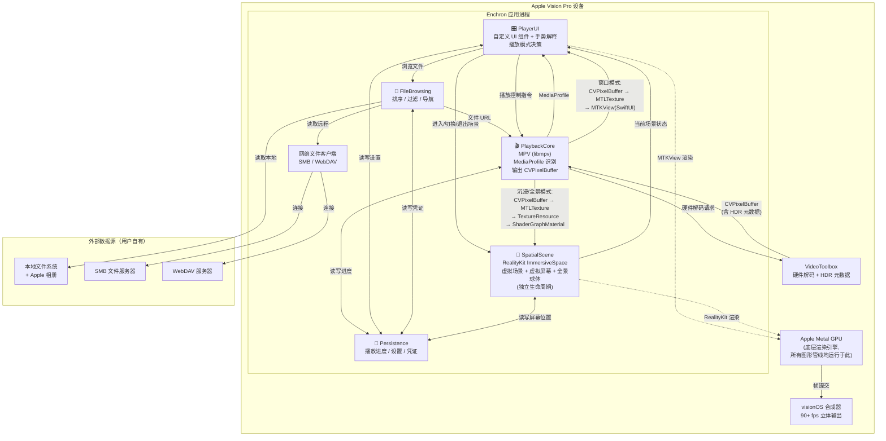
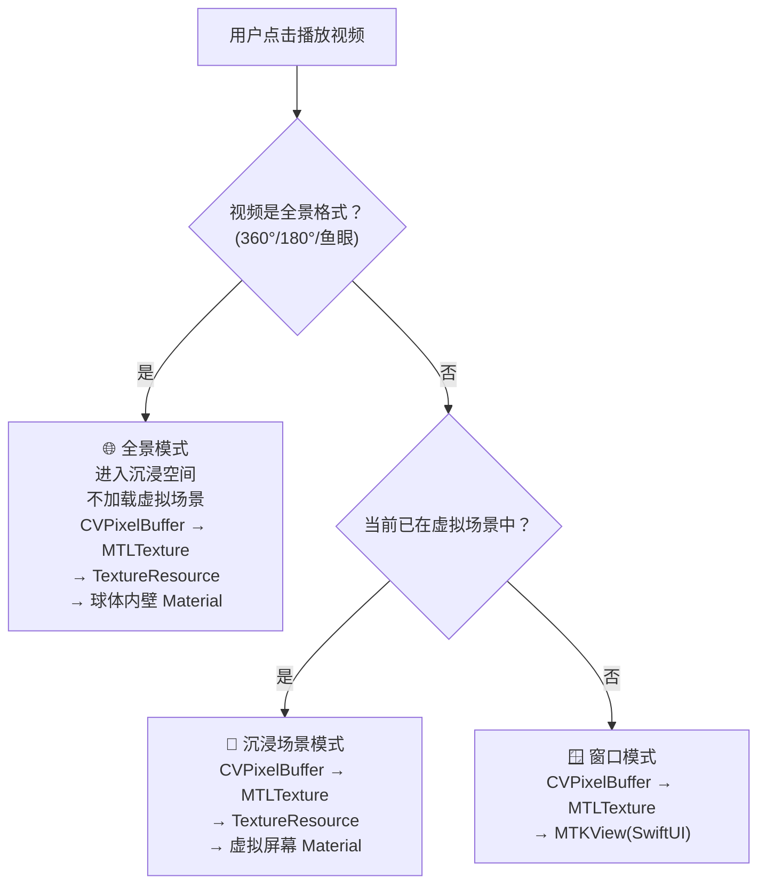

# Phase 1 产出：物理架构拓扑图

> ⚠️ 本文档为设计阶段的架构蓝图，渲染管线和技术选型描述的是**目标方案**。
> 具体实现细节（如 HDR 元数据透传方式、Metal 纹理格式选择）以代码和 `known_issues.md` 为准。

## 系统上下文定位

Enchron 是一款**纯客户端原生 visionOS 应用**，无自建后端服务器。所有计算（解码、渲染、UI）均在 Apple Vision Pro 本地完成，外部依赖仅为用户自有的文件存储服务。

## 高层拓扑架构



### 渲染管线技术细节

```
MPV (libmpv) 解码视频
    ↓
VideoToolbox 硬件解码（保留 HDR 元数据和色彩空间标签）
    ↓
CVPixelBuffer（解码后的原始帧数据）
    ↓
CVMetalTextureCache 零拷贝转换（不复制内存，直接映射到 GPU）
    ↓
MTLTexture（Metal 纹理，10-bit 格式 + BT.2020 PQ/HLG 色彩空间）
    │
    ├─ 窗口模式:
    │   MTLTexture → MTKView（嵌入 SwiftUI 的 Metal 视图）
    │   → visionOS 合成器输出
    │
    └─ 沉浸/全景模式:
        MTLTexture → TextureResource（RealityKit 纹理封装）
        → ShaderGraphMaterial（着色器图材质，纹理参数绑定）
        → ModelEntity.ModelComponent（平面=虚拟屏幕 / 球体=全景投影）
        → RealityKit 场景图渲染（底层调用 Metal）
        → visionOS 合成器输出

※ Metal 不是数据流中的一个"站"，它是底层 GPU 引擎。
  MTKView 直接使用 Metal，RealityKit 也运行在 Metal 之上。
```

### 播放模式决策流程



## 关键技术选型决策

### 解码引擎：MPV (libmpv)

| 决策项 | 选型 | 理由 |
|---|---|---|
| 视频解码 | MPV (libmpv) 统一处理所有格式 | 避免双管线维护成本，MKV/AVI/MP4 全覆盖 |
| 硬件加速 | VideoToolbox（MPV 内置支持） | Apple 平台标准硬件解码，自动保留 HDR 元数据 |
| HDR 支持 | VideoToolbox 解码 → Metal EDR 渲染 | 色彩空间标签自动透传，无需手写色调映射 |
| 帧输出 | Metal 纹理（10-bit 像素格式） | 支持 HDR 宽色域，接入三种渲染路径 |
| 字幕/音轨 | MPV 原生多轨道 API | 无需额外解析库 |
| 3D/全景识别 | MPV 读取元数据 + 文件名匹配 | 输出 MediaProfile 供 PlayerUI 决策 |

### 三种渲染路径

| 播放模式 | 渲染路径 | 触发条件 |
|---|---|---|
| 窗口模式 | Metal 纹理 → SwiftUI 窗口 | 未进入沉浸空间时播放 2D/3D 视频 |
| 沉浸场景模式 | Metal 纹理 → RealityKit 虚拟屏幕 Material | 已进入虚拟场景时播放 2D/3D 视频 |
| 全景模式 | Metal 纹理 → RealityKit 球体/半球体内壁投影 | 播放 360°/180°/鱼眼视频 |

### 网络文件访问

| 协议 | 推荐方案 | 说明 |
|---|---|---|
| SMB | AMSMB2（Swift 封装的 libsmb2） | iOS/visionOS 生态最成熟的 SMB 客户端库 |
| WebDAV | 基于 URLSession 的 WebDAV 实现 | WebDAV 本质是 HTTP 扩展，无需重型第三方库 |

### 本地持久化

| 数据类型 | 存储方案 | 说明 |
|---|---|---|
| 用户偏好设置 | UserDefaults | 键值对型轻量配置 |
| 播放进度记忆 | SwiftData | 结构化数据，需按文件路径索引和过期清理 |
| SMB/WebDAV 连接凭证 | Keychain | 敏感信息走系统安全存储 |
| 屏幕位置记忆 | SwiftData | 每个虚拟场景独立的屏幕位置记忆 |

### visionOS 场景模型与平台约束

| 场景类型 | 用途 | visionOS API |
|---|---|---|
| WindowGroup | 主 UI 面板 + 窗口模式播放 | SwiftUI WindowGroup |
| ImmersiveSpace | 虚拟场景 + 沉浸模式/全景模式播放 | RealityKit ImmersiveSpace |

#### 来自 visionOS HIG 的关键平台约束

| 规则编号 | 约束 | 对本项目的影响 |
|---|---|---|
| IS-01 | 应用必须在 Shared Space 中启动 | 主 UI 面板先以 WindowGroup 呈现，支持窗口模式播放 |
| IS-02 | 渐进式沉浸 | 进入沉浸场景/全景模式需用户主动触发 |
| IS-05 | 调暗透视需平滑过渡 | 进入虚拟场景时需动画过渡 |
| WN-04 | Tab 栏必须在窗口左侧作为 Ornament | 文件浏览/场景选择/设置的导航栏位于面板左侧 |
| WN-05 | 工具栏作为底部 Ornament | 播放控制栏放在底部 Ornament |
| EH-02 | 交互目标最小 60pt | 所有按钮和可点击元素不得小于 60pt |
| EH-01 | 注视+捏合是主要交互方式 | 手势系统以间接交互为基础 |
| SL-02 | 内容放置在 1~2 米距离 | 适用于 Shared Space UI 面板；沉浸空间虚拟屏幕距离由用户自定义并记忆 |
| SL-07 | 内容固定在世界空间，不跟随头部 | 视频窗口和 UI 面板固定在空间中 |
| MD-06 | 媒体播放可使用不透明背景 | 视频播放区域是不透明背景的例外场景 |

### SwiftUI 状态管理

| 模式 | 选型 | 说明 |
|---|---|---|
| 状态管理 | `@Observable` 宏 | 属性级追踪，减少不必要的视图重绘 |
| 依赖注入 | `@Environment` | 模块间依赖注入 |
| 导航 | NavigationStack + NavigationPath | 类型安全的程序化导航 |

## 数据流全链路

```
用户启动应用 → Shared Space 中呈现 WindowGroup（主 UI 面板）
    │
    ├─ 用户配置存储 → SMB/WebDAV 凭证存入 Keychain
    ├─ 用户浏览文件 → FileBrowsing 定位文件 URL
    │   ├─ 本地文件 → 直接取文件 URL
    │   └─ 远程文件 → SMB/WebDAV 客户端获取流式 URL
    │
    └─ 用户选择视频文件 → PlaybackCore (MPV) 打开文件
        │
        ├─ 识别 MediaProfile（投影类型 + HDR 类型）→ 通知 PlayerUI
        ├─ VideoToolbox 硬件解码（保留 HDR 元数据）
        ↓
    Metal 纹理（10-bit HDR）
        │
        ├─ 窗口模式     → SwiftUI 窗口内显示
        ├─ 沉浸场景模式 → RealityKit 虚拟屏幕 Material
        └─ 全景模式     → RealityKit 球体内壁投影
            ↓
    visionOS 合成器 → 90+ fps 立体显示
```
