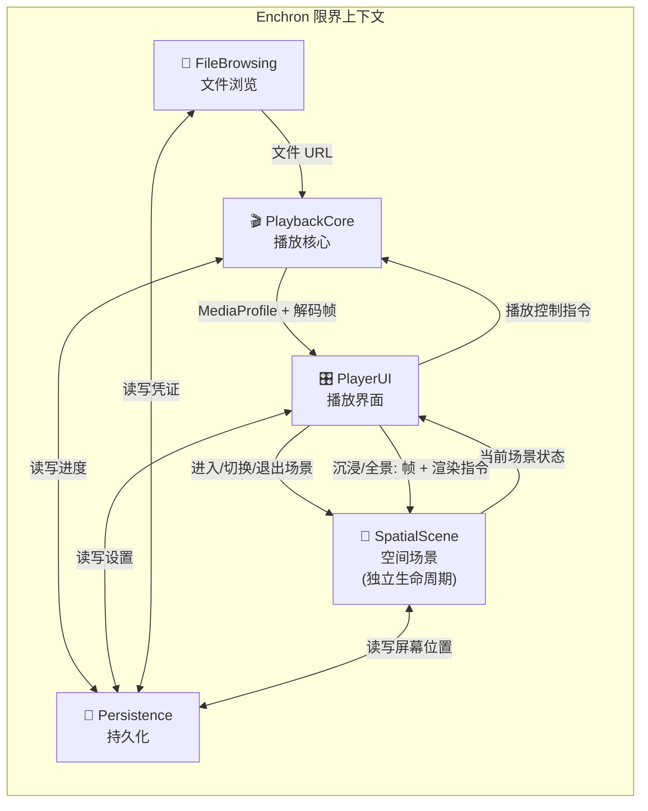
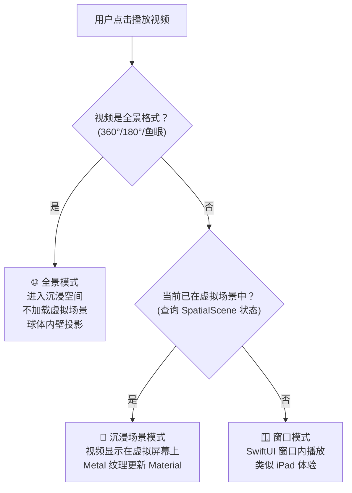

# Phase 2 产出：限界上下文与上下文映射

## 子域识别

### 核心域 — 产品竞争力所在，必须自主深耕

| 子域 | 说明 |
|---|---|
| **空间播放体验** | 三种播放模式（窗口/沉浸场景/全景）的切换与渲染、虚拟屏幕位置调节、视角旋转、3D/全景投影 |
| **自定义播放界面** | 二级进度条、手势解释层（200ms 消歧）、自定义控制浮层、播放模式展示 |

### 支撑子域 — 支撑核心体验，有一定业务定制

| 子域 | 说明 |
|---|---|
| **文件浏览与导航** | 多数据源文件浏览、排序过滤、文件夹导航 |
| **播放状态管理** | 播放进度记忆、恢复弹窗、用户偏好设置 |
| **网络文件访问** | SMB/WebDAV 连接管理、凭证存储、断连重连 |

### 通用子域 — 业界有标准解决方案，直接使用

| 子域 | 方案 |
|---|---|
| **视频解码** | MPV (libmpv) + VideoToolbox |
| **安全凭证存储** | Apple Keychain |
| **本地数据持久化** | SwiftData / UserDefaults |

---

## 限界上下文划分

基于子域分析和用户反馈，划分为五个限界上下文。

### 播放模式决策逻辑（由 PlayerUI 执行）

### 各上下文职责

#### 🎬 PlaybackCore 播放核心

- **职责**: 视频加载、解码、播放控制（播放/暂停/快进/倍速）、音轨/字幕轨切换、**MediaProfile 识别（投影类型 + HDR 类型）**
- **核心实体**: `PlaybackSession`, `MediaFile`, `AudioTrack`, `SubtitleTrack`, `MediaProfile`
- **对外暴露**: 播放状态变更事件、解码帧（`CVPixelBuffer`，由各渲染路径自行转换为 Metal 纹理）、MediaProfile 识别结果
- **内部依赖**: MPV (libmpv)、VideoToolbox（通过防腐层隔离）
- **边界说明**: 只负责"解码和输出帧"，不决定帧往哪里渲染——渲染路径决策由 PlayerUI 负责

#### 🎛️ PlayerUI 播放界面

- **职责**: 自定义 UI 组件（二级进度条、控制浮层）、手势解释层（200ms 消歧状态机）、**播放模式决策**
- **核心实体**: `GestureDisambiguator`, `PlaybackCommand`, `PlaybackMode`, `DetailedTimeline`
- **对外暴露**: 播放控制指令（发给 PlaybackCore）、渲染路径决策（根据场景状态 + 投影类型决定）
- **决策依据**: 1. 从 PlaybackCore 获取 MediaProfile 2. 向 SpatialScene 查询当前是否在虚拟场景中 3. 综合两者决定渲染路径
- **边界说明**: 手势消歧是此模块的内部子组件。窗口模式下 PlayerUI 自行在 SwiftUI 窗口内渲染视频帧；沉浸/全景模式下将帧数据和渲染指令发送给 SpatialScene

#### 📁 FileBrowsing 文件浏览

- **职责**: 数据源管理（本地/SMB/WebDAV）、文件夹导航、文件列表排序过滤（升序降序）
- **核心实体**: `DataSource`, `StorageConnection`, `MediaFolder`, `MediaFile`
- **对外暴露**: 用户选定文件的 URL
- **内部依赖**: AMSMB2、URLSession WebDAV（通过防腐层隔离）
- **边界说明**: `MediaFile` 在此上下文中只关注文件名、大小、修改时间等元信息

#### 🌌 SpatialScene 空间场景（独立生命周期）

- **职责**: 虚拟场景加载与切换（Reality Composer Pro 资源）、虚拟屏幕的空间定位（远近/高度/旋转）、**全景球体/半球体投影渲染**、接收 Metal 纹理并更新材质
- **核心实体**: `VirtualEnvironment`, `VirtualScreen`, `PanoramaSphere`, `ScreenPosition`, `ViewAngle`
- **对外暴露**: RealityKit 场景控制接口 + **当前场景状态（是否活跃）**
- **内部依赖**: RealityKit、Metal
- **生命周期说明**: 用户可以在不播放任何视频的情况下进入虚拟场景浏览。场景的打开/关闭完全独立于播放行为。PlayerUI 在播放时查询场景状态来决定渲染路径
- **多场景支持**: 每个虚拟场景具备独立的屏幕位置记忆

#### 💾 Persistence 持久化

- **职责**: 统一的数据存取服务，供其他四个模块调用
- **核心实体**: `PlaybackProgress`, `UserPreferences`, `StorageCredential`, `SavedScreenPosition`
- **对外暴露**: 简洁的存取接口（protocol 定义）
- **内部依赖**: SwiftData、UserDefaults、Keychain
- **边界说明**: Persistence 只是"笔记本"——播放进度由 PlaybackCore 产生、屏幕位置由 SpatialScene 产生、连接凭证由 FileBrowsing 产生

---

## 上下文映射关系

| 上游 | 下游 | 关系类型 | 数据交换 |
|---|---|---|---|
| FileBrowsing | PlaybackCore | 客户-供应商 | 文件 URL |
| PlaybackCore | PlayerUI | 发布-订阅 | MediaProfile + 解码帧 + 播放状态事件 |
| PlayerUI | PlaybackCore | 客户-供应商 | 播放控制指令 |
| PlayerUI | SpatialScene | 双向协作 | 场景进入/切换/退出 + 帧数据 + 渲染指令 |
| SpatialScene | PlayerUI | 状态查询 | 当前场景是否活跃（用于播放模式决策） |
| PlaybackCore | Persistence | 双向协作 | 读写播放进度 |
| PlayerUI | Persistence | 双向协作 | 读写用户设置 |
| FileBrowsing | Persistence | 双向协作 | 读写连接凭证 |
| SpatialScene | Persistence | 双向协作 | 读写每场景屏幕位置 |

### 防腐层与模块接口设计

#### 防腐层（隔离第三方库）

- **MPV 防腐层**: PlaybackCore 内封装 MPV 的 C API，对外只暴露 Swift protocol 接口
- **网络协议防腐层**: FileBrowsing 内封装 AMSMB2 和 WebDAV 的差异，对外通过统一的 `DataSource` protocol 暴露

#### 模块间接口（protocol 解耦）

所有模块之间通过 Swift protocol 通信，不直接依赖具体实现：

- `PlaybackControlling` — PlayerUI 调用 PlaybackCore 的接口
- `FrameOutput` — PlaybackCore 输出帧的接口
- `SceneRendering` — PlayerUI 指示 SpatialScene 渲染的接口
- `SceneStateProviding` — PlayerUI 查询 SpatialScene 当前状态的接口
- Persistence 模块暴露四个细粒度存取接口：`ProgressStoring` / `PreferencesStoring` / `CredentialStoring` / `ScreenPositionStoring`（详见 `phase3_interface_contracts.md`）

