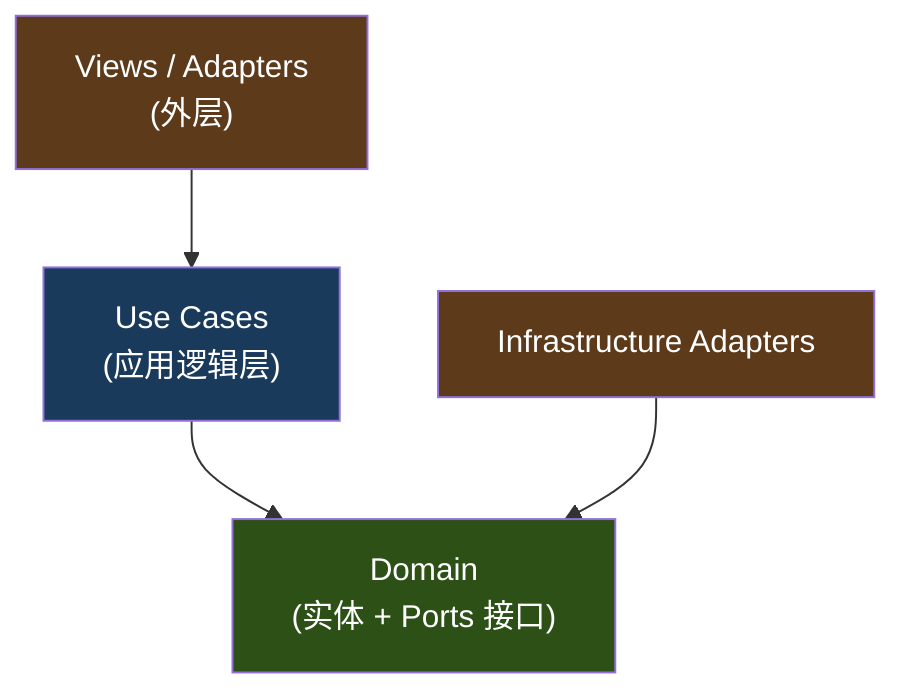

# Phase 3 产出：整洁架构代码结构

> 本文档定义 Endorphin Player 的 Swift 代码目录结构。遵循整洁架构原则：依赖关系向内指向，外层模块依赖内层接口，不反向依赖。

## 整洁架构分层概览

```
整体结构 = 5 个独立模块，每个模块内部分 3 层

┌─────────────┬─────────────┬─────────────┬─────────────┬─────────────┐
│ PlaybackCore│  PlayerUI   │ FileBrowsing│ SpatialScene│ Persistence │
│  🎬 播放核心│ 🎛️ 播放界面  │ 📁 文件浏览  │ 🌌 空间场景  │ 💾 持久化    │
├─────────────┴─────────────┴─────────────┴─────────────┴─────────────┤
│  每个模块内部的 3 层结构（从外到内）：                                  │
│                                                                      │
│  Adapters    封装第三方库（MPV、AMSMB2）和 UI 组件（SwiftUI Views）   │
│      ↓                                                               │
│  Use Cases   每个用户操作的完整流程（"点播放会发生什么"）               │
│      ↓                                                               │
│  Domain      纯业务概念 + 对外接口定义（protocol）                    │
│              不依赖任何库和框架，可以独立存在                           │
├──────────────────────────────────────────────────────────────────────┤
│  底层第三方库（被 Adapters 封装，不直接出现在业务代码中）              │
│  MPV (libmpv)  │ AMSMB2 │ SwiftData │ UserDefaults │ Keychain       │
└──────────────────────────────────────────────────────────────────────┘

关键规则：
  ① 模块之间通过 protocol 接口通信，互不知道对方内部实现
  ② 每个模块内部，Adapters/Views 依赖 Domain，反过来不行
  ③ App/ 目录负责在启动时把各模块组装在一起（依赖注入）
```

## 代码目录结构

```
EndorphinPlayer/
├── App/                                  # 应用外壳 —— 把各模块的界面组合在一起
│   ├── EndorphinPlayerApp.swift          # 应用入口，声明窗口和沉浸空间
│   ├── AppCoordinator.swift              # 启动时把各模块组装在一起（谁用谁的接口）
│   ├── MainView.swift                    # 主界面（左侧标签栏 + 右侧内容区）
│   │                                     #   标签栏包含：文件浏览 / 场景选择 / 设置
│   │                                     #   每个标签页的具体内容由对应模块提供
│   └── Navigation/
│       └── AppTabView.swift              # 标签栏定义（visionOS 左侧 Ornament）
│
├── PlaybackCore/                         # 🎬 播放核心 —— 负责视频解码和播放控制
│   ├── Domain/                           #    纯业务概念（不依赖任何库和框架）
│   │   ├── Entities/
│   │   │   ├── PlaybackSession.swift     # 一次"从打开视频到关闭"的完整播放过程
│   │   │   ├── MediaFile.swift           # 正在播放的视频文件（URL + 格式信息）
│   │   │   ├── AudioTrack.swift          # 视频里的一条音轨（比如中文配音/英文配音）
│   │   │   └── SubtitleTrack.swift       # 视频里的一条字幕轨
│   │   ├── ValueObjects/
│   │   │   ├── PlaybackState.swift       # 当前状态：正在播放/已暂停/缓冲中/已停止
│   │   │   ├── PlaybackSpeed.swift       # 当前播放倍速（0.25x ~ 5.0x）
│   │   │   ├── PlaybackPosition.swift    # 当前播放到了哪里（已播时间 + 总时长）
│   │   │   ├── MediaProfile.swift        # 视频的画面特征（投影 + HDR + 分辨率）
│   │   │   ├── ProjectionType.swift      # 投影类型：平面/左右3D/上下3D/360°/180°/鱼眼
│   │   │   └── HDRType.swift             # HDR 类型：SDR/HDR10/杜比视界/HLG
│   │   ├── Events/
│   │   │   └── PlaybackEvents.swift      # 播放过程中发出的通知（开始/暂停/结束/进度变化等）
│   │   └── Ports/                        #    对外接口定义（只定义"能做什么"，不写"怎么做"）
│   │       ├── PlaybackControlling.swift  # 播放控制接口（播放/暂停/快进/切音轨等）
│   │       ├── FrameOutput.swift          # 帧输出接口（每帧解码后通知外部渲染）
│   │       └── MediaProfileDetecting.swift# 视频特征识别结果的回调接口
│   ├── UseCases/                         #    业务流程编排（调用 Domain + Adapters 完成一个用户操作）
│   │   ├── StartPlaybackUseCase.swift    # "用户点击播放"这个动作的完整流程
│   │   ├── ControlPlaybackUseCase.swift  # "用户暂停/快进/调倍速"这些操作
│   │   └── SwitchTrackUseCase.swift      # "用户切换音轨或字幕轨"
│   └── Adapters/                         #    第三方库封装（防止外部 API 污染内部代码）
│       └── MPV/
│           ├── MPVPlayerAdapter.swift     # 用 Swift 包裹 MPV 的 C 语言 API
│           ├── MPVConfiguration.swift     # MPV 初始化配置（硬件解码、像素格式等）
│           └── VideoToolboxBridge.swift   # 从 VideoToolbox 拿到 CVPixelBuffer
│
├── PlayerUI/                             # 🎛️ 播放界面 —— 用户看到和操作的所有 UI + 播放模式决策
│   ├── Domain/
│   │   ├── ValueObjects/
│   │   │   ├── PlaybackMode.swift        # 三种播放模式：窗口/沉浸场景/全景
│   │   │   ├── PlaybackCommand.swift     # 手势翻译后的指令（如"暂停"、"倍速2x"）
│   │   │   ├── GestureType.swift         # 识别出的手势类型：单次捏合/双击/长按/拖拽
│   │   │   └── GesturePhase.swift        # 手势判断阶段：等待中/观察窗口中/已确认
│   │   └── Ports/
│   │       └── SceneStateQuerying.swift   # 查询"当前是否在虚拟场景中"的接口
│   ├── UseCases/
│   │   ├── DecidePlaybackModeUseCase.swift  # 根据视频类型+场景状态决定用哪种模式播放
│   │   └── DisambiguateGestureUseCase.swift # 200ms 内判断用户捏合意图
│   └── Views/
│       ├── PlayerControlsView.swift       # 播放/暂停/快进/倍速等标准控制按钮
│       ├── DetailedTimelineView.swift     # 二级进度条（可缩放的时间轴）
│       ├── PlaylistView.swift             # 选集列表（当前文件夹的视频列表）
│       ├── PlaybackModeSwitcher.swift     # 切换播放模式（窗口/沉浸场景/全景）的入口
│       ├── SceneSwitcherView.swift         # 播放中快速切换虚拟场景的浮层
│       ├── ScreenPositionControlView.swift# 虚拟屏幕远近距离/垂直高度调节滑块
│       ├── TrackSelectorView.swift        # 音轨和字幕轨选择面板
│       ├── WindowVideoView.swift          # 窗口模式下的视频画面（MTKView 嵌入 SwiftUI）
│       └── GestureDisambiguator.swift     # 200ms 手势消歧状态机
│
├── FileBrowsing/                         # 📁 文件浏览 —— 让用户找到想看的视频文件
│   ├── Domain/
│   │   ├── Entities/
│   │   │   ├── DataSource.swift          # 一个文件来源（本地磁盘/SMB 服务器/WebDAV 服务器）
│   │   │   ├── MediaFolder.swift         # 一个可以浏览的文件夹
│   │   │   └── MediaFile.swift           # 文件夹里的一个文件（文件名/大小/修改时间）
│   │   ├── ValueObjects/
│   │   │   ├── SourceType.swift          # 来源类型：本地/相册/SMB/WebDAV
│   │   │   ├── ConnectionInfo.swift      # 远程服务器连接信息（IP 地址/端口/用户名）
│   │   │   ├── SortCriteria.swift        # 排序方式：按名称/按时间/按大小（升序/降序）
│   │   │   └── FileFilter.swift          # 过滤规则：只显示可播放的格式
│   │   └── Ports/
│   │       ├── FileProviding.swift        # 获取文件列表和可播放 URL 的接口
│   │       └── DataSourceConnecting.swift # 连接远程服务器的统一接口（SMB/WebDAV 各自实现）
│   ├── UseCases/
│   │   ├── BrowseFolderUseCase.swift     # "用户打开一个文件夹查看内容"
│   │   ├── ConnectDataSourceUseCase.swift # "用户添加一个 SMB/WebDAV 服务器"
│   │   └── SortFilesUseCase.swift        # "用户切换文件排序方式"
│   ├── Adapters/
│   │   ├── SMB/
│   │   │   └── SMBDataSourceAdapter.swift # 用 Swift 包裹 AMSMB2 库
│   │   ├── WebDAV/
│   │   │   └── WebDAVDataSourceAdapter.swift # 用 URLSession 实现 WebDAV 协议
│   │   └── Local/
│   │       └── LocalDataSourceAdapter.swift  # 读取本地文件系统
│   └── Views/
│       ├── FileBrowserView.swift          # 文件浏览主界面
│       ├── FolderListView.swift           # 文件夹/文件列表
│       ├── DataSourceConfigView.swift     # 添加/编辑远程服务器连接的设置页
│       └── SortPickerView.swift           # 排序方式选择器
│
├── SpatialScene/                         # 🌌 空间场景 —— 管理 3D 虚拟环境和视频渲染
│   ├── Domain/
│   │   ├── Entities/
│   │   │   ├── VirtualEnvironment.swift   # 一个虚拟场景（比如"影院"或"太空"主题）
│   │   │   ├── VirtualScreen.swift        # 场景中的虚拟屏幕（一块悬浮的平面）
│   │   │   └── PanoramaSphere.swift       # 全景模式的球体（视频投射到内壁上）
│   │   ├── ValueObjects/
│   │   │   ├── ScreenPosition.swift       # 虚拟屏幕的远近距离和垂直高度
│   │   │   ├── ViewAngle.swift            # 虚拟屏幕的旋转角度（适配躺着看）
│   │   │   ├── ScreenSize.swift           # 虚拟屏幕尺寸
│   │   │   └── SceneActiveState.swift     # 当前有没有虚拟场景在运行（供 PlayerUI 查询）
│   │   ├── Events/
│   │   │   └── SceneEvents.swift          # 场景相关通知（进入/退出/切换/屏幕位置调整）
│   │   └── Ports/
│   │       ├── SceneRendering.swift        # 接收视频帧并渲染到虚拟屏幕/球体的接口
│   │       └── SceneStateProviding.swift   # 告诉外部"当前场景是否活跃"的接口
│   ├── UseCases/
│   │   ├── LoadEnvironmentUseCase.swift   # "用户选择并进入一个虚拟场景"
│   │   ├── AdjustScreenPositionUseCase.swift # "用户拖动滑块调整屏幕远近/高度"
│   │   └── SwitchEnvironmentUseCase.swift # "用户切换到另一个虚拟场景"
│   ├── Rendering/                         #    视频帧到 RealityKit 的渲染实现
│   │   ├── VideoTextureUpdater.swift      # CVPixelBuffer → MTLTexture → TextureResource
│   │   ├── VirtualScreenRenderer.swift    # 把纹理贴到虚拟屏幕的材质上
│   │   └── PanoramaRenderer.swift         # 把纹理贴到球体内壁上（全景投影）
│   ├── Views/                             #    非播放时的场景管理界面
│   │   ├── SceneSelectorView.swift        # 场景选择页（展示所有可用虚拟场景的列表/卡片）
│   │   └── ScenePreviewCard.swift         # 单个场景的预览卡片（缩略图 + 名称）
│   └── Scenes/
│       ├── ImmersiveSpaceView.swift        # RealityView 入口（沉浸空间的 SwiftUI 视图）
│       └── Resources/                      # Reality Composer Pro 导出的 3D 场景文件
│
├── Persistence/                          # 💾 持久化 —— 负责把数据存到设备上/从设备读出来
│   ├── Domain/
│   │   ├── Entities/
│   │   │   ├── PlaybackProgress.swift    # 一条播放进度记录（哪个文件看到了哪里）
│   │   │   ├── UserPreferences.swift     # 用户的全局设置（恢复策略、默认场景等）
│   │   │   └── SavedScreenPosition.swift # 某个场景记忆的屏幕位置
│   │   ├── ValueObjects/
│   │   │   ├── FileIdentifier.swift      # 文件唯一标识（用于匹配进度记录）
│   │   │   ├── ProgressPosition.swift    # 记录的播放位置（分:秒）
│   │   │   └── ResumePolicy.swift        # 恢复策略：每次询问/总是恢复/总是从头
│   │   └── Ports/
│   │       ├── ProgressStoring.swift       # 读写播放进度的接口
│   │       ├── PreferencesStoring.swift     # 读写用户设置的接口
│   │       ├── CredentialStoring.swift      # 安全读写密码凭证的接口（走 Keychain）
│   │       └── ScreenPositionStoring.swift  # 读写屏幕位置记忆的接口
│   └── Adapters/                          #    具体用什么技术来存数据
│       ├── SwiftDataStore.swift            # 用 SwiftData 存播放进度和屏幕位置
│       ├── UserDefaultsStore.swift         # 用 UserDefaults 存用户设置
│       └── KeychainStore.swift             # 用 Keychain 存密码
│
├── Settings/                             # ⚙️ 设置 —— 用户偏好和应用配置界面
│   └── Views/
│       ├── SettingsView.swift             # 设置主页面
│       ├── PlaybackSettingsView.swift     # 播放相关设置（恢复策略、默认倍速等）
│       ├── StorageSettingsView.swift      # 已添加的远程存储列表 + 管理
│       └── AboutView.swift               # 关于页面（版本信息等）
│
└── Shared/                               # 跨模块共享的工具（尽量少放东西在这里）
    ├── Extensions/
    │   └── CVPixelBuffer+MTLTexture.swift  # CVMetalTextureCache 零拷贝转换工具方法
    └── Constants/
        └── AppConstants.swift             # 全局常量
```

## 依赖规则

### 合法依赖方向



### 禁止的依赖

- ❌ Domain 层不得 import 任何 Adapter、View、第三方库
- ❌ PlaybackCore 不得直接 import SpatialScene 的具体类
- ❌ 模块间不得直接引用对方的 Domain 实体（通过接口传递）
- ❌ UseCase 不得直接创建 Adapter 实例（通过构造器注入）

### 依赖注入方式

```swift
// AppCoordinator 负责组装依赖
let mpvAdapter = MPVPlayerAdapter()          // 实现 PlaybackControlling
let smbAdapter = SMBDataSourceAdapter()      // 实现 DataSourceConnecting
let swiftDataStore = SwiftDataStore()        // 实现 ProgressStoring

let playbackUseCase = StartPlaybackUseCase(
    player: mpvAdapter,                       // 注入接口，不注入具体类
    progressStore: swiftDataStore
)
```

## 模块边界与 MediaFile 的多上下文存在

`MediaFile` 在不同上下文中是**不同的类**（同名但不同模块）：

| 上下文 | MediaFile 关心的属性 |
|---|---|
| FileBrowsing | 文件名、大小、修改时间、格式类型、URL |
| PlaybackCore | URL、格式信息、关联的音轨和字幕轨列表 |

它们之间通过**文件 URL**这个值传递，不共享同一个类实例。
