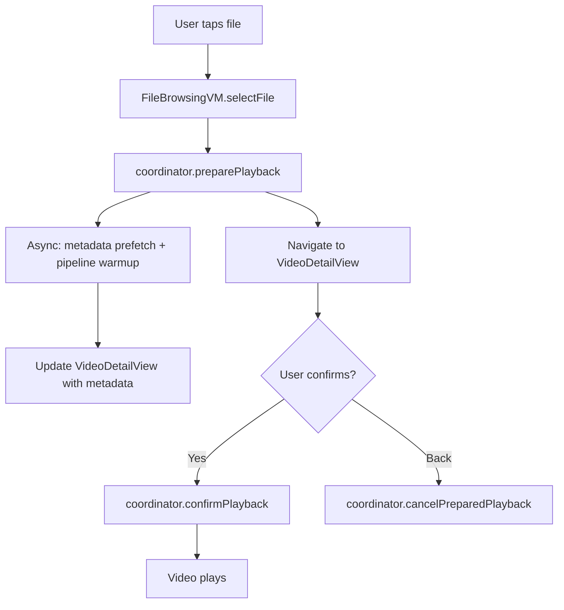

# Phase 1-3 — Test Resources, E2E QA & UI/UX Rewrite

## Overview

Enchron is a visionOS-native immersive video player. This plan covers three phases of work:
- **Phase 1**: Validate existing test videos and acquire panoramic test media
- **Phase 2**: End-to-end QA via Apple Vision Pro Simulator
- **Phase 3**: Complete UI/UX rewrite — Liquid Glass migration, video details page, progress bar simplification, and immersive space global entry

Phase 3 is the core deliverable, containing significant architectural changes (especially T3.2: video details page which modifies the playback launch flow).

## Problem Framing

The app's core playback pipeline is mature, but the user experience has several gaps:
- **No video details page**: Clicking a file immediately starts playback with no preview, metadata inspection, or track selection
- **Immersive space entry buried**: Users must navigate to the "Scenes" tab to toggle immersive space
- **Two-level progress bar is confusing**: Primary slider and DetailedTimelineView are mutually exclusive modes, requiring a toggle
- **UI doesn't use Liquid Glass**: The new visionOS design language is not adopted; current views use `.glassBackgroundEffect()` (visionOS 1.x)
- **No E2E QA baseline**: No systematic Simulator testing has been performed

## Requirements Traceability

- R1. 5 test video formats (SDR/HDR10/DV/180°/360°) validated and available
- R2. Apple Vision Pro Simulator E2E test pass — every button, every interaction path
- R3. All UI components use Liquid Glass design language
- R4. Video details page: click file → preheat pipeline + show details → confirm to play
- R5. Progress bar simplified: single unified timeline (no secondary toggle)
- R6. Immersive space configurable from app launch (global entry, not buried in Scenes tab)
- R7. Zero known P0/P1 regressions introduced

## Scope Boundaries

- **Not in scope**: Phase 4 (design doc gap analysis), new playback features, new data source types
- **Not in scope**: Complete Settings implementation beyond immersive space controls
- **Not in scope**: Real device testing (Simulator only for this plan)
- **Not in scope**: Performance optimization, HDR pipeline changes

## Context & Research

### Relevant Code and Patterns

**Playback Launch Flow** (current):
```
FileBrowsingViewModel.selectFile(file)
  → playbackRequest(for: file) → PlaybackLaunchRequest
  → onPlayFile(request) → PlaybackLaunchCoordinator.beginPlayback(request)
    → appModel.startPlayback(url:)
    → windowVideoViewModel.prepareForPlayback()
    → metadataService.prepareMetadata() (async prefetch)
    → windowVideoViewModel.play(url:) (after SwiftUI yield)
```

**Key files**:
- `XrPlayer/App/PlaybackLaunchCoordinator.swift` — launch gate, generation tracking, metadata prefetch
- `XrPlayer/AppModel.swift` — observable app state (playback, immersive space, controls)
- `XrPlayer/MainView.swift` — ZStack of AppTabView + always-mounted video surface + ornament controls
- `XrPlayer/App/Navigation/AppTabView.swift` — TabView with Files/Scenes/Settings tabs
- `XrPlayer/PlayerUI/Views/PlayerControlsView.swift` — primary slider + DetailedTimelineView toggle
- `XrPlayer/PlayerUI/Views/DetailedTimelineView.swift` — secondary timeline (to be merged)
- `XrPlayer/FileBrowsing/Views/FileBrowserView.swift` — NavigationStack file browser
- `XrPlayer/FileBrowsing/Views/FolderListView.swift` — file/folder list rendering
- `XrPlayer/SpatialScene/Views/SceneSelectorView.swift` — immersive space toggle
- `XrPlayer/ToggleImmersiveSpaceButton.swift` — open/dismiss immersive space
- `XrPlayer/XrPlayerApp.swift` — WindowGroup + ImmersiveSpace scenes

**Existing Liquid Glass usage** (6 locations, all visionOS 1.x `.glassBackgroundEffect()`):
- `PlaybackMenuView.swift:75`
- `DebugOverlayView.swift:71`
- `PlayerControlsView.swift:88`
- `ScreenPositionControlView.swift:33`
- `PlaylistView.swift:85`
- `MainView.swift:19`

**Architecture invariants that constrain this plan**:
- All playback must go through `PlaybackLaunchCoordinator` — no bypass
- Playback mode decision belongs to `PlayerUI`, not `PlaybackCore`
- Scene lifecycle is independent of playback
- System-native first — Liquid Glass migration should use system APIs, not custom effects

### External References

- Apple Liquid Glass design guidelines (visionOS 26)
- HelloWorld Apple visionOS sample project at `/Users/xiongzhipeng/Movies/HelloWorld` — reference for animations, layout, navigation patterns

## Key Technical Decisions

- **T3.2 Architecture**: Split `PlaybackLaunchCoordinator.beginPlayback()` into `preparePlayback()` (returns prepared state with metadata) and `confirmPlayback()` (starts actual playback). This preserves the single-coordinator invariant while adding the details page flow.
  - *Rationale*: The coordinator already has metadata prefetch infrastructure; we extend it rather than bypass it.

- **T3.3 Approach**: Inline DetailedTimelineView's precision features (scrubbing, time markers) into the primary slider section, then remove the toggle button and separate view.
  - *Rationale*: Product philosophy calls the progress bar a "core experience asset" — merging gives users precision without a mode switch.

- **T3.4 Approach**: Add `ToggleImmersiveSpaceButton` to `MainView`'s toolbar/ornament area (visible in both browsing and playback states), keeping SceneSelectorView in its tab for advanced scene selection.
  - *Rationale*: Quick toggle at app level satisfies "configurable from launch"; full scene selector stays for power users.

- **Liquid Glass**: Use `.liquidGlass()` modifier (visionOS 26 API). Where unavailable, use `.glassBackgroundEffect()` with enhanced materials as fallback.
  - *Rationale*: System-native first. Product philosophy explicitly prefers system containers and materials.

## Unresolved Questions

### Resolved During Planning

- **Q: Should video details be a sheet, fullscreen, or navigation push?** → Navigation push within FileBrowserView's NavigationStack. This keeps the browsing context and allows back navigation. The video surface remains mounted but hidden.
- **Q: When to start pipeline preheat?** → On file tap (same moment as navigating to details page). Metadata prefetch already starts in `preparePlayback()`.

### Deferred to Implementation

- **Exact Liquid Glass API surface** — `.liquidGlass()` vs `.glassBackgroundEffect(in:)` depends on visionOS 26 SDK availability. Agent should check at implementation time.
- **DetailedTimelineGeometry integration into primary slider** — exact gesture handling and layout math will be determined during implementation of Unit 5.
- **Panoramic test video URLs** — specific CC-licensed files to download will be identified during Phase 1 execution.

## High-Level Technical Design

> *This clarifies the intended approach, is directional guidance for review, not an implementation specification. Implementation agents should treat it as context, not code to reproduce.*

### T3.2 Video Details Page — Playback Launch Flow Change

```
Current:  selectFile → beginPlayback → [loading] → playing
Proposed: selectFile → preparePlayback → [preheat + metadata] → VideoDetailView → confirmPlayback → playing

PlaybackLaunchCoordinator:
  preparePlayback(request) → PreparedPlayback  (metadata, tracks, preheat handle)
  confirmPlayback(prepared)                     (uses existing beginPlayback internals)
  cancelPreparedPlayback(prepared)              (cleanup preheat)
```



### T3.3 Progress Bar Unification

```
Current:  sliderSection ←toggle→ DetailedTimelineView
Proposed: UnifiedTimelineView (always visible, combines slider + precision features)
          - Normal: standard slider with time labels
          - Drag/hover: reveals precision markers and scrubbing
          - No mode toggle needed
```

## Implementation Units

- [x] **Unit 1: Phase 1 — Test Video Validation & Acquisition**

**Goal:** Verify existing test videos work with mpv and acquire 180°/360° panoramic test videos.

**Requirements:** R1

**Dependencies:** None

**Files:**
- Verify: `/Users/xiongzhipeng/Movies/SDR-test.mkv`, `HDR10-test.MP4`, `dolby-vision-test.mp4`
- Create: `/Users/xiongzhipeng/Movies/180-test.*`, `/Users/xiongzhipeng/Movies/360-test.*`

**Approach:**
- Use `ffprobe` to verify existing video metadata and codec support
- Search for CC-licensed panoramic test videos (NASA, YouTube CC, Wikimedia)
- Download with `curl` or `wget`, verify with `ffprobe`
- Ensure all files < 100MB

**Test Expectation:** none — this is resource acquisition, not code change

**Verification:**
- `ffprobe` successfully reads all 5 video files
- Each file plays in mpv CLI without errors

---

- [x] **Unit 2: T3.4 — Immersive Space Global Entry**

**Goal:** Surface immersive space toggle at app level, accessible from any state without navigating to Scenes tab.

**Requirements:** R6

**Dependencies:** None

**Files:**
- Modify: `XrPlayer/MainView.swift`
- Modify: `XrPlayer/App/Navigation/AppTabView.swift`
- Modify: `XrPlayer/ToggleImmersiveSpaceButton.swift` (may need size/style variants)
- Test: `XrPlayerTests/` (structural test for toggle presence)

**Approach:**
- Add `ToggleImmersiveSpaceButton` to MainView's toolbar or as a persistent ornament visible in browsing state
- The button should be visible when NOT playing (browsing files) — during playback, the existing mode menu in PlayerControlsView handles this
- Keep SceneSelectorView in its tab for advanced scene configuration
- Respect `immersiveSpaceState` transitions (no double-open)

**Patterns to Follow:**
- Existing `ToggleImmersiveSpaceButton` implementation for open/dismiss logic
- `PlayerControlsView.switchPlaybackMode()` for transition state management

**Test Scenarios:**
- Normal path: tap toggle in browsing state → immersive space opens, tap again → closes
- Edge: toggle while in `.inTransition` state → button disabled, no double-open
- Integration: open immersive space from toolbar → navigate to Scenes tab → SceneSelectorView reflects open state

**Verification:**
- Immersive space toggle visible on main screen without tab navigation
- Toggle works correctly in browsing state
- No conflict with playback mode controls

---

- [x] **Unit 3: T3.2a — PlaybackLaunchCoordinator Prepare/Confirm Split**

**Goal:** Extend PlaybackLaunchCoordinator to support prepare-then-confirm flow for video details page.

**Requirements:** R4

**Dependencies:** None (can be done in parallel with Unit 2)

**Files:**
- Modify: `XrPlayer/App/PlaybackLaunchCoordinator.swift`
- Create: `XrPlayer/App/PreparedPlayback.swift` (prepared state value type)
- Modify: `XrPlayer/FileBrowsing/ViewModels/FileBrowsingViewModel.swift` (update selectFile flow)
- Test: `XrPlayerTests/PlaybackLaunchCoordinatorTests.swift`

**Approach:**
- Add `PreparedPlayback` struct holding: `PlaybackLaunchRequest`, resolved `PlaybackMediaMetadata?`, resolved track lists (`[AudioTrack]`, `[SubtitleTrack]`), preheat `Task`, generation stamp, error state
- Add `preparePlayback(_ request:) -> PreparedPlayback` — starts metadata prefetch AND mpv `loadfile` with `pause=yes` to enumerate tracks without starting playback. This is necessary because track information (audio/subtitle lists) requires mpv to actually parse the container.
- Add `confirmPlayback(_ prepared:)` — validates generation, resumes paused mpv (or calls play if warmup path differs)
- Add `cancelPreparedPlayback(_ prepared:)` — cancels preheat task, stops mpv preload, cleans up. Includes TTL auto-cancel (60s timeout) for abandoned preparations.
- Error handling: `PreparedPlayback` has optional `error: Error?` field. Remote file failures during prepare surface to VideoDetailView, not FileBrowserView.
- Existing `beginPlayback()` remains for direct-play callers (playlist, smoke test)
- `FileBrowsingViewModel.selectFile()` switches from `onPlayFile(request)` to `onPrepareFile(request)` callback

**Patterns to Follow:**
- Existing generation tracking pattern in `beginPlayback()`
- Existing `metadataTask` cancellation pattern

**Test Scenarios:**
- Normal path: prepare → metadata resolves → confirm → playback starts
- Normal path: prepare → cancel → no playback, resources cleaned up
- Edge: prepare A → prepare B before A confirms → A's generation invalidated
- Error path: prepare succeeds but confirm called after generation mismatch → no playback
- Integration: prepare triggers metadata prefetch → PreparedPlayback receives resolved metadata

**Verification:**
- `preparePlayback()` returns PreparedPlayback with metadata
- `confirmPlayback()` starts playback only when generation matches
- `cancelPreparedPlayback()` cleans up without side effects
- Existing `beginPlayback()` still works for direct-play callers

---

- [x] **Unit 4: T3.2b — Video Detail View**

**Goal:** Create VideoDetailView showing media metadata, track selection, and play confirmation.

**Requirements:** R4

**Dependencies:** Unit 3 (PreparedPlayback must exist)

**Files:**
- Create: `XrPlayer/PlayerUI/Views/VideoDetailView.swift`
- Modify: `XrPlayer/FileBrowsing/Views/FileBrowserView.swift` (navigation destination)
- Modify: `XrPlayer/FileBrowsing/ViewModels/FileBrowsingViewModel.swift` (navigation state)
- Modify: `XrPlayer/MainView.swift` (may need to handle detail→playback transition)
- Test: `XrPlayerTests/VideoDetailViewTests.swift`

**Approach:**
- `VideoDetailView` receives `PreparedPlayback` binding and displays:
  - File name, resolution, codec, HDR type, duration, file size (from `PlaybackMediaMetadata`)
  - Available subtitle tracks (from metadata when resolved)
  - Available audio tracks (from metadata when resolved)
  - Playback mode selector (window/immersive/panorama)
  - "Play" button → calls `coordinator.confirmPlayback(prepared)`
- Navigation: `FileBrowserView` pushes `VideoDetailView` onto its NavigationStack
- Loading state: show spinner while metadata resolves, progressive reveal as data arrives
- Back navigation: calls `coordinator.cancelPreparedPlayback(prepared)`

**Patterns to Follow:**
- `PlayerControlsView.infoMenu` for media info display format
- `PlaybackInfoFormatter` for formatting resolution, HDR type, file size
- `PlayerControlsView.playbackModeMenu` for mode selector pattern

**Test Scenarios:**
- Normal path: navigate to detail → metadata loads → shows resolution, HDR type, tracks → tap Play → playback starts
- Normal path: navigate to detail → tap Back → preparation cancelled, no playback
- Edge: metadata still loading → shows spinner, Play button disabled until metadata arrives
- Edge: file with no subtitle tracks → subtitle section hidden
- Integration: select file in FileBrowserView → navigates to VideoDetailView → confirm → video surface becomes visible in MainView

**Verification:**
- VideoDetailView correctly displays all available metadata fields
- Play button starts playback through coordinator
- Back navigation cancels preparation without side effects
- Pipeline preheat runs concurrently with detail view display

---

- [x] **Unit 5: T3.3 — Progress Bar Unification**

**Goal:** Merge DetailedTimelineView functionality into the primary slider, eliminating the two-level toggle.

**Requirements:** R5

**Dependencies:** None (independent of Units 2-4)

**Files:**
- Modify: `XrPlayer/PlayerUI/Views/PlayerControlsView.swift` (remove toggle, inline precision features)
- Modify or remove: `XrPlayer/PlayerUI/Views/DetailedTimelineView.swift`
- Modify: `XrPlayer/PlayerUI/UseCases/DetailedTimelineGeometry.swift` (adapt for inline use)
- Test: `XrPlayerTests/PlayerUI/` (timeline behavior tests)

**Approach:**
- Replace the `showDetailedTimeline` toggle pattern with a unified timeline that always shows
- Integrate DetailedTimelineView's precision scrubbing (fixed center pointer + time band drag model) directly into sliderSection
- Remove the waveform toggle button from secondaryControlRow
- Remove the `pausedForTimeline` state — unified timeline doesn't pause playback on reveal
- Width adjustment: the controls view currently expands from 720→860 for detailed timeline; unified view should use a consistent width
- Preserve the DetailedTimelineGeometry calculations for precision positioning

**Patterns to Follow:**
- Current `sliderSection` layout for time labels + slider
- Current `DetailedTimelineView` for precision scrubbing behavior
- Product philosophy: "core experience asset" — must be fast to enter, precise, and not confusing

**Test Scenarios:**
- Normal path: slider visible by default with precision markers → drag to seek → position updates
- Normal path: precision scrubbing gesture → fine-grained seek with time band visualization
- Edge: very short video (< 10s) → timeline scales appropriately
- Edge: very long video (> 3h) → precision markers remain useful
- Error path: seek during buffering → slider shows buffering state, doesn't snap back

**Verification:**
- Single unified timeline replaces two-mode toggle
- Precision scrubbing works inline without mode switch
- No regression in basic seek behavior
- PlayerControlsView width is consistent (no expand/collapse)

---

- [x] **Unit 6: T3.1a — FileBrowsing Liquid Glass Redesign**

**Goal:** Redesign FileBrowsing UI with Liquid Glass components for a premium browsing experience.

**Requirements:** R3

**Dependencies:** Unit 4 (VideoDetailView navigation integration)

**Files:**
- Modify: `XrPlayer/FileBrowsing/Views/FileBrowserView.swift`
- Modify: `XrPlayer/FileBrowsing/Views/FolderListView.swift`
- Modify: `XrPlayer/FileBrowsing/Views/DataSourceConfigView.swift`
- Test: `XrPlayerTests/FileBrowsing/` (structural/snapshot tests)

**Approach:**
- Replace standard `NavigationStack` styling with Liquid Glass materials
- Redesign data source chips (currently `Color.secondary.opacity(0.2)` capsules) with glass material
- Redesign file list items with glass cards, proper spacing, and hover effects
- Add file thumbnails or format icons for visual differentiation
- Improve connection status bar (currently `.secondary.opacity(0.1)` background)
- Reference HelloWorld project for visionOS-native layout patterns
- Use `/design-consultation` skill for design decisions, `/frontend-design` for implementation

**Patterns to Follow:**
- HelloWorld project UI patterns
- Apple Human Interface Guidelines for visionOS
- Existing `.glassBackgroundEffect()` usage (upgrade to Liquid Glass)

**Test Scenarios:**
- Normal path: file browser renders with glass materials → files and folders visible with clear hierarchy
- Normal path: hover over file item → glass highlight effect visible
- Edge: empty folder → empty state with glass background, not bare
- Integration: connect to SMB → connection bar updates with glass styling → file list populates

**Verification:**
- All FileBrowsing views use Liquid Glass materials
- Visual hierarchy is clear (folders vs files, connected vs disconnected)
- No functional regression in file browsing or data source connection

---

- [x] **Unit 7: T3.1b — PlayerUI & App-Level Liquid Glass Migration**

**Goal:** Migrate remaining UI components to Liquid Glass — player controls, settings, menus, overlays.

**Requirements:** R3

**Dependencies:** Unit 5 (unified timeline should be finalized first), Unit 6 (pattern established)

**Files:**
- Modify: `XrPlayer/PlayerUI/Views/PlayerControlsView.swift`
- Modify: `XrPlayer/PlayerUI/Views/PlaybackMenuView.swift`
- Modify: `XrPlayer/PlayerUI/Views/DebugOverlayView.swift`
- Modify: `XrPlayer/PlayerUI/Views/PlaylistView.swift`
- Modify: `XrPlayer/PlayerUI/Views/ScreenPositionControlView.swift`
- Modify: `XrPlayer/Settings/SettingsView.swift`
- Modify: `XrPlayer/MainView.swift`
- Modify: `XrPlayer/SpatialScene/Views/SceneSelectorView.swift`
- Test: `XrPlayerTests/` (visual regression, structural)

**Approach:**
- Replace all 6 existing `.glassBackgroundEffect()` calls with Liquid Glass equivalents
- Ensure PlayerControlsView ornament uses Liquid Glass with proper layering
- Settings view: flesh out from empty shell with Liquid Glass cards for each settings category
- SceneSelectorView: enhance with Liquid Glass scene cards
- Maintain consistency with Unit 6's FileBrowsing redesign
- Use design skills for all UI decisions

**Patterns to Follow:**
- Unit 6 Liquid Glass patterns (established during FileBrowsing redesign)
- `PlayerControlSurfaceStyle` for control button styling (may need Liquid Glass variant)

**Test Scenarios:**
- Normal path: player controls render with Liquid Glass → all buttons interactive
- Normal path: playback menu opens with glass overlay → track selection works
- Normal path: settings view shows categories with glass cards
- Edge: controls in both window and immersive modes → Liquid Glass adapts to context
- Integration: full flow — browse files (glass) → detail view (glass) → play → controls (glass) → settings (glass)

**Verification:**
- All UI components use Liquid Glass
- Visual consistency across all views
- No functional regressions in any control or setting

---

- [x] **Unit 8: Phase 2 — E2E QA Testing** (agent-level: build + 205 tests pass + structural QA 6/6; simulator QA pending human)

**Goal:** Systematic end-to-end testing of the complete app in Apple Vision Pro Simulator.

**Requirements:** R2, R7

**Dependencies:** Units 2-7 (all UI changes should be complete)

**Files:**
- All source files (testing, not modifying)
- Create: test results documentation

**Approach:**
- Use `/qa` skill for systematic Simulator testing
- Test matrix:
  - File browsing: local, SMB, WebDAV
  - Video playback: SDR, HDR10, Dolby Vision, 180°, 360°
  - Controls: play/pause, seek, speed, tracks, mode switch
  - New features: video details page flow, unified timeline, immersive space toggle
  - Navigation: tab switching, back navigation, state persistence
- Fix any discovered issues inline (loop: test → fix → retest)

**Execution Notes:** This unit will likely produce sub-tasks for bug fixes discovered during QA.

**Test Scenarios:**
- Full interaction path coverage as defined in TODOS.md T2.1
- Regression items from REGRESSION.md

**Verification:**
- All interaction paths tested without crash or hang
- All 5 video formats play correctly
- All new UI features (details page, unified timeline, immersive toggle) work as designed
- Zero P0/P1 regressions

## System-Wide Impact

- **PlaybackLaunchCoordinator change**: Adding `preparePlayback`/`confirmPlayback` affects the primary launch flow. All existing callers (FileBrowsingViewModel, PlaylistView, smoke test) must continue working through `beginPlayback()`.
- **Navigation change**: FileBrowserView gets a new navigation destination (VideoDetailView). This changes the browsing UX — users can no longer accidentally start playback by tapping.
- **Progress bar change**: Removing the toggle changes the controls layout and interaction model. Users familiar with the current two-mode system will need to adapt.
- **Immersive space toggle**: Adding a global toggle means immersive space state management must handle more entry points. The `immersiveSpaceState` in AppModel already tracks transitions, which mitigates double-open risk.

## Risk & Dependencies

| Risk | Mitigation |
|------|------------|
| Liquid Glass API may not be available in current SDK | Fall back to enhanced `.glassBackgroundEffect()` with system materials; document which views need future migration |
| Video details page adds latency to playback start | Pipeline preheat runs concurrently with detail view — actual play start should be faster than current cold start |
| Progress bar merge may lose precision features | Carefully port DetailedTimelineGeometry calculations; verify with long and short videos |
| Immersive space toggle in multiple locations may cause state conflicts | Centralize through AppModel.immersiveSpaceState; test concurrent toggle attempts |
| Breaking existing file selection UX | Keep `beginPlayback()` for direct-play callers (playlist); only FileBrowserView file selection goes through details page |

## Sources & References

- Architecture: `ARCHITECTURE.md`
- Interface contracts: `docs/design_docs/phase3_interface_contracts.md`
- Product philosophy: `docs/product_philosophy.md`
- Implementation roadmap: `docs/design_docs/phase4_implementation_roadmap.md`
- HelloWorld reference: `/Users/xiongzhipeng/Movies/HelloWorld`

## CEO Review Findings (2026-04-02)

### P1 Issues (Must Address Before Execution)

1. **Track 信息获取时机** — 音轨/字幕列表需要 mpv 实际加载文件才能获取（来自 `WindowVideoViewModel.availableAudioTracks`）。当前 `PlaybackMediaMetadataService.prepareMetadata()` 只获取 mediaProfile（分辨率、HDR），不含 track 列表。`preparePlayback` 必须执行 `mpv loadfile` + `pause=yes` 模式以获取 track 信息，否则 VideoDetailView 无法展示字幕/音轨选择。这需要在 Unit 3 方案中增加 mpv 预加载逻辑。

2. **Remote file prepare 错误路径** — 网络断开时 `preparePlayback` 的 `resolvePlayableURL` 会抛异常。当前 `selectFile` 在 FileBrowsingViewModel 中有 catch 并设 `lastErrorMessage`，但新流程需要将错误传播到 VideoDetailView（而非 FileBrowserView）。Unit 3 和 Unit 4 需要定义 `PreparedPlayback` 的错误状态和 UI 展示。

### P2 Issues (Address During Implementation)

3. **网络中断 prepare→confirm 间隙** — 用户在 VideoDetailView 已看到完整元数据，但点击 Play 时 SMB 连接已断。`confirmPlayback` 会尝试播放不可达 URL。缓解：依赖 mpv 自身错误处理 + 现有 `PlaybackError` 传播路径。

4. **Immersive toggle 附着点** — MainView 是 ZStack（非 NavigationStack），`.toolbar` 修饰符需附着在 AppTabView 内部或使用 `.safeAreaInset`。实现时需确认正确宿主。

5. **PreparedPlayback 生命周期泄漏** — 用户 prepare 后既不 confirm 也不 cancel（如 App 进入后台），preheat task 和 mpv 预加载需有超时或自动清理机制。建议在 `PreparedPlayback` 中加入 TTL（如 60s）超时自动 cancel。

### Strategic Assessment

- **方向**：正确。Phase 3 UX 重构是产品从"技术 demo"到"可用产品"的关键一步。
- **优先级**：T3.2（视频详情）影响最大，应优先。T3.4（沉浸入口）最低风险，可并行。
- **12 个月轨迹**：计划正确地不触碰沉浸场景核心架构，保持了向终极形态演进的空间。

## GSTACK REVIEW REPORT

| Review | Trigger | Why | Runs | Status | Findings |
|--------|---------|-----|------|--------|----------|
| CEO Review | `/plan-ceo-review` | Scope & strategy | 1 | DONE | mode: HOLD_SCOPE, 2 P1 + 3 P2 issues |
| Codex Review | `/codex:rescue` | Independent 2nd opinion | 0 | — | — |
| Eng Review | `/plan-eng-review` | Architecture & tests (required) | 1 | DONE | 2 P1 + 4 P2 issues, 8 test gaps, 0 critical failure gaps |
| Design Review | `/plan-design-review` | UI/UX gaps | 0 | — | — |

**VERDICT:** CEO + ENG CLEARED — ready to implement. Design review optional (recommended for UI-heavy Units 4, 6, 7).
