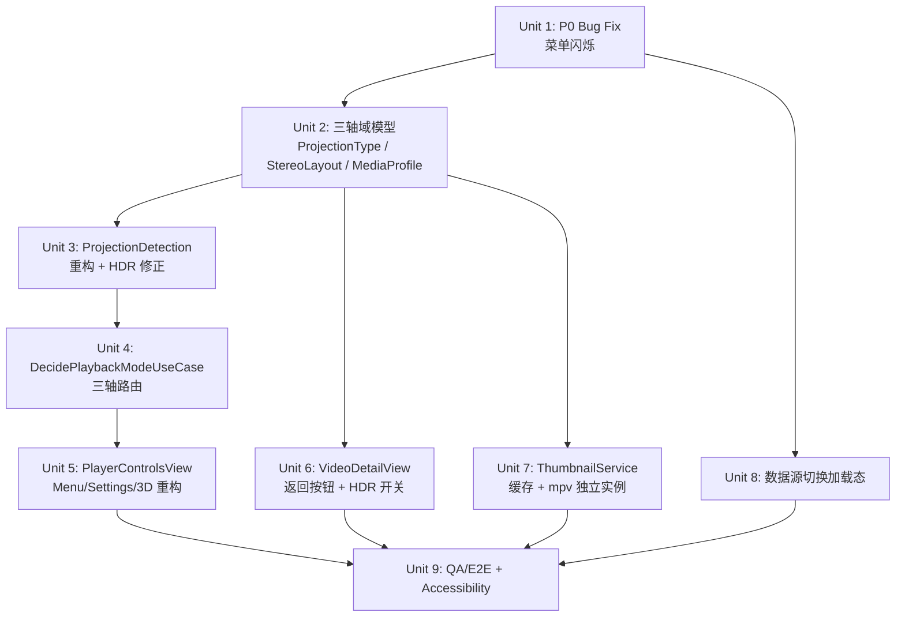

# feat: Enchron V2 — 三轴域模型重构 + UI 对齐 + 缩略图 + QA

## 概述

本计划覆盖 Enchron V2 的完整实施范围：修复 P0 菜单闪烁 Bug、重构 PlaybackCore 域模型为三轴正交模型（ProjectionType × StereoLayout × PlaybackMode）、对齐 player.html 和 variant-AB-combined.html 设计稿、实现缩略图加载和数据源切换加载态、最终 QA/E2E 验收。

执行顺序：P0 Bug 修复 → 域模型重构 → UI 对齐 → 功能实现 → QA

## 问题框架

当前 `ProjectionType` 枚举混淆了投影几何和立体布局，导致 flat+stereo 内容路由错误、三级菜单无法正确显示 3D 开关、`DecidePlaybackModeUseCase` 无法感知立体布局。UI 层存在菜单闪烁 P0 Bug、缩略图缺失、数据源切换无加载态等问题。设计稿（player.html、variant-AB-combined.html）已提供权威视觉规范。

(see origin: docs/brainstorms/2026-04-06-v2-comprehensive-requirements.md)

## 需求追踪

- R1. P0 Bug：播放中二级/三级菜单闪烁且不可交互 — 必须在所有其他工作前修复
- R2. 三轴域模型：`ProjectionType`（纯几何）× `StereoLayout`（立体布局）× `PlaybackMode`（呈现位置）正交分离
- R3. `MediaProfile` 新增 `stereoLayout` 和 `hasCoverArt` 字段
- R4. `ProjectionDetection` 适配三轴检测，清理 mpv 死代码字符串匹配
- R5. HDR 检测修正：移除无效的 `video-params/hdr-format`，改用 `video-params/gamma`
- R6. `DecidePlaybackModeUseCase` 感知 StereoLayout：flat+stereo → `.immersive` 自动路由
- R7. 约束矩阵：flat 禁止 Panorama（3 种非法），用户手动切换时 UI 灰色禁用
- R8. 播放控件 UI 严格对齐 player.html：Menu 向上展开、Settings 向上展开、HDR 动态标签、3D 开关
- R9. VideoDetailView：补返回按钮 + HDR 开关 + 沉浸模式选择
- R10. 视频卡片缩略图：ThumbnailService（NSCache + 磁盘两级缓存）+ mpv 独立实例
- R11. 数据源切换立即跳转 + skeleton shimmer 加载态
- R12. QA/E2E：所有可交互元素 accessibilityIdentifier + accessibilityLabel，Standard 档位验收

## 范围边界

- 不实现真正双眼立体渲染（RealityKit 立体 API，属 P3 超出 MVP）
- fisheye + stereo 两阶段管线（裁切+remap）初期降格为 mono，不实现（P2）
- Apple MV-HEVC 路径仅识别（路由到 AVFoundation 占位），本次不全量实现播放
- 不改动 SpatialScene 内部渲染管线（仅更新枚举引用）
- 不实现播放列表功能扩展
- AVFoundation 快速路径缩略图为可选优化，不作为主要验收项

## 上下文与调研

### 相关代码和模式

- `XrPlayer/PlaybackCore/Domain/ValueObjects/ProjectionType.swift` — 当前混合枚举，需拆分
- `XrPlayer/PlaybackCore/Domain/ValueObjects/StereoMode.swift` — 重命名为 `StereoLayout.swift`，保留 `leftEyeUVRect`/`rightEyeUVRect`/`outputDimensions`，新增 `.mono`
- `XrPlayer/PlaybackCore/Domain/ValueObjects/MediaProfile.swift` — 需新增 `stereoLayout`、`hasCoverArt`
- `XrPlayer/PlaybackCore/Adapters/MPV/ProjectionDetection.swift` — 需修正 stereo 字符串匹配 + 返回 `(ProjectionType, StereoLayout)` 元组
- `XrPlayer/PlayerUI/UseCases/DecidePlaybackModeUseCase.swift` — 需扩展感知 StereoLayout
- `XrPlayer/PlayerUI/Views/PlayerControlsView.swift` — Menu/Settings 重构，新增 HDR 动态标签 + 3D 开关
- `XrPlayer/PlayerUI/Views/VideoDetailView.swift` — 补返回按钮 + HDR 开关
- `XrPlayer/FileBrowsing/Views/VideoCardView.swift` — 接入 ThumbnailService
- `XrPlayer/FileBrowsing/Views/ContentGridView.swift` — 骨架屏加载态
- `XrPlayer/FileBrowsing/ViewModels/FileBrowsingViewModel.swift` — 数据源切换立即跳转逻辑
- `XrPlayer/AppModel.swift` — 新增 `stereoLayout`、`isStereoContent`、`isHDRContent` 属性

### 机构知识

- `PanoramaLayerBridge.stereoCropMode` 已正确实现 SBS/OU UV 裁切，重构后需将 `StereoMode` 改为 `StereoLayout`
- `ImmersiveSpaceView.stereoModeForCurrentProjection()` 是立体 UV 分割的调用点，需随枚举重命名更新
- `windowVideoViewModel.isHDRContent` 和 `setHDREnabled()` 已存在，Menu 层的 HDR Toggle 可直接复用
- mpv 属性 `video-params/hdr-format` 无效（调研已确认）；`video-params/gamma` 为正确 HDR 检测依据
- mpv `stereo-in` 短名称：`sbs2l`/`sbs2r`（SBS），`ab2l`/`ab2r`（TopBottom），其余均为 mono
- `NSCache` + `Library/Caches/thumbnails/` 两级缓存模式来自缩略图调研报告
- `PlaybackMediaMetadataStore: actor` 模式是现有的 actor 保护缓存先例

### 外部参考

- `docs/reference/2026-04-06-mpv-metadata-investigation.md` — mpv 属性完整值表、HDR 决策树、死代码清单
- `docs/reference/2026-04-06-thumbnail-extraction-investigation.md` — ThumbnailService 架构方案
- `docs/reference/2026-04-06-combination-matrix-investigation.md` — 36 种组合矩阵、3 种非法组合、自动路由逻辑

## 关键技术决策

- **StereoMode → StereoLayout 重命名**：保留现有 `leftEyeUVRect`/`rightEyeUVRect`/`outputDimensions` 计算属性，新增 `.mono` case，`mono.leftEyeUVRect` 返回全帧 `[0,0,1,1]`。避免引入新类型，降低渲染管线改动面。
- **ProjectionDetection 返回元组**：`detect(from:) -> (ProjectionType, StereoLayout)` 而非只返回 `ProjectionType`，调用处 `MPVPlayerAdapter` 需同步更新，`AppModel.updateDetectedProjection` 改为接收两个参数。
- **fisheye + stereo 降格**：检测到 fisheye 时强制 `stereoLayout = .mono`（调研 §4.4 确认管线不支持此组合，P2 推迟）。
- **3D 开关位于 Settings 面板**（而非 Menu 面板）：与 player.html 设计稿一致，作为 Playback Mode 下方的独立一项。
- **HDR 标签动态规则**：Menu 面板 HDR 行仅在内容非 SDR 时显示，标签文字跟随 `hdrType`（Dolby Vision / HDR10 / HLG）。SDR 内容该行完全不渲染。
- **ThumbnailService 归属 FileBrowsing 上下文**：独立 mpv 实例不共享主播放器，遵守依赖方向约束。
- **数据源切换立即跳转**：`connectToDataSource()` 开头立即设置 `isLoading = true`，同步清空 `files`/`folders`，再异步连接。用户看到骨架屏而非停在旧内容。
- **P0 Bug 根因方向**：优先调查 `SwiftUI Menu` 在 visionOS 播放状态高频刷新下的 hit-testing 冲突，具体修复策略推迟到实施阶段发现后决定。

## 未解决问题

### 规划期间解决

- mpv `stereo-in` 死代码匹配（`side_by_side_left`、`over_under_*`、`top_bottom`）：调研已确认为死代码，实施时直接删除，改用精确匹配 `sbs2l`/`sbs2r`/`ab2l`/`ab2r`。
- `video-params/hdr-format` 无效属性：调研已确认，实施时移除该调用，改用 `gamma`-based 决策树。

### 推迟到实施

- P0 Bug 精确根因：需要在真机上附加调试器观察 SwiftUI 渲染循环与 Menu 状态的冲突点，无法在计划阶段预判具体修复位置（可能是 `AppModel` observable 属性高频刷新、可能是 ornament z-order 问题）。
- `ThumbnailMPVAdapter` 多实例内存开销：需真机实测 3-4 个并发 mpv 实例在 visionOS sandbox 下的稳定性。
- SMB 缩略图 seek 延迟：需实测百兆局域网下的延迟，确定并发限制（调研建议 1-2 个）。
- `AVFoundation` 快速路径缩略图（MP4/MOV 本地文件）：可选优化，实施时根据主路径完成情况决定是否实施。

## 高层技术设计

> *这阐明了预期方案，是供审查的方向性指导，而非实现规范。实现代理应将其视为上下文，而非需要重现的代码。*

### 三轴域模型数据流

```
mpv video-params/stereo-in
    └─→ ProjectionDetection.detect() → (ProjectionType, StereoLayout)
              └─→ AppModel.updateDetectedProjection(projection, stereo)
                      ├─→ appModel.detectedProjectionType
                      ├─→ appModel.detectedStereoLayout
                      └─→ autoRoutePlaybackMode()
                              └─→ DecidePlaybackModeUseCase.decideMode(
                                      profile: MediaProfile(projectionType, stereoLayout, ...),
                                      isEnvironmentActive,
                                      manualOverride
                                  )
                                  → PlaybackMode
```

### PlaybackMode 约束矩阵（决策视图）

| ProjectionType | Panorama 可用 | flat+mono 默认 | flat+stereo 默认 | panoramic 默认 |
|---|---|---|---|---|
| `.flat` | 禁止 | `.window` | `.immersive` | — |
| `.equirectangular180/360` | 开放 | — | — | `.panorama` |
| `.fisheye` | 开放 | — | — | `.panorama` |

### ThumbnailService 架构

```
ThumbnailService (actor, FileBrowsing context)
  ├── ThumbnailCache
  │     ├── NSCache<NSString, CGImage>   (热路径)
  │     └── Library/Caches/thumbnails/  (磁盘 JPEG，冷路径)
  └── ThumbnailMPVAdapter (独立 mpv 实例)
        ├── vo=libmpv, pause=yes, cache=no
        ├── Phase A: seek 10% → offscreen render → CGImage
        └── Phase B: track-list/N/image → screenshot-to-file → CGImage（封面优先）
```

## 实施单元



---

- [ ] **Unit 1: P0 菜单闪烁与不可交互 Bug 修复**

**目标：** 消除播放状态下二级/三级菜单持续闪烁和 hit-testing 失效的 P0 Bug。暂停后恢复正常说明根因与播放刷新循环耦合。

**需求：** R1

**依赖：** 无

**文件：**
- 调查：`XrPlayer/PlayerUI/Views/PlayerControlsView.swift`
- 调查：`XrPlayer/AppModel.swift`（observable 高频属性）
- 调查：`XrPlayer/MainView.swift`（ornament z-order）
- 可能修改：`XrPlayer/PlayerUI/Views/PlayerControlsView.swift`
- 可能修改：`XrPlayer/AppModel.swift`
- 可能修改：`XrPlayer/WindowVideoViewModel.swift`

**方案（根因已定位）：**

根因已通过代码审查确认：`WindowVideoViewModel.startStatusTask()`（`WindowVideoViewModel.swift:78-89`）每 200ms 在 `@MainActor` 上调用 `updateStatus()`，该方法同时写 `playbackPosition` 和 `playbackState`。由于 `WindowVideoViewModel` 是 `@Observable`，这两个属性的任何变化都会通知所有依赖该对象的 SwiftUI View。`PlayerControlsView` 依赖 `videoViewModel.playbackPosition`（显示时间标签），因此每 200ms 被强制重新评估整个 body，包括 `leftMenu` 和 `rightMenu`。SwiftUI `Menu` 在 body 重新评估时会关闭已展开的弹出层，导致菜单闪烁/无法交互。暂停后停止轮询（`updateStatus` 不再写 `playbackState = .playing`），所以暂停后恢复正常。

**修复方向（按优先级）：**

- **方案 A（推荐，隔离高频属性）**：将 `playbackPosition` 的读取从 `PlayerControlsView` 主体迁移到独立子 View（`SeekBarView`），使用 `@Bindable` 或拆分为 `SeekBarViewModel`。菜单组件 (`leftMenu`/`rightMenu`) 不再依赖 `videoViewModel.playbackPosition`，SwiftUI diff 不会因时间更新而重建菜单
- **方案 B（降低轮询影响）**：在 `updateStatus()` 中对 `playbackPosition` 使用 `withTransaction(.disablesAnimations: true)` 并添加 `withAnimation(nil)` 隔离，减少 SwiftUI 重算范围；效果不如方案 A 彻底但改动小
- 不选：增加轮询间隔（体验退化）；不选：关闭 `@Observable` 整体（破坏架构）

优先实施方案 A：抽取 `SeekBarView` 作为独立 View，其 `body` 内仅依赖 `videoViewModel.playbackPosition`，菜单 View 不再触发此依赖链。

**要遵循的模式：**
- SwiftUI `@Observable` 属性隔离：将高频更新属性下沉到只读取该属性的子 View（参考 SwiftUI 性能指南）
- 现有 `simultaneousGesture` 用法：`PlayerControlsView.swift:48-54`

**测试场景：**
- 正常路径：播放状态下点击 Menu 按钮，二级菜单展开，子菜单项可点击
- 正常路径：播放状态下点击 Settings 按钮，展开 Playback Mode / Environment 子菜单
- 边界情况：播放开始后立即点击 Menu（未等待 2s 自动隐藏），菜单正常出现
- 边界情况：暂停 → 播放 → 再次点击菜单，交互正常（回归原有暂停后恢复）
- 错误路径：快速连续点击 Menu 5 次，不出现闪烁或 UI 卡死

**验证：** 真机验证：播放状态下所有菜单层级可交互，无闪烁，帧率不受菜单展开影响

---

- [ ] **Unit 2: 三轴域模型 — ProjectionType 拆分 + StereoLayout 重命名 + MediaProfile 扩展**

**目标：** 将 `ProjectionType` 拆分为纯几何枚举，将 `StereoMode` 重命名为 `StereoLayout`（含 `.mono`），`MediaProfile` 新增 `stereoLayout`、`hasCoverArt` 字段。同步更新所有调用侧。

**需求：** R2, R3

**依赖：** Unit 1

**文件：**
- 修改：`XrPlayer/PlaybackCore/Domain/ValueObjects/ProjectionType.swift`
- 重命名/修改：`XrPlayer/PlaybackCore/Domain/ValueObjects/StereoMode.swift` → `StereoLayout.swift`
- 修改：`XrPlayer/PlaybackCore/Domain/ValueObjects/MediaProfile.swift`
- 修改：`XrPlayer/AppModel.swift`（新增 `detectedStereoLayout`、`isHDRContent` 计算属性）
- 修改：`XrPlayer/SpatialScene/**/*.swift`（`PanoramaLayerBridge`、`ImmersiveSpaceView`，更新枚举引用）
- 修改：`XrPlayer/PlayerUI/UseCases/DecidePlaybackModeUseCase.swift`（方法签名适配）
- 修改：任何 `import`/使用 `StereoMode`/`stereoscopicSBS`/`stereoscopicOU` 的调用侧
- 测试：`XrPlayerTests/PlaybackCore/Domain/ProjectionTypeTests.swift`（新建或更新）
- 测试：`XrPlayerTests/PlaybackCore/Domain/StereoLayoutTests.swift`（新建）
- 测试：`XrPlayerTests/PlaybackCore/Domain/MediaProfileTests.swift`（新建或更新）
- 更新：`REGRESSION.md`（新增域模型三轴回归项：ProjectionType 计算属性、StereoLayout UV 裁切、MediaProfile 构造）

**方案：**
- `ProjectionType` 新枚举值：`.flat` / `.equirectangular180` / `.equirectangular360` / `.fisheye`（移除 `stereoscopicSBS`、`stereoscopicOU`、`panorama360`、`panorama180`）
- 保留计算属性 `isPanoramic`、`requiresHemisphereMesh`（`equirectangular180`）、`requiresFisheyeRemap`（`fisheye`）；移除 `isStereo3D`
- `StereoLayout` 新增 `.mono`，`.mono.leftEyeUVRect` = `{0,0,1,1}`（全帧），`.mono.outputDimensions` = 原始尺寸不变
- `MediaProfile.init` 新增 `stereoLayout: StereoLayout = .mono`、`hasCoverArt: Bool = false`，保持向后兼容默认值
- `AppModel` 新增：`var detectedStereoLayout: PlaybackCoreDomain.StereoLayout = .mono`；`var isStereoContent: Bool { detectedStereoLayout != .mono }`
- 旧 `stereoscopicSBS`/`stereoscopicOU` 全局 Find & Replace → 找到后按新三轴语义分析替换

**技术设计：**

旧枚举到新三轴的映射（供重构参考，方向性）：
```
.flat               → .flat         + .mono
.stereoscopicSBS    → .flat         + .sideBySide
.stereoscopicOU     → .flat         + .topBottom
.panorama360        → .equirectangular360 + .mono（默认）
.panorama180        → .equirectangular180 + .mono（默认）
.fisheye            → .fisheye      + .mono（强制）
```

**要遵循的模式：**
- 现有 `StereoMode.leftEyeUVRect` 结构（`StereoMode.swift`）
- `MediaProfile.init` 的命名参数和默认值模式

**测试场景：**
- 正常路径：`ProjectionType.flat.isPanoramic` = false；`equirectangular360.isPanoramic` = true
- 正常路径：`StereoLayout.mono.leftEyeUVRect` = `{0,0,1,1}`；`.sideBySide.leftEyeUVRect` = `{0,0,0.5,1}`
- 正常路径：`MediaProfile(projectionType: .flat, stereoLayout: .sideBySide, ...)` 可正确构造
- 边界情况：`MediaProfile(projectionType: .fisheye, stereoLayout: .sideBySide, ...)` 可构造（路由层强制 mono，域对象本身不拒绝）
- 正常路径：旧调用侧（`SpatialScene` / `PlayerUI`）编译通过，不引入新的 forced unwrap

**验证：** 项目编译成功，所有 `StereoMode`/`stereoscopicSBS`/`stereoscopicOU`/`panorama360`/`panorama180` 引用已清除，单元测试通过

---

- [ ] **Unit 3: ProjectionDetection 重构 + HDR 检测修正**

**目标：** `ProjectionDetection.detect()` 返回 `(ProjectionType, StereoLayout)` 元组，修正 stereo 字符串匹配为精确 mpv 值，移除 `video-params/hdr-format` 无效调用，实现 `gamma`-based HDR 决策树。

**需求：** R4, R5

**依赖：** Unit 2

**文件：**
- 修改：`XrPlayer/PlaybackCore/Adapters/MPV/ProjectionDetection.swift`
- 修改：`XrPlayer/PlaybackCore/Adapters/MPV/MPVPlayerAdapter.swift`（读取 stereo-in 的调用处；HDR 检测逻辑）
- 测试：`XrPlayerTests/PlaybackCore/Adapters/ProjectionDetectionTests.swift`（新建或更新）

**方案：**
- `ProjectionDetectionInput` 无需变更（已有 `stereo3dIn`、`gSphericalSpherical`、`gSphericalProjectionType`、`horizontalFOVDegrees`、`aspectRatio`）
- `detect()` 返回类型改为 `(ProjectionType, StereoLayout)`
- Stereo 检测逻辑（精确匹配替代模糊匹配）：
  - `stereo == "sbs2l" || stereo == "sbs2r"` → `(.flat, .sideBySide)`（初始，投影类型后续可被球面检测覆盖）
  - `stereo == "ab2l" || stereo == "ab2r"` → `(.flat, .topBottom)`
  - 其他（含 `"mono"`, `""`, `"no"`）→ `stereoLayout = .mono`，继续检测 projectionType
- 删除死代码：`stereo == "side_by_side_left"`、`stereo.hasPrefix("ou")`、`stereo.contains("top_bottom")`、`stereo.contains("over_under")`
- 球面检测仍在 stereo 检测之后运行，若 GSpherical 元数据指示球面，projectionType 被覆盖为 `equirectangular*`/`fisheye`；fisheye 时强制 `stereoLayout = .mono`
- HDR 修正：`MPVPlayerAdapter` 中移除 `stringProperty("video-params/hdr-format")`；按调研 §5.3 决策树实现 `detectHDRType()` 私有方法：
  1. Dolby Vision：`track-list/N/dolby-vision-profile > 0`
  2. HLG：`gamma == "hlg" || "arib-std-b67"`
  3. HDR10+：`scene-max-r` 属性可用
  4. HDR10：`gamma == "pq" || "smpte2084"` 或 `max-luma > 0`
  5. 其他 → `.sdr`
- `MPVPlayerAdapter` 调用 `ProjectionDetection.detect()` 后，将元组结果分别赋给新 `MediaProfile.stereoLayout` 和 `MediaProfile.projectionType`

**要遵循的模式：**
- 现有 `ProjectionDetection.detect(from:)` 静态函数结构
- `MPVPlayerAdapter.detectHDRType()` 等私有方法命名风格

**测试场景：**
- 正常路径：`stereo3dIn = "sbs2l"` → `(.flat, .sideBySide)`
- 正常路径：`stereo3dIn = "ab2r"` → `(.flat, .topBottom)`
- 正常路径：`stereo3dIn = "mono"` + `gSphericalSpherical = "true"` → `(.equirectangular360, .mono)`
- 正常路径：`stereo3dIn = ""` + `gSphericalProjectionType = "fisheye"` → `(.fisheye, .mono)`（强制 mono）
- 边界情况：`stereo3dIn = "sbs2l"` + `gSphericalProjectionType = "equirectangular"` → `(.equirectangular360, .sideBySide)`（球面覆盖 flat，但保留 SBS）
- 边界情况：`stereo3dIn = "sbs2r"` + fisheye 检测 → `(.fisheye, .mono)`（fisheye 强制覆盖 stereo）
- 错误路径：`stereo3dIn = "side_by_side_left"` → 不触发 SBS（死代码已删除），返回 `(.flat, .mono)`
- 正常路径（HDR）：`gamma = "pq"` → `.hdr10`；`gamma = "hlg"` → `.hlg`
- 正常路径（HDR）：`gamma = "bt.1886"` → `.sdr`

**验证：** 所有旧 stereo 死代码测试用例覆盖率为 0，HDR 检测不再依赖 `hdr-format` 属性，单元测试通过

---

- [ ] **Unit 4: DecidePlaybackModeUseCase 三轴路由 + 约束矩阵**

**目标：** 扩展 `DecidePlaybackModeUseCase` 感知 `StereoLayout`：flat+stereo → `.immersive` 自动路由，flat+mono → `.window`，全景内容始终 → `.panorama`；更新 `allowedModes` 实现 flat 禁止 Panorama 的硬约束；更新 `AppModel.autoRoutePlaybackMode()` 传入新字段。

**需求：** R6, R7

**依赖：** Unit 2, Unit 3

**文件：**
- 修改：`XrPlayer/PlayerUI/UseCases/DecidePlaybackModeUseCase.swift`
- 修改：`XrPlayer/AppModel.swift`（`autoRoutePlaybackMode()`，传入 `stereoLayout`）
- 测试：`XrPlayerTests/PlayerUI/UseCases/DecidePlaybackModeUseCaseTests.swift`（新建或更新）
- 更新：`REGRESSION.md`（新增三轴路由约束矩阵回归项）

**方案：**
- `allowedModes(for:stereoLayout:)` 新重载（或修改现有签名）：
  - `projectionType.isPanoramic == true` → `[.window, .immersive, .panorama]`
  - 其他 → `[.window, .immersive]`（flat 永远不包含 `.panorama`）
- `decideMode(for:isEnvironmentActive:manualOverride:)` 新逻辑：
  ```
  if manualOverride 合法 → return manualOverride
  if projectionType.isPanoramic → return .panorama
  if stereoLayout != .mono (SBS/TopBottom) → return .immersive  // flat 3D 内容
  if isEnvironmentActive → return .immersive
  return .window
  ```
- `AppModel.autoRoutePlaybackMode()` 中构造 `routingProfile` 时传入 `detectedStereoLayout`（或 `projectionOverride` 后的 stereoLayout）

**要遵循的模式：**
- 现有 `DecidePlaybackModeUseCase.decideMode()` 结构（`DecidePlaybackModeUseCase.swift:19-41`）
- `AppModel.autoRoutePlaybackMode()`（`AppModel.swift:97-113`）

**测试场景：**
- 正常路径：`(.flat, .mono)` → `.window`（2D 普通视频默认窗口）
- 正常路径：`(.flat, .sideBySide)` → `.immersive`（3D 平面 SBS 自动沉浸大屏）
- 正常路径：`(.flat, .topBottom)` → `.immersive`（3D 平面 OU 自动沉浸大屏）
- 正常路径：`(.equirectangular360, .mono)` → `.panorama`
- 正常路径：`(.equirectangular180, .sideBySide)` → `.panorama`（全景优先）
- 边界情况：`manualOverride = .panorama` + `projectionType = .flat` → `.window`（non-conformant override 被拦截）
- 边界情况：`manualOverride = .immersive` + `projectionType = .equirectangular360` → `.immersive`（合法 override）
- 边界情况：`(.flat, .mono)` + `isEnvironmentActive = true` → `.immersive`（保留已有行为）
- 正常路径：`allowedModes(.flat)` 不包含 `.panorama`；`allowedModes(.equirectangular360)` 包含 `.panorama`

**验证：** 单元测试覆盖全部 12 种 `(ProjectionType, StereoLayout)` 组合的默认路由，约束矩阵 3 种 ILLEGAL 用例有测试守卫

---

- [ ] **Unit 5: PlayerControlsView 重构 — Menu/Settings/3D 对齐 player.html**

**目标：** 按 player.html 重构 `leftMenu` 和 `rightMenu`：HDR 动态标签行（只在 HDR 内容时显示，标签跟随 hdrType）、3D 开关项（Settings 面板内，mono 时禁用）、Playback Mode 不可用项灰色禁用（不过滤，直接渲染为 disabled）。

**需求：** R8

**依赖：** Unit 4

**文件：**
- 修改：`XrPlayer/PlayerUI/Views/PlayerControlsView.swift`
- 测试：`XrPlayerTests/PlayerUI/Views/PlayerControlsViewSnapshotTests.swift`（快照/结构验证，可选）

**方案：**

Left Menu（player.html §Menu 弹出面板）：
- 第一项 HDR 行：仅当 `appModel.mediaProfile?.hdrType != .sdr` 时显示；标签文字 = `hdrType.displayName`（新增）；Toggle 绑定 `videoViewModel.isHDROutputEnabled`
- 其余三项保持：Subtitles / Audio Track / Playback Speed（顺序不变）

Right Menu（player.html §Settings 弹出面板）：
- Section "Playback Mode"：遍历 `PlaybackMode.allCases`（全部显示，含不可用），`.disabled(!allowedModes.contains(mode))` 灰色禁用不合法项，当前激活项显示 checkmark
- 新增 Section "3D"：一个 `Picker`/`Menu` 展示 `Off / Side-by-Side / Top-Bottom`；当 `isStereoContent == false`（mono）时整行 `.disabled(true)`；绑定 `appModel.selectedStereoDisplay`（新增到 AppModel，表示用户 3D 覆盖选择）
- 保留：Section "Environment"（cinema environment）
- **明确决策：Projection Override、Playlist、Screen Position、Settings link 从 PlayerControlsView 移除**，但不删除代码：这些功能迁移到独立的 Settings window（`SettingsView`），通过 `AppModel.openWindow(.settings)` 触发；`PlayerControlsView` 的 `rightMenu` 底部保留一项 `Button("More Settings...")` 跳转入口（不在 player.html 中，但保留功能可达性）。这与 2026-04-05-arch.md ISSUE-5 结论一致：不能静默删除现有功能。

**技术设计：**

3D 开关状态机（方向性）：
```
stereoLayout == .mono → disabled（锁定 Off）
stereoLayout == .sideBySide → 可选 [Off, Side-by-Side*]（默认选中 SBS）
stereoLayout == .topBottom  → 可选 [Off, Top-Bottom*]（默认选中 TB）
切换为 Off → PanoramaLayerBridge.stereoCropMode = nil
切换为 SBS → PanoramaLayerBridge.stereoCropMode = .sideBySide
```

**要遵循的模式：**
- 现有 `leftMenu`/`rightMenu` SwiftUI Menu 结构（`PlayerControlsView.swift:231-363`）
- 现有 HDR toggle 代码（`PlayerControlsView.swift:234-241`）

**测试场景：**
- 正常路径：SDR 内容时，Menu 中无 HDR 行
- 正常路径：HDR10 内容时，Menu 中显示 "HDR10" 标签 + Toggle
- 正常路径：Dolby Vision 内容时，显示 "Dolby Vision" + Toggle
- 正常路径：flat 内容时，Settings 中 Panorama 项为灰色禁用
- 正常路径：equirectangular360 时，Settings 中全部三项 Playback Mode 均可点击
- 正常路径：mono 内容时，3D 开关整行禁用
- 正常路径：SBS 内容时，3D 开关默认选中 Side-by-Side，用户可切换为 Off
- 边界情况：快速切换 Playback Mode 两次，UI 不崩溃，状态一致

**验证：** 真机验证：Menu 和 Settings 结构与 player.html 截图对照一致，3D 开关和 HDR 开关在各内容类型下行为符合约束矩阵

---

- [ ] **Unit 6: VideoDetailView — 返回按钮 + HDR 开关 + 沉浸模式选择**

**目标：** 详情页顶部补返回按钮（点击 dismiss sheet），新增 HDR 开关，新增"以沉浸空间播放"选项。

**需求：** R9

**依赖：** Unit 2

**文件：**
- 修改：`XrPlayer/PlayerUI/Views/VideoDetailView.swift`
- 测试：结构验证：确认返回按钮、HDR 开关、沉浸模式三个 accessibilityIdentifier 存在

**方案：**
- 返回按钮：添加到 `NavigationStack` 的 `.toolbar`，`.navigationBarLeading` 位置；或在 `titleSection` 左侧添加 `Button("Back") { dismiss() }`，使用 `Image(systemName: "chevron.left")`
- HDR 开关：在 `readyContent` 的详情 section 中添加 `Toggle` 绑定 `hdrOutputEnabled` 状态，仅当 `prepared.profile.hdrType != .sdr` 时显示
- 沉浸模式选择：在播放按钮附近添加 Picker 或 SegmentedPicker 允许用户选择 Window / Immersive / Panorama（受约束矩阵限制，非法项 disabled）；所选模式通过 `PlaybackLaunchRequest` 或 `AppModel` 传递给播放启动器

**要遵循的模式：**
- 现有 `hdrOutputEnabled` 状态变量（`VideoDetailView.swift:20`）
- `NavigationStack` + `.navigationBarTitleDisplayMode(.inline)` 结构（`VideoDetailView.swift:25-45`）

**测试场景：**
- 正常路径：打开详情页，返回按钮可见并可点击，点击后 sheet dismiss
- 正常路径：SDR 视频，HDR 开关不显示
- 正常路径：HDR 视频（ready 状态），HDR 开关显示
- 正常路径：flat 内容，Panorama 选项 disabled
- 边界情况：preparing 状态（元数据未就绪），沉浸模式选择使用默认值，不崩溃

**验证：** 真机验证：返回按钮导航正确，HDR 开关与播放控件中的开关状态同步，沉浸模式预设在播放时生效

---

- [ ] **Unit 7: ThumbnailService — 缩略图加载与缓存**

**目标：** 实现 `ThumbnailService` actor（属 FileBrowsing 上下文），独立 `ThumbnailMPVAdapter`（Phase A 帧提取 + Phase B 封面提取），两级缓存（NSCache + 磁盘 JPEG），接入 `VideoCardView` 和 `VideoDetailView`。

**需求：** R10

**依赖：** Unit 2

**文件：**
- 新建：`XrPlayer/FileBrowsing/Services/ThumbnailService.swift`
- 新建：`XrPlayer/FileBrowsing/Services/ThumbnailMPVAdapter.swift`
- 新建：`XrPlayer/FileBrowsing/Services/ThumbnailCache.swift`
- 修改：`XrPlayer/FileBrowsing/Views/VideoCardView.swift`（接入异步缩略图加载）
- 修改：`XrPlayer/PlayerUI/Views/VideoDetailView.swift`（详情页封面显示）
- 修改：`XrPlayer/App/AppCoordinator.swift`（注入 ThumbnailService 到环境）
- 测试：`XrPlayerTests/FileBrowsing/Services/ThumbnailServiceTests.swift`（缓存逻辑）

**方案：**
- `ThumbnailService` 是 `actor`，提供 `func thumbnail(for file: MediaFile) async -> CGImage?`
- 查询顺序：NSCache 命中 → 磁盘命中（读 JPEG → 更新 NSCache）→ 未命中 → 生成
- 生成优先级：Phase B（`track-list/N/image == true`，内嵌封面）> Phase A（seek 10% 帧）
- Cache key：`CryptoKit.SHA256` 哈希（`import CryptoKit`，visionOS 原生支持）`SHA256.hash(data: Data((standardizedPath + String(modifiedAt.timeIntervalSince1970)).utf8))` 转 hex，取前 16 字节作为文件名
- `ThumbnailMPVAdapter`：`vo=libmpv`、`pause=yes`、`cache=no`、`demuxer-readahead-secs=0`；使用 `MPV_RENDER_PARAM_SW_*` offscreen render（复用 `MPVPlayerAdapter` 相同路径，但独立实例）
- **Security-scoped URL**：`ThumbnailMPVAdapter` 加载 URL 前须调用 `url.startAccessingSecurityScopedResource()`，完成后 `stopAccessingSecurityScopedResource()`，参照 `MPVPlayerAdapter.swift:1090` 现有模式
- 并发控制：本地文件最多 3 个并发；远程文件（SMB/WebDAV）1-2 个并发（实施时通过 `TaskGroup` + `AsyncSemaphore` 控制）
- `VideoCardView`：新增 `@State private var thumbnail: CGImage?`，`.task(id: file.id)` 启动异步加载，placeholder 保持现有设计图标
- 磁盘缓存目录：`FileManager.urls(for: .cachesDirectory).first/thumbnails/`

**要遵循的模式：**
- `PlaybackMediaMetadataStore: actor` 的 actor 缓存模式
- `MPVPlayerAdapter` offscreen render 路径（`MPVPlayerAdapter.swift:1005-1053`）

**测试场景：**
- 正常路径：相同 file 两次 `thumbnail(for:)` 调用，第二次命中 NSCache，不触发 mpv
- 正常路径：NSCache 清空后，命中磁盘缓存，读取 JPEG 返回
- 正常路径：无缓存时，生成缩略图后写入磁盘，再次调用命中磁盘
- 边界情况：`file.modifiedAt` 变化，缓存 key 改变，旧缓存不命中
- 边界情况：远程文件（SMB URL），并发限制 ≤ 2，不超限
- 错误路径：mpv 加载超时或文件损坏，返回 `nil`，`VideoCardView` 显示占位图标，不崩溃
- 集成场景：`VideoCardView` 在 LazyVGrid 中滚动，缩略图按需加载，已缓存的不重复提取

**验证：** 首页所有视频卡片显示缩略图（有内嵌封面时显示封面，无则显示帧截图）；播放详情页封面正确显示；二次进入页面无闪烁（命中缓存）

---

- [x] **Unit 8: 数据源切换立即跳转 + 骨架屏加载态**

**目标：** 切换 WebDAV/SMB 数据源时立即切换页面，显示 skeleton shimmer 加载态，加载完成后替换为实际内容。不再停留在旧数据源页面。

**需求：** R11

**依赖：** 无（`connectToDataSource()` 的状态清空逻辑不依赖域模型三轴变更，可独立执行）

**文件：**
- 修改：`XrPlayer/FileBrowsing/ViewModels/FileBrowsingViewModel.swift`（`connectToDataSource()` 开头立即清空+标记 loading）
- 修改：`XrPlayer/FileBrowsing/Views/ContentGridView.swift`（骨架屏 UI 状态）
- 新建（可选）：`XrPlayer/FileBrowsing/Views/SkeletonCardView.swift`（骨架占位卡片）
- 测试：`XrPlayerTests/FileBrowsing/ViewModels/FileBrowsingViewModelTests.swift`（状态机）

**方案：**
- `FileBrowsingViewModel.connectToDataSource()` 冒头改为：
  ```
  await MainActor.run {
      isLoading = true
      files = []
      folders = []
      currentRootDisplayName = ds.displayName  // 立即更新标题
  }
  // 之后再异步连接和加载
  ```
- `ContentGridView`：当 `isLoading == true` 时，渲染 skeleton grid（6 个占位卡，`redacted(reason: .placeholder)` 或自定义 shimmer）；当 `isLoading == false` 时渲染实际内容
- Skeleton shimmer：使用 `redacted(reason: .placeholder)` 配合 `animation(.easeInOut(duration: 1.0).repeatForever(autoreverses: true))` 的 opacity 动画（visionOS 原生可接受方案）

**要遵循的模式：**
- 现有 `ContentGridView` 的 `isLoading` 判断（`ContentGridView.swift:17-33`，已有 ProgressView）
- `FileBrowsingViewModel.useDefaultFolder()` 的 async 切换模式

**测试场景：**
- 正常路径：调用 `connectToDataSource()` → `isLoading = true`、`files = []`、`folders = []` 在连接动作开始前同步成立
- 正常路径：连接成功后 `isLoading = false`，`files` 被真实数据填充
- 正常路径：切换期间 UI 显示骨架屏（不显示旧数据源内容）
- 错误路径：连接失败，`isLoading = false`，`lastErrorMessage` 有值，UI 显示错误态
- 边界情况：快速连续切换两个数据源，最终显示最后一次切换的结果

**验证：** 真机验证：切换到 WebDAV/SMB 时，立即看到骨架屏，不停留在本地文件夹页面

---

- [ ] **Unit 9: QA/E2E + Accessibility 体系**

**目标：** 执行 `/qa`（Standard 档位）和 `/e2e`，确保所有可交互元素有 `accessibilityIdentifier` 和 `accessibilityLabel`，验证 UI 形式对齐，验证状态机约束。

**需求：** R12

**依赖：** Unit 5, Unit 6, Unit 7, Unit 8

**文件：**
- 修改：各 View 文件（按 QA 结果补 accessibilityIdentifier）
- 新增/更新：`REGRESSION.md`（新增本次所有回归项）

**方案：**
- Accessibility 清单（必须覆盖）：
  - `PlayerControlsView`：Menu 按钮、Play/Pause、Rewind、Forward、Settings 按钮各有 `accessibilityIdentifier` + `accessibilityLabel`
  - 所有 Menu 子项：HDR Toggle、Subtitles Menu、Audio Track Menu、Speed Menu、Playback Mode 各项、3D 开关
  - `VideoCardView`：已有 `accessibilityLabel`，补 `accessibilityIdentifier`
  - `VideoDetailView`：返回按钮、HDR Toggle、沉浸模式 Picker、Play 按钮
  - `ContentGridView`：骨架屏容器
- 状态机约束验证（对照 REGRESSION.md 索引）：
  - flat 内容 → Settings 中 Panorama 项为 disabled
  - equirectangular360 + SBS 内容 → 自动路由到 Panorama 模式、3D 开关默认开启
  - mono 内容 → 3D 开关 disabled
- 不使用 Simulator 截图测试（需真机或参考 `/e2e` skill 指引）

**执行说明：** 执行 `/qa Standard` 和 `/e2e`，按产出清单补 accessibilityIdentifier，再次运行验证通过。

**测试场景：**
- 正常路径：VoiceOver 读出所有按钮标签（`accessibilityLabel` 存在且语义正确）
- 正常路径：所有按钮 `accessibilityIdentifier` 可被 UI 测试框架定位
- 集成场景：全量 12 种 `(ProjectionType, StereoLayout)` 组合 → 验证 `allowedModes` 输出与约束矩阵一致
- 集成场景：切换数据源 → 立即看到骨架屏 → 加载完成显示内容（端到端流程）
- 集成场景：打开视频详情 → 点击播放 → 进入播放界面 → 菜单全程可交互（P0 回归）

**验证：** `/qa Standard` 产出无 P0/P1 问题；`REGRESSION.md` 新增至少以下回归项：P0 菜单交互、三轴路由约束矩阵、HDR 检测路径、缩略图加载、数据源切换加载态

---

## 系统范围影响

- **PanoramaLayerBridge**：`stereoCropMode` 属性类型从 `StereoMode?` 改为 `StereoLayout?`，`.mono` case 时 `stereoCropMode = nil`（全帧直通）
- **ImmersiveSpaceView**：`stereoModeForCurrentProjection()` 需更新为读取新 `StereoLayout`，映射到 `PanoramaLayerBridge.stereoCropMode`
- **PlaybackLaunchCoordinator**（`App/PlaybackLaunchCoordinator.swift:51-60`）：当前 `onMediaProfileResolved` 回调调用 `appModel.updateDetectedProjection(profile.projectionType)`，Unit 3 完成后需同步更新为 `appModel.updateDetectedProjection(profile.projectionType, profile.stereoLayout)`
- **AppCoordinator / 依赖注入链**：`ThumbnailService` actor 需在 `AppCoordinator` 中构造并作为环境对象注入 `FileBrowsingViewModel`；`FileBrowsingViewModel.init` 需新增 `thumbnailService: ThumbnailService` 参数（或通过 `@Environment` 注入到 View 层）。注入路径：`AppCoordinator → FileBrowsingViewModel → VideoCardView`
- **AppModel 新属性传播**：`detectedStereoLayout` 须在 `autoRoutePlaybackMode()` 中被正确读取；`isHDRContent` 计算属性供 `PlayerControlsView` Menu 层使用，避免在 Menu 中直接访问 `mediaProfile?.hdrType`（hdrType 变化不应触发菜单重建）
- **REGRESSION.md**：本次改动涉及 PlaybackCore Domain、PlayerUI UseCases、FileBrowsing Views，需要新增回归项覆盖三轴路由、HDR 检测、缩略图、菜单交互
- **不变的不变量**：`PlaybackLaunchCoordinator` 启动路径不变；`AppModel.projectionOverride` 手动覆盖机制保留；本次不引入 `stereoLayoutOverride`（超出 MVP，留作 P2）；`SpatialScene` 渲染管线的 UV 裁切逻辑不变，仅枚举类型引用更新

## 风险与依赖

| 风险 | 缓解措施 |
|------|----------|
| P0 Bug 根因已定位（WindowVideoViewModel 200ms 轮询触发 @Observable 传播），修复方向明确（SeekBarView 属性隔离）；若方案 A 实施后仍有残留问题，回退到方案 B | Unit 1 独立执行；若方案 A 未完全解决，单独记录剩余现象后继续 Unit 2 |
| `StereoMode → StereoLayout` 重命名引发 SpatialScene 渲染管线编译错误 | Unit 2 执行时全量编译验证；`PanoramaLayerBridge` 和 `ImmersiveSpaceView` 在文件清单内 |
| `ThumbnailMPVAdapter` 多实例内存超限 | 实施时先测试 1 个并发，稳定后扩展到 3；有崩溃则回退到 1 并发 + 磁盘缓存路径 |
| player.html 中被移除的 Projection Override / Playlist 功能缺乏明确去向 | 参照 2026-04-05-arch.md ISSUE-5：这些功能保留在 Settings window，从 PlayerControlsView 移除但不删除代码；Unit 5 实施前确认 |
| HDR 修正破坏现有 HDR 检测通路 | Unit 3 测试场景覆盖旧路径回归；真机用 HDR10 和 Dolby Vision 各一个测试文件验证 |

## 文档 / 运营说明

- 完成后更新 `ARCHITECTURE.md` §PlaybackCore Architecture Invariants，反映三轴模型和新的 `StereoLayout` 域对象
- 完成后更新 `docs/ubiquitous_language.md`，新增 `StereoLayout`、`ProjectionType`（新义）、`ThumbnailService` 词条，更新 `PlaybackMode` 约束矩阵引用
- `REGRESSION.md` 新增回归集（Unit 9 负责）

## 来源与参考

- **来源文档：** [docs/brainstorms/2026-04-06-v2-comprehensive-requirements.md](docs/brainstorms/2026-04-06-v2-comprehensive-requirements.md)
- 调研报告：[docs/reference/2026-04-06-mpv-metadata-investigation.md](docs/reference/2026-04-06-mpv-metadata-investigation.md)
- 调研报告：[docs/reference/2026-04-06-thumbnail-extraction-investigation.md](docs/reference/2026-04-06-thumbnail-extraction-investigation.md)
- 调研报告：[docs/reference/2026-04-06-combination-matrix-investigation.md](docs/reference/2026-04-06-combination-matrix-investigation.md)
- 架构审查：[docs/plans/active/2026-04-05-arch.md](docs/plans/active/2026-04-05-arch.md)（ISSUE-5 Projection Override 处理建议）
- 设计稿：`docs/designs/player.html`、`docs/designs/variant-AB-combined.html`
- 现有代码：`XrPlayer/PlaybackCore/Domain/ValueObjects/`、`XrPlayer/PlayerUI/UseCases/DecidePlaybackModeUseCase.swift`

---

## GSTACK REVIEW REPORT

| Review | Trigger | Why | Runs | Status | Findings |
|--------|---------|-----|------|--------|----------|
| CEO Review | `/plan-ceo-review` | Scope & strategy | 0 | — | — |
| Codex Review | `/codex:rescue` | Independent 2nd opinion | 0 | — | — |
| Eng Review | `/plan-eng-review` | Architecture & tests (required) | 1 | DONE_WITH_CONCERNS | 6 issues — 2 P1, 4 P2 |
| Design Review | `/plan-design-review` | UI/UX gaps | 0 | — | — |

**VERDICT:** ENG REVIEW COMPLETE — 2 P1 issues require plan amendment before execution. See §Eng Review Findings below.

---

## Eng Review Findings

*Reviewed 2026-04-06. Reviewer: plan-eng-review skill.*

### P1-1: PlaybackLaunchCoordinator 三处 `updateDetectedProjection` 调用必须同步更新

**位置：** `PlaybackLaunchCoordinator.swift:60`, `PlaybackLaunchCoordinator.swift:119`, `PlaybackLaunchCoordinator.swift:316`, `PlaybackLaunchCoordinator.swift:358`

代码中有四处调用 `appModel.updateDetectedProjection(profile.projectionType)` — 分别在 `onMediaProfileResolved` 回调、`beginPlayback` 元数据预取、`confirmPlayback` 两处。Unit 3 完成后 `MediaProfile` 会携带 `stereoLayout`，但这四个调用点仅传 `projectionType`，`detectedStereoLayout` 不会被更新，导致 `autoRoutePlaybackMode()` 永远读到默认值 `.mono`，flat+stereo 内容不会自动路由到 `.immersive`。

**爆炸半径：** Unit 4 的三轴路由在真机上完全失效（单元测试通过但集成失败），flat+SBS 视频始终停在窗口模式。

**修复方向：** Unit 3 执行时同步修改这四处调用，改为接收 `(projectionType, stereoLayout)` 两个参数，或直接传入 `MediaProfile`（推荐，减少传参碎片）。`AppModel.updateDetectedProjection` 签名相应更新。

**计划补丁：** Unit 3 文件清单补充 `PlaybackLaunchCoordinator.swift`（四处调用点）；Unit 4 测试矩阵新增集成场景：真机 SBS 文件从 `confirmPlayback` 路径进入，验证自动路由到 `.immersive`。

---

### P1-2: Unit 6 沉浸模式选择的 preferredPlaybackMode 传递路径未定义

**位置：** `VideoDetailView.swift`（Unit 6 方案段）

Unit 6 方案写道"所选模式通过 `PlaybackLaunchRequest` 或 `AppModel` 传递"，但未做决定。

`PlaybackLaunchRequest` 当前没有 `preferredPlaybackMode` 字段（已验证 `PlaybackLaunchRequest.swift`）。若走 `AppModel` 路径，需要 `AppModel.preferredPlaybackModeOverride`，但该字段也不存在。两条路径都是空气。

**爆炸半径：** 实施 Agent 会自己选一条路，可能创建第三种传递机制，与现有 `projectionOverride` 逻辑产生冲突，或绕过 `PlaybackLaunchCoordinator` 约束。

**推荐方案：** 用 `AppModel.preferredPlaybackModeOverride: PlaybackMode?`（可选，nil = 自动路由）。`VideoDetailView` 在用户选择后写入该属性；`autoRoutePlaybackMode()` 在 `manualOverride` 参数中读取它，`confirmPlayback` 后清空。这与现有 `projectionOverride` 模式完全对称，不引入新机制。

**计划补丁：** Unit 6 方案中明确采用 `AppModel.preferredPlaybackModeOverride` 路径；Unit 6 文件清单新增 `AppModel.swift`（新增该属性和清空逻辑）。

---

### P2-1: `hdr-format` 属性在现有代码中仍被使用，Unit 3 移除范围不完整

**位置：** `MPVPlayerAdapter.swift:1291` — `inferHDRType(from:)` 仍读取 `hdrFormat`；`MPVPlayerAdapter.swift:1341` — `currentHDRMetadata()` 仍调用 `stringProperty("video-params/hdr-format")`

调研已确认 `video-params/hdr-format` 无效，但现有 `inferHDRType` 同时使用了 `hdrFormat` 和 `gamma`（两者都参与决策树）。Unit 3 方案描述"移除 `video-params/hdr-format` 无效调用"，实际改动面比看起来大：`MPVHDRMetadataSnapshot` 结构体中的 `hdrFormat` 字段、`inferHDRType` 中所有 `hdrFormat.contains(...)` 分支都需要清理或重写。

计划文件清单未列出 `MPVHDRMetadataSnapshot` 的修改（这是个嵌套结构体，在 `MPVPlayerAdapter.swift:52` 附近）。

**修复方向：** Unit 3 文件清单补充对 `MPVHDRMetadataSnapshot.hdrFormat` 字段的处理说明，明确是完整移除还是保留为 fallback（有些容器的 `hdrFormat` 仍有值）。若选择移除，`inferHDRType` 的 Dolby Vision 检测需改为只靠 `dolbyVisionProfile` 和 `colormatrix`。

---

### P2-2: `StereoMode.overUnder` 命名与 `StereoLayout.topBottom` 不一致，重命名面被低估

**位置：** `StereoMode.swift:6` — 当前 case 是 `.overUnder`；计划要求新命名为 `.topBottom`

`ImmersiveSpaceView.swift:189` 中 `stereoModeForCurrentProjection()` 返回 `.overUnder`；`PanoramaLayerBridge.swift:37` 的 `stereoCropMode` 类型是 `StereoMode`，内部逻辑用 `.overUnder`。

Unit 2 的"任何 `import`/使用 `StereoMode`" 措辞可能引起实施 Agent 只做类型重命名而忽略 case 重命名（`.overUnder` → `.topBottom`）。这不是编译错误，是静默语义不对齐。

**修复方向：** Unit 2 技术设计中明确：`StereoMode.overUnder` → `StereoLayout.topBottom`（case 名称也要改），并在迁移映射表中注明。

---

### P2-3: Unit 5 `isHDRContent` 计算属性设计与 P0 修复目标矛盾

**位置：** ExecPlan §系统范围影响 — "`isHDRContent` 计算属性供 `PlayerControlsView` Menu 层使用，避免在 Menu 中直接访问 `mediaProfile?.hdrType`"

`AppModel` 是 `@Observable`。如果 `isHDRContent` 是计算属性（而非存储属性），`PlayerControlsView` 访问它仍然会在 `mediaProfile` 变化时触发重渲染，因为 Swift `@Observable` 的 tracking 粒度是属性访问，不是计算属性的返回值。

这和 Unit 1 P0 修复的思路相同：菜单不能依赖高频变化的属性链。

**修复方向：** 将 `isHDRContent`（以及 `isStereoContent`）改为存储属性，在 `updateMediaProfile()` 中同步更新，切断 Menu → `mediaProfile` 的依赖链。与 `SeekBarView` 属性隔离方案同属一类 `@Observable` 性能守卫。

---

### P2-4: 测试矩阵缺少 Unit 3 边界情况 — equirectangular + SBS 组合

**位置：** ExecPlan Unit 3 测试场景、TestPlan.md §3

Unit 3 测试场景覆盖了 `sbs2l + fisheye`（fisheye 强制覆盖），但缺少：
- `stereo3dIn = "sbs2l"` + `gSphericalSpherical = "true"` + `gSphericalProjectionType = "equirectangular"` → 应返回 `(.equirectangular360, .sideBySide)`（球面覆盖 flat，保留 SBS）

ExecPlan 技术设计段提到了这个 case（"球面覆盖 flat，但保留 SBS"），但测试场景没有对应的测试用例，TestPlan §3 也没有。这是 12 种组合矩阵中最复杂的情况，确实需要测试守卫。

**修复方向：** Unit 3 测试场景和 TestPlan §3 补充该用例。

---

### 覆盖率快照（CODE PATH COVERAGE）

```
Unit 1: SeekBarView 隔离
  ├── [★★★ PLANNED] playbackPosition 访问隔离到 SeekBarView
  ├── [★★★ PLANNED] leftMenu/rightMenu 不访问 playbackPosition
  └── [GAP]         AppModel.isHDRContent 存储属性优化 (P2-3)

Unit 2: 域模型重构
  ├── [★★★ PLANNED] ProjectionType 枚举值 + 计算属性
  ├── [★★★ PLANNED] StereoLayout.mono 全帧 UVRect
  ├── [★★  PLANNED] StereoMode.overUnder → StereoLayout.topBottom (命名)
  └── [GAP]         overUnder→topBottom case 重命名明确性 (P2-2)

Unit 3: ProjectionDetection
  ├── [★★★ PLANNED] sbs2l/sbs2r/ab2l/ab2r 精确匹配
  ├── [★★★ PLANNED] fisheye 强制 mono
  ├── [GAP] [CRITICAL] equirectangular + SBS 组合 (P2-4)
  ├── [GAP]           hdr-format 移除范围 (P2-1)
  └── [GAP] [CRITICAL] PlaybackLaunchCoordinator 四处调用点 (P1-1)

Unit 4: 三轴路由
  ├── [★★★ PLANNED] 12 种组合矩阵单元测试
  ├── [★★★ PLANNED] 3 种 ILLEGAL 约束测试
  └── [GAP] [CRITICAL] 集成测试：confirmPlayback 路径 stereoLayout 传播 (P1-1)

Unit 6: VideoDetailView
  └── [GAP] [CRITICAL] preferredPlaybackModeOverride 传递路径 (P1-2)

─────────────────────────────────────────
CRITICAL GAPS: 2 (P1-1, P1-2)
P2 GAPS: 4 (P2-1..P2-4)
─────────────────────────────────────────
```

### 结论

计划架构方向正确，依赖方向、Clean Architecture 边界、12 种组合矩阵都没问题。两个 P1 项必须在执行前修补到计划中，否则 Unit 4 的三轴路由在真机集成时会静默失效，Unit 6 会产生未定义传递路径。四个 P2 项可以在对应 Unit 执行时修补，不阻塞整体。
