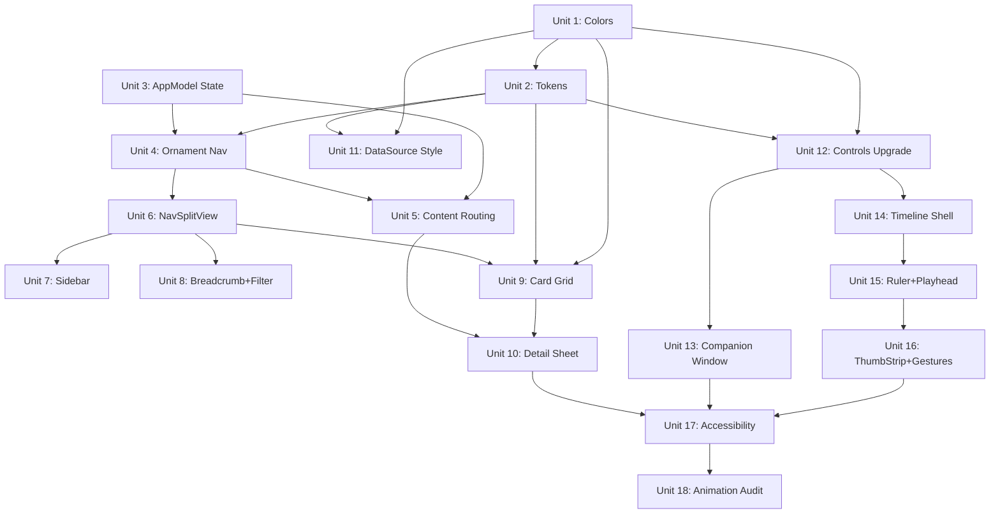

# Enchron UI/UX Redesign — Liquid Glass + Finder-style Navigation

## Overview

Rewrite Enchron's UI layer to implement the verified Liquid Glass design system: ornament-based 3+1 navigation, Finder-style file browser with NavigationSplitView, pill-shaped player controls, NLE timeline, and unified visual language. All work stays within View/ViewModel layers; Domain, UseCase, PlaybackCore, and SpatialScene internals are untouched.

## Problem Framing

Enchron's current UI is a pragmatic assembly of visionOS 1.x stock controls (TabView + NavigationStack + ad-hoc glass panels). The design team has completed and adversarial-reviewed a full visual direction — 5 HTML mockups + 534-line design-to-swiftui translation guide — that establishes a Liquid Glass dark aesthetic with clear information hierarchy. This plan turns those verified designs into SwiftUI native code.

(see origin: docs/brainstorms/2026-04-05-uiux-redesign-requirements.md)

## Requirements Tracking

| ID | Requirement | Phase | Unit(s) |
|----|-------------|-------|---------|
| R1 | 9-color semantic palette in Asset Catalog + Color extension | A | 1 |
| R2 | Design token constants (radius, concentric rule) | A | 2 |
| R3 | Font mapping to SwiftUI semantic Text Styles | A | 2 |
| R4 | Unified .glassBackgroundEffect 4 variants | A | 2 |
| R5 | Leading ornament replaces AppTabView | B | 4 |
| R6 | VStack + capsule glass pill navigation | B | 4 |
| R7 | SF Symbols icons, tertiary active state | B | 4 |
| R8 | Independent Scene Selector circle button | B | 4 |
| R9 | Navigation state in AppModel, conditional rendering | B | 3, 5 |
| R9a | Recent view with ProgressStoring extension | B | 5 |
| R10 | FileBrowserView → NavigationSplitView | C | 6 |
| R11 | Sidebar with data sources + storage bar | C | 7 |
| R12 | LazyVGrid content grid | C | 9 |
| R13 | Breadcrumb path navigation (search box deferred — see NOT in scope) | C | 8 |
| R14 | Filter pills (All/4K/HDR/Spatial) | C | 8 |
| R15 | VideoCardView custom component | C | 9 |
| R16 | Video detail as .sheet() | C | 10 |
| R17 | Detail panel layout (preview + metadata) | C | 10 |
| R18 | Data source config keeps .sheet() modal | C | 11 |
| R19 | Window mode ornament pill controls | D | 12 |
| R20 | Control bar layout: Menu|Rew|Play|Fwd|Settings | D | 12 |
| R21 | Immersive mode companion WindowGroup | D | 13 |
| R22 | System Menu + Picker for menus | D | 12 |
| R23 | Seek bar system Slider + hover preview | D | 12 |
| R24 | Auto-hide via Task.sleep pattern | D | 12 |
| R25 | Top info bar (back + title + format metadata) | D | 12 |
| R26 | NLE timeline expandable panel | E | 14 |
| R27 | Canvas ruler with time labels | E | 15 |
| R28 | Thumb strip with drag scroll | E | 16 |
| R29 | Fixed-center playhead | E | 15 |
| R30 | MagnifyGesture zoom | E | 16 |
| R31 | Frame step buttons | E | 16 |
| R32 | 60pt gaze targets | F | 17 |
| R33 | accessibilityLabel/Hint on cards+controls | F | 17 |
| R34 | Timeline custom accessibility actions | F | 17 |
| R35 | Reduce Motion check | F | 17 |
| R35a | AccessibilityFocusState management | F | 17 |
| R35b | accessibilitySortPriority on grid/sidebar | F | 17 |
| R36 | .hoverEffect() only (no custom translateY) | F | 18 |
| R37 | .buttonStyle(.automatic) only (no custom scale) | F | 18 |
| R38 | .sheet/.popover system transitions only | F | 18 |
| R39 | .interactiveSpring for drag, .spring for settle | F | 18 |

## Scope Boundaries

**In scope:** View + ViewModel layers of FileBrowsing, PlayerUI, App, Settings, SpatialScene/Views
**Out of scope:** PlaybackCore, SpatialScene/Renderers, SpatialScene/Domain, Persistence internals, new data source protocols, multi-session playback, iCloud sync, R13 search box (breadcrumb implemented; search requires new ViewModel state + filtering logic, deferred to follow-up iteration)

- PlaybackLaunchCoordinator's preparePlayback/confirmPlayback flow is preserved
- FileBrowsing Domain layer (BrowsingMediaFile, DataSource, Ports) is preserved
- SpatialScene Renderers (EnvironmentDome, PanoramaSphere, VirtualScreen) are preserved
- PlaybackMenuView floating panel is deleted and replaced by system Menu + Picker
- ScreenPositionControlView is preserved and restyled (continuous sliders cannot migrate to Menu)

(see origin: requirements scope boundaries)

## Context & Research

### Relevant Code and Patterns

| Current File | Current Pattern | Target Pattern |
|---|---|---|
| `App/Navigation/AppTabView.swift` | TabView .sidebarAdaptable, 3 tabs | Leading ornament + conditional content |
| `MainView.swift` | ZStack { AppTabView + WindowVideoView + ornament(bottom) } | ZStack { ornament(leading) + conditional content + WindowVideoView + ornament(bottom) } |
| `FileBrowsing/Views/FileBrowserView.swift` | NavigationStack + VStack + FolderListView | NavigationSplitView { sidebar } detail: { grid } |
| `PlayerUI/Views/VideoDetailView.swift` | Via .navigationDestination(isPresented:) | Via .sheet(item:) |
| `PlayerUI/Views/PlayerControlsView.swift` | Custom ZStack with panels | Pill glass-control, system Menu/Picker |
| `PlayerUI/Views/PlaybackMenuView.swift` | Custom glass floating panel | System Menu with Picker sections |
| `PlayerUI/Views/DetailedTimelineView.swift` | Canvas-based ticks + playhead | Expanded into full NLE timeline |
| `SpatialScene/Views/SceneSelectorView.swift` | Full Tab content | .sheet triggered by ornament button |
| `AppModel.swift` | No navigation state | Add NavigationTab enum |

### Existing .glassBackgroundEffect Usage (10 sites)

Current usage is split: 5 parameterless (full-area glass), 5 shaped (RoundedRectangle/Capsule). Radius range: 16-32pt. PlayerControlsView uses double layer (glass + .ultraThinMaterial). The refactoring consolidates these into 4 named variants per R4.

### Institutional Knowledge

- Code health ≠ user health: 97.75% code coverage but 70.7% E2E pass rate in prior overnight (see `docs/solutions/best-practices/overnight-qa-plan-first-visionos-2026-04-02.md`)
- Clean Architecture disconnection trap: UseCase exists but UI never calls it (see断联检查 pattern)
- PreparedPlayback TTL: 60s timeout managed by coordinator, value type (see `docs/solutions/best-practices/autonomous-overnight-visionos-architectural-patterns.md`)
- .glassBackgroundEffect() must apply to container, not children in ZStack (see pipeline best practices)
- visionOS .sheet() presents as floating window panel, not iOS half-screen (see `docs/solutions/visionos-uiux-refactor-requirements-lessons-2026-04-05.md`)

## Key Technical Decisions

- **Leading ornament confirmed compatible with .windowStyle(.plain)**: HelloWorld reference project uses this exact combination. No fallback to TabView needed. (Resolves deferred Q1)

- **SceneSelectorView → .sheet() from ornament button**: Content (3 environment cards in LazyVGrid) is too rich for .popover but fits well in .sheet. Ornament button triggers sheet. (Resolves deferred Q4)

- **NavigationSplitView sidebar behavior**: Standard visionOS sidebar behavior; system handles folding automatically. No special handling needed. (Resolves deferred Q5)

- **Asset Catalog**: Use "Any Appearance" only (visionOS is always dark). Create 9 Color Sets matching design spec. (Resolves deferred Q8)

- **ProgressStoring extension for Recent view**: Add `loadRecentlyPlayed(limit:) -> [PlaybackProgress]` to protocol. SwiftDataStore implementation sorts by timestamp descending. Dedup by FileIdentifier. (Resolves deferred Q9)

- **VideoDetailView sheet migration**: Replace `.navigationDestination(isPresented:)` with `.sheet(item:)`. Bind to `coordinator.currentPreparation`. On sheet dismiss (onDisappear), call `coordinator.cancelPreparedPlayback()`. The coordinator's PreparationState already handles lifecycle correctly. (Resolves deferred Q2)

- **Companion WindowGroup for immersive controls**: Add `WindowGroup(id: "playerControls")` to XrPlayerApp. Open via `openWindow(id: "playerControls")` when entering immersive playback. Dismiss on immersive exit. Reuses PlayerControlsView. Window positioning follows system default (user movable). (Resolves deferred Q3)

- **System Menu + Picker replaces PlaybackMenuView**: Delete PlaybackMenuView custom glass panel. Use `Menu { }` with nested `Picker` sections for HDR/Subtitles/Audio/Speed/Mode/Environment. Simpler code, native interaction. ScreenPositionControlView is preserved (continuous sliders for distance/offset/angle cannot be expressed as discrete Menu items). (see origin: R22, design-to-swiftui.md ch.12)

- **NLE thumbnail strategy**: Deferred to implementation. Approach: start with mpv screenshot API for on-demand thumbnails; evaluate AVAssetImageGenerator as alternative during Unit 16. (Deferred Q6)

- **Video card thumbnail caching**: Deferred to implementation. Approach: AsyncImage-style lazy loading with in-memory NSCache. Disk cache if performance requires. (Deferred Q7)

## Unresolved Questions

### Resolved During Planning

| Question | Resolution |
|---|---|
| Q1: ornament + .plain compatibility | Compatible — confirmed by HelloWorld reference |
| Q2: VideoDetailView sheet migration | .sheet(item:) bound to coordinator.currentPreparation, dismiss calls cancelPreparedPlayback() |
| Q3: Companion WindowGroup lifecycle | New WindowGroup(id: "playerControls"), open/dismiss via environment actions |
| Q4: SceneSelectorView presentation | .sheet() triggered by ornament button |
| Q5: NavigationSplitView sidebar folding | System-managed, no special handling |
| Q8: Asset Catalog Dark/Light | "Any Appearance" only, visionOS always dark |
| Q9: ProgressStoring extension | loadRecentlyPlayed(limit:) added to protocol |

### Deferred to Implementation

| Question | Reason |
|---|---|
| Q6: NLE thumbnail generation strategy | Depends on mpv screenshot API behavior in practice; start with mpv, evaluate alternatives |
| Q7: Video thumbnail caching strategy | Performance characteristics need runtime measurement |
| Companion window exact sizing | System manages visionOS window sizes; test and adjust |
| Filter pills data source | Need to verify MediaProfile field availability for 4K/HDR/Spatial detection |

## High-Level Technical Design

> *This clarifies the intended approach as directional guidance for review, not implementation spec.*

### Navigation Architecture Transformation

```
BEFORE                                  AFTER
┌────────────────────────────┐         ┌──────────┬──────────────────────────┐
│ MainView (ZStack)          │         │ Leading  │ MainView (ZStack)        │
│  ├─ AppTabView             │         │ Ornament │  ├─ ContentRouter        │
│  │  ├─ Tab: FileBrowser    │    →    │  Browse  │  │  ├─ if .browse:       │
│  │  ├─ Tab: SceneSelector  │         │  Recent  │  │  │   FileBrowserView  │
│  │  └─ Tab: Settings       │         │  Settings│  │  ├─ if .recent:       │
│  ├─ WindowVideoView        │         │  ─────── │  │  │   RecentlyPlayed   │
│  └─ ornament(bottom):      │         │  ◉ Scene │  │  └─ if .settings:     │
│      PlayerControlsView    │         └──────────┘  │      SettingsView      │
└────────────────────────────┘                       │  ├─ WindowVideoView    │
                                                     │  └─ ornament(bottom):  │
                                                     │      PlayerControls    │
                                                     └──────────────────────────┘
```

### File Browser Transformation

```
BEFORE                                  AFTER
┌────────────────────────────┐         ┌──────────┬──────────────────────────┐
│ NavigationStack             │         │ NavSplit │                          │
│  VStack                     │         │ Sidebar  │  Detail                  │
│   ├─ ActiveDataSource bar   │    →    │  Sources │  ├─ Breadcrumb + Search  │
│   ├─ SavedSources scroll    │         │  ├─Local │  ├─ Filter Pills         │
│   ├─ NavigateUp button      │         │  ├─NAS   │  ├─ LazyVGrid           │
│   └─ FolderListView (List)  │         │  └─WebDAV│  │   └─ VideoCardView[] │
│       └─ navigationDest →   │         │  Storage │  └─ .sheet: VideoDetail  │
│           VideoDetailView   │         │   bar    │                          │
└────────────────────────────┘         └──────────┴──────────────────────────┘
```

### State Flow

```
AppModel (@Observable)
  ├─ selectedTab: NavigationTab = .browse     ← NEW
  ├─ showSceneSelector: Bool = false          ← NEW
  ├─ isPlaying, showControls, playbackMode    (existing)
  └─ immersiveSpaceState                      (existing)

NavigationOrnament reads selectedTab, writes selectedTab
ContentRouter reads selectedTab, renders matching view
SceneSelectorButton writes showSceneSelector
MainView .sheet(isPresented: showSceneSelector) → SceneSelectorView
```

## Implementation Units

### Phase A: Design Foundation

- [x] **Unit 1: Semantic Color System (R1)**

  **Goal:** Establish the 9-color design palette as first-class SwiftUI assets

  **Requirements:** R1

  **Dependencies:** None (foundation unit)

  **Files:**
  - Create: `XrPlayer/Assets.xcassets/Colors/` — 9 Color Sets (surface, onSurface, tertiary, onTertiary, primary, onPrimary, surfaceContainerLow, surfaceContainerHighest, onSurfaceVariant)
  - Create: `XrPlayer/Shared/Extensions/Color+DesignTokens.swift` — type-safe Color extension
  - Test: `Tests/XrPlayerCoreTests/DesignTokenTests.swift`

  **Approach:**
  - Each Color Set uses "Any Appearance" only (visionOS is always dark)
  - Color extension provides `Color.enchronSurface`, `Color.enchronTertiary`, etc.
  - Prefix with `enchron` to avoid collision with system colors
  - Color values from design spec: surface #131313, onSurface #E5E2E1, tertiary #ADC6FF, onTertiary #002E6A, primary #C6C6C7, onPrimary #2F3131, surfaceContainerLow #1C1B1B, surfaceContainerHighest #353535, onSurfaceVariant #C1C6D7

  **Patterns to follow:**
  - `XrPlayer/Shared/Constants/AppConstants.swift` — namespace pattern with enum

  **Test scenarios:**
  - Normal: Each of 9 Color.enchron* properties resolves to non-nil UIColor with correct RGB components
  - Normal: Colors are usable in SwiftUI views without runtime crash

  **Verification:** Build succeeds; 9 Color Sets visible in Asset Catalog; Color extension compiles

---

- [x] **Unit 2: Design Tokens, Typography & Glass Variants (R2, R3, R4)**

  **Goal:** Define reusable design constants for radius, typography, and glass effects

  **Requirements:** R2, R3, R4

  **Dependencies:** Unit 1

  **Files:**
  - Create: `XrPlayer/Shared/DesignSystem/DesignTokens.swift` — radius, typography, glass constants
  - Test: `Tests/XrPlayerCoreTests/DesignTokenTests.swift` (extend)

  **Approach:**
  - `enum DesignTokens.Radius { static let card: CGFloat = 20; window = 40; badge = 10 }`
  - Concentric inner radius: document pattern `inner = outer - padding` in code comment
  - Typography: map to SwiftUI semantic styles (title2, headline, caption, caption2) — no `.system(size:)` hardcoding
  - Glass variants as ViewModifier or extension:
    - `.enchronGlassWindow()` → `.glassBackgroundEffect(in: .rect(cornerRadius: 40))`
    - `.enchronGlassControl()` → `.glassBackgroundEffect(in: .capsule)`
    - `.enchronGlassPanel()` → `.regularMaterial` (for content panels)
    - `.enchronGlassSidebar()` → system List default (no explicit modifier)

  **Patterns to follow:**
  - `XrPlayer/Shared/Constants/AppConstants.swift` — enum namespace

  **Test scenarios:**
  - Normal: DesignTokens.Radius.card == 20, .window == 40, .badge == 10
  - Normal: Glass variant modifiers compile and can be applied to a View

  **Verification:** Build succeeds; tokens accessible from any module

---

### Phase B: Global Navigation

- [x] **Unit 3: AppModel Navigation State (R9)**

  **Goal:** Add navigation tab state to AppModel so Views project state without owning it

  **Requirements:** R9

  **Dependencies:** None (AppModel already exists)

  **Files:**
  - Modify: `XrPlayer/AppModel.swift` — add NavigationTab enum + selectedTab + showSceneSelector
  - Test: `Tests/XrPlayerCoreTests/NavigationStateTests.swift`

  **Approach:**
  - Add `public enum NavigationTab: String, CaseIterable { case browse, recent, settings }`
  - Add `public var selectedTab: NavigationTab = .browse`
  - Add `public var showSceneSelector: Bool = false`
  - Views read/write these via @Environment(AppModel.self) — existing pattern
  - Architecture invariant: "没有把业务状态机默认塞进 SwiftUI View" — this keeps navigation state in the model

  **Patterns to follow:**
  - Existing `AppModel.ImmersiveSpaceState` enum pattern
  - Existing `@Environment(AppModel.self)` injection throughout all Views

  **Test scenarios:**
  - Normal: Default selectedTab is .browse
  - Normal: Setting selectedTab to .recent persists the value
  - Normal: showSceneSelector defaults to false
  - Edge: NavigationTab.allCases contains exactly 3 cases

  **Verification:** AppModel compiles with new properties; existing tests pass unchanged

---

- [x] **Unit 4: Leading Ornament Navigation (R5, R6, R7, R8)**

  **Goal:** Replace TabView with ornament-based vertical pill navigation on window's leading edge

  **Requirements:** R5, R6, R7, R8

  **Dependencies:** Unit 2 (glass tokens), Unit 3 (navigation state)

  **Files:**
  - Create: `XrPlayer/App/Navigation/NavigationOrnament.swift` — VStack pill with 3 items + scene button
  - Modify: `XrPlayer/MainView.swift` — replace AppTabView with ornament(leading) + conditional content
  - Delete: `XrPlayer/App/Navigation/AppTabView.swift` (no longer needed; all consumers migrated)

  **Approach:**
  - `.ornament(attachmentAnchor: .scene(.leading), contentAlignment: .center)` on MainView's ZStack
  - NavigationOrnament: `VStack(spacing: 12) { ForEach tabs → Button with SF Symbol }` wrapped in `.enchronGlassControl()` (capsule)
  - Active tab: icon tint = Color.enchronTertiary; inactive = Color.enchronOnSurfaceVariant
  - Below separator: independent circle button for Scene Selector (triggers `appModel.showSceneSelector = true`)
  - Scene button has `.clipShape(.circle)` + `.enchronGlassControl()` applied to individual button
  - Tab icons: "folder" (Browse), "clock" (Recent), "gearshape" (Settings)
  - Scene button icon: "moon.stars" (from current SceneSelectorView)

  **Patterns to follow:**
  - Existing `MainView.swift` `.ornament(attachmentAnchor: .scene(.bottom))` for PlayerControls
  - HelloWorld reference: `.ornament(visibility:attachmentAnchor:)` pattern

  **Test scenarios:**
  - Normal: Tapping Browse/Recent/Settings updates appModel.selectedTab
  - Normal: Active tab shows tertiary tint, others show variant tint
  - Normal: Scene button sets appModel.showSceneSelector = true
  - Edge: Ornament visibility hidden when appModel.isPlaying (controls take focus)

  **Verification:** Build succeeds; ornament renders on window's left side; tab switching works

---

- [x] **Unit 5: Content Routing & Recent View (R9, R9a)**

  **Goal:** Wire navigation state to content area; implement Recent tab view

  **Requirements:** R9, R9a

  **Dependencies:** Unit 3 (navigation state), Unit 4 (ornament shell)

  **Files:**
  - Modify: `XrPlayer/MainView.swift` — conditional rendering based on selectedTab
  - Create: `XrPlayer/App/Views/RecentlyPlayedView.swift` — recent playback list (App module: navigation-level assembly, not PlayerUI — see ARCHITECTURE.md module boundaries)
  - Modify: `XrPlayer/Persistence/Domain/Ports/ProgressStoring.swift` — add loadRecentlyPlayed
  - Modify: `XrPlayer/Persistence/SwiftDataStore.swift` (or equivalent adapter) — implement new method
  - Modify: `XrPlayer/MainView.swift` — add .sheet for SceneSelectorView
  - Test: `Tests/XrPlayerCoreTests/RecentlyPlayedTests.swift`

  **Approach:**
  - MainView body replaces `AppTabView()` with:
    ```
    switch appModel.selectedTab {
    case .browse: FileBrowserView()
    case .recent: RecentlyPlayedView()
    case .settings: SettingsView()
    }
    ```
  - RecentlyPlayedView: query `progressStore.loadRecentlyPlayed(limit: 50)`, display in list
  - Dedup key: FileIdentifier (path + sizeInBytes + serverFingerprint)
  - Empty state: guidance text encouraging browsing
  - SceneSelectorView presented via `.sheet(isPresented: $appModel.showSceneSelector)` on MainView
  - ProgressStoring protocol extension: `func loadRecentlyPlayed(limit: Int) async -> [PlaybackProgress]`
  - **Mock impact:** All existing ProgressStoring conformers (SwiftDataStore + test mocks) must implement the new method. Provide protocol extension default `{ return [] }` for backward compatibility, or enumerate and update all conformers.

  **Patterns to follow:**
  - Existing `FileBrowsingViewModel.loadFiles()` async pattern
  - Existing `ProgressStoring.loadProgress(for:)` pattern

  **Test scenarios:**
  - Normal: loadRecentlyPlayed(limit: 50) returns items sorted by timestamp descending
  - Normal: Duplicate FileIdentifiers are deduplicated (most recent kept)
  - Normal: limit parameter is respected
  - Edge: Empty result returns empty array (no crash)
  - Edge: Setting selectedTab to .recent shows RecentlyPlayedView
  - Integration: SceneSelectorView sheet presents and dismisses correctly

  **Verification:** All 3 navigation targets render; Recent shows playback history; Scene selector opens as sheet

---

### Phase C: File Browser

- [x] **Unit 6: NavigationSplitView Container (R10)**

  **Goal:** Refactor FileBrowserView from NavigationStack to NavigationSplitView two-column layout

  **Requirements:** R10

  **Dependencies:** Unit 4 (navigation shell provides the container context)

  **Files:**
  - Modify: `XrPlayer/FileBrowsing/Views/FileBrowserView.swift` — NavigationSplitView refactor

  **Approach:**
  - Replace outer `NavigationStack { VStack { ... } }` with `NavigationSplitView { sidebar } detail: { content }`
  - Sidebar: data source list (Unit 7 content)
  - Detail: content grid (Unit 9 content)
  - Keep `@Environment(FileBrowsingViewModel.self)` injection
  - Preserve existing .sheet for DataSourceConfigView
  - Remove .navigationDestination for VideoDetailView (migrated to .sheet in Unit 10)
  - Toolbar actions (sort, add source) move to detail toolbar

  **Patterns to follow:**
  - Standard SwiftUI NavigationSplitView pattern
  - Existing FileBrowsingViewModel as data source

  **Test scenarios:**
  - Normal: Two-column layout renders with sidebar and detail
  - Normal: Existing data loading (viewModel.loadFiles) still triggers correctly
  - Edge: Empty file list shows content unavailable in detail
  - Integration: .sheet for DataSourceConfigView still works

  **Verification:** Build succeeds; two-column layout visible; existing file browsing functionality preserved

---

- [x] **Unit 7: Sidebar with Data Sources & Storage (R11)**

  **Goal:** Implement Finder-style sidebar with data source sections and storage indicator

  **Requirements:** R11

  **Dependencies:** Unit 6 (NavigationSplitView container)

  **Files:**
  - Create: `XrPlayer/FileBrowsing/Views/FileBrowserSidebar.swift` — sidebar content
  - Modify: `XrPlayer/FileBrowsing/Views/FileBrowserView.swift` — wire sidebar

  **Approach:**
  - Use system `List(selection: $viewModel.activeDataSource)` for sidebar
  - Section "Sources": Local Storage item + each saved remote DataSource
  - Each row: icon + name + connection status indicator
  - Bottom of sidebar: local storage ProgressView (bytes used / total) — only for local source
  - Tapping source calls `viewModel.connectToDataSource()` or switches to local
  - Favorites section deferred (per requirements: needs new Domain model, out of scope)

  **Patterns to follow:**
  - Existing `viewModel.savedDataSources` array
  - Existing `viewModel.activeDataSource` selection state

  **Test scenarios:**
  - Normal: Local storage always appears first in sidebar
  - Normal: Saved remote sources appear under Sources section
  - Normal: Selecting a source triggers connectToDataSource
  - Normal: Storage bar shows used/total for local only
  - Edge: No saved remote sources → only Local shown
  - Edge: Connection failure shows error state on source row

  **Verification:** Sidebar renders with correct data sources; selection changes detail content

---

- [x] **Unit 8: Breadcrumb Navigation & Filter Pills (R13, R14)**

  **Goal:** Add path breadcrumb and content filter controls above the grid

  **Requirements:** R13, R14

  **Dependencies:** Unit 6 (detail content area)

  **Files:**
  - Create: `XrPlayer/FileBrowsing/Views/BreadcrumbView.swift` — path navigation
  - Create: `XrPlayer/FileBrowsing/Views/FilterPillsView.swift` — filter toggles
  - Modify: `XrPlayer/FileBrowsing/ViewModels/FileBrowsingViewModel.swift` — add filter state + breadcrumb path

  **Approach:**
  - BreadcrumbView: HStack of tappable path segments from viewModel navigation history
  - Each segment is a Button; tapping navigates to that folder level
  - FilterPillsView: HStack of pill-shaped toggles (All, 4K, HDR, Spatial)
  - Active filter: background Color.enchronTertiary; inactive: Color.enchronSurfaceContainerHighest
  - Filter logic in ViewModel: filter `files` array by MediaProfile characteristics
  - "All" is default active; others are additive toggles
  - Both views placed at top of detail column, above LazyVGrid

  **Patterns to follow:**
  - Existing `viewModel.canNavigateUp` / `viewModel.navigateUp()` pattern
  - Existing `viewModel.files` filtering by `sortCriteria`

  **Test scenarios:**
  - Normal: Breadcrumb shows current path segments
  - Normal: Tapping breadcrumb segment navigates to that level
  - Normal: Filter "4K" shows only files with 4K resolution
  - Normal: Active filter pill has tertiary background
  - Edge: Root level breadcrumb shows only source name
  - Edge: No files match filter → empty state in grid
  - Integration: Filter + sort criteria combine correctly

  **Verification:** Breadcrumb reflects navigation; filters narrow content grid

---

- [x] **Unit 9: Video Card Grid (R12, R15)**

  **Goal:** Replace list-based file display with visual card grid including thumbnails and badges

  **Requirements:** R12, R15

  **Dependencies:** Unit 1 (colors), Unit 2 (tokens), Unit 6 (detail area)

  **Files:**
  - Create: `XrPlayer/FileBrowsing/Views/VideoCardView.swift` — card component
  - Create: `XrPlayer/FileBrowsing/Views/ContentGridView.swift` — LazyVGrid wrapper
  - Modify: `XrPlayer/FileBrowsing/Views/FileBrowserView.swift` — wire grid into detail

  **Approach:**
  - ContentGridView: `LazyVGrid(columns: [GridItem(.adaptive(minimum: 240))], spacing: 20)`
  - VideoCardView structure:
    - ZStack: thumbnail placeholder (aspect 16:9, gray surface) with format badge (top-left, `.offset(z: 4)`) + duration badge (bottom-right, `.offset(z: 8)`)
    - Below: title (.font(.headline)) + metadata (.font(.caption), .foregroundStyle(Color.enchronOnSurfaceVariant))
  - Format badge: capsule with text ("4K", "HDR", "Spatial"), Color.enchronTertiary background, radius=badge
  - Duration badge: same style, formatted duration text
  - Card: `.cornerRadius(DesignTokens.Radius.card)` + `.hoverEffect(.lift)` for gaze feedback
  - Badge different Z offsets create parallax bounce on hover (visionOS system behavior)
  - Thumbnail: placeholder initially; async loading strategy deferred to implementation

  **Patterns to follow:**
  - Existing `FolderListView` file display pattern (icon + name + metadata)
  - Existing `.hoverEffect()` usage in SceneSelectorView

  **Test scenarios:**
  - Normal: Grid renders with correct column count for viewport width
  - Normal: Card shows file name, size, duration from MediaFile
  - Normal: Format badge shows "4K" for ≥3840 width files
  - Normal: .hoverEffect(.lift) applied to card
  - Edge: Very long file name truncates with ellipsis
  - Edge: Missing metadata fields show graceful fallback

  **Verification:** Grid displays files as cards; badges show correct format info; hover effect works

---

- [x] **Unit 10: Video Detail Sheet (R16, R17)**

  **Goal:** Migrate VideoDetailView from navigation push to sheet presentation with new layout

  **Requirements:** R16, R17

  **Dependencies:** Unit 9 (card grid provides tap target), Unit 5 (scene selector in sheet)

  **Files:**
  - Modify: `XrPlayer/PlayerUI/Views/VideoDetailView.swift` — new two-column layout
  - Modify: `XrPlayer/FileBrowsing/Views/FileBrowserView.swift` — .sheet(item:) binding

  **Approach:**
  - FileBrowserView: replace `.navigationDestination(isPresented:)` with `.sheet(item: $viewModel.detailNavigationRequest)`
  - **Prerequisite:** PlaybackLaunchRequest must conform to `Identifiable` for `.sheet(item:)` — add `id` property (e.g., UUID or derive from fileIdentifier)
  - **Migration note:** Remove ALL manual `fileBrowsingViewModel.detailNavigationRequest = nil` assignments from VideoDetailView (currently ~6 sites). SwiftUI .sheet(item:) manages dismissal by nilling the binding automatically. Manual nil-setting races with SwiftUI's dismiss animation. Instead: confirmPlayback should nil detailNavigationRequest (triggers sheet dismiss), and .onDisappear handles the cancel/swipe-dismiss case only.
  - VideoDetailView layout (two columns in HStack):
    - Left: video preview area + environment selector carousel (ScrollView horizontal, scrollTargetBehavior(.viewAligned)) + "Start Playback" button
    - Right: metadata section + playback settings (Picker/Toggle for audio, subtitles, etc.)
  - Preserve coordinator.currentPreparation state machine (preparing/ready/failed)
  - On sheet dismiss: call `coordinator.cancelPreparedPlayback()` via `.onDisappear`
  - Resume logic preserved: all 3 resumePolicy branches (askEveryTime, alwaysResume, alwaysStartFromBeginning) must survive layout rewrite. Resume buttons render in left column below environment selector, above "Start Playback". Check savedProgress > 5s → ask/resume/restart
  - "Start Playback" calls `coordinator.confirmPlayback(prepared, resumePosition:)`
  - Environment selector: carousel of CinemaEnvironment.allCases with preview thumbnails

  **Patterns to follow:**
  - Existing VideoDetailView coordinator interaction pattern
  - Existing PreparedPlayback TTL lifecycle

  **Test scenarios:**
  - Normal: Tapping card in grid presents detail sheet
  - Normal: Sheet shows preparing state while metadata loads
  - Normal: Ready state shows audio/subtitle pickers and play button
  - Normal: "Start Playback" triggers coordinator.confirmPlayback
  - Normal: Dismissing sheet calls cancelPreparedPlayback
  - Edge: Failed state shows error with retry option
  - Edge: Resume prompt appears for progress > 5 seconds
  - Integration: preparePlayback → ready → confirmPlayback full flow through sheet

  **Verification:** Sheet presents on card tap; playback launch flow works end-to-end; dismiss cleanup verified

---

- [x] **Unit 11: Data Source Config Styling (R18)**

  **Goal:** Update DataSourceConfigView visual styling to match new design language

  **Requirements:** R18

  **Dependencies:** Unit 1 (colors), Unit 2 (tokens)

  **Files:**
  - Modify: `XrPlayer/FileBrowsing/Views/DataSourceConfigView.swift` — visual update

  **Approach:**
  - Keep existing .sheet() modal and two-phase flow (credentials → share selection)
  - Update colors to design token references
  - Update glass effects to use enchronGlassPanel variant
  - Ensure 60pt gaze targets on all interactive elements
  - No structural change to the view logic

  **Test scenarios:**
  - Normal: Two-phase flow (credentials then share selection) still works
  - Normal: Sheet presents and dismisses correctly
  - Edge: Invalid credentials show error state

  **Verification:** DataSourceConfigView presents correctly with updated styling; flow preserved

---

### Phase D: Player Controls

- [x] **Unit 12: Window Mode Controls Upgrade (R19, R20, R22, R23, R24, R25)**

  **Goal:** Redesign PlayerControlsView as pill-shaped glass control bar with system menus

  **Requirements:** R19, R20, R22, R23, R24, R25

  **Dependencies:** Unit 1 (colors), Unit 2 (tokens)

  **Files:**
  - Modify: `XrPlayer/PlayerUI/Views/PlayerControlsView.swift` — major layout refactor
  - Delete: `XrPlayer/PlayerUI/Views/PlaybackMenuView.swift` — replaced by system Menu
  - Restyle: `XrPlayer/PlayerUI/Views/ScreenPositionControlView.swift` — preserve (continuous sliders for distance/offset/angle cannot migrate to discrete Menu; update colors + glass tokens to match redesign)
  - Create: `XrPlayer/PlayerUI/Views/PlayerInfoBarView.swift` — top info bar

  **Approach:**
  - Overall shape: `.enchronGlassControl()` (capsule) via `.ornament(attachmentAnchor: .scene(.bottom))`
  - Layout (VStack):
    - Top: PlayerInfoBarView — back button + title + format metadata ("4K HDR · HEVC · Spatial Audio")
    - Middle: Seek bar — system `Slider(value:in:)` + time labels
    - Bottom: Control row — `Menu` button | Rewind 10s | Play/Pause (large center) | Forward 10s | `Menu` (Settings)
  - Left Menu popup: HDR toggle + Subtitles Picker + Audio Track Picker + Speed Picker
  - Right Menu popup (Settings): Playback Mode Picker + Environment selector
  - All menu items use system `Menu { Picker { ForEach } }` — no custom panels
  - Auto-hide: replace existing Timer with `@State lastInteractionTime` + `.task(id:)` + `Task.sleep(for: .seconds(5))`
  - Buttons use `.buttonStyle(.automatic)` for system press feedback
  - Delete PlaybackMenuView.swift (custom glass panel → system Menu)
  - Restyle ScreenPositionControlView.swift with design tokens (continuous sliders preserved; cannot migrate to discrete Menu)

  **Patterns to follow:**
  - Existing `PlayerControlsView` environment injection pattern (AppModel, WindowVideoViewModel, etc.)
  - Existing `switchPlaybackMode(to:)` async function for mode switching
  - Existing speed menu in PlayerControlsView (already uses Menu pattern)

  **Test scenarios:**
  - Normal: Control bar renders with correct button order
  - Normal: Play/Pause toggles playback state
  - Normal: Rewind/Forward seek by 10 seconds
  - Normal: Left menu shows HDR + Subtitles + Audio + Speed
  - Normal: Right menu shows Mode + Environment
  - Normal: Slider reflects current playback position
  - Normal: Controls auto-hide after 5 seconds of no interaction
  - Normal: Info bar shows video title and format metadata
  - Edge: Controls reappear on any user interaction
  - Edge: Menu items update when track list changes mid-playback
  - Integration: Mode switch from menu triggers full switchPlaybackMode flow

  **Verification:** Controls render in pill shape; menus work; auto-hide timing correct; old panels deleted

---

- [x] **Unit 13: Immersive Mode Companion Window (R21)**

  **Goal:** Add a dedicated WindowGroup for player controls during immersive playback

  **Requirements:** R21

  **Dependencies:** Unit 12 (controls design)

  **Files:**
  - Modify: `XrPlayer/XrPlayerApp.swift` — add WindowGroup(id: "playerControls")
  - Modify: `XrPlayer/MainView.swift` or `XrPlayer/PlayerUI/Views/PlayerControlsView.swift` — open/dismiss logic

  **Approach:**
  - Add `WindowGroup(id: "playerControls") { PlayerControlsView().environment(...) }` to XrPlayerApp
  - Inject ALL 5 required environment objects (PlayerControlsView uses all 5):
    1. `.environment(appModel)` — AppModel
    2. `.environment(windowVideoViewModel)` — WindowVideoViewModel
    3. `.environment(fileBrowsingViewModel)` — FileBrowsingViewModel
    4. `.environment(playbackLauncher)` — PlaybackLaunchCoordinator
    5. `.environment(panoramaBridge)` — PanoramaLayerBridge
  - Follow existing pattern from main WindowGroup (XrPlayerApp.swift:124-131)
  - Open: when `appModel.playbackMode != .window && appModel.isPlaying`, call `openWindow(id: "playerControls")`
  - Dismiss: when exiting immersive mode or stopping playback, call `dismissWindow(id: "playerControls")`
  - The existing bottom ornament hides when in immersive mode (already conditional on playbackMode)
  - Companion window shows same PlayerControlsView — code reuse
  - Window sizing: let system manage; apply `.defaultSize(width: 600, height: 200)` as hint
  - **ScreenPositionControlView in companion window:** The 340x420 overlay panel cannot fit in the 200pt-tall companion window. Strategy: present ScreenPositionControlView as `.sheet()` from the companion window (not as ZStack overlay). This lets visionOS size the sheet independently.
  - **Lifecycle guard:** Use a single computed condition `shouldShowCompanion = (playbackMode != .window && isPlaying)` and one `.onChange(of: shouldShowCompanion)` observer. Avoid two independent `.onChange` observers that can race (double-open or double-dismiss).

  **Patterns to follow:**
  - Existing `WindowGroup(id: "settings")` pattern in XrPlayerApp
  - Existing `@Environment(\.openWindow)` / `dismissWindow` in PlayerControlsView

  **Test scenarios:**
  - Normal: Entering immersive playback opens companion window
  - Normal: Exiting immersive mode dismisses companion window
  - Normal: Stopping playback dismisses companion window
  - Normal: Companion window shows same controls as window mode
  - Edge: User manually closes companion window → recoverable (can reopen)
  - Edge: Switching from immersive back to window mode → companion dismissed, ornament reappears
  - Integration: Mode switch flow: window(ornament) → immersive(companion) → window(ornament)

  **Verification:** Companion window appears/disappears with immersive mode; controls functional

---

### Phase E: NLE Timeline

- [x] **Unit 14: Timeline Shell & Animation (R26)**

  **Goal:** Create expandable NLE timeline panel with spring animation

  **Requirements:** R26

  **Dependencies:** Unit 12 (integrated into player controls area)

  **Files:**
  - Create: `XrPlayer/PlayerUI/Views/NLETimelineView.swift` — timeline container

  **Approach:**
  - NLETimelineView: expandable panel below the control bar
  - Toggle button in control bar triggers expand/collapse
  - Animation: `.offset(y:)` driven by `@State isExpanded` + `.animation(.spring, value: isExpanded)`
  - Collapsed: hidden below control bar; expanded: slides up to reveal full timeline
  - Contains: ruler (Unit 15) + thumb strip (Unit 16) + playhead (Unit 15)
  - Panel uses `.enchronGlassPanel()` material

  **Patterns to follow:**
  - Existing `DetailedTimelineView` Canvas rendering approach
  - Existing `.glassBackgroundEffect()` on timeline

  **Test scenarios:**
  - Normal: Toggle button expands timeline panel
  - Normal: Toggle again collapses it
  - Normal: Spring animation applies during transition
  - Edge: Rapid toggle doesn't produce glitches (animation interruption handled)

  **Verification:** Timeline panel expands/collapses with spring animation

---

- [x] **Unit 15: Time Ruler & Playhead (R27, R29)**

  **Goal:** Implement Canvas-drawn time ruler with tick marks, labels, and fixed-center playhead

  **Requirements:** R27, R29

  **Dependencies:** Unit 14 (timeline container)

  **Files:**
  - Create: `XrPlayer/PlayerUI/Views/TimelineRulerView.swift` — Canvas ruler
  - Modify: `XrPlayer/PlayerUI/Views/NLETimelineView.swift` — integrate ruler

  **Approach:**
  - Build on existing DetailedTimelineGeometry calculations (proven math)
  - Canvas draws major ticks (tall, with time labels) and minor ticks (short)
  - Tick interval adapts to zoom level (from DetailedTimelineGeometry)
  - Playhead: fixed at horizontal center, drawn with Canvas as vertical line + triangle indicator
  - Playhead color: white normally, Color.enchronTertiary when actively seeking
  - Time labels: formatted via existing PlaybackTimeFormatter

  **Patterns to follow:**
  - Existing `DetailedTimelineView` Canvas rendering + DetailedTimelineGeometry
  - Existing `PlaybackTimeFormatter` for time display

  **Test scenarios:**
  - Normal: Ruler shows correct time labels for video duration
  - Normal: Playhead stays at center position
  - Normal: Tick density adjusts with zoom level
  - Edge: Very short video (< 10s) shows appropriate tick intervals
  - Edge: Very long video (> 3hr) shows appropriate major tick intervals

  **Verification:** Ruler renders with correct timing; playhead visible at center

---

- [ ] **Unit 16: Thumb Strip & Gesture Controls (R28, R30, R31)**

  **Goal:** Add thumbnail track with drag scrolling, pinch zoom, and frame stepping

  **Requirements:** R28, R30, R31

  **Dependencies:** Unit 15 (ruler provides time reference)

  **Files:**
  - Create: `XrPlayer/PlayerUI/Components/ThumbStripView.swift` — thumbnail track
  - Modify: `XrPlayer/PlayerUI/Views/NLETimelineView.swift` — integrate strip + gestures

  **Approach:**
  - ThumbStripView: horizontal strip of thumbnail frames below ruler
  - Thumbnail generation: start with placeholder rectangles; async thumbnail loading deferred to implementation (Q6)
  - `DragGesture` on strip: horizontal scrolling changes playback position
  - `MagnifyGesture` on timeline area: changes zoom level (modifies DetailedTimelineGeometry.zoomLevel)
  - Frame step buttons (◁ Previous Frame | Next Frame ▷) at edges of timeline
  - Frame step calls: existing mpv frame-step / frame-back-step commands
  - During drag: `.interactiveSpring` for responsive feel
  - On drag end: `.spring` for elastic settle

  **Execution notes:** Thumbnail generation strategy (mpv screenshot vs AVAssetImageGenerator) to be evaluated during implementation. Start with solid-color placeholders derived from video timestamp.

  **Patterns to follow:**
  - Existing `DragGesture` in MainView (seek gesture)
  - Existing `DetailedTimelineGeometry` zoom calculation

  **Test scenarios:**
  - Normal: DragGesture scrolls timeline and updates playback position
  - Normal: MagnifyGesture changes zoom level
  - Normal: Frame step forward advances by one frame
  - Normal: Frame step backward retreats by one frame
  - Edge: Drag beyond video bounds clamps to 0 / duration
  - Edge: Zoom level has min/max limits
  - Integration: Drag + release → position persists after spring animation settles

  **Verification:** Drag scrolling, pinch zoom, and frame stepping all functional

---

### Phase F: Accessibility & Animation (Cross-cutting)

- [ ] **Unit 17: Accessibility Pass (R32, R33, R34, R35, R35a, R35b)**

  **Goal:** Ensure all new and modified views meet visionOS accessibility requirements

  **Requirements:** R32, R33, R34, R35, R35a, R35b

  **Dependencies:** Units 4-16 (all UI work complete)

  **Files:**
  - Modify: All views created/modified in Units 4-16
  - Audit list: NavigationOrnament, FileBrowserSidebar, ContentGridView, VideoCardView, FilterPillsView, BreadcrumbView, VideoDetailView, PlayerControlsView, PlayerInfoBarView, NLETimelineView, TimelineRulerView, ThumbStripView, RecentlyPlayedView

  **Approach:**
  - R32: Audit all interactive elements for 60×60pt minimum. Add `.frame(minWidth: 60, minHeight: 60)` + `.contentShape(.rect)` where visual size < 60pt
  - R33: Add `.accessibilityLabel()` + `.accessibilityHint()` to VideoCardView ("Video: [name], [duration], [format]") and all player control buttons
  - R34: Add `.accessibilityAction(named:)` to NLETimelineView: "Play/Pause", "Next Frame", "Previous Frame", "Seek Forward", "Seek Backward"
  - R35: Check `@Environment(\.accessibilityReduceMotion)` in NLETimelineView (.spring → .easeInOut), VideoCardView (disable hover parallax), NavigationOrnament (disable decorative transitions)
  - R35a: Add `@AccessibilityFocusState` to: VideoDetailView sheet (focus on title on appear), NavigationOrnament (focus on active tab after switch), immersive mode transition (focus on companion window controls)
  - R35b: Add `.accessibilitySortPriority()` to VideoCardView grid (left-to-right, top-to-bottom) and sidebar data source rows (top-to-bottom)

  **Patterns to follow:**
  - Existing `.hoverEffect()` usage (add `.accessibilityLabel` alongside)

  **Test scenarios:**
  - Normal: VoiceOver reads video card as "Video: filename, 2 hours 15 minutes, 4K HDR"
  - Normal: All navigation buttons have accessibility labels
  - Normal: Timeline custom actions (Play, Next Frame) trigger correctly via VoiceOver
  - Normal: Reduce Motion enabled → spring animations become easeInOut
  - Edge: Focus lands on sheet title when VideoDetailView opens
  - Edge: Sort priority ensures left-to-right grid reading order

  **Verification:** VoiceOver can traverse all functionality; Reduce Motion paths work; focus management correct

---

- [ ] **Unit 18: Animation & Interaction Unification (R36, R37, R38, R39)**

  **Goal:** Verify and enforce system-native animation and interaction patterns across all views

  **Requirements:** R36, R37, R38, R39

  **Dependencies:** Units 4-16 (all UI work complete)

  **Files:**
  - Audit and modify: All views created/modified in Units 4-16

  **Approach:**
  - R36: Grep for custom translateY/shadow hover effects → replace with `.hoverEffect()` or `.hoverEffect(.lift)`
  - R37: Grep for custom `scaleEffect` press animations → replace with `.buttonStyle(.automatic)`
  - R38: Grep for `withAnimation(.opacity)` panel transitions → replace with `.sheet()` / `.popover()` system transitions
  - R39: Verify drag gestures use `.interactiveSpring` during drag, `.spring` on release
  - This unit is primarily an audit + correction pass, not new implementation

  **Patterns to follow:**
  - Existing `.hoverEffect()` in SceneSelectorView, PlayerControlSurface
  - Existing `.buttonStyle(.automatic)` (to be established as standard)

  **Test scenarios:**
  - Normal: No custom translateY hover effects exist in codebase (grep verification)
  - Normal: No custom scaleEffect press animations exist (grep verification)
  - Normal: All panel presentations use .sheet or .popover (grep verification)
  - Normal: Timeline drag uses interactiveSpring, release uses spring

  **Verification:** Grep confirms zero custom hover/press/transition animations; all interactions use system APIs

---

## Implementation Dependency Graph



## System-Wide Impact

- **Navigation architecture**: AppTabView (TabView .sidebarAdaptable) is fully replaced by ornament + conditional rendering. All existing tab-based navigation tests or assumptions break.
- **File browser data flow**: FolderListView is no longer the primary content display; ContentGridView replaces it for files. **Decision: Delete FolderListView.swift in Unit 9** — ContentGridView fully replaces its role. Subfolders render as folder-type cards in the grid (tap navigates into subfolder). Keeping FolderListView creates dead code and confusion.
- **PlaybackMenuView deletion**: All consumers of PlaybackMenuView must be updated to use system Menu. PlayerControlsView is the only consumer.
- **ScreenPositionControlView preserved**: Restyled with new design tokens; continuous sliders (distance/offset/angle) cannot migrate to discrete Menu. Panel still available in immersive mode.
- **VideoDetailView lifecycle**: Changing from navigationDestination to .sheet changes dismiss semantics. Any code relying on NavigationStack path changes must be updated.
- **WindowGroup registration**: Adding "playerControls" WindowGroup affects app scene declaration. Scene environment injection must cover this new window.
- **Invariant preserved**: All playback still routes through PlaybackLaunchCoordinator. R16/R17 detail sheet calls coordinator.confirmPlayback — same as before.
- **Invariant preserved**: PlaybackMode decision stays in PlayerUI (PlayerControlsView.switchPlaybackMode). Companion window just hosts the same view.

## Risks & Dependencies

| Risk | Likelihood | Impact | Mitigation |
|------|-----------|--------|------------|
| Leading ornament visual clash with content when window resized | Low | Medium | System manages ornament positioning; test at various window sizes |
| NavigationSplitView sidebar auto-collapse in small windows | Medium | Low | System behavior; acceptable degradation |
| Companion WindowGroup z-ordering in immersive space | Medium | Medium | Test with ImmersiveSpace active; adjust .defaultSize if needed |
| PlaybackMenuView deletion breaks existing menu consumers | Low | High | PlayerControlsView is only consumer; verified by grep |
| 248 existing tests break from navigation restructuring | Medium | High | Domain/UseCase tests unaffected; View-level tests need updating |
| VideoDetailView sheet dismiss race with preparePlayback | Medium | High | Use coordinator's generation stamp pattern (already handles this) |
| NLE timeline performance with large video files | Medium | Medium | Start with placeholders; optimize thumbnail loading iteratively |
| Accessibility audit reveals systematic gaze target violations | High | Medium | Phase F is dedicated to this; budget time accordingly |

## Documentation / Operational Notes

- After Phase B completion: update ARCHITECTURE.md to reflect ornament navigation replacing TabView
- After Unit 12: update REGRESSION.md with new player control paths (REG-080~096 affected)
- After Unit 13: update ARCHITECTURE.md to document new "playerControls" WindowGroup
- REGRESSION.md: all units that modify PlayerControlsView trigger REG-080~096 regression items
- REGRESSION.md: file browser changes trigger REG-082~089

## Sources & References

- **Origin document:** [docs/brainstorms/2026-04-05-uiux-redesign-requirements.md](docs/brainstorms/2026-04-05-uiux-redesign-requirements.md)
- **Design guide:** [docs/designs/design-to-swiftui.md](docs/designs/design-to-swiftui.md)
- **Investigation:** [docs/reference/2026-04-05-uiux-rewrite-investigation.md](docs/reference/2026-04-05-uiux-rewrite-investigation.md)
- **Lessons learned:** [docs/solutions/visionos-uiux-refactor-requirements-lessons-2026-04-05.md](docs/solutions/visionos-uiux-refactor-requirements-lessons-2026-04-05.md)
- **Architecture patterns:** [docs/solutions/best-practices/autonomous-overnight-visionos-architectural-patterns.md](docs/solutions/best-practices/autonomous-overnight-visionos-architectural-patterns.md)
- **QA methodology:** [docs/solutions/best-practices/overnight-qa-plan-first-visionos-2026-04-02.md](docs/solutions/best-practices/overnight-qa-plan-first-visionos-2026-04-02.md)
- **HelloWorld reference:** ~/Movies/HelloWorld/ (Apple visionOS sample)
- **Architecture:** [ARCHITECTURE.md](ARCHITECTURE.md)

## GSTACK REVIEW REPORT

| Review | Trigger | Why | Runs | Status | Findings |
|--------|---------|-----|------|--------|----------|
| CEO Review | `/plan-ceo-review` | Scope & strategy | 0 | — | — |
| Codex Review | `/codex:rescue` | Independent 2nd opinion | 0 | — | — |
| Eng Review | `/plan-eng-review` | Architecture & tests (required) | 1 | CLEAR (PLAN) | 7 issues, 1 critical gap, 4 P1 fixed |
| Design Review | `/plan-design-review` | UI/UX gaps | 1 | issues_open | score: 5/10 → 5/10, 5 decisions (stale: prior pipeline) |

**UNRESOLVED:** 0
**VERDICT:** ENG CLEARED — ready to implement. Design Review is from prior pipeline (stale commit 117c3af, not current ExecPlan).
