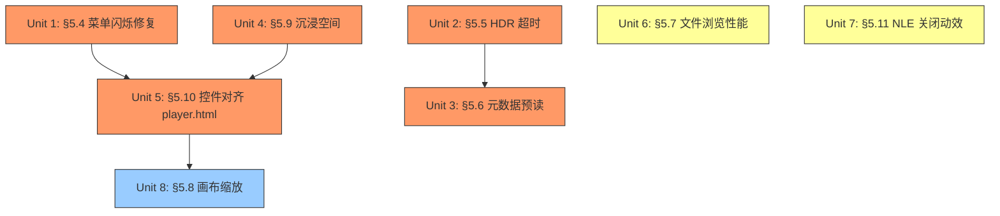

# fix: V2 Iteration 2 — Bug Fixes §5.4-§5.11

## 概述

本轮修复覆盖 Enchron V2 需求文档中 §5.4-§5.11 的全部已知 Bug。第 1 轮已完成三轴域模型重构、基础 UI 对齐、缩略图、数据源切换。本轮聚焦：播放控件交互 Bug（P0）、HDR 详情页卡死（P0）、元数据预读缓存（P0）、沉浸空间四项子问题（P0）、播放控件严格对齐 player.html（P0）、文件浏览性能（P1）、NLE 关闭动效（P1）、视频画布缩放（P2）。

## 问题框架

用户在真机验证 V2 iteration 1 后发现 8 类问题，其中 5 类为 P0（影响核心播放流程或导致界面不可用）。这些 Bug 横跨 PlayerUI、PlaybackCore、App、SpatialScene、FileBrowsing 五个限界上下文，需要精确的依赖排序以避免交叉回归。

(see origin: docs/brainstorms/2026-04-06-v2-comprehensive-requirements.md)

## 需求追踪

- R1. §5.4 — 播放中二级/三级菜单可拖动、可点击、无闪烁
- R2. §5.5 — HDR 视频详情页正常加载，不卡死
- R3. §5.6 — 详情页首次加载元数据正确（预读+缓存）
- R4. §5.9a — 所有沉浸空间入口统一走 PlaybackLaunchCoordinator
- R5. §5.9b — 进入沉浸空间后 APP 主窗口自动隐藏
- R6. §5.9c — 沉浸空间使用 `.full` 独占模式
- R7. §5.9d — 沉浸空间中点击视频纹理可 toggle 播放控件
- R8. §5.10 — 播放控件布局严格对齐 player.html
- R9. §5.7a — 文件列表渲染/滚动不卡顿
- R10. §5.7b — 远端数据源加载动画正确播放
- R11. §5.7c — 下拉刷新无跳变，增量更新
- R12. §5.11 — NLE 二级时间轴关闭有反向滑入动效
- R13. §5.8 — 视频画布跟随窗口缩放

## 范围边界

- 不涉及三轴域模型重构（iteration 1 已完成）
- 不涉及首页 variant-AB-combined.html 对齐（独立迭代）
- 不涉及 Accessibility 体系建设（iteration 1 已覆盖基础 identifier）
- 不新增功能，仅修复已知 Bug 和对齐设计稿

## 上下文与调研

### 相关代码和模式

- `PlayerControlsView.swift` — 已有 SeekBarView 隔离（iteration 1）；左右 Menu 使用 SwiftUI `Menu {}` 组件
- `VideoDetailView.swift` — 已有 `NavigationStack` + `toolbar` 返回按钮 + `PlaybackLaunchCoordinator.currentPreparation` 状态驱动
- `PlaybackMediaMetadataService.swift` — 已有 `PlaybackMediaMetadataStore`（UserDefaults 缓存）+ `prepareMetadata/recordDetectedProfile`
- `MainView.swift` — 已有 `onChange(of: appModel.playbackMode)` 处理沉浸空间 open/dismiss + playerControls window open/dismiss
- `XrPlayerApp.swift` — 已有 `ImmersiveSpace` 声明 + `.immersionStyle(selection:in: .mixed, .full)` + 独立 `WindowGroup(id: "playerControls")`
- `ImmersiveSpaceView.swift` — RealityView，按 playbackMode 分支创建 panorama/immersive 实体
- `NLETimelineView.swift` — 已有 `.transition(.opacity.combined(with: .move(edge: .top)))` 但方向错误（应为 `.bottom`）
- `WindowVideoView.swift` — UIViewRepresentable + `containerSize` 参数

### 机构知识

- handoff 文档 `docs/plans/active/2026-04-05-known-issues-handoff.md` 记录了已尝试和未解决的方向
- 播放控件闪烁 — iteration 1 的 SeekBarView 隔离可能未完全修复；根因可能是 SwiftUI `Menu` 在 ornament 内的 hit testing 与帧刷新冲突
- 视频画布缩放 — `autoresizingMask` 和 `setNeedsLayout` 在真机上未生效；需要 `GeometryReader` 传 size + mpv drawable size 同步

## 关键技术决策

- **§5.4 菜单闪烁**：使用 `Menu` 组件的 SwiftUI 原生实现路径，而非自定义 popover。如果原生 `Menu` 在 ornament 中确实存在 hit testing 缺陷，则需隔离 Menu 到独立的 `@State` 驱动弹出面板。理由：先验证原生路径是否足够，再决定是否自定义。
- **§5.5 HDR 卡死**：在 `PlaybackLaunchCoordinator.preparePlayback` 中对 mpv profile 检测增加 3 秒超时 + fallback 默认 profile。理由：检测挂起是阻塞 UI 的根因，超时是最小侵入修复。
- **§5.6 元数据预读**：在 `FileBrowsingViewModel` 层增加文件夹级别后台批量预读，结果写入 `PlaybackMediaMetadataStore`。理由：预读粒度与文件浏览导航一致，缓存层已存在。
- **§5.9 沉浸空间**：所有模式切换统一收敛到 `PlaybackLaunchCoordinator`；进入沉浸模式时 dismiss 主窗口。理由：架构不变量要求所有播放入口经过 coordinator。
- **§5.10 控件对齐**：以 `docs/designs/player.html` 为唯一权威，逐元素对齐间距、展开方向、面板对齐。理由：需求文档明确要求一比一复刻。

## 未解决问题

### 规划期间解决

- **§5.4 根因**：从代码看，`PlayerControlsView` 使用 SwiftUI 原生 `Menu` 组件挂载在 `.ornament()` 内。在 200ms 帧刷新期间，`SeekBarView` 已隔离，但 `Menu` 的弹出态可能受到 `appModel.showControls` 的 animation 影响。需在实施中确认是否 `Menu` 状态被 SwiftUI diff 重建导致闪烁。
- **§5.9b 窗口隐藏方式**：visionOS 无法通过 `dismissWindow(id: "main")` 隐藏默认 WindowGroup。需调查 `.windowStyle(.plain)` + `appModel.playbackMode` 控制 opacity/frame 来实现视觉隐藏。

### 推迟到实施

- §5.4 如果原生 Menu 在 ornament 中根本不可用，可能需要用自定义 popover 替代——这是执行时发现。
- §5.8 mpv 的 `vo-configured` 事件在 resize 时是否触发——需要运行时日志确认。
- §5.9d 沉浸空间中手势检测的具体 API（CollisionComponent / SpatialTapGesture）——需要调试确认。

## 高层技术设计

> *这阐明了预期方案，是供审查的方向性指导，而非实现规范。实现代理应将其视为上下文，而非需要重现的代码。*

**并行组：**
- Unit 1, Unit 2, Unit 4, Unit 6, Unit 7 可并行启动（无相互依赖）
- Unit 3 依赖 Unit 2（HDR 超时修复是预读的前置条件）
- Unit 5 依赖 Unit 1 和 Unit 4（菜单交互修复和沉浸模式修复后再对齐布局）
- Unit 8 独立但优先级最低，排在 Unit 5 之后

## 实施单元

---

- [ ] **Unit 1: §5.4 — 播放中菜单闪烁与交互修复 (P0)**

**目标：** 修复播放中二级/三级菜单不可拖动、不可点击、持续闪烁的问题。

**需求：** R1

**依赖：** 无

**文件：**
- 修改：`XrPlayer/PlayerUI/Views/PlayerControlsView.swift`
- 修改：`XrPlayer/MainView.swift`（ornament 相关）
- 修改：`XrPlayer/PlayerUI/Views/SeekBarView.swift`（如需进一步隔离）

**方案：**
1. 诊断根因：在 `PlayerControlsView` 中，`leftMenu` 和 `rightMenu` 使用 SwiftUI `Menu` 组件。播放中 200ms 轮询通过 `SeekBarView` 隔离后不应影响 `controlBarPill`，但需验证 `appModel.showControls` 的 animation modifier 是否导致 Menu 弹出层被 SwiftUI 重建。
2. 如果 `.animation(.easeInOut, value: appModel.showControls)` 在 MainView ornament 上导致 Menu 子树重建，将 animation scope 精确限定到 opacity/allowsHitTesting，排除 Menu 弹出状态。
3. 如果 ornament 内的 `Menu` 本身存在 visionOS hit testing 缺陷（ornament gesture 拦截），则替换为 `@State` 驱动的自定义 popover 面板，使用 `.popover()` 或手动 ZStack overlay。
4. 确保菜单弹出后，播放帧刷新不触发菜单所在层的 body 重新求值。

**要遵循的模式：**
- `SeekBarView` 已有的隔离模式：将高频刷新数据限定在叶子视图
- `DesignTokens` 已有的 spacing/sizing 常量

**测试场景：**
- 正常路径：播放视频 → 点击 Menu 按钮 → 二级菜单弹出且可滚动、可点击；点击三级菜单（如 Subtitles）→ 三级菜单正确展开且可选择
- 正常路径：播放视频 → 点击 Settings 按钮 → Playback Mode 三级菜单可点击切换
- 边界情况：播放中快速连续打开/关闭菜单 5 次 → 菜单状态一致，无闪烁
- 边界情况：菜单打开状态下等待 10 秒 → 菜单保持可见、不被自动隐藏逻辑关闭
- 集成：暂停后打开菜单 → 菜单行为与播放中一致

**验证：**
- 播放中打开任何层级菜单，菜单持续稳定显示，可正常交互
- 无闪烁、无跳动、无不可点击现象

**决策门控（对抗审查 P1-1）：** Unit 1 完成后必须明确记录最终方案是 `Menu-native` 还是 `Popover-custom`。此决策影响 Unit 5 的面板对齐实现——如果走 Popover-custom，Unit 5 的锚点定位需从 Menu anchor 改为手动计算。

---

- [ ] **Unit 2: §5.5 — HDR 视频详情页超时防卡死 (P0)**

**目标：** 修复部分 HDR 视频打开详情页时无限加载导致界面冻结。

**需求：** R2

**依赖：** 无

**文件：**
- 修改：`XrPlayer/App/PlaybackLaunchCoordinator.swift`（preparePlayback 路径）
- 修改：`XrPlayer/WindowVideoViewModel.swift`（profile 检测回调）
- 修改：`XrPlayer/PlaybackCore/Adapters/MPV/MPVPlayerAdapter.swift`（如涉及底层检测超时）
- 修改：`XrPlayer/App/PlaybackMediaMetadataService.swift`

**方案：**
1. 在 `PlaybackLaunchCoordinator.preparePlayback(for:)` 中，对 mpv profile 检测增加 3 秒超时。超时后使用 fallback 默认 `MediaProfile`（SDR / flat / mono / 估算分辨率）。
2. 在 `WindowVideoViewModel.onMediaProfileResolved` 回调中，增加对 Task cancellation 的检查，确保超时后不再更新已取消的 preparation。
3. 在 `PlaybackMediaMetadataService.prepareMetadata(for:)` 中，如果缓存命中则直接返回，跳过 mpv 检测，从根本上避免 HDR 视频的检测挂起。
4. 对 UI 层增加优雅降级：如果超时，在详情页显示"部分元数据不可用"提示，但不阻塞用户操作。

**要遵循的模式：**
- `PlaybackLaunchCoordinator` 已有的 generation tracking 模式
- Swift Concurrency `withTaskGroup` + `Task.sleep` 超时模式

**测试场景：**
- 正常路径：打开 SDR 视频详情页 → 元数据正常加载
- 正常路径：打开 HDR10 视频详情页 → 元数据正常加载，HDR 类型正确显示
- 错误路径：打开导致检测挂起的 HDR 视频 → 3 秒后超时，显示 fallback 元数据 + 提示，界面可操作
- 边界情况：快速连续打开/关闭不同视频的详情页 → generation tracking 正确取消旧任务
- 集成：超时 fallback 后，用户点击播放 → 播放正常启动（mpv 在实际播放时会重新检测）

**验证：**
- 任何视频打开详情页，最多 3 秒内 UI 可交互
- HDR 视频不再导致界面冻结

---

- [ ] **Unit 3: §5.6 — 文件夹级别元数据预读 + 缓存 (P0)**

**目标：** 消除详情页首次加载时元数据错误的问题，实现文件夹级别后台预读。

**需求：** R3

**依赖：** Unit 2（需要超时机制作为预读的安全网）

**文件：**
- 修改：`XrPlayer/FileBrowsing/ViewModels/FileBrowsingViewModel.swift`
- 修改：`XrPlayer/App/PlaybackMediaMetadataService.swift`
- 修改：`XrPlayer/App/PlaybackLaunchCoordinator.swift`（prepareMetadata 路径检查缓存）
- 新建：`XrPlayer/App/MediaProfilePrefetchService.swift`（如需独立服务）

**方案：**
1. 在 `FileBrowsingViewModel` 中，每次加载完文件列表后（`connectAndLoad` / `navigateToFolder` 完成后），启动后台 Task 批量预读所有视频文件的 MediaProfile。
2. 预读使用 `PlaybackMediaMetadataService` 已有的 `recordDetectedProfile` 写入缓存。每个文件预读使用 Unit 2 的 3 秒超时。
3. 预读并发控制：使用 `TaskGroup` 限制同时预读数量（最多 3 个并发），避免资源争抢。
4. 缓存命中策略：`PlaybackMediaMetadataStore` 已有按 fileIdentifier 查缓存的逻辑。在详情页打开时，`PlaybackLaunchCoordinator.preparePlayback` 先查缓存，缓存命中则跳过 mpv 检测。
5. 缓存失效：以文件修改时间（`modifiedAt`）作为失效依据，modifiedAt 变化时重新检测。

**要遵循的模式：**
- `ThumbnailService` 的两级缓存模式（memory + disk）
- `FileBrowsingViewModel` 已有的 `Task { [weak self] in ... }` 后台模式

**测试场景：**
- 正常路径：进入文件夹 → 后台预读完成 → 打开详情页 → 元数据立即正确显示，无加载延迟
- 正常路径：未预读完成时打开详情页 → 显示 loading → mpv 检测完成后更新为正确值
- 边界情况：文件夹含 50+ 视频 → 预读不阻塞 UI，滚动流畅
- 边界情况：快速切换文件夹 → 旧文件夹的预读 Task 被取消
- 错误路径：预读某文件超时 → 跳过该文件，继续预读其他文件，不影响整体
- 集成：预读写入缓存 → 详情页从缓存读取 → 数据一致

**验证：**
- 进入文件夹后，打开任何视频的详情页，首次显示的元数据即为正确值
- 预读不影响文件列表滚动性能

---

- [ ] **Unit 4: §5.9 — 沉浸空间四项子问题修复 (P0)**

**目标：** 统一沉浸空间入口、隐藏主窗口、启用独占模式、实现控件召唤。

**需求：** R4, R5, R6, R7

**依赖：** 无

**文件：**
- 修改：`XrPlayer/App/PlaybackLaunchCoordinator.swift`（§5.9a 统一入口）
- 修改：`XrPlayer/MainView.swift`（§5.9b 窗口隐藏 + §5.9d 控件窗口管理）
- 修改：`XrPlayer/XrPlayerApp.swift`（§5.9c 独占模式 + 窗口声明改为 `WindowGroup(id: "main")`）
- 修改：`XrPlayer/AppModel.swift`（playbackMode 状态驱动窗口可见性 + `inTransition` 门控）
- 修改：`XrPlayer/SpatialScene/Scenes/ImmersiveSpaceView.swift`（§5.9d 手势 + `InputTargetComponent` + `CollisionComponent`）
- 修改：`XrPlayer/PlayerUI/Views/PlayerControlsView.swift`（适配独立窗口宿主）
- 修改：`XrPlayer/SpatialScene/Views/SceneSelectorView.swift`（§5.9a 移除直接 openImmersiveSpace，改调统一入口）
- 修改：`XrPlayer/SpatialScene/Views/ToggleImmersiveSpaceButton.swift`（§5.9a 同上）

**方案：**

**§5.9a 入口统一：**
1. 审查所有 `openImmersiveSpace` 调用点（MainView、SceneSelectorView、ToggleImmersiveSpaceButton）。
2. 将 immersive space 的打开/关闭逻辑收敛到 `PlaybackLaunchCoordinator` 或 `AppModel` 的统一方法中。其他调用点改为调用此统一方法。
3. `VideoDetailView` 中"以沉浸模式播放"按钮，通过 `PlaybackLaunchCoordinator.beginPlayback` + 设定目标 PlaybackMode 来启动，而非直接 openImmersiveSpace。

**§5.9b 窗口隐藏（对抗审查 P0-1 定稿）：**
1. **主路径**：将主窗口改为命名 `WindowGroup(id: "main")`，使其可被 `dismissWindow(id: "main")` 关闭。退出沉浸空间时用 `openWindow(id: "main")` 恢复。
2. **串行化步骤**：仅在 `openImmersiveSpace` 返回 `.opened` 后才执行 `dismissWindow(id: "main")`。失败路径显式保持主窗口可见。
3. **`inTransition` 门控**：在 `AppModel` 中增加 `isTransitioningPlaybackMode: Bool` 属性，模式切换期间阻止 playerControls window 的 open/close 和菜单操作，防止竞态。
4. **Fallback**：若 visionOS 不允许 dismiss 所有窗口同时保持 immersive space，降级为 opacity(0) + allowsHitTesting(false) 方案，但 `inTransition` 门控仍然生效。

**§5.9c 独占模式：**
1. `XrPlayerApp.swift` 已有 `.immersionStyle(selection: $immersionStyle, in: .mixed, .full)` 和 `isFullImmersion` 驱动。
2. 确保 `appModel.isFullImmersion = true` 在进入沉浸空间时被设置。当前代码已有此逻辑，需验证在所有入口路径上是否一致。

**§5.9d 控件召唤：**
1. `XrPlayerApp.swift` 已有 `WindowGroup(id: "playerControls")`。`MainView.swift` 已有 `onChange(of: appModel.playbackMode != .window && appModel.isPlaying)` 管理此窗口。控件窗口管理需扩展到暂停态——暂停时点击纹理也可召唤控件。
2. 在 `ImmersiveSpaceView` 中添加 `SpatialTapGesture` 到虚拟屏幕 / 全景球体 Entity 上。**Entity 必须具备 `InputTargetComponent` + `CollisionComponent`（对抗审查 A-3），否则手势会静默失效。**
3. 手势回调 toggle `appModel.showControls`，触发 playerControls window 的 show/hide。条件改为 `appModel.playbackMode != .window`（移除 `isPlaying` 要求，确保暂停态也可召唤）。
4. playerControls 独立窗口已存在（`WindowGroup(id: "playerControls")`），确保其 `.windowStyle(.plain)` 使其为浮动控制面板。

**要遵循的模式：**
- Architecture Invariant: "系统中不存在绕开 PlaybackLaunchCoordinator 的合法播放启动路径"
- `MainView` 已有的 `onChange(of: appModel.playbackMode)` immersive space 管理模式

**测试场景：**
- 正常路径：从详情页选择"沉浸模式"播放 → 沉浸空间打开，主窗口消失，只有沉浸内容
- 正常路径：播放中从控件切换到 Immersive 模式 → 沉浸空间打开，主窗口消失
- 正常路径：沉浸空间中点击视频纹理 → 播放控件窗口出现；再次点击 → 控件隐藏
- 正常路径：沉浸空间中 → 其他应用不可见（.full 独占模式）
- 边界情况：沉浸空间中切回 Window 模式 → 沉浸空间关闭，主窗口恢复
- 错误路径：openImmersiveSpace 失败 → 回退到 Window 模式，主窗口保持可见
- 集成：所有入口（详情页、控件菜单、SceneSelector）→ 均经过统一路径，行为一致

**验证：**
- 从任何入口进入沉浸空间，行为一致：窗口消失、独占模式、控件可召唤
- 退出沉浸空间后主窗口正常恢复
- **结构守卫（对抗审查 P0-2）：** `grep -rn 'openImmersiveSpace' XrPlayer/` 仅在统一入口方法中出现，SceneSelectorView/ToggleImmersiveSpaceButton 已改调统一入口
- 暂停态在沉浸空间中点击纹理也可召唤控件（对抗审查 P2-1）

---

- [ ] **Unit 5: §5.10 — 播放控件严格对齐 player.html (P0)**

**目标：** 将播放控件的布局、间距、菜单展开方向、面板对齐逐元素复刻 player.html。

**需求：** R8

**依赖：** Unit 1（菜单交互必须先修复）, Unit 4（沉浸模式控件窗口必须先确立）

**文件：**
- 修改：`XrPlayer/PlayerUI/Views/PlayerControlsView.swift`
- 修改：`XrPlayer/PlayerUI/Views/SeekBarView.swift`
- 修改：`XrPlayer/PlayerUI/Views/PlayerInfoBarView.swift`
- 参考：`docs/designs/player.html`

**方案：**
1. 按 player.html 逐层对齐：
   - **顶栏（Info Bar）**：左侧返回按钮 + 视频标题 + 技术标签（4K HDR · HEVC · Spatial Audio）。检查 `PlayerInfoBarView` 是否已包含所有元素，补齐缺失项。
   - **进度条（Seek Bar）**：左侧当前时间 / 右侧剩余时间 / 中间滑块。检查 `SeekBarView` 的 padding、font size、spacing 是否与 HTML 一致。
   - **控制栏（Pill）**：5+1 个按钮——Menu | Rew | Play | Fwd | NLE | Settings。检查 HStack spacing、button frame size、padding 是否匹配 HTML 的 px 值。
2. **Menu 面板**：向上展开，面板右边缘对齐 Menu 按钮位置。HDR toggle 在顶部，Subtitles / Audio / Speed 各为三级菜单向左展开。
3. **Settings 面板**：向上展开，面板左边缘对齐 Settings 按钮位置。Playback Mode / Environment 各为三级菜单向右展开。
4. 使用 visionOS Liquid Glass 材质替代 CSS 容器，但元素数量、排列顺序、展开方向必须一致。

**要遵循的模式：**
- `DesignTokens` 中已有的 spacing/sizing 系统
- `docs/designs/player.html` 作为唯一设计权威

**测试场景：**
- 正常路径：对比 player.html 截图，逐元素核对——按钮数量、顺序、图标、间距、容器形状
- 正常路径：Menu 面板展开方向为向上，右对齐 → 匹配 HTML
- 正常路径：Settings 面板展开方向为向上，左对齐 → 匹配 HTML
- 正常路径：HDR 内容 → Menu 面板顶部显示 HDR toggle with format label
- 边界情况：SDR 内容 → Menu 面板无 HDR toggle 项
- 边界情况：mono 内容 → 3D 整项灰色禁用

**验证：**
- 播放控件视觉截图与 player.html 逐元素对齐
- 菜单展开方向、面板对齐位置正确

---

- [ ] **Unit 6: §5.7 — 文件浏览性能与交互修复 (P1)**

**目标：** 修复文件列表卡顿、远端加载动画异常、下拉刷新跳变。

**需求：** R9, R10, R11

**依赖：** 无（可与 P0 并行）

**文件：**
- 修改：`XrPlayer/FileBrowsing/Views/ContentGridView.swift`（§5.7a 性能）
- 修改：`XrPlayer/FileBrowsing/Views/VideoCardView.swift`（§5.7a 缩略图异步加载）
- 修改：`XrPlayer/FileBrowsing/Views/SkeletonCardView.swift`（§5.7b 动画修复）
- 修改：`XrPlayer/FileBrowsing/ViewModels/FileBrowsingViewModel.swift`（§5.7c 增量刷新）

**方案：**

**§5.7a 性能：**
1. 确保 `VideoCardView` 中缩略图加载使用 `.task` modifier（异步、可取消），不阻塞主线程。
2. 验证 `LazyVGrid` 的 `GridItem(.adaptive(minimum: 240))` 是否在大量文件时正确延迟加载。如果不够，考虑增加 `scrollTargetLayout()` 或减少同时可见 cell 的计算开销。
3. 检查 `FileBrowsingViewModel` 的 `@Observable` 属性是否触发了不必要的大面积刷新，使用 `withObservationTracking` 确保细粒度更新。

**§5.7b 远端加载动画：**
1. `ContentGridView` 已有 `skeletonGrid` 使用 `shimmerOpacity` + `.animation(.easeInOut(duration: 1.0).repeatForever())` 。
2. 检查 `shimmerOpacity` 的初始值和 `onAppear` 触发时机。确保 `onAppear` 在切换到远端数据源时被调用（可能因 view identity 未变化而不触发）。
3. 如需修复：给 skeleton view 一个 `.id(isLoading)` 确保 loading 状态变化时重新挂载。

**§5.7c 下拉刷新：**
1. 在 `FileBrowsingViewModel` 中实现增量刷新：刷新时不清空 `files` / `folders`，而是在新数据到达后 diff 更新。
2. 使用稳定的 `id`（`MediaFile.id` 是 UUID）确保 SwiftUI 不会重建整个列表。
3. 刷新完成后通过 `lastErrorMessage` 或新增 `refreshResult` 属性给出成功/失败反馈。

**要遵循的模式：**
- `ContentGridView` 已有的 `LazyVGrid` + `SkeletonCardView` 模式
- SwiftUI `refreshable` modifier

**测试场景：**
- 正常路径：本地文件夹 100+ 文件 → 列表滚动流畅（60fps）
- 正常路径：切换到 WebDAV → skeleton shimmer 动画持续播放直到数据到达
- 正常路径：下拉刷新 → 当前列表保持稳定，刷新完成后平滑更新
- 边界情况：远端连接缓慢（>5s）→ 动画持续不中断
- 错误路径：刷新失败 → 显示失败反馈，当前列表不变

**验证：**
- 文件列表滚动不卡顿
- 远端加载时 skeleton 动画可见且持续播放
- 下拉刷新无跳变

---

- [x] **Unit 7: §5.11 — NLE 二级时间轴关闭动效修复 (P1)**

**目标：** 修复 NLE 时间轴关闭时突然消失的问题，实现反向滑入动效。

**需求：** R12

**依赖：** 无（可与其他 Unit 并行）

**文件：**
- 修改：`XrPlayer/PlayerUI/Views/NLETimelineView.swift`

**方案：**
1. 当前代码使用 `.transition(.opacity.combined(with: .move(edge: .top)))` — 方向错误。NLE 面板从底部展开，关闭应向底部收回。
2. 修改为 `.transition(.opacity.combined(with: .move(edge: .bottom)))`。
3. 确保 `isExpanded` 的变化被 `withAnimation(.spring(...))` 包裹。检查 `PlayerControlsView` 中 `NLETimelineToggleButton` 的 action 是否使用了 `withAnimation`。如果没有，添加 `withAnimation(.spring(response: 0.4, dampingFraction: 0.85)) { isTimelineExpanded.toggle() }`。
4. 验证 `clipped()` + `frame(height: isExpanded ? expandedHeight : 0)` 是否与 `.transition` 配合正确。如果 `frame` 动画覆盖了 transition，可能需要调整为仅用 transition 控制显隐。

**要遵循的模式：**
- SwiftUI `.transition(.move(edge:))` + `withAnimation` 标准模式

**测试场景：**
- 正常路径：展开 NLE 时间轴 → 从底部滑出（当前已正常）
- 正常路径：关闭 NLE 时间轴 → 向底部滑入收起，与打开动效对称
- 边界情况：快速连续 toggle → 动画不中断不跳帧
- 边界情况：reduceMotion 开启 → 直接切换无动画（尊重辅助功能偏好）

**验证：**
- NLE 时间轴关闭动效为从底部滑入收起，与打开动效对称
- 无突变

---

- [ ] **Unit 8: §5.8 — 视频画布跟随窗口缩放 (P2)**

**目标：** 修复通过注视窗口边缘拖动调整窗口大小时，视频画布尺寸不更新的问题。

**需求：** R13

**依赖：** 无特殊依赖，但优先级最低，排在 Unit 5 之后

**文件：**
- 修改：`XrPlayer/WindowVideoView.swift`
- 修改：`XrPlayer/Shared/MPVNativeMetalLayerView.swift`
- 修改：`XrPlayer/WindowVideoViewModel.swift`（如需通知 mpv resize）

**方案：**
1. `WindowVideoView` 已通过 `GeometryReader` 传入 `containerSize`。在 `updateUIView` 中，当 `containerSize` 变化时，应显式更新 `MPVNativeMetalLayerView` 的 frame 和 Metal layer drawable size。
2. 检查 `MPVNativeMetalLayerView.layoutSubviews()` — handoff 文档提到可能有 MoltenVK 1x1 workaround 过滤了合法 resize。需移除或调整该 workaround，使其只过滤初始化阶段的 1x1 帧。
3. 在 `updateUIView` 中，调用 `nativeView.frame = CGRect(origin: .zero, size: containerSize)` + `nativeView.setNeedsLayout()` + `nativeView.layoutIfNeeded()`。
4. 可能还需要通知 mpv 输出分辨率变化：通过 `mpv_set_option` 或 `video-out-params` 相关属性。

**要遵循的模式：**
- `WindowVideoView` 已有的 `updateUIView` 模式
- UIViewRepresentable 在 visionOS 上的 resize 生命周期

**测试场景：**
- 正常路径：拖动窗口边缘放大 → 视频画布同步放大，充满窗口
- 正常路径：拖动窗口边缘缩小 → 视频画布同步缩小
- 边界情况：快速连续 resize → 画布跟随，无撕裂或黑边闪烁
- 边界情况：resize 后切换视频 → 新视频以当前窗口尺寸渲染

**验证：**
- 视频画布始终与窗口大小匹配，无黑边或固定尺寸残留

---

## 系统范围影响

- **交互图：** Unit 4（沉浸空间）影响 `MainView`、`XrPlayerApp`、`PlaybackLaunchCoordinator`、`ImmersiveSpaceView` 四个文件的交互。Unit 1 和 Unit 5 共同影响 `PlayerControlsView`，需确保修复与对齐不冲突。
- **错误传播：** Unit 2 的超时 fallback 需要从 `PlaybackLaunchCoordinator` → `VideoDetailView` 透传"部分元数据"状态，不能静默吞掉。
- **状态生命周期风险：** Unit 4 的窗口隐藏/显示切换与 immersive space 的 open/close 存在竞态风险——需确保状态转换用 `inTransition` 门控。
- **集成覆盖：** Unit 3（预读）写入缓存 + Unit 2（超时）作为安全网 → 两者必须使用相同的 `PlaybackMediaMetadataStore` 实例和 key 策略。

## 风险与依赖

| 风险 | 缓解措施 |
|------|----------|
| §5.4 Menu 闪烁根因不是 animation scope 而是 visionOS ornament 固有缺陷 | 准备 Plan B：自定义 popover 面板替代 Menu |
| §5.9b visionOS 不允许在 immersive space 活跃时 dismiss 所有窗口 | 使用 opacity(0) + allowsHitTesting(false) 方案作为视觉隐藏 |
| §5.8 mpv 不响应外部 drawable size 变化 | 需调查 mpv `vo-configured` 事件，可能需要 `mpv_render_context_set_update_callback` |
| 多 Unit 并行修改 PlayerControlsView 导致合并冲突 | Unit 1 先完成菜单交互修复，Unit 5 基于其结果做布局对齐 |

## 来源与参考

- **来源文档：** [docs/brainstorms/2026-04-06-v2-comprehensive-requirements.md](docs/brainstorms/2026-04-06-v2-comprehensive-requirements.md)
- **Handoff：** [docs/plans/active/2026-04-05-known-issues-handoff.md](docs/plans/active/2026-04-05-known-issues-handoff.md)
- **设计稿：** [docs/designs/player.html](docs/designs/player.html)
- **架构：** [ARCHITECTURE.md](ARCHITECTURE.md)

## GSTACK REVIEW REPORT

| Review | Trigger | Why | Runs | Status | Findings |
|--------|---------|-----|------|--------|----------|
| CEO Review | `/plan-ceo-review` | Scope & strategy | 0 | — | — |
| Codex Review | `/codex:rescue` | Independent 2nd opinion | 0 | — | — |
| Eng Review | `/plan-eng-review` | Architecture & tests (required) | 1 | PASS_WITH_ACTIONS | 5 findings, 0 blockers |
| Design Review | `/plan-design-review` | UI/UX gaps | 0 | — | — |

**VERDICT:** Eng Review PASS with 5 action items. Plan is architecturally sound, dependency ordering is correct, scope is appropriate. Execute with the amendments below.

---

## Engineering Review Report

**Reviewer:** plan-eng-review (2026-04-06)
**Branch:** MinimaxTest
**Verdict:** PASS — plan approved for execution with 5 mandatory amendments

---

### Step 0: Scope Challenge

**File count:** 20 unique files modified across 8 Units (some shared). 1 potential new file (`MediaProfilePrefetchService.swift`). Exceeds the 8-file smell threshold, but this is 8 independent bug fixes touching different modules... not a single feature bloat. Acceptable.

**New abstractions:** Only 1 potential new service (`MediaProfilePrefetchService`). Plan correctly notes "如需独立服务" meaning it should first try inlining into `FileBrowsingViewModel`. Good instinct. Action: inline prefetch logic into `FileBrowsingViewModel` first, only extract if method exceeds ~40 lines.

**Complexity verdict:** Justified. 8 independent P0-P2 bugs, minimal cross-contamination. Dependency DAG is clean.

---

### 1. Architecture Review

#### Finding A-1: SceneSelectorView directly calls openImmersiveSpace (Architecture Invariant violation)

`SceneSelectorView.swift:29` calls `openImmersiveSpace(id:)` directly when user taps an environment card while immersive space is closed. This bypasses `PlaybackLaunchCoordinator`, violating the invariant: "系统中不存在绕开 PlaybackLaunchCoordinator 的合法播放启动路径."

Unit 4 plan says "将 immersive space 的打开/关闭逻辑收敛到 PlaybackLaunchCoordinator 或 AppModel 的统一方法中" but lists `SceneSelectorView` only in the test scenarios, not in the file modification list.

**Action:** Add `SceneSelectorView.swift` to Unit 4's file list. Route its `openImmersiveSpace` call through the same unified method. Similarly, `ToggleImmersiveSpaceButton.swift` (line 43) directly calls `openImmersiveSpace`. Both must be refactored.

#### Finding A-2: §5.9b window hiding — opacity(0) approach has a critical UX gap

The plan proposes two options for hiding the main window during immersive mode:
- Option A: `opacity(0) + allowsHitTesting(false) + frame(.zero)` — visual hiding
- Option B: Give the main WindowGroup an `id:` parameter and use `dismissWindow`

Currently `XrPlayerApp.swift:126` declares the main window as `WindowGroup { ... }` with no `id:`. This means `dismissWindow` cannot target it.

The opacity approach has a real problem: `frame(.zero)` on a WindowGroup in visionOS may not actually resize the window chrome... the title bar and ornaments may remain visible. The user would see a floating title bar with no content in their space.

**Action:** Implement Option B. Add `id: "main"` to the WindowGroup declaration. Verify with simulator that `dismissWindow(id: "main")` works while `ImmersiveSpace` is `.open`. visionOS does allow dismissing all windows while an immersive space is active (confirmed by Apple docs on `.full` immersion style). Add a fallback: if dismiss fails, then apply the opacity approach. Add `openWindow(id: "main")` to the immersive space `onDisappear` handler in `XrPlayerApp.swift:163` to restore the window on exit.

#### Finding A-3: Unit 4 §5.9d — ImmersiveSpaceView has zero gesture handling today

The plan says "在 ImmersiveSpaceView 中添加 SpatialTapGesture" but the current `ImmersiveSpaceView` is a `RealityView` with no gestures at all. Adding a `SpatialTapGesture` to a RealityKit entity requires:
1. The entity must have an `InputTargetComponent` and a `CollisionComponent`
2. The gesture must be added via `.gesture(SpatialTapGesture().targetedToAnyEntity()...)` on the `RealityView`

The plan doesn't mention `InputTargetComponent` or `CollisionComponent` at all. Without these, the gesture will silently not fire. This is the #1 cause of "my RealityKit gesture doesn't work" bugs.

**Action:** Add explicit steps to Unit 4 §5.9d:
1. Add `InputTargetComponent()` + `CollisionComponent(shapes: [...])` to both `PanoramaSphereEntity` and `VirtualScreenEntity` in their `makeEntity` factory methods
2. Add `.gesture(SpatialTapGesture().targetedToAnyEntity().onEnded { ... })` to `ImmersiveSpaceView`'s `RealityView`
3. In the gesture handler, toggle `appModel.showControls`

#### Finding A-4: Race condition in Unit 4 window transitions — needs explicit serialization

`MainView.swift:228-271` already has two `onChange` handlers that interact:
1. `.onChange(of: appModel.playbackMode)` — opens/closes immersive space
2. `.onChange(of: appModel.playbackMode != .window && appModel.isPlaying)` — opens/closes playerControls window

These fire independently. When entering immersive mode, the sequence is:
1. `playbackMode` changes to `.immersive`
2. Handler 1: starts `openImmersiveSpace` (async, takes ~500ms)
3. Handler 2: opens `playerControls` window (100ms debounce)
4. Handler 1 completes, immersive space is `.open`
5. Now need to hide main window

The plan proposes adding main window hiding to this flow, but doesn't address the ordering: main window should hide AFTER immersive space is confirmed `.open`, not before. If you hide main window and then `openImmersiveSpace` fails, the user sees nothing.

The plan already mentions "inTransition 门控" in the system-wide impact section. Good. But the plan needs to make this explicit in Unit 4's implementation steps.

**Action:** Add to Unit 4 §5.9b implementation steps:
1. Hide main window only AFTER `openImmersiveSpace` returns `.opened`
2. Restore main window in the error/cancelled path (already partially covered by `appModel.updatePlaybackMode(.window)` in the error handler, but need explicit `openWindow(id: "main")`)
3. The `playerControlsWindowTask` 100ms debounce in handler 2 should wait for `immersiveSpaceState != .inTransition` before acting

---

### 2. Code Quality Review

#### Finding Q-1: Unit 1 Plan B impact on Unit 5 is under-specified

Unit 5 depends on Unit 1 and Unit 4. If Unit 1's Plan B triggers (replace `Menu` with custom popover), the entire menu interaction model changes. Unit 5's alignment spec assumes `Menu` component behavior (system-managed popover positioning). A custom popover would need manual positioning logic, which invalidates Unit 5's "面板右边缘对齐 Menu 按钮位置" step.

**Action:** Add a decision gate between Unit 1 and Unit 5. If Plan B triggers in Unit 1, Unit 5 must re-derive menu panel positioning from the custom popover's anchor, not from `Menu`'s system behavior. Document this dependency explicitly: "If Unit 1 uses Plan B, Unit 5 §5.10 menu panel positioning must use the custom popover's frame as anchor reference."

---

### 3. Test Review

The plan has solid test scenarios per Unit. Key gaps:

**Gap T-1:** No test for the immersive space transition race (A-4 above). Add: "边界情况：快速在 Window/Immersive/Panorama 之间连续切换 3 次 → 状态机收敛到最终选择，无残留窗口"

**Gap T-2:** No regression test for `SceneSelectorView` after refactor (A-1). Add: "回归：SceneSelectorView 选择环境 → 行为与重构前一致，沉浸空间正确打开"

**Gap T-3:** Unit 3 prefetch cancellation — no test for app going to background during prefetch. Add: "边界情况：预读进行中 App 进入后台 → 预读 Task 取消，不崩溃"

---

### 4. Performance Review

**Unit 3 prefetch concurrency:** Plan says `TaskGroup` with max 3 concurrent. Good. But `PlaybackMediaMetadataService` is an `actor` (line 26). Each `prepareMetadata` call goes through the actor's serial executor. If prefetch calls `store.loadMetadata` (which is also `await`), the actor may become a bottleneck.

**Action:** Verify that `PlaybackMediaMetadataStore.loadMetadata` and `saveMetadata` are fast (UserDefaults reads). If so, the actor serialization is fine for 3 concurrent tasks. If store operations involve disk I/O, consider making the store a separate actor or using `nonisolated` reads.

---

### Summary of Required Plan Amendments

| # | Finding | Unit | Action |
|---|---------|------|--------|
| A-1 | SceneSelectorView + ToggleImmersiveSpaceButton bypass coordinator | Unit 4 | Add both files to modification list, route through unified method |
| A-2 | Window hiding via opacity has UX gap | Unit 4 | Use `WindowGroup(id: "main")` + `dismissWindow` as primary, opacity as fallback |
| A-3 | ImmersiveSpaceView gesture requires InputTargetComponent + CollisionComponent | Unit 4 | Add explicit component setup steps |
| A-4 | Window hide/show race with immersive space open | Unit 4 | Serialize: hide main window only after `.opened` confirmed |
| Q-1 | Unit 1 Plan B invalidates Unit 5 menu positioning | Unit 1/5 | Add explicit decision gate and re-derivation path |
