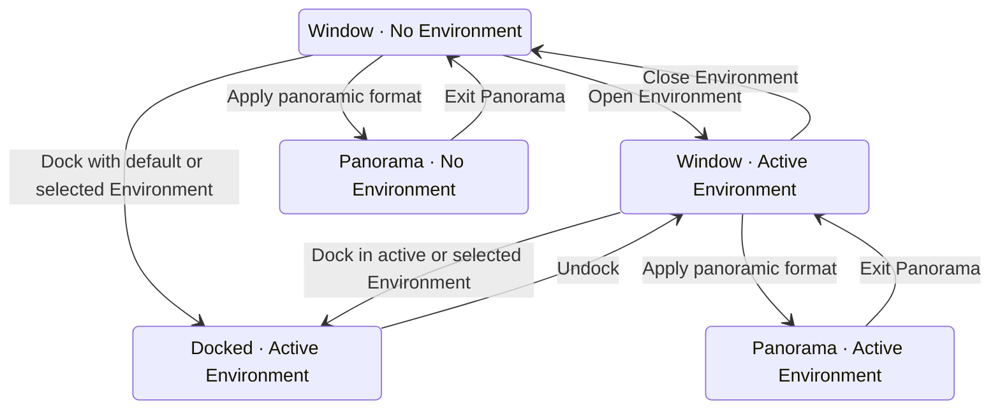

# Enchron V1 产品规格

V1 是 Enchron 第一个完整可组装版本，不是只验证单一路径的演示。最低运行系统为 visionOS 27，不提供 visionOS 26 兼容路径。具体按钮、布局和组件参数以生产代码为准；本文件只保留产品能力与不可破坏的行为。

## 媒体与来源

- Media Library 是 App 管理的虚拟目录，只保存分类、媒体引用和播放状态，不保存媒体字节。用户可以创建、重命名、嵌套和移除 Library Folder，并在目录间移动 Media Reference；这些操作不得移动、复制或删除原始媒体。
- Add Files 和 Add Folder Contents 保存系统文件 bookmark；Add from Photos 保存 `PHAsset.localIdentifier`；Add to Media Library 保存 SMB 或 WebDAV 来源 ID 与远程路径。播放时才把引用解析为原始 URL；解析失败时保留引用并给出恢复来源的反馈。
- 来源浏览器支持用户授权的本地文件、Photos 视频选择、SMB 和 WebDAV；远程目录支持导航、刷新和添加到 Media Library。Media Library 支持目录导航、搜索、排序与网格/列表显示。
- 远程凭据只存入 Keychain；权限、认证、网络和文件错误给出可恢复反馈。
- 选择媒体直接进入播放。一个产品播放对应一个 PlaybackCore Media Session，失败时不静默切换到另一套媒体实现。
- 提供播放、暂停、重播、前后跳转、seek、时间反馈、倍速、可用音轨与逐帧操作；可用能力只来自当前会话。
- 保存进度并支持询问续播、总是续播、总是从头开始；播放结束支持停止、单集循环或播放下一项。

## 呈现与场景

- 所有媒体默认以 Flat + Mono 在 Window 显示。媒体元数据或用户选择只更新格式，不自动离开 Window。
- Window、Docked 与 Panorama 使用同一个 `VideoPlayerComponent` consumer 合同；切换 Presentation 不重开 Media Session，也不建立 `VideoMaterial` 平行产品路径。
- Window 顶部的 Dock 菜单选择场景后直接进入 Docked；Deck 的 Dock 使用当前场景，没有当前场景时使用默认场景。
- Docked 使用 Environment 的唯一 `PlaybackSurfaceAnchor` 作为基准位置和朝向。Screen Size 以一米基准高度的百分比呈现并对整个 Video Entity 等比缩放；宽度由 RealityKit 根据视频宽高比生成。控制范围为 50%–250%，步进 5%；设置按 Environment 保存并可恢复该场景推荐值。当前天空盒的推荐值为 130%，anchor 距默认观看原点 4 米。
- Window 顶部的 Video Format 菜单正交选择 Projection（Flat、180°、360°、Fisheye）和 Stereo Layout（Mono、Side-by-Side、Top-Bottom）。应用非 Flat 格式进入 Panorama；应用 Flat 保持 Window。
- Fisheye 只在来源已经携带 Apple AIME 投影元数据时成立；缺少该事实时保持 Window 并显示错误，不能伪造投影。
- Docked 和 Panorama 只显示 transport controls 与对应的返回动作，不显示互相冲突的空间入口。两者不能直接互转，必须先回到 Window。
- Undock 回到 Window 并保留已打开的 Environment。退出 Panorama 恢复进入前的 Environment Context。
- 平台打开、场景加载或 renderer attach 失败时保留同一媒体会话，恢复转换前稳定状态，并给出可重试反馈。

## 设置与数据

- 保存续播策略、播放结束行为、控件自动隐藏时长、默认场景和播放速度。
- 保存每个 Environment 的 Screen Size 与相对 Playback Surface Anchor 的用户 placement 调整。
- 显示并清理缩略图缓存与播放进度；清理不删除媒体文件或远程来源。
- 提供隐私说明、版本与构建信息、反馈地址和开源许可。

## 组装与验证

- 产品页面只组装生产组件并绑定产品状态。新 UI 先搜索现有组件；共享变化修改组件，页面特有变化修改页面。
- DesignPreview、SwiftUI Preview 与测试可以注入确定性 fixture，但不得维护平行页面或第二套产品行为。
- 运行事实通过 OSLog 和 signpost 暴露；不建设 Enchron CLI、自定义调试协议、Debug Overlay 或产品内日志面板。
- 验证严格按 PlaybackCore L1 → Enchron macOS App L2 Core scenario → Enchron macOS App L2 App Adapter scenario → visionOS Simulator → L3 Vision Pro 执行。前一门槛未通过时，不用后一层结果代替。
- Enchron macOS App 使用真实视频与音频、真实 AVFoundation renderer、共享 synchronizer 和 RealityKit consumer，证明持续播放、seek、连续 seek、快进、快退、rate、音量、静音、音画同步、close/reopen、颜色/HDR 信令与稳定性；Core scenario 通过后才能接入 `PlaybackRuntime`。
- Swift Testing / XCTest 验证纯逻辑和适配边界，XCUIAutomation 验证可访问交互，`xcodebuild` 与 `.xcresult` 保存结果。Simulator 验证 UI、平台 API 和基础 RealityKit 生命周期；硬件解码、HDR/EDR、最终 Panorama、空间舒适度和性能必须在 Vision Pro 验证。完整门槛见 [`acceptance/verification-system.md`](acceptance/verification-system.md)。
