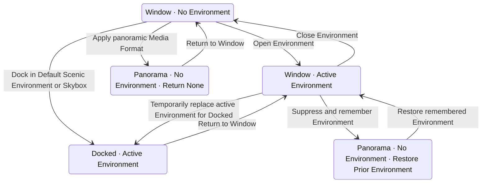

# Enchron V1 产品规格

V1 是 Enchron 第一个完整可组装版本，不是单一路径演示。最低运行系统为 visionOS 27，不提供 visionOS 26 兼容路径。本文定义产品能力和不可破坏的行为；领域术语以 [`CONTEXT.md`](../CONTEXT.md) 为准，视觉参数与组件样式由生产组件负责。

## 产品状态

Playback Lifecycle、Media Format、Playback Presentation 与 Environment Context 是四个正交状态轴：

- Playback Lifecycle 说明 Media Session 当前处于 loading、playing、paused、ended 等哪个阶段。
- Media Format 说明如何解释画面，只由 Projection 与 Stereo Layout 组成。
- Playback Presentation 说明视频位于 Window、Docked 或 Panorama。
- Environment Context 说明当前是否存在一个活动 Environment 及其 Environment Effect。

进入 Panorama 会把当前 Environment Context 变为 none，并把进入前的 Environment Context 捕获为 Panorama Return Environment Context。后者只负责返回 Window 时的恢复，不是第五个正交状态轴，也不代表 Panorama 中仍有活动 Environment。

Presentation 转换不得重新打开媒体或更换 Media Session。每次转换先捕获转换前的播放意图；原本正在播放时，转换期间暂停媒体，目标 Presentation 达到对应的成功后置条件后恢复播放。原本处于 ready、paused 或 ended 时不自动开始播放。播放中的转换只有在目标画面稳定后提交；Ready、Paused 与 Ended 没有新帧时，以目标 surface 已绑定同一 Media Session 的 renderer 作为提交条件。任何失败都回滚到转换前的稳定 Presentation、Environment Context 与播放意图，保留同一 Media Session 并给出可重试反馈。

Window、Docked 与 Panorama 之间使用 visionOS 系统视觉交接。请求接受后，原先 Playing 的当前 Media Session 在平台效果前进入 Paused，实际时间线、音频和显示帧停止；暂停失败时平台效果不开始。转换期间源与目标不能同时接受播放界面输入，只迁移同一个 renderer consumer，并且不显示只属于媒体打开或故障恢复的 `LoadingSpinner`。目标 Immersive Space、Environment 或黑色周围环境、视频表面和播放控件达到成功后置条件后提交目标 Presentation，并保持 Paused；只有用户在当前可见界面显式点击 Play 才继续。失败时保留同一 Media Session，恢复源 Presentation 并保持 Paused。验收检查明显黑帧、闪烁、重复界面、错误界面、输入归属和最终状态，不规定 Enchron 自有的透明度曲线、源与目标的并行准备关系或淡入淡出截止点。

## 媒体与来源

- Media Library 是 Enchron 管理的虚拟分类器，只保存 Library Folder 与 Media Reference，不保存媒体字节，也不是文件管理系统。
- 用户可以创建、重命名、嵌套和移除 Library Folder，并在其中移动或移除 Media Reference。同一个父级下的 Library Folder 显示名在去除首尾空白并按本地化、不区分大小写比较后必须唯一；不同父级可以使用相同名称。创建或重命名造成同级重名时保留原状态并显示可恢复提示。移除非空 Library Folder 时，在用户明确确认后递归移除整棵虚拟子树及其中的 Media Reference，不把内容自动移动到父级或 Media Library 根层；这些操作不得移动、复制或删除原始媒体。
- Media Library 与 Source Browser 共享层级浏览导航：进入子层级、通过面包屑返回祖先以及后退或前进只改变当前浏览位置，往返后内容位置与媒体身份保持不变。Library Folder 使用虚拟 identity 层级；Remote Source 使用来源 identity 与目录路径。共同导航界面不改变所有权，Source Directory 不因此获得创建、重命名、移动或删除操作。
- Media Library 搜索只过滤用户当前打开的 Library Folder 的直接子 Library Folder 与 Media Reference，不递归拉取更深层结果，也不把整个 Media Library 扁平化为一个结果列表。进入另一个 Library Folder 后，搜索作用于新的当前层级。搜索匹配用户可见名称：Library Folder 使用完整显示名，Media Reference 使用去掉文件扩展名后的显示名；查询去除首尾空白后按本地化、不区分大小写的包含关系匹配，不搜索隐藏路径、来源、codec 或其它 metadata。
- Local Source 的媒体由 visionOS 文件系统或 Photos 拥有。Add Files 和 Add Folder Contents 保存系统 bookmark；Add from Photos 保存 Photos identifier。
- Remote Source 的媒体与目录由 SMB 或 WebDAV 服务拥有。Enchron 按其原有 Source Directory 只读浏览、刷新和播放，不创建、重命名、移动或删除远程文件与目录。
- Add to Media Library 只保存 Remote Source ID 与远程路径。播放时才解析真实来源；解析失败时保留 Media Reference 并提供恢复来源的操作。
- 远程凭据只存入 Keychain，并按服务器与账号命名空间隔离；同一 SMB 账号的不同 share 可以共享凭据，不同账号不得互相覆盖。旧版服务器级 Keychain 记录在账号匹配时迁移到账号命名空间。权限、认证、网络与文件错误必须给出可恢复反馈。
- 远程媒体在首次形成可用音视频输出前，连接、来源解析或打开失败可以在预先规定的次数和总等待时间内自动重新解析同一 Media Reference 并重新打开。每次失败尝试都必须完整关闭其 Media Session 并释放来源访问资源；最终最多只有一个活动 Media Session。规定范围内仍未成功时，播放显式进入 failed。
- 远程媒体在首次形成可用音视频输出后遇到读取失败时，当前播放停止并显式进入 failed，不得在背景自动创建或替换 Media Session。Window 或空间 Player Control Dock 所在的系统窗口通过 SwiftUI 系统警告框（`.alert`）提供 Retry 与 Close；只有用户选择 Retry 后，Enchron 才重新解析同一 Media Reference 并创建新的 Media Session。
- Retry 重新解析得到的 Content Revision 与失败前一致时，新 Media Session 从失败前最后一次满足全部可用音视频输出条件的观测所记录的 media time 开始。该观测必须属于失败前的 Media Session 与当前 stream epoch，并且已经直接证明时间线、显示画面和存在音轨时的音频都在正常输出。不得使用原始打开位置，也不得使用尚未被播放管线实际证明的界面 Seek 请求位置。
- Retry 重新解析得到的 Content Revision 已变化或无法可靠验证时，不得使用失败前的位置。Enchron 说明媒体内容已变化或无法确认一致性，并直接从零创建新 Media Session；这条说明不阻塞播放，也不再要求用户确认。来源仍无法访问时保持 failed，显示 Retry 与 Close，不创建活动 Media Session。
- 选择媒体直接承诺打开它。一次产品播放对应一个 PlaybackCore Media Session；失败时不静默切换到另一套播放实现。
- H.264、H.265/HEVC 与 AV1 视频属于产品必须接入的 video codec；失败只能来自具体媒体损坏、缺少必要 codec configuration 或当前平台明确不支持的 profile/level，不能因为容器同时携带 FLAC 音轨而把已经可显示的视频留在半启动状态。VP9 不是必须接入的 video codec；当当前设备的 VideoToolbox 对 VP9 没有可用于压缩 sample 渲染路径的解码能力时，必须在启动 renderer graph 前以明确的 unsupported-codec failure 拒绝，不得进入仅有音频、LoadingSpinner 常驻或空板的半启动状态。音频编码不能由 `AVSampleBufferAudioRenderer` 直接接收时，PlaybackCore 使用同一个 FFmpeg provider 将已接入的编码解码为线性 PCM；当前至少覆盖 FLAC。没有直接接收能力且尚未接入解码器的音频 codec 必须在启动 renderer graph 前给出明确的 unsupported-audio-codec failure。

## 独立字幕文件

- V1 支持 SubRip（`.srt`）、WebVTT（`.vtt`）和 ASS/SSA（`.ass`、`.ssa`）独立字幕文件。它们与容器内字幕共同进入当前 Media Session 的字幕轨列表，并使用同一套字幕选择、时间线、Seek、Off、Window、Docked 与 Panorama 呈现规则。
- 从能够枚举 Source Directory 的 Local、SMB 或 WebDAV 来源打开媒体时，Enchron 在同一目录发现与视频文件主名称完全相同，或以该主名称加语言、地区或用途后缀命名的受支持字幕文件。例如 `Movie.srt`、`Movie.zh-CN.ass` 与 `Movie.forced.vtt` 都可以关联 `Movie.mkv`。扩展名比较不区分大小写；名称不满足该规则的文件不自动关联。
- 自动关联只把候选文件加入字幕轨列表，不在多个候选之间猜测，也不覆盖用户已经选择的字幕轨。单文件授权与 Photos 不提供可枚举的同级 Source Directory，因此静默略过独立字幕查找；用户通过获得目录授权的本地文件夹或可枚举的 SMB/WebDAV Source Directory 打开媒体时才取得同目录候选。
- 独立字幕文件的保证使用范围是当前 Media Session。选择后保持同一 Media Session、renderer graph、Playback Lifecycle、Playback Presentation 和媒体时间；字幕读取使用自己的来源授权与 Content Revision，Close、打开另一媒体或当前 Session 失败时释放相应访问资源。
- 无法访问、解析失败、格式不支持或读取中断只使该独立字幕轨不可用，并给出可恢复的字幕错误；当前视频、音频和已经可用的其它字幕轨继续工作。失败不得创建第二个 Media Session、把未知文件当成空字幕成功，或在旧字幕 cue 仍可见时静默切换来源。

## 音轨与字幕轨选择偏好

- 用户明确选择的音轨稳定身份，以及字幕轨稳定身份或 Off，按 Media Identity 与 Content Revision 保存。它们独立于 Persistent Viewing State，不受媒体时长、有效播放时间、Resume 或已看完条件限制。
- 再次打开相同媒体版本时，Enchron 先取得容器轨和已经成功自动关联的独立字幕轨，再恢复保存的音轨与字幕选择。轨道恢复在当前 Media Session 内完成，不重新打开媒体、不创建第二个 renderer graph，也不改变 Playback Presentation。
- 保存的轨道身份必须来自 PlaybackCore 发布的稳定 identity；不得保存 UI index，也不得用语言、标题、显示名称或当前菜单顺序猜测替代轨道。字幕 Off 是用户明确选择，必须与“从未保存字幕偏好”区分并在再次打开时保持 Off。
- 保存的轨道当前不存在或不可用时，打开媒体仍然成功：音频保留 PlaybackCore 当前默认音轨，字幕保留当前选择或 Off，并记录该偏好未能恢复。缺失轨道不会被其它轨道静默替代；用户随后明确选择可用轨道时覆盖旧偏好。
- Content Revision 变化或无法可靠验证时删除旧 Track Selection Preference，并按新媒体的默认轨道行为打开；轨道选择、观看状态和 Media Format Preference 共用 Media Identity 与 Content Revision 权威。

## Playback Collection 与 Play Next

- 用户选择媒体时，以它所在的 Library Folder 或 Source Directory 建立 Playback Collection。两者都是队列范围，但所有权不同。
- Playback Queue 在开始播放时从该 Collection 按名称自然升序生成并固定。数字按数值比较，因此 `Episode 2` 位于 `Episode 10` 之前。
- Library 搜索、浏览排序和后续目录变化不修改当前 Playback Queue；用户从另一个 Collection 或另一媒体重新开始时建立新队列。
- Episodes 与 Play Next 使用同一个固定队列，不提供独立排序，也不跨目录按相似名称自动拼接。
- 当前项已是队尾时，Play Next 回到 ended 控制语义，不跳到其他来源或旧 Library 游标。
- 队列切换为每个新媒体重新读取它自己的 Media Format Preference。当前 Presentation 与新格式兼容时保留：Docked 可继续呈现 Flat，Panorama 可继续呈现 panoramic；不兼容时先回 Window，再根据新媒体的格式决定是否进入 Panorama。Docked 不因此成为持久化偏好。

## Persistent Viewing State

Enchron 只持久化可恢复位置或已看完，不建设通用观看历史、Recently Played 或可扩展观看状态机。

- 状态属于 Media Identity，不属于 Media Reference；相同底层媒体从不同 Library Folder 或来源入口打开时共享一份状态。
- Media Identity 与 Content Revision 由一套共享权威生成。播放进度、Media Format Preference 与 Track Selection Preference 可以分别存储，但不得分别实现媒体身份或文件变化算法。
- 总时长不足 15 分钟的媒体不保存可恢复位置，也不保存已看完。
- 当前 Media Session 累计至少 15 秒有效播放后才算真正开始。只有 Lifecycle 为 playing 且媒体时间线实际前进才累计；暂停、缓冲和 seek 跳跃不计入。
- 剩余时间不超过 `min(duration × 10%, 5 minutes)` 时不保存 Resume。仅进入这个区间不等于已看完。
- 保存位置时同时保存 position、duration 与 Content Revision。再次打开时只有版本一致才允许 Resume；版本变化或无法可靠取得时清除旧状态并从头播放。
- Resume Policy 为询问时只提供 Resume 与 Start Over。媒体选择已经表达打开意图，因此不提供 Cancel 或 Back-to-Browser。
- 总时长不少于 15 分钟的媒体只有自然播放结束才标记已看完；seek 或退出时接近结尾不标记。已看完媒体再次打开时从头播放且不询问 Resume。
- 新一轮观看达到可恢复条件时可以用新的可恢复位置替换已看完；用户清除单项或全部进度时同时清除已看完。
- Persistent Viewing State 不自动过期。
- 文件夹进入后，Viewing Progress Projection 以批量后台操作读入并按 Media Identity 缓存。卡片 Gaze/Hover 只读取内存，不触发磁盘、媒体解析或网络 I/O。
- 卡片底边图形按保存的 `position / duration` 绘制，表示上次已知观看进度；打开媒体时才执行 Content Revision 的最终 Resume 验证。已看完显示完整进度。

## Media Format

- Media Format 由 Projection 与 Stereo Layout 正交组成。Enchron 当前不自动识别、推断或应用这两个维度。
- 没有有效用户偏好时使用 Flat + Mono。
- Window 的 Panorama 二级菜单提供 Projection：180°、360°、Fisheye；Stereo Layout：Mono、Side-by-Side、Top-Bottom。用户选择完整组合后点击 Apply，成功后关闭 Window 并进入 Panorama。
- Fisheye 只有来源携带 Apple Immersive Media Experience（AIME）投影事实时才可应用。该事实只验证资格，不替用户选择格式。
- 用户选择按 Media Identity 与 Content Revision 保存为 Media Format Preference，不受 15 分钟观看状态门槛影响。
- 相同媒体版本再次打开时，在完成 Resume 或 Start Over 决策后自动进入保存的 Panorama 格式。Docked 不自动恢复；转换失败时以同一 Media Session 回退 Window。
- 初始或保存的 Media Format 必须先在当前 Media Session 内完成应用，随后才允许 RealityKit surface 挂载和播放启动；不得让默认画面抢先启动后再异步改格式。
- 从 Panorama 返回 Window 只改变 Playback Presentation，不清除 panoramic Media Format。此时不提供 Docking；Panorama 按钮直接恢复刚才的格式。用户在 Panorama Advanced Settings 中修改格式。
- Panorama Advanced Settings 提供 Reset to Flat + Mono。成功后删除该媒体的 Media Format Preference、返回 Window 并恢复 Docking 与首次 Panorama 格式入口；不清除观看状态。
- HDR、Codec 与 Resolution 是只读媒体/渲染事实。V1 不提供 HDR 开关，也不声称在没有正式 tone mapping 能力时把 HDR 转换为 SDR。

## Environment 与 Docked Placement

- 当前交付四个稳定 Environment Identity：三个 Scenic Environment 暂以淡红、淡绿和淡蓝内容区分，一个 Skybox Environment 使用当前 Skybox 内容；未来替换正式名称与场景资源时保留 identity。资源颜色只区分占位内容，不成为产品名称或持久化 identity。
- Day 与 Night 是同一 Scenic Environment 内部的视觉特效状态，共享 Environment Identity、等价的 Playback Surface Anchor 语义和同一份用户摆位，不形成两个 Environment。Skybox Environment 具有单一固定外观，不提供 Environment Effect。
- Window 界面的 Environment Tab 激活独立的 Environment Card Volume；它是所有非 Docking 场景操作的统一入口。该 Volume 必须使用 visionOS 26 起提供单例语义的 `Window` Scene 并保持 volumetric window style；所有入口都聚焦同一个实例，不使用 `WindowGroup` 创建副本。
- Environment Card 按四个 Environment Identity 展示卡片并打开用户选择的场景，不把 Day/Night 拆成两个浏览项。三个 Scenic Environment 的卡片提供 Day/Night Environment Effect 控制；Skybox Environment 卡片只提供打开操作；当前活动 Environment 可以关闭。
- Environment Card 不提供 App 内 Return 按钮；用户通过 visionOS Window Bar 关闭 Volume。它不进入 Playback Deck，也不在 Panorama 中出现。
- Environment Card 是 volumetric `Window`，不具有 Immersive Space 的 immersion style。它打开的 Enchron Immersive Space 在 Environment、Docked 与 Panorama 中统一使用 Progressive immersion，用户在三种空间内容中都可以通过 Digital Crown 调节沉浸量。
- Progressive immersion amount 的允许范围为 `0.3...1.0`。visionOS 拥有当前值，Enchron 观察并在当前 App 进程内记住最近值；该值不写入 Preferences、Resume、数据库或文件。
- 一次 Immersive Space Open Cycle 从 Scene 确认出现开始，到同一个 Scene 确认消失结束。同一 Open Cycle 内 Environment、Docked 与 Panorama 的合法切换不得重置用户当前的 Progressive immersion amount；Digital Crown 调节后的值立即成为后续空间内容继续使用的当前值。
- 当 Environment 或 Docked 使一个 closed Immersive Space 重新打开时，初始沉浸量使用当前进程内最近观察值；没有最近值时使用 visionOS 的系统默认值。只有 Panorama 使 closed Immersive Space 重新打开时，初始沉浸量为 `1.0`；打开以后仍允许用户通过 Digital Crown 调低。已经 open 时进入 Panorama 不重新应用 `1.0`。
- Settings 提供 Default Scenic Environment，用户只在三个 Scenic Environment identity 中选择。该偏好跨 App 进程保存；它不包含 Environment Effect，不表示当前 Environment Context，也不自动打开或切换 Environment。用户只能在没有活动 Media Session 的浏览状态进入 Settings；此时可以保留一个已经活动的 Environment，修改默认值不得改变它。
- Window 的 Dock Menu 顶部依次显示 Default Scenic Environment 的两行圆形裁切缩略图入口：Dark 使用其 Night Effect，Light 使用其 Day Effect；分隔线下方显示固定 Skybox Environment 的单行圆形裁切缩略图入口。菜单不列出另外两个非默认 Scenic Environment，也不继承当前活动 Environment。
- 选择任一 Dock Menu 入口只决定本次 Docked Presentation 使用的 Environment 与受支持的 Effect。存在活动 Environment 时先保存其 Environment Context，Docked 临时使用菜单目标；返回 Window、退出媒体或转换失败时恢复进入 Docked 前的 Environment Context，不把临时目标写回 Environment Card 或 Default Scenic Environment。
- Docked Video Entity 使用 Environment 的 Playback Surface Anchor 作为基准，并由 Screen Size、Distance 与 Elevation 表达用户调整。
- Screen Size 是相对一米基准高度的等比缩放，范围 50%–250%、步进 5%；宽度由视频宽高比生成。
- Distance 是用户到屏幕的半径，范围为 0.5–10 米、步进 0.5 米，默认 4 米，与当前场景交付的 Playback Surface Anchor 基准距离一致。Elevation 范围为 −80°–80°、步进 5°；它以用户为球心、当前 Distance 为半径沿垂直圆弧调节，屏幕始终朝向用户，不得把相对 anchor 的局部偏移误当作用户距离，也不得退化为世界坐标 Y 平移。
- Screen Size、Distance 与 Elevation 按稳定 Environment identity 持久化；同一 Scenic Environment 的 Day/Night Effect 共享摆位。关闭媒体、建立新 Media Session 或终止并重新启动 Enchron 后仍恢复；不同 Environment 不能共享保存值。Restore Defaults 恢复当前 Environment 的完整推荐摆位。

## Window 与 Playback Deck

- Window 视频界面左上角拥有 Back，右上角依次放置 Dock、Video Format 与 More；视频画面不叠加标题或媒体信息。
- Window 播放控件以底部 Ornament 呈现，不显示 Settings 与 More。第一行把同尺寸的后退 15 秒、Play/Pause/Replay、前进 15 秒放在左侧，右侧的只读 Thick Material 信息区显示文件名并在 Hover 时显示与空间 Deck 相同的两组媒体信息；普通 Progress Bar 独占第二行。
- Window Playback 的宽高比来自 PlaybackCore 报告的当前视频显示尺寸；Side-by-Side 与 Top-Bottom 先按 Stereo Layout 换算单眼显示尺寸。只有播放头尚未交付有效尺寸时，启动占位才临时使用 16:9。收起状态的 PlayerControls Ornament 外部宽度是 Window 宽度范围的唯一基准：最小、默认和最大宽度分别为其 1.25、1.75 和 2.50 倍，并对齐到 16pt；对应高度始终由当前视频宽高比计算。Precision Timeline 展开时 Ornament 可以扩展到与空间 Player Control Dock 相同的精确时间轴宽度，但不得触发 Window 尺寸跳变。
- Settings 展开 Advanced Settings；More 提供 Subtitles、Audio Track、Playback Speed 与 Episodes。Subtitles 统一包含 Off、容器内字幕轨和自动关联的同目录独立字幕轨；用户选择轨道时不需要区分来源。没有可用音轨或队列时不显示对应的空菜单。
- Advanced Settings 在 Docked 提供 Screen Size、Distance、Elevation、Restore Defaults，在 Panorama 提供 Projection、Stereo Layout 与 Apply。Precision Timeline 由 Progress Bar 的圆形 scrubber 双击打开，不属于 Settings。
- Precision Timeline 支持精确 seek 与逐帧，完成后保持暂停。用户通过视频表面隐藏整个 Player Controls 时结束 Precision Timeline 的临时展开状态；再次召唤控件时显示普通 Progress Bar。Progress Bar 拖动期间的时间标识随本地预览位置连续更新，松手才提交 seek；seek 到结尾之前保持拖动前的 playing/paused 意图，从 ended 拖动离开结尾后保持暂停。
- Progress Bar 将手势与视觉位置限制在自身 `0...1` 几何范围，但不拥有媒体 Seek 合法范围。PlaybackCore 根据当前 provider 的可 Seek 范围统一收束有限 target 或拒绝不可 Seek与非有限请求；PlaybackFeature 根据收束后的普通位置、结尾或从 Ended 离开结尾决定产品播放意图。
- 前后 15 秒保持原来的 playing/paused 意图；从 ended 后退会离开结尾并保持暂停。逐帧始终保持暂停。
- Enchron 不提供 App 内 Volume 或 Mute，不保存相对音量。播放保持正常基准增益，最终音量与静音由 visionOS、Digital Crown 和系统音频界面控制。

## Docked、Panorama 与退出

- Docked 的 Video Entity/Mesh 不承载可点击按钮。Docked 与 Panorama 召唤同一个 `PlayerControlDock`，均提供播放控制、Settings 与 Return to Window，不提供直接 Back-to-Library。
- `PlayerControlDock` 的外部结构在 Docked 与 Panorama 中保持一致。顶部只读 Thick Material 信息区在普通状态显示去掉扩展名的文件名；Hover 时文件名轻微上移，并在同一固定尺寸区域的左信息区显示 Projection 与 Stereo Layout，在右信息区显示 Resolution、HDR、Codec 与 Frame Rate。该区域不可点击，也没有进一步展开状态。
- Player Control Dock 的操作行把 Settings 与 Return to Window 放在左侧、More 放在右侧，后退 15 秒、Play/Pause/Replay、前进 15 秒组成独立且以 Play 为面板几何中心的 transport group。Docked 与 Panorama 的 Return 图标不同；只有 Settings 展开内容不同：Docked 调整 Screen Size、Distance、Elevation 与 Restore Defaults，Panorama 调整 Projection、Stereo Layout、Apply 与 Reset。
- Player Control Dock 的 More 与 Window More 使用相同的 Subtitles、Audio Track、Playback Speed 与 Episodes 产品操作；字幕轨或音轨选择不会改变当前 Playback Presentation。
- Window、Docked 与 Panorama 的 Precision Timeline 使用相同的展开宽度。Window 展开后保留第一行的 transport 与媒体信息，由 Precision Timeline 替换第二行的普通 Progress Bar。普通 Progress Bar 与 Precision Timeline 是不同控件。
- Window Back 关闭当前 Media Session 并回到 Media Library。
- 返回 Window 或 Media Library 时结束本次 Docked Environment Effect，并恢复进入 Docked 前的 Environment Context。此前存在 Enchron Environment 时继续保留它原有的 Environment Effect；此前不存在时仍保持没有活动 Enchron Environment，System Surroundings 由 visionOS 决定。
- 进入 Panorama 时，当前 Environment 与 Environment Effect 停止活动，Panorama 的 Environment Context 为 none；同一个 Enchron Immersive Space Open Cycle 保持打开，当前 Progressive Immersion Amount 不变。Panorama 只呈现黑色周围环境与视频投影球面。
- Panorama Return Environment Context 保存进入前的 Environment 身份与 Effect。返回 Window 时，进入前为 active 就在同一 Open Cycle 内恢复原 Environment 与 Effect；进入前为 none 就保持 none，并关闭不再需要的 Enchron Immersive Space。
- Docked 与 Panorama 不直接互转，必须经过 Window。

## 系统关闭空间与同进程恢复

- Home View 或其他 visionOS 系统行为使 Enchron Immersive Space 消失时，Enchron 释放已经失效的空间资源，并仅在当前 App 进程的内存中保留 Spatial Recovery Intent。它记录原来的 Docked 或 Panorama、Media Session 身份和转换前的播放意图，但不形成第四种 Playback Presentation，也不写入 Resume、UserDefaults、SceneStorage、数据库或文件。
- 用户在同一 App 进程仍存活时重新激活 Enchron，Enchron 显式重新打开 Immersive Space，重建 RealityKit 内容并重新绑定原 Media Session 的 renderer；目标 surface 已绑定原 renderer，并且达到相应 Presentation 的成功后置条件后，恢复原来的 Docked 或 Panorama 以及播放意图。恢复失败时安全回到 Window，并停止自动重试。
- visionOS 终止 App 进程后，内存中的 Spatial Recovery Intent 随进程消失。下一次启动按冷启动和普通 Resume 规则处理，不自动恢复 Docked 或 Panorama；Enchron 不尝试检测即将发生的进程终止，也不持久化空间形态来模拟同进程恢复。

## Ended

- End Behavior 支持 Stop、Repeat One 与 Play Next。Stop 表示不自动重播或播放下一项，不等于关闭 Media Session。
- Stop 后保留当前 Media Session 与 Playback Presentation；视频画面为纯黑，不自动显示结束信息或播放控件。
- 用户召唤 Playback Deck 后，主按钮显示 Replay。Replay 从零开始播放。
- ended 时后退、拖动到结尾之前、Precision Timeline 和上一帧可用；位于结尾时前进与下一帧禁用，不能保留可点击但无效果的操作。
- Progress Bar、后退 15 秒、Precision Timeline 或上一帧从 ended 定位离开结尾后都保持暂停。seek 到结尾本身仍为 ended、纯黑和 Replay，并且不构成自然播放结束。
- 所有这些操作继续使用同一 Media Session。

## 设置与数据

- 保存 Resume Policy、End Behavior、控件自动隐藏时长、Default Scenic Environment 与默认播放速度。Default Scenic Environment 只保存三个 Scenic Environment 之一的稳定 identity；Skybox Environment 不进入该选择器。
- 默认播放速度是打开 Media Session 时的初始 rate，不是在 timeline 尚未建立时发送的第二条播放控制命令；自动化覆盖值只影响该次验证启动，不写入用户设置。
- 显示并清理缩略图缓存与 Persistent Viewing State；清理不得删除媒体文件、Media Reference 或 Remote Source。
- 提供隐私说明、版本与构建信息、反馈地址和开源许可。

## 组装与验证

- 产品页面只组装生产组件并绑定产品状态。DesignPreview、SwiftUI Preview 与测试可以注入确定性依赖，但不得维护平行页面、测试专用产品行为或第二套状态机。
- 产品规则必须由唯一状态 owner、最小跨边界 API、编译依赖方向和自动化测试共同约束，不能只依赖目录、注释或代码审查。
- 运行事实通过 OSLog、signpost、Xcode、LLDB、Console 与 Instruments 暴露；不建设 Enchron CLI、自定义调试协议、Debug Overlay 或产品内日志面板。
- 验证按被证明的事实组织。PlaybackCore 与纯逻辑合同、物理 Vision Pro 自动回归，以及物理 Vision Pro 上的性能、声学和佩戴感知专项验收分别形成证据，互不代替。
- visionOS 产品集成验证使用真实媒体、生产 `PlaybackRuntime`、真实音频和视频 Renderer、共享时间同步器与 RealityKit 渲染接收方，证明持续播放、音画同步、Seek、连续 Seek、快进、快退、播放速度、关闭后重新打开、颜色与 HDR 信令和稳定性。App 不模拟系统音量界面；底层增益测试不代表产品提供了音量或静音功能。
- Swift Testing / XCTest 验证纯逻辑、状态转换和适配边界；XCUIAutomation 验证可访问交互；`xcodebuild` 与 `.xcresult` 保存结果。
- App、UI、平台 API、RealityKit 生命周期、硬件解码、HDR/EDR、最终 Panorama、系统音频和性能均在物理 Vision Pro 上验证。Swift Testing 与 XCTest 继续承担可以直接调用的纯逻辑、状态转换和协议合同；它们不替代真实设备上的产品运行。完整门槛见 [`acceptance/verification-system.md`](acceptance/verification-system.md)。
