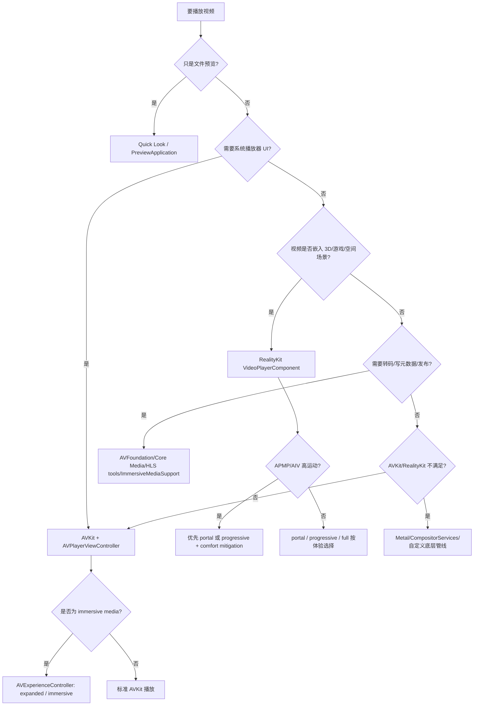

> This is external migration audit input, not Enchron final normative guidance. Final decisions remain governed by Apple official documentation, `ARCHITECTURE.md`, active contracts, project product philosophy, `.agents/skills/visionos-platform/` references, and project quality gates.

# visionOS 开发差异与视频播放审计报告（visionOS 26 可用版）

版本：2026-05-22
适用范围：iOS / iPadOS / macOS 团队迁移或新建 visionOS 应用。
版本假设：以 visionOS 26 与对应 Xcode / SDK 为主；如果你的最低部署版本低于 visionOS 26，本报告中标注为 visionOS 26 的能力需要 `@available`、运行时能力判断或降级路径。
验证原则：本版只使用 Apple 官方文档、Apple Developer 视频、App Store Connect Help 与 Apple 官方示例/规格页作为依据。

---

## 1. 执行摘要

visionOS 不是“多了一个屏幕尺寸”的 iPadOS，也不是“把 macOS 窗口搬进头显”。Swift、AVFoundation、SwiftUI、UIKit、RealityKit 等框架仍然熟悉，但系统契约发生了变化：应用从屏幕中心转为场景中心，从直接触控转为眼手输入与空间输入，从二维布局转为空间布局，从单一前台窗口转为 Shared Space / Full Space 的多容器运行模型。Apple 的 visionOS 开发入口把空间体验描述为 windows、volumes、immersive spaces 这几类构建块，HIG 也强调 Vision Pro 提供的是可以承载窗口、视体、3D 对象和沉浸体验的空间画布。依据：[Designing for visionOS](https://developer.apple.com/design/human-interface-guidelines/designing-for-visionos)、[Get started with building apps for spatial computing](https://developer.apple.com/videos/play/wwdc2023/10260/)。

本版与原文相比，做了四类修订。

| 原文问题 | 本版处理 | 验证依据 |
|---|---|---|
| 引用为 `turnXXsearchYY` 临时编号，不可复核。 | 全部替换为 Apple 官方链接。 | Apple Developer / App Store Connect Help |
| “注视触发 hover”表述过宽。 | 改为：系统使用眼睛参与目标选择和反馈，但 app 不获得原始 gaze；`onHover`/指针 hover、RealityKit hover effect、系统 gaze 反馈要分开处理。 | [Get started with building apps for spatial computing](https://developer.apple.com/videos/play/wwdc2023/10260/)、[Designing for visionOS](https://developer.apple.com/design/human-interface-guidelines/designing-for-visionos) |
| “ARKit 只在 immersive space”表述过旧。 | 改为：ARKit 空间数据通常要求 app 呈现 Full Space 且其他 app 隐藏；visionOS 26 又提供 RealityKit 直接接入 ARKit 数据的 SpatialTrackingSession 等新路径。 | [Setting up access to ARKit data](https://developer.apple.com/documentation/visionos/setting-up-access-to-arkit-data)、[What’s new in RealityKit](https://developer.apple.com/videos/play/wwdc2025/287/) |
| 视频播放只覆盖常规视频/空间视频，缺少 visionOS 26 边界。 | 新增完整视频播放审计：2D、3D、spatial video、APMP 180/360/Wide FOV、Apple Immersive Video、AVKit/Quick Look/RealityKit/底层自定义管线。 | [Explore video experiences for visionOS](https://developer.apple.com/videos/play/wwdc2025/304/)、[Support immersive video playback in visionOS apps](https://developer.apple.com/videos/play/wwdc2025/296/) |

结论可以压缩成三条。

第一，应用结构要先变成 scene-first。不要先问“怎么把页面放到 Vision Pro 里”，而要先决定这个功能属于 window、volume、immersive space，还是只是兼容 iPad/iPhone app。

第二，标准系统能力优先。窗口、工具栏、hover/focus、播放控件、HLS、字幕、音频路由、舒适度缓解、沉浸式切换，这些能力越靠近系统实现越可靠。

第三，视频播放是 visionOS 的特殊高价值边界。传统 iOS/macOS 播放器仍可工作，但 visionOS 26 已经把沉浸式媒体扩展到 APMP、Apple Immersive Video、RealityKit `VideoPlayerComponent` 与 AVKit `AVExperienceController`。如果仍按“AVPlayerLayer + 自定义球面贴图”作为默认路线，会错过系统级字幕、音频、舒适度、投影元数据、转场和平台一致性。

---

## 2. 平台心智模型：是什么、为什么、怎么做

### 2.1 是什么

visionOS 的基本单位是 scene，而不是屏幕。常见容器是 window、volume、immersive space。window 适合二维 UI 和内容浏览；volume 适合有实体感的 3D 内容；immersive space 适合需要占据用户周围空间、使用 Full Space、或需要 ARKit 空间数据的体验。Apple 在 WWDC23 把这些称为空间计算的基础构建块；WWDC24/25 又继续扩展 volume、immersive space、scene restoration、surface snapping、scene bridging 等能力。依据：[Get started with building apps for spatial computing](https://developer.apple.com/videos/play/wwdc2023/10260/)、[Dive deep into volumes and immersive spaces](https://developer.apple.com/videos/play/wwdc2024/10153/)、[Set the scene with SwiftUI in visionOS](https://developer.apple.com/videos/play/wwdc2025/290/)。

### 2.2 为什么

iOS 的历史心智是近距离手持触控，macOS 的历史心智是桌面指针、多窗口和键鼠，visionOS 的历史心智则是“人在真实空间里与数字内容共处”。这会改变很多默认假设：窗口不一定占满屏幕，内容不一定是二维矩形，用户不一定一直看着你的 app，app 也不应假设自己可以随意读取眼动、相机或世界状态。

### 2.3 怎么做

迁移顺序建议如下。

1. 先把核心业务跑成原生或兼容 window 体验，保证多窗口、恢复、外设、字幕、音频、网络、后台下载都稳定。
2. 只有当内容必须具有真实体积或空间上下文时，才进入 volume。
3. 只有当功能需要 Full Space、空间感知、沉浸式媒体、ARKit world / hand / plane / scene 数据或完整环境控制时，才进入 immersive space。
4. 新增能力都做版本门控：visionOS 26 的 persistence、surface snapping、clipping margins、scene bridging、APMP、Apple Immersive Video、RealityKit immersive media 等，不应无条件回填到低版本。

---

## 3. 运行时容器与生命周期审计

| 维度 | iOS / macOS 常见心智 | visionOS 26 可用结论 | 建议 | 验证依据 |
|---|---|---|---|---|
| 应用入口 | iOS 常从单一屏幕或导航栈开始，macOS 常从窗口开始。 | visionOS 应先声明 scene：window、volume、immersive space。 | 把导航、恢复、深链、外部事件都映射到 scene。 | [Get started with building apps for spatial computing](https://developer.apple.com/videos/play/wwdc2023/10260/) |
| Shared Space | iOS 没有直接对应物；macOS 类似多窗口桌面。 | 多个 app 可以共处，用户决定窗口/视体的位置。 | 不要假设后台或失焦就等于用户看不到。 | [Meet RealityKit Trace](https://developer.apple.com/videos/play/wwdc2023/10099/) |
| Full Space | iOS/macOS 无直接对应物。 | Full Space 会隐藏其他 app；ARKit 数据访问通常要求 Full Space。 | 空间感知能力进入 Full Space 前要做状态机和权限判断。 | [Setting up access to ARKit data](https://developer.apple.com/documentation/visionos/setting-up-access-to-arkit-data) |
| Volume | 早期资料易被理解为固定容器。 | visionOS 2 起 volume 调整能力增强；visionOS 26 进一步支持 surface snapping、clipping margins、volume 内 presentation。 | 不要把 volume 行为写死；按最低部署版本做门控。 | [Dive deep into volumes and immersive spaces](https://developer.apple.com/videos/play/wwdc2024/10153/)、[Set the scene with SwiftUI in visionOS](https://developer.apple.com/videos/play/wwdc2025/290/) |
| 恢复与锁定 | iOS/macOS 恢复多为窗口/状态恢复。 | visionOS 26 支持窗口、视体和 widget 锁定到物理空间并持久化。 | 默认支持可恢复；临时工具窗、登录窗、一次性流程明确禁用恢复。 | [What’s New - visionOS](https://developer.apple.com/visionos/whats-new/)、[Set the scene with SwiftUI in visionOS](https://developer.apple.com/videos/play/wwdc2025/290/) |
| UIKit 增量迁移 | UIKit 应用通常自己管理 view controller。 | visionOS 26 通过 scene bridging 允许 UIKit 生命周期应用接入 SwiftUI volumes / immersive spaces。 | 现有 UIKit app 不必全量推倒；用 `UIHostingSceneDelegate` 增量桥接空间场景。 | [Set the scene with SwiftUI in visionOS](https://developer.apple.com/videos/play/wwdc2025/290/) |

示意代码：

```swift
@main
struct SampleVisionApp: App {
    var body: some Scene {
        WindowGroup(id: "main") {
            MainView()
        }

        WindowGroup(id: "model") {
            ModelVolumeView()
        }
        .windowStyle(.volumetric)
        .defaultSize(width: 1.0, height: 0.7, depth: 0.7, in: .meters)

        ImmersiveSpace(id: "immersive") {
            ImmersiveRootView()
        }
    }
}
```

UIKit 增量桥接示意：

```swift
import UIKit
import SwiftUI

final class MyHostingSceneDelegate: NSObject, UIHostingSceneDelegate {
    static var rootScene: some Scene {
        WindowGroup(id: "my-volume") {
            ContentView()
        }
        .windowStyle(.volumetric)
    }
}

let request = UISceneSessionActivationRequest(
    hostingDelegateClass: MyHostingSceneDelegate.self,
    id: "my-volume"
)!

UIApplication.shared.activateSceneSession(for: request)
```

审计结论：保留原文“scene-first”方向；删除“UIKit 必须推倒重写”的隐含假设；补入 visionOS 26 的锁定、恢复、surface snapping、clipping margins、scene bridging。

---

## 4. UI 框架、坐标、输入与隐私

### 4.1 UI 框架边界

| 领域 | 可用方向 | 不建议方向 | 验证依据 |
|---|---|---|---|
| SwiftUI | 新建 visionOS app 的首选 UI 路径；scene、window、volume、immersive space 声明都围绕 SwiftUI 展开。 | 用自定义 3D UI 代替所有标准控件。 | [visionOS - Apple Developer](https://developer.apple.com/visionos/)、[Set the scene with SwiftUI in visionOS](https://developer.apple.com/videos/play/wwdc2025/290/) |
| UIKit | 可用于兼容和迁移，尤其是已有 iOS/iPadOS 业务。visionOS 26 还可通过 scene bridging 增量接入 SwiftUI 空间场景。 | 假设所有 iOS UIKit API、方向、屏幕、触控、Pencil 语义都不变。 | [Making your existing app compatible with visionOS](https://developer.apple.com/documentation/visionOS/making-your-app-compatible-with-visionos)、[Set the scene with SwiftUI in visionOS](https://developer.apple.com/videos/play/wwdc2025/290/) |
| AppKit | 仍是 macOS UI 框架，不是 visionOS 原生 UI 方案。 | 把 AppKit window/panel 直接移植成 visionOS UI。 | [visionOS - Apple Developer](https://developer.apple.com/visionos/) |
| RealityKit | 3D 内容、实体、空间视频、空间媒体、自定义沉浸体验的默认高层路径。 | 一开始就自研 Metal 渲染和交互。 | [What’s new in RealityKit](https://developer.apple.com/videos/play/wwdc2025/287/) |
| Metal / Compositor Services | 用于明确需要自定义沉浸式渲染管线、低层 compositor 或远程沉浸预览的场景。 | 用它重写 AVKit/RealityKit 已经提供的媒体播放能力。 | [Set the scene with SwiftUI in visionOS](https://developer.apple.com/videos/play/wwdc2025/290/) |

### 4.2 坐标与单位

visionOS 最容易出错的不是某个 API，而是单位混淆。SwiftUI 常用 points；RealityKit / ARKit 通常按米理解；窗口、视体、沉浸空间之间又有不同坐标空间。visionOS 26 的 Unified Coordinate Conversion API 进一步强化了 SwiftUI、RealityKit、ARKit 之间的转换，但这不等于可以省略单位设计。依据：[What’s new in visionOS 26](https://developer.apple.com/videos/play/wwdc2025/317/)、[Dive deep into volumes and immersive spaces](https://developer.apple.com/videos/play/wwdc2024/10153/)。

建议：

- 代码注释中显式标注空间量单位，例如 `meters`、`points`、`entity local space`、`scene space`。
- 2D UI 和 3D entity 之间的桥接不要靠手算魔数；优先用官方坐标转换 API。
- 视频、字幕、HUD、3D 对象在同一平面上时，要处理排序和遮挡，不要假设绘制顺序稳定。

### 4.3 输入与隐私

| 议题 | 本版结论 | 风险 | 验证依据 |
|---|---|---|---|
| 眼手输入 | 眼睛参与目标选择，手势完成确认；标准控件优先。 | 把多点触控、四指手势、持续挥手照搬到 visionOS 会造成疲劳和识别问题。 | [Get started with building apps for spatial computing](https://developer.apple.com/videos/play/wwdc2023/10260/) |
| Gaze 隐私 | app 不应设计为读取原始精确 gaze 来分析用户看哪里；应使用系统提供的 hover/focus/selection 语义。 | 产品需求本身不可实现，或需要受限授权。 | [Designing for visionOS](https://developer.apple.com/design/human-interface-guidelines/designing-for-visionos) |
| RealityKit 实体交互 | 可交互实体需要输入目标、碰撞体、targeted gesture；visionOS 26 可用 `ManipulationComponent`、`GestureComponent` 等降低自定义手势复杂度。 | “看得见但点不到”。 | [What’s new in RealityKit](https://developer.apple.com/videos/play/wwdc2025/287/) |
| 空间附件 | visionOS 26 支持 spatial accessories，提供 6DoF、按钮与触觉反馈等能力。 | 专业绘制、雕刻、游戏仍只依赖眼手会限制效率。 | [What’s new in visionOS 26](https://developer.apple.com/videos/play/wwdc2025/317/) |
| 摄像头与企业 API | 主摄像头等深层设备访问仍属于受限/企业方向；visionOS 26 扩展了一些企业能力。 | 开发期概念成立，但签名、entitlement、分发和审核不成立。 | [Explore enhancements to your spatial business app](https://developer.apple.com/videos/play/wwdc2025/223/) |

示意代码：

```swift
entity.components.set(InputTargetComponent())
entity.components.set(CollisionComponent(shapes: [.generateBox(size: [0.2, 0.2, 0.2])]))
entity.components.set(HoverEffectComponent())
```

```swift
RealityView { content in
    // 可交互实体需要可命中的 collision shape 和输入目标。
}
.gesture(
    TapGesture()
        .targetedToAnyEntity()
        .onEnded { value in
            print("Tapped:", value.entity.name)
        }
)
```

审计结论：原文“系统交互语义优先”应保留；“注视触发 hover”应改成更细的隐私与事件模型；Apple Pencil / PencilKit 不应笼统写成不可用，而应逐 API 检查 availability 和设备支持。

---

## 5. ARKit、Full Space 与空间感知

visionOS 的 ARKit 不是 iOS 上 `ARView` 的简单迁移。Apple 的当前文档明确写明：ARKit data 只有在 app 呈现 Full Space 且其他 app 隐藏时才可用。依据：[Setting up access to ARKit data](https://developer.apple.com/documentation/visionos/setting-up-access-to-arkit-data)。

同时，visionOS 26 又让 RealityKit 与 ARKit 更深集成。RealityKit 可以通过 `SpatialTrackingSession`、AnchorEntity 和 ARKit anchoring data 获取空间锚点状态；这不是否定 Full Space 规则，而是说明接入路径更高层、更 RealityKit 化。依据：[What’s new in RealityKit](https://developer.apple.com/videos/play/wwdc2025/287/)。

| 需求 | 推荐容器 | 推荐框架 | 审计判断 |
|---|---|---|---|
| 普通信息展示、表单、列表 | Window | SwiftUI / UIKit | 不需要 ARKit。 |
| 3D 模型查看、产品展示 | Volume 或 Window + 3D content | SwiftUI + RealityKit | 不一定需要 Full Space；先用 volume。 |
| 放置在真实桌面/墙面、平面识别、世界锚点 | Full Space / ImmersiveSpace | ARKit / RealityKit | 需要权限、Full Space、真机验证。 |
| 手部跟踪、场景理解、房间/平面/对象感知 | Full Space / ImmersiveSpace | ARKit data providers / RealityKit SpatialTrackingSession | 不要设计成普通 window 内隐式可用。 |
| 企业摄像头/环境视频分析 | 受限企业能力 | ARKit enterprise APIs / 自定义 ML | 先确认 entitlement 和分发资格，再投入开发。 |

---

## 6. 性能、后台与测试

### 6.1 性能

空间体验对性能更敏感，因为渲染链路包括 app、render server 和 compositor。Apple 的 RealityKit Trace 资料明确说明，Shared Space 和 Full Space 有不同性能影响；优化时既要单独 profile app，也要在与其他 app 并存时 profile。依据：[Meet RealityKit Trace](https://developer.apple.com/videos/play/wwdc2023/10099/)、[Optimize app power and performance for spatial computing](https://developer.apple.com/videos/play/wwdc2023/10100/)。

建议：

- 每个里程碑都做 Instruments profile，不要只在发布前测。
- RealityKit 内容用 RealityKit Trace；Metal 内容用 Metal System Trace。
- 关注首帧时间、CPU/GPU 时间、内存、纹理、材质、实体数、三角面数、视频播放时的系统功耗。
- Simulator 只做入口验证和 UI/逻辑 smoke test；性能与舒适度必须上真机。

### 6.2 后台与网络

visionOS 兼容许多 Apple 平台通用技术，例如 URLSession、HLS、Swift Concurrency、Core Data、SwiftData 等。但原文关于后台模式的风险提醒应保留：visionOS 不支持 location、external accessory、Bluetooth-peripheral background execution modes；并且不能假设 background app 一定隐藏。依据：[Making your existing app compatible with visionOS](https://developer.apple.com/documentation/visionOS/making-your-app-compatible-with-visionos)。

建议：

- 大视频、大模型、大 3D 资产使用可恢复下载或 HLS，不要要求用户盯着加载页等待。
- scene 失活时暂停非必要流、释放临时 GPU 资源、保存用户上下文。
- 后台音频/视频要按 AVFoundation / AVAudioSession / App Store 审核要求做，不要用“空间 app”作为后台常驻理由。

### 6.3 测试与上架

iPhone/iPad apps 默认会在 Apple Vision Pro 上可用，除非在 App Store Connect 修改可用性。兼容 app 与原生 visionOS app 的上架策略需要明确区分。依据：[Manage availability of iPhone and iPad apps on Apple Vision Pro](https://developer.apple.com/help/app-store-connect/manage-your-apps-availability/manage-availability-of-iphone-and-ipad-apps-on-apple-vision-pro/)。

最低测试清单：

| 测试项 | 必须真机 | 说明 |
|---|---:|---|
| 眼手输入、hover/focus、疲劳 | 是 | Simulator 不代表真实交互舒适度。 |
| ARKit / 空间感知 / Full Space | 是 | 依赖真实设备、真实环境和权限。 |
| 2D/3D/spatial/APMP/AIV 播放 | 是 | 要验证字幕、音频、转场、舒适度、HLS、设备功耗。 |
| Performance / power | 是 | Apple 明确建议在设备上 profile，Simulator 性能数据不可靠。 |
| 多窗口、恢复、锁定、surface snapping | 是 | 需要真实空间和系统恢复行为。 |
| 兼容 iPad/iPhone app 可用性 | 否/是 | App Store Connect 可检查；关键体验仍要真机。 |

---

# 7. 视频播放专项审计

本章是本版新增的重点。原文对视频播放覆盖不足，尤其没有纳入 visionOS 26 新增的 APMP、Apple Immersive Video、AVKit `AVExperienceController`、RealityKit `VideoPlayerComponent` 沉浸式播放、Quick Look 自动支持、以及舒适度缓解机制。

## 7.1 视频类型分类

visionOS 26 的视频体验不能再只分“普通视频”和“空间视频”。应至少按以下六类处理。依据：[Explore video experiences for visionOS](https://developer.apple.com/videos/play/wwdc2025/304/)。

| 类型 | 定义 | 典型投影 / 视野 | visionOS 26 播放方向 | iOS / macOS 差异 |
|---|---|---|---|---|
| 2D 平面视频 | 传统单目矩形视频。 | Rectilinear / flat screen | AVKit、SwiftUI VideoPlayer、Quick Look、RealityKit 视频材质/组件均可，但系统播放器优先。 | iOS/macOS 的传统播放模型基本延续；visionOS 可 expanded、docked、环境播放。 |
| 3D 平面视频 | 传统立体电影/3D 内容。 | Rectilinear stereo | 在 visionOS 中 inline 嵌入会回退为 2D；要立体观看需要 expanded experience。 | iOS/macOS 通常无法提供 Vision Pro 级立体观看；可用于编辑、管理或 2D fallback。 |
| Spatial Video | 带空间元数据的 stereo MV-HEVC QuickTime 视频。 | Rectilinear stereo + spatial metadata | visionOS 26 可通过 AVKit / Quick Look / RealityKit / WebKit 更直接呈现，RealityKit 可选择 spatial styling、portal/full。 | iPhone 可拍摄；其他平台通常可 2D 回放或作为媒体文件处理。 |
| APMP 180° | Apple Projected Media Profile，半球投影，可 mono 或 stereo，常见为 stereo 180。 | Half-equirectangular | visionOS 26 通过 Quick Look、AVKit、RealityKit、WebKit 支持；舒适度缓解适用。 | iOS/macOS 可处理文件/元数据/编辑，但最终沉浸观看价值在 Vision Pro。 |
| APMP 360° / Wide FOV | 360 equirectangular 或 wide FOV parametric projection。 | Equirectangular / parametric immersive | 官方媒体框架可按元数据投影；不建议默认手写球面贴图。 | macOS 更适合制作、转换、校验；Vision Pro 是主要观看目标。 |
| Apple Immersive Video | Apple 面向 Vision Pro 的高质量沉浸式视频格式，依赖专门采集、校准与元数据。 | Apple Immersive Video projection / high-res stereo + spatial audio | visionOS 26 起可在开发者 app 中通过 AVKit、RealityKit、Quick Look、WebKit 等播放；生产工具可用 ImmersiveMediaSupport。 | macOS/visionOS 26 支持创作工具链；iOS 不是主要沉浸式播放端。 |

核心修订：不要再把 360° 视频写成“在球内贴一张视频纹理”这一个默认答案。visionOS 26 已经引入 APMP，用 QuickTime / MP4 元数据标记 180、360、Wide FOV 的投影方式，并由系统媒体框架解释这些元数据。依据：[Learn about the Apple Projected Media Profile](https://developer.apple.com/videos/play/wwdc2025/297/)。

---

## 7.2 官方高层播放路线：Quick Look、AVKit、RealityKit

### Quick Look

Quick Look 适合“快速预览任何类型媒体”，尤其是文件浏览、附件预览、内容库、低定制需求。visionOS 26 中，`PreviewApplication` 支持 Apple Immersive Video 与 APMP，包括 180、360、Wide FOV；`QLPreviewController` 也增强为空间照片和视频预览。依据：[Support immersive video playback in visionOS apps](https://developer.apple.com/videos/play/wwdc2025/296/)。

建议：

- 文件预览、媒体库、用户上传内容：优先 Quick Look。
- 不需要自定义播放器控件：不要自己重写。
- 需要 out-of-process 媒体呈现：考虑 `PreviewApplication`。

### AVKit

AVKit 是系统播放器方向。AVFoundation 负责 time-based media 的播放、HLS、解析、解码、同步；AVKit 在此基础上提供适合平台的播放 UI。Apple 的 AVFoundation 页面明确列出 AVFoundation 支持 iOS、iPadOS、macOS、tvOS、visionOS、watchOS，并可播放 QuickTime、MPEG-4、HLS 等。依据：[AVFoundation](https://developer.apple.com/av-foundation/)、[Create a great spatial playback experience](https://developer.apple.com/videos/play/wwdc2023/10070/)。

visionOS 26 中，AVKit 新增/扩展 `AVExperienceController` 来控制 expanded / immersive experience。官方 session 说明：expanded 可以占据整个 UI window scene，immersive 可显式 transition；`AVExperienceController` 负责体验之间的动画和转场，delegate 用于监听可用 experience 与 transition 状态。依据：[Support immersive video playback in visionOS apps](https://developer.apple.com/videos/play/wwdc2025/296/)。

AVKit 适合：

- 影视类播放、课程、体育、长视频、订阅媒体。
- 需要系统控件、字幕、closed captions、音频路由、Now Playing、HLS、沉浸式切换。
- 需要 Apple 自动舒适度缓解，而不是自己处理高运动内容。

AVKit 不适合：

- 要把视频作为游戏世界中的一个实体、洞口、屏幕、环境组件。
- 要把播放器与 3D 物理、场景对象、游戏 UI 深度融合。
- 要完全自定义渲染和投影。

示意代码：

```swift
import AVKit

let player = AVPlayer(url: mediaURL)
let controller = AVPlayerViewController()
controller.player = player

let experienceController = controller.experienceController
experienceController.allowedExperiences = .recommended(including: [.expanded, .immersive])

// 需要 portal treatment 而不是自动进入沉浸时：
experienceController.configuration.expanded.automaticTransitionToImmersive = .none

await experienceController.transition(to: .expanded)
```

显式进入 immersive 的示意：

```swift
import AVKit

let controller = AVPlayerViewController()
controller.player = AVPlayer(url: immersiveMediaURL)

let experienceController = controller.experienceController
experienceController.allowedExperiences = .recommended(including: [.immersive])

let scene = getPreferredWindowUIScene()
experienceController.configuration.placement = .over(scene: scene)

await experienceController.transition(to: .immersive)
```

### RealityKit

RealityKit 适合“视频是空间体验的一部分”。visionOS 26 的 `VideoPlayerComponent` 支持 native immersive videos，包括 APMP 180、360、Wide FOV、Apple Immersive Video，以及 spatial video rendering。它支持 portal、progressive、full 等沉浸式观看模式，并能发出内容类型变化和舒适度缓解事件。依据：[Support immersive video playback in visionOS apps](https://developer.apple.com/videos/play/wwdc2025/296/)、[What’s new in RealityKit](https://developer.apple.com/videos/play/wwdc2025/287/)。

RealityKit 适合：

- 游戏里的视频屏幕、门户、360 环境内容。
- 自定义 UI、空间物体与视频一体化。
- 需要 `VideoPlayerComponent` 管理 mesh、projection、spatial styling。
- 需要 progressive immersion，让用户用 Digital Crown 调整沉浸程度。

RealityKit 不适合：

- 只想播放电影或课程，却重写系统播放器。
- 需要完整系统播放 UI，但又试图在 RealityKit 里手搓。
- 需要最大兼容性和最低开发成本。

示意代码：APMP / Apple Immersive Video portal 播放。

```swift
import AVFoundation
import RealityKit
import SwiftUI

struct PortalVideoView: View {
    let url: URL

    var body: some View {
        RealityView { content in
            let player = AVPlayer(playerItem: AVPlayerItem(url: url))

            let videoEntity = Entity()
            var component = VideoPlayerComponent(avPlayer: player)
            component.desiredImmersiveViewingMode = .portal

            videoEntity.components.set(component)
            videoEntity.scale *= 0.4

            content.add(videoEntity)
            player.play()
        }
    }
}
```

示意代码：progressive immersion。

```swift
import AVFoundation
import RealityKit
import SwiftUI

struct ProgressiveVideoView: View {
    let url: URL

    var body: some View {
        RealityView { content in
            let player = AVPlayer(playerItem: AVPlayerItem(url: url))

            let videoEntity = Entity()
            var component = VideoPlayerComponent(avPlayer: player)
            component.desiredImmersiveViewingMode = .progressive

            videoEntity.components.set(component)
            content.add(videoEntity)
            player.play()
        }
    }
}

@main
struct ImmersiveVideoApp: App {
    var body: some Scene {
        ImmersiveSpace {
            ProgressiveVideoView(url: URL(string: "https://cdn.example.com/My180.m3u8")!)
        }
        .immersionStyle(
            selection: .constant(.progressive(0.1...1.0, initialAmount: 1.0)),
            in: .progressive
        )
    }
}
```

示意代码：spatial video portal / full。

```swift
import AVFoundation
import RealityKit
import SwiftUI

struct SpatialVideoRealityView: View {
    let url: URL

    var body: some View {
        RealityView { content in
            let player = AVPlayer(url: url)

            let entity = Entity()
            var component = VideoPlayerComponent(avPlayer: player)
            component.desiredViewingMode = .stereo
            component.desiredSpatialVideoMode = .spatial
            component.desiredImmersiveViewingMode = .portal   // 或 .full

            entity.components.set(component)
            entity.scale *= 0.4

            content.add(entity)
            player.play()
        }
    }
}
```

RealityKit 集成注意事项：

- portal mesh 默认高度相关，放到 window / volume 中要用 `GeometryReader3D` 等适配尺寸，避免裁剪。
- X/Y 轴应等比缩放以保持视频比例。
- 自定义 UI 与视频 mesh 共面时，排序行为可能不稳定；需要使用 `ModelSortGroupComponent` 等显式排序。
- 对 APMP 高运动内容，RealityKit 会自动应用舒适度缓解；`VideoComfortMitigationDidOccur` 事件是信号，不是要求 app 重新发明舒适度算法。
- APMP 的 reduced immersion mitigation 依赖 progressive mode；portal 通常已经足够舒适。

---

## 7.3 底层 / 自定义控制路线

“底层”不是一个单一框架，而是一组从高到低的控制层级。

| 控制层级 | 可用工具 | 适合场景 | 不适合场景 |
|---|---|---|---|
| 系统播放器 | AVKit `AVPlayerViewController`、`AVExperienceController` | 标准视频、3D、spatial、APMP、AIV，要求字幕、音频、HLS、系统控件、沉浸转场。 | 需要把视频做成游戏世界中的物理对象。 |
| 自定义空间播放器 | RealityKit `VideoPlayerComponent` + AVPlayer | 视频是 3D/沉浸场景的一部分，需要 portal/progressive/full、自定义 UI。 | 纯长视频播放、最低维护成本需求。 |
| 媒体生产/元数据工具 | AVFoundation、Core Media、Video Toolbox、ImmersiveMediaSupport、HLS tools、avconvert | 转码、读写元数据、生成 APMP/AIV、HLS 分发、编辑工具。 | 终端用户播放器 UI。 |
| 自定义渲染 | Metal、Compositor Services、AVPlayerItemVideoOutput、VideoToolbox、Core Media | 特殊渲染、研究型投影、专业制作预览、非标准视觉处理。 | 只是播放标准内容；会丢掉大量系统行为并增加舒适度风险。 |

审计建议：

1. 如果目标是播放标准媒体，先走 Quick Look / AVKit。
2. 如果目标是“视频作为空间体验的一部分”，走 RealityKit `VideoPlayerComponent`。
3. 如果目标是创建或转换媒体，使用 AVFoundation / Core Media / Video Toolbox / HLS tools / ImmersiveMediaSupport。
4. 如果目标是完全自定义投影和渲染，先写明为什么 AVKit 和 RealityKit 不满足需求，再进入 Metal / Compositor Services。否则这是高风险路线。

底层路线的风险：

- 你要自己处理投影、view packing、MV-HEVC、多视图同步、空间音频、字幕深度/遮挡、HLS 变体、用户舒适度、高运动缓解、系统转场、播放状态恢复。
- 你可能无法获得与 Photos、TV、Quick Look、AVKit 一致的 spatial styling。
- 你需要在真机上验证长时间观看的舒适度和功耗。
- 手写 inside-out sphere 播放 360 视频容易出现 seam、UV、双眼视差、字幕位置、音频外化、运动舒适度问题。

结论：底层控制应作为明确需求驱动的例外，不应作为 visionOS 视频播放默认路径。

---

## 7.4 2D 平面视频

2D 平面视频是迁移成本最低的类型。AVFoundation/AVKit 的基本模型延续 iOS/macOS：`AVPlayer` 负责播放，`AVPlayerItem` 管理媒体项，AVKit 提供平台播放器 UI。Apple 也明确 AVFoundation 是跨 iOS、iPadOS、macOS、tvOS、visionOS、watchOS 的 time-based audiovisual media 框架。依据：[AVFoundation](https://developer.apple.com/av-foundation/)。

visionOS 差异：

- 2D 视频可 inline、expanded、docked 到环境中。
- 长视频体验应优先 AVKit，不要用自定义 SwiftUI overlay 替代系统播放器。
- 沉浸环境中播放 2D 视频时，要考虑环境、窗口位置、字幕可读性、音频路由和休眠/恢复。
- visionOS 26 支持 2D/3D 视频 per-frame dynamic mask，可让帧大小和纵横比按镜头变化，减少黑边叙事限制。依据：[Explore video experiences for visionOS](https://developer.apple.com/videos/play/wwdc2025/304/)。

建议：

| 需求 | 推荐实现 |
|---|---|
| 普通 app 内短视频 | SwiftUI `VideoPlayer` 或 AVKit，视控制需求而定。 |
| 长视频/影视/课程 | AVKit `AVPlayerViewController`。 |
| 需要系统沉浸转场 | AVKit `AVExperienceController`。 |
| 需要把视频放在 3D 场景中 | RealityKit `VideoPlayerComponent`。 |
| 仅文件预览 | Quick Look。 |

---

## 7.5 3D 平面视频

3D 平面视频在 visionOS 中不是“inline 就自动立体”。Apple 的 WWDC25 视频明确说明：如果把 3D 视频 inline 嵌入，它会优雅回退为 2D；要用立体方式观看 3D movie，需要 expanded experience。依据：[Explore video experiences for visionOS](https://developer.apple.com/videos/play/wwdc2025/304/)。

HLS 交付上，Apple 在 WWDC23 说明 3D 内容应构建在现有 2D HLS 流程之上，3D 视频使用 MV-HEVC，并在 HLS multivariant playlist 中使用 `REQ-VIDEO-LAYOUT` 标记 stereoscopic video，HLS spec 版本更新到 12。依据：[Deliver video content for spatial experiences](https://developer.apple.com/videos/play/wwdc2023/10071/)。

建议：

- 有 3D 片源时，优先使用 AVKit expanded / immersive 体验，不要在普通 window 中假装立体。
- HLS 中 2D 与 3D 变体可以在同一 playlist 中共存，但 3D asset 载入后不会在播放中随意切换到 2D，反之亦然。
- 3D 内容必须做舒适度审查：极端正/负视差、高运动、window violation、字幕遮挡都会造成不适。
- 如果有字幕，优先沿用 HLS 支持的字幕流程，并提供必要 timed metadata 以避免遮挡和舒适度问题。

---

## 7.6 Spatial Video

Apple 的 ImageIO 文档把 spatial video 定义为带有 stereo MV-HEVC video track 和 spatial metadata 的 QuickTime movie。依据：[Creating spatial photos and videos with spatial metadata](https://developer.apple.com/documentation/ImageIO/Creating-spatial-photos-and-videos-with-spatial-metadata)。

visionOS 26 的变化：

- Spatial Video 不再只是 Photos app 或系统播放器场景；AVKit、RealityKit、Quick Look、WebKit 等都更直接支持。
- RealityKit 可通过 `VideoPlayerComponent` 设置 `desiredSpatialVideoMode = .spatial`，并选择 portal 或 full。
- spatial video 的 immersive full 与 APMP/AIV 的 headlocked/投影逻辑不同；官方示例中 spatial video full 需要 mixed immersion style，并可通过 `.immersiveEnvironmentBehavior(.coexist)` 允许在系统环境中呈现。依据：[Support immersive video playback in visionOS apps](https://developer.apple.com/videos/play/wwdc2025/296/)。

建议：

| 使用场景 | 推荐 |
|---|---|
| 用户相册/UGC spatial video 预览 | Quick Look 或 AVKit。 |
| 媒体 app 播放 spatial video | AVKit。 |
| 空间场景中嵌入 spatial video | RealityKit `VideoPlayerComponent`。 |
| 转换/生成 spatial video | AVFoundation / ImageIO / Apple 示例，确保 MV-HEVC + spatial metadata。 |

风险：

- 不要把 side-by-side 3D 误认为合规 spatial video；spatial video 需要正确 MV-HEVC 与 spatial metadata。
- 不要丢失 metadata；丢失后可能退化为普通 stereo 或 2D。
- 不要只在 macOS QuickTime/播放器里验证；空间样式要在 Vision Pro 真机上看。

---

## 7.7 APMP：180°、360°、Wide FOV / 全景视频

visionOS 26 新增 Apple Projected Media Profile（APMP），用于支持非 rectilinear 视频，包括 180°、360°、Wide FOV。APMP 通过 QuickTime / MP4 中的 Video Extended Usage signaling 记录 projection type、lens parameters、view packing 等信息。180° 使用 half-equirectangular，360° 使用 equirectangular，Wide FOV 使用 parametric immersive projection。依据：[Learn about the Apple Projected Media Profile](https://developer.apple.com/videos/play/wwdc2025/297/)。

这会改变过去全景视频的实现决策。

旧做法：把 equirectangular 视频贴到球体内侧，摄像机放在球心。
新默认：优先转换/标记为 APMP，让 Quick Look / AVKit / RealityKit / WebKit 按官方 projection metadata 播放。

建议：

| 需求 | 推荐路线 |
|---|---|
| 播放标准 180/360/Wide FOV 文件 | Quick Look 或 AVKit。 |
| 嵌入沉浸式游戏/场景 | RealityKit `VideoPlayerComponent`。 |
| 将第三方相机素材转成可识别格式 | 使用 APMP 工作流、avconvert、HLS tools、相关官方示例。 |
| 自定义渲染 360 球面 | 仅作为无法使用 APMP 或有特殊视觉需求的例外。 |

舒适度：

- APMP 高运动检测与舒适度缓解是 visionOS 26 的关键能力。
- Quick Look 和 AVKit 可自动检测 APMP 高运动并降低沉浸程度。
- RealityKit 会通过事件通知舒适度缓解；progressive mode 对 reduced immersion 尤其重要。
- 对高运动内容，优先使用 portal 或 progressive，而不是直接 full。依据：[Support immersive video playback in visionOS apps](https://developer.apple.com/videos/play/wwdc2025/296/)。

---

## 7.8 Apple Immersive Video

Apple Immersive Video 是比普通 180/360 更高规格的沉浸式视频格式。它依赖专门相机、镜头校准、场景元数据、presentation commands、空间音频。Apple 在 WWDC25 说明 macOS 和 visionOS 26 引入 Immersive Media Support framework，用于读写启用 Apple Immersive Video 所需的元数据，并给出 AIVU 文件、HLS、AIMEData、APAC audio 等发布方向。依据：[Learn about Apple Immersive Video technologies](https://developer.apple.com/videos/play/wwdc2025/403/)。

播放方向：

- 文件预览：Quick Look / Files app / PreviewApplication。
- 标准 app 播放：AVKit。
- 自定义沉浸场景播放：RealityKit。
- Web 内容：WebKit / Safari spatial web。
- 制作工具：macOS / visionOS + ImmersiveMediaSupport + AVFoundation metadata + HLS。

不要把 Apple Immersive Video 当成“普通 8K 180° 视频”。它的价值来自校准、metadata、投影和空间音频工作流。若只把文件帧当普通 texture 解码，会丢掉该格式的核心语义。

---

## 7.9 visionOS、iOS、macOS 的视频播放差异

| 维度 | iOS / iPadOS | macOS | visionOS |
|---|---|---|---|
| 基本播放 | AVFoundation + AVKit / SwiftUI VideoPlayer。 | AVFoundation + AVKit / AppKit/SwiftUI。 | 同样使用 AVFoundation / AVKit，但扩展到 expanded、docked、immersive、spatial styling。 |
| 2D 视频 | 成熟，屏幕/全屏/PiP 心智。 | 成熟，窗口/全屏/外接显示心智。 | 可作为空间窗口、expanded、docked、环境中内容。 |
| 3D 视频 | 通常不提供 Vision Pro 式立体观看。 | 可处理文件/编辑，但非主要沉浸观看端。 | 需要 expanded experience 才以 stereoscopic 观看；inline 会回退 2D。 |
| Spatial Video | iPhone 可拍摄；播放多为 2D/兼容体验。 | 可处理/管理/编辑；不是主要沉浸端。 | 可按 spatial styling、portal/full 等方式呈现。 |
| 180/360/Wide FOV | 可作为普通文件处理，沉浸体验有限。 | 适合转换、编辑、验证。 | APMP 使系统媒体框架可按投影元数据呈现。 |
| Apple Immersive Video | 不是主要播放目标。 | 适合专业制作、元数据、预览、分发工具链。 | 主要观看与 app 集成目标。 |
| 自定义底层控制 | AVPlayerLayer、AVSampleBufferDisplayLayer、VideoToolbox 等。 | AVFoundation / VideoToolbox / Metal / Pro 工具链。 | RealityKit / Compositor Services / Metal 可以自定义，但必须处理舒适度、投影、空间音频、metadata、系统转场。 |

---

## 7.10 视频播放路线决策树



---

## 7.11 视频专项错误清单

| 错误 | 为什么错 | 修正 |
|---|---|---|
| 用 `AVPlayerLayer` 作为 visionOS 视频默认方案。 | 它能显示视频，但不会自动提供 visionOS 的沉浸式媒体体验、系统转场、spatial styling、舒适度缓解等。 | 标准播放用 AVKit；空间场景用 RealityKit `VideoPlayerComponent`。 |
| 把 360 视频一律贴到球体内侧。 | visionOS 26 已有 APMP，系统框架能按 projection metadata 处理 180/360/Wide FOV。 | 优先 APMP + Quick Look / AVKit / RealityKit。 |
| 以为 3D 视频 inline 嵌入就是立体。 | 官方说明 inline 3D 会回退为 2D；expanded 才需要/支持 stereoscopic movie experience。 | 3D 观看走 AVKit expanded。 |
| 把 spatial video 等同于 side-by-side 3D。 | spatial video 是 stereo MV-HEVC track + spatial metadata。 | 使用正确的 MV-HEVC 与 metadata。 |
| 自定义渲染 Apple Immersive Video 但忽略 metadata。 | AIV 依赖 VenueDescriptor、PresentationDescriptor、AIMEData、APAC 等语义。 | 使用 AVKit / RealityKit 或 ImmersiveMediaSupport 工具链。 |
| 高运动 180/360 直接 full immersion。 | APMP 高运动内容可能造成不适。 | 使用 portal/progressive，依赖系统 comfort mitigation，并在真机长时间测试。 |
| 忘记字幕和 caption 的空间位置。 | 3D/沉浸播放中字幕可能遮挡、深度冲突或导致不适。 | 沿用 HLS caption 流程，并保留相关 timed metadata。 |
| 只在 Simulator 验证播放。 | 视频性能、音频空间化、舒适度、沉浸转场、功耗都需要真机。 | 真机 + Instruments + 长时间观看测试。 |

---

## 8. 保留、修订、剔除的旧内容

| 旧内容方向 | 处理 | 理由 |
|---|---|---|
| “visionOS 不是 iPadOS/macOS 屏幕扩展” | 保留 | 与 Apple 对 spatial computing 的描述一致。 |
| “SwiftUI 优先，UIKit 可迁移，AppKit 不作为 visionOS 原生 UI” | 保留并细化 | visionOS 26 允许 UIKit scene bridging，不等于 UIKit 必须重写。 |
| “Volume 固定尺寸” | 剔除为绝对表述 | visionOS 2/26 已显著扩展 volume 能力。 |
| “ARKit 只在 immersive space” | 改为 Full Space / 对应授权条件 | 当前官方文档用 Full Space 表述，RealityKit 也有更高层接入路径。 |
| “注视触发 hover” | 改为系统 gaze/focus/hover 分层 | 避免误导开发者以为可读原始 gaze 或把 `onHover` 当 gaze API。 |
| “Apple Pencil 相关接口不可用” | 改为逐 API 检查 | PencilKit / Apple Pencil Pro / spatial accessories 等能力随系统演进。 |
| “模拟器通过即可” | 坚决否定 | 官方性能与空间能力资料均要求真机验证。 |
| “视频播放按 iOS/macOS 处理即可” | 扩展为专项章节 | visionOS 26 媒体能力已形成独立决策体系。 |

---

## 9. 最终建议清单

| 建议 | 影响 | 验证方式 |
|---|---:|---|
| 所有业务入口按 scene 建模，不按单屏页面建模。 | 高 | 多开窗口、关闭、恢复、锁定、深链测试。 |
| 新项目优先 SwiftUI；UIKit 项目用 scene bridging 增量引入 volume/immersive。 | 高 | visionOS 26 SDK 编译与运行。 |
| 空间量显式标注单位，跨 SwiftUI / RealityKit / ARKit 用官方转换。 | 高 | 真机 0.5m、1m、2m 位置验证。 |
| 可交互 RealityKit 实体必须有输入目标、碰撞体和 gesture/ManipulationComponent。 | 高 | 真机 hover/命中测试。 |
| ARKit 空间数据必须按 Full Space、权限、数据 provider 路径设计。 | 高 | Full Space 内 provider 数据测试。 |
| 视频播放默认用 Quick Look / AVKit / RealityKit，而不是底层重写。 | 高 | 每种媒体 profile 对照测试。 |
| 2D/3D/spatial/APMP/AIV 分开建模，不能用一个“video”字段概括。 | 高 | 内容元数据、HLS playlist、文件格式检查。 |
| APMP 和 Apple Immersive Video 使用官方元数据/工具链。 | 高 | 用官方样例、validator、真机播放验证。 |
| 高运动沉浸视频使用 portal/progressive 与系统 comfort mitigation。 | 高 | 长时间真机观看和用户舒适度记录。 |
| 发布前必须真机性能测试，尤其视频、3D、沉浸式和多窗口共存。 | 高 | Instruments / RealityKit Trace / power profiling。 |

---

## 10. 官方资料索引

平台与场景：

- [Designing for visionOS](https://developer.apple.com/design/human-interface-guidelines/designing-for-visionos)
- [visionOS - Apple Developer](https://developer.apple.com/visionos/)
- [What’s New - visionOS](https://developer.apple.com/visionos/whats-new/)
- [Get started with building apps for spatial computing](https://developer.apple.com/videos/play/wwdc2023/10260/)
- [Dive deep into volumes and immersive spaces](https://developer.apple.com/videos/play/wwdc2024/10153/)
- [Set the scene with SwiftUI in visionOS](https://developer.apple.com/videos/play/wwdc2025/290/)
- [What’s new in visionOS 26](https://developer.apple.com/videos/play/wwdc2025/317/)

ARKit、RealityKit、性能：

- [Setting up access to ARKit data](https://developer.apple.com/documentation/visionos/setting-up-access-to-arkit-data)
- [What’s new in RealityKit](https://developer.apple.com/videos/play/wwdc2025/287/)
- [Meet RealityKit Trace](https://developer.apple.com/videos/play/wwdc2023/10099/)
- [Optimize app power and performance for spatial computing](https://developer.apple.com/videos/play/wwdc2023/10100/)
- [Explore enhancements to your spatial business app](https://developer.apple.com/videos/play/wwdc2025/223/)

兼容、后台、上架：

- [Making your existing app compatible with visionOS](https://developer.apple.com/documentation/visionOS/making-your-app-compatible-with-visionos)
- [Manage availability of iPhone and iPad apps on Apple Vision Pro](https://developer.apple.com/help/app-store-connect/manage-your-apps-availability/manage-availability-of-iphone-and-ipad-apps-on-apple-vision-pro/)
- [Test iPhone and iPad apps on Apple Vision Pro](https://developer.apple.com/help/app-store-connect/test-a-beta-version/test-iphone-and-ipad-apps-on-apple-vision-pro/)

视频与媒体：

- [AVFoundation](https://developer.apple.com/av-foundation/)
- [Create a great spatial playback experience](https://developer.apple.com/videos/play/wwdc2023/10070/)
- [Deliver video content for spatial experiences](https://developer.apple.com/videos/play/wwdc2023/10071/)
- [Build compelling spatial photo and video experiences](https://developer.apple.com/videos/play/wwdc2024/10166/)
- [Explore video experiences for visionOS](https://developer.apple.com/videos/play/wwdc2025/304/)
- [Support immersive video playback in visionOS apps](https://developer.apple.com/videos/play/wwdc2025/296/)
- [Learn about the Apple Projected Media Profile](https://developer.apple.com/videos/play/wwdc2025/297/)
- [Learn about Apple Immersive Video technologies](https://developer.apple.com/videos/play/wwdc2025/403/)
- [Creating spatial photos and videos with spatial metadata](https://developer.apple.com/documentation/ImageIO/Creating-spatial-photos-and-videos-with-spatial-metadata)
- [Playing immersive media with AVKit](https://developer.apple.com/documentation/AVKit/playing-immersive-media-with-avkit)
- [Playing immersive media with RealityKit](https://developer.apple.com/documentation/visionOS/playing-immersive-media-with-realitykit)

---

## 11. 本版结论

这版可以作为 visionOS 迁移或新建项目的技术风险清单使用。若项目是普通业务/内容类 app，默认路线是 window-first，再按价值进入 volume 或 immersive space。若项目是视频/媒体类 app，默认路线应升级为 media-profile-first：先区分 2D、3D、spatial video、APMP、Apple Immersive Video，再选择 Quick Look、AVKit、RealityKit 或底层工具链。
