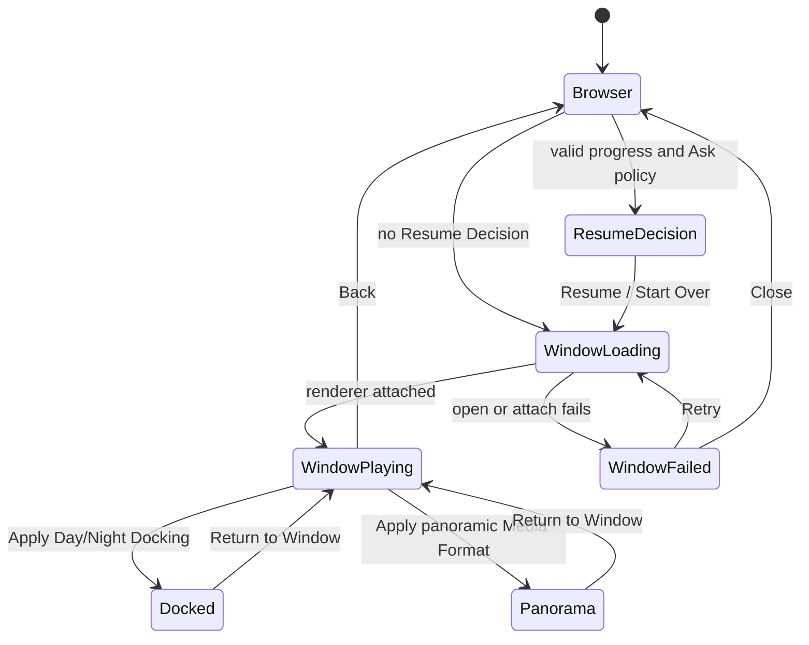

# Enchron UI 结构规格

本文件描述产品 surface 的职责与状态投影。完整行为以 [`../product-requirements.md`](../product-requirements.md) 为准；术语以 [`../../CONTEXT.md`](../../CONTEXT.md) 为准。视觉参数、布局细节与 accessibility identifier 由生产组件表达。

## Surface ownership

- Media Library 展示虚拟 Library Folder、Media Reference 与只读 Source Directory。它不拥有媒体字节、播放策略或观看状态写入。
- Window chrome 左上角拥有退出当前媒体，右上角依次放置 Dock、Video Format 与 More；媒体标题和格式信息位于左下角。它们与底部 Playback Overlay 位于同一个 Window，但不进入播放控制胶囊。
- Window Playback 的 RealityView、Window Chrome 和媒体信息属于同一个 Main Window 内容树；PlayerControls 通过底部 Ornament 附着到该 Window，不进入内容树、RealityView attachment 或独立 Window。它把同尺寸的后退 15 秒、Play/Pause/Replay、前进 15 秒放在左侧，并与 Progress Bar 保持同一行；Window Ornament 不显示 Settings 与 More。独立的 Spatial Playback Controls Window 只服务 Docked 与 Panorama，不得在 Window Playback 中出现。
- Settings 展开 Advanced Settings；Docked 提供 Screen Size、Distance、Elevation、Restore Defaults，Panorama 提供 Projection、Stereo Layout、Apply 和 Reset to Flat + Mono。Precision Timeline 由长按激活后的 Progress Bar scrubber 双击打开，不再由 Settings 打开。
- More 只提供 Subtitles、Audio Track、Playback Speed 与 Episodes。HDR、Codec、Resolution 是只读信息；App 不提供 Volume/Mute。
- Docked 与 Panorama 共用 `PlayerControlDock` 外部结构，均提供 Return to Window、Settings 与 transport；两者只在 Settings 展开内容上不同，不提供直接 Back-to-Library。
- Resume Decision 只有 Resume 与 Start Over。用户选择媒体已经承诺打开，不提供 Cancel。
- Window、Docked、Panorama 共享同一 Media Session 与 renderer；页面不得读取 PlaybackCore 私有对象、建立第二套 lifecycle 或在 fixture 中复制产品行为。

## Interaction constraints

- Progress Bar seek 到结尾之前后开始或继续播放；Precision Timeline 和逐帧完成后保持暂停。
- ended 时画面纯黑。召唤 Deck 后显示 Replay；位于结尾时前进与下一帧禁用。
- 从 Panorama 返回 Window 保留 panoramic Media Format，隐藏 Docking，并让 Panorama 按钮直接恢复刚才格式。
- 卡片 Gaze/Hover 的底边进度图只读取文件夹进入后预取的内存 projection，不触发 I/O。
- DesignPreview 只陈列生产组件，不拥有导航、产品状态或平行交互。
