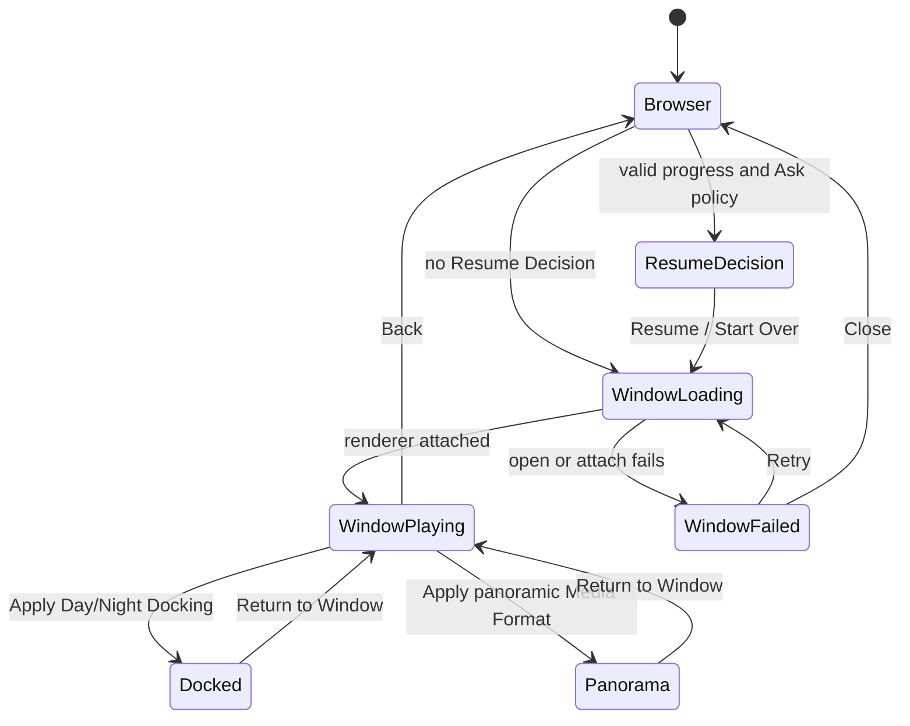

# Enchron UI 结构规格

本文件描述产品 surface 的职责与状态投影。完整行为以 [`../product-requirements.md`](../product-requirements.md) 为准；术语以 [`../../CONTEXT.md`](../../CONTEXT.md) 为准。视觉参数、布局细节与 accessibility identifier 由生产组件表达。

## Surface ownership

- Media Library 展示虚拟 Library Folder、Media Reference 与只读 Source Directory。它不拥有媒体字节、播放策略或观看状态写入。
- Window chrome 左上角拥有退出当前媒体，右上角依次放置 Dock、Video Format 与 More。视频画面不叠加媒体标题和格式信息。
- Window Playback 的 RealityView 和 Window Chrome 属于 Main Window 内容树；PlayerControls 通过底部 Ornament 附着到该 Window，不进入内容树、RealityView attachment 或独立 Window。Window Ornament 第一行左侧是同尺寸的后退 15 秒、Play/Pause/Replay、前进 15 秒，右侧是可 Hover 的只读 Thick Material 媒体信息区；第二行是普通 Progress Bar 或展开后的 Precision Timeline。Window Ornament 不显示 Settings 与 More。独立的 Spatial Playback Controls Window 只服务 Docked 与 Panorama。
- Settings 展开 Advanced Settings；Docked 提供 Screen Size、Distance、Elevation、Restore Defaults，Panorama 提供 Projection、Stereo Layout、Apply 和 Reset to Flat + Mono。Precision Timeline 由长按激活后的 Progress Bar scrubber 双击打开，与 Settings 互斥展开。
- More 提供 Playback Speed 与 Episodes。空间 Deck 的只读 Thick Material 信息区在普通状态只显示去掉扩展名的文件名，Hover 时同时显示左右两组一级媒体信息；它不可点击，也没有进一步展开状态。App 不提供 Volume/Mute。
- Docked 与 Panorama 共用 `PlayerControlDock` 外部结构，均提供 Settings、Return to Window、居中的 transport 与 More；两者只在 Return 图标和 Settings 展开内容上不同，不提供直接 Back-to-Library。Window 使用独立 Ornament 结构，但三种 Presentation 的 Precision Timeline 展开宽度一致。
- Resume Decision 只有 Resume 与 Start Over。用户选择媒体已经承诺打开，不提供 Cancel。
- Window、Docked、Panorama 共享同一 Media Session 与 renderer；页面不得读取 PlaybackCore 私有对象、建立第二套 lifecycle 或在 fixture 中复制产品行为。

## Interaction constraints

- Progress Bar 拖动期间，圆形 scrubber 与时间标识共同读取本地预览位置并连续跟手，松手后才提交 seek；等待运行时位置追上时继续显示已提交目标。Progress Bar 与前后跳转在结尾之前保持原 playing/paused 意图；Precision Timeline 和逐帧完成后保持暂停；从 ended 通过任一 seek 离开结尾后保持暂停。
- ended 时画面纯黑。召唤 Deck 后显示 Replay；位于结尾时前进与下一帧禁用。
- 从 Panorama 返回 Window 保留 panoramic Media Format，隐藏 Docking，并让 Panorama 按钮直接恢复刚才格式。
- 卡片 Gaze/Hover 的底边进度图只读取文件夹进入后预取的内存 projection，不触发 I/O。
- DesignPreview 只陈列生产组件，不拥有导航、产品状态或平行交互。
