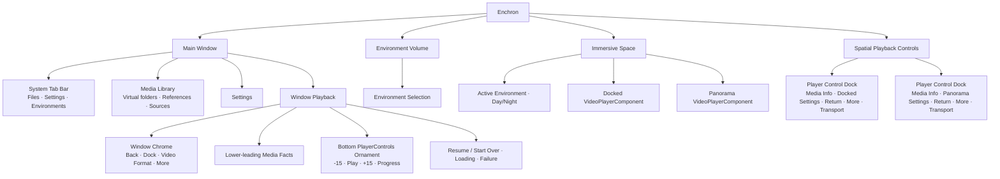
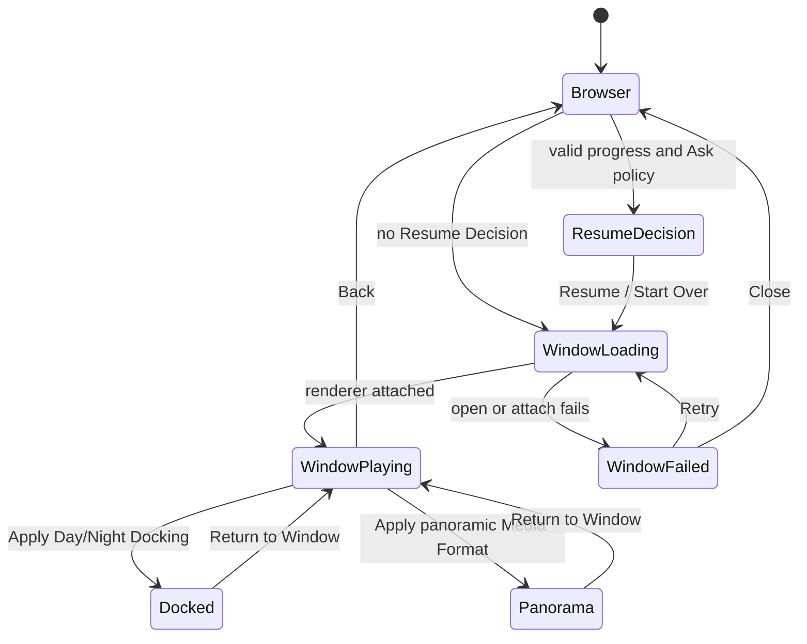

# Enchron UI 结构规格

本文件描述产品 surface 的职责与状态投影。完整行为以 [`../product-requirements.md`](../product-requirements.md) 为准；术语以 [`../../CONTEXT.md`](../../CONTEXT.md) 为准。视觉参数、布局细节与 accessibility identifier 由生产组件表达。

## Surface ownership

- Main Window 始终是同一个使用 `.automatic` 样式的系统 Window；外层玻璃、窗口圆角与窗口边界由 visionOS 拥有，浏览、加载和播放状态不得各自绘制替代外壳。浏览态使用系统 `TabView` 提供 Files、Settings 与 Environments。Files 与 Settings 承载主窗口内容；Environments 只请求激活或聚焦独立 Environment Card Volume，主窗口选择保持在原内容 Tab。
- 播放请求活动期间不挂载浏览 `TabView`，同一个 Window Playback `RealityView` 从加载开始持续挂载到 `videoVisible`。加载态只在该 `RealityView` 上显示产品 `LoadingSpinner`，不绘制额外玻璃底板；画面达到 `videoVisible` 后才显示 Window Chrome 与底部 PlayerControls Ornament。
- Media Library 展示虚拟 Library Folder、Media Reference 与只读 Source Directory。它不拥有媒体字节、播放策略或观看状态写入。
- Window chrome 左上角拥有退出当前媒体，右上角依次放置 Dock、Video Format 与 More。视频画面不叠加媒体标题和格式信息。
- Window Playback 的 RealityView 和 Window Chrome 属于 Main Window 内容树；RealityView 优先用目标化 `SpatialTapGesture` 处理视频实体上的空间点击，并以同一 RealityView 的普通点击作为空白区域回退，两者互斥且调用同一控件显隐命令。Window Video Entity 的可见画面保持完整，RealityKit 碰撞区域避开 Window 上缘的 Chrome 保护带，使 Back、Dock、Video Format 与 More 由 SwiftUI 直接接收输入；该保护带只改变命中范围，不绘制蒙版或裁切画面。PlayerControls 通过底部 Ornament 附着到该 Window，不进入内容树、RealityView attachment 或独立 Window。Window Ornament 第一行左侧是同尺寸的后退 15 秒、Play/Pause/Replay、前进 15 秒，右侧是可 Hover 的只读 Thick Material 媒体信息区；第二行是普通 Progress Bar 或展开后的 Precision Timeline。Window Ornament 不显示 Settings 与 More。独立的 Spatial Playback Controls Window 只服务 Docked 与 Panorama。
- Settings 展开 Advanced Settings；Docked 提供 Screen Size、Distance、Elevation、Restore Defaults，Panorama 提供 Projection、Stereo Layout、Apply 和 Reset to Flat + Mono。Precision Timeline 由长按激活后的 Progress Bar scrubber 双击打开，与 Settings 互斥展开。
- More 提供 Subtitles、Audio Track、Playback Speed 与 Episodes。Subtitles 包含 Off、容器内字幕轨、自动关联的独立字幕轨和 Choose Subtitle File；Window、Docked 与 Panorama 使用相同的字幕操作。空间 Deck 的只读 Thick Material 信息区在普通状态只显示去掉扩展名的文件名，Hover 时同时显示左右两组一级媒体信息；它不可点击，也没有进一步展开状态。App 不提供 Volume/Mute。
- Docked 与 Panorama 共用 `PlayerControlDock` 外部结构，均提供 Settings、Return to Window、居中的 transport 与 More；两者只在 Return 图标和 Settings 展开内容上不同，不提供直接 Back-to-Library。Window 使用独立 Ornament 结构，但三种 Presentation 的 Precision Timeline 展开宽度一致。
- Resume Decision 只有 Resume 与 Start Over。用户选择媒体已经承诺打开，不提供 Cancel。
- Window、Docked、Panorama 共享同一 Media Session 与 renderer；页面不得读取 PlaybackCore 私有对象、建立第二套 lifecycle 或在 fixture 中复制产品行为。
- Window 进入 Docked 或 Panorama 时，Main Window 在目标空间内容与 Player Controls Window 准备完成前保持可见；转换期间禁用新的 Presentation 请求。目标准备完成后由 visionOS 系统动画关闭 Main Window。两套播放界面不能同时可操作，且交接过程中始终至少存在一个可观察、可恢复的播放界面。失败时 Main Window 保留并恢复交互。

## Interaction constraints

- Progress Bar 拖动期间，圆形 scrubber 与时间标识共同读取本地预览位置并连续跟手，松手后才提交 seek；等待运行时位置追上时继续显示已提交目标。Progress Bar 与前后跳转在结尾之前保持原 playing/paused 意图；Precision Timeline 和逐帧完成后保持暂停；从 ended 通过任一 seek 离开结尾后保持暂停。
- ended 时画面纯黑。召唤 Deck 后显示 Replay；位于结尾时前进与下一帧禁用。
- 从 Panorama 返回 Window 保留 panoramic Media Format，隐藏 Docking，并让 Panorama 按钮直接恢复刚才格式。
- 卡片 Gaze/Hover 的底边进度图只读取文件夹进入后预取的内存 projection，不触发 I/O。
- DesignPreview 只陈列生产组件，不拥有导航、产品状态或平行交互。
