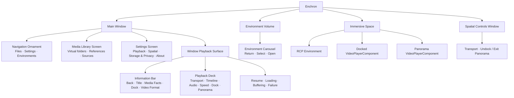
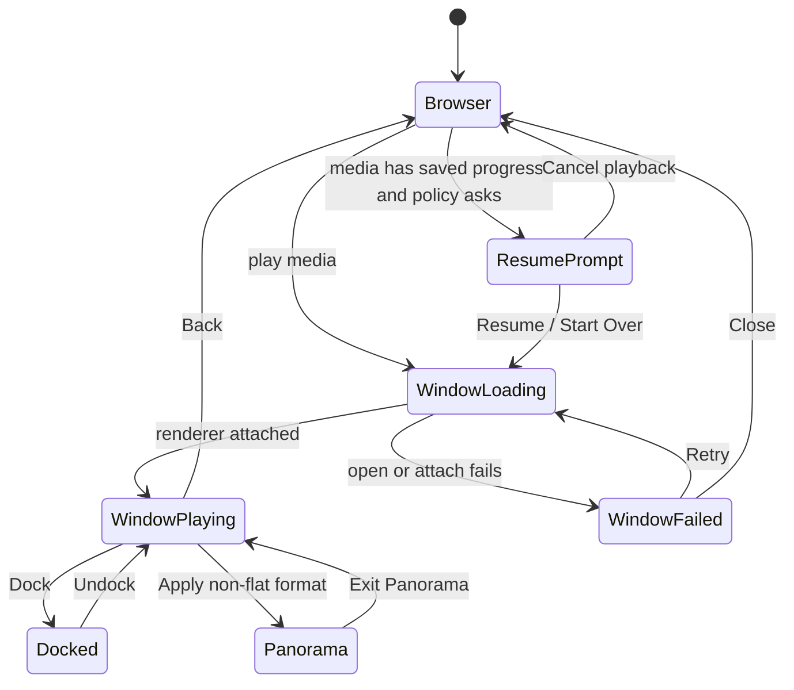

# Enchron UI 结构规格

本文件以 UI 模块为主语，描述模块拥有的状态、输入与结果。按钮的精确外观、顺序、参数和 accessibility identifier 由生产 Swift 代码表达。

Media Library Screen 默认展示 `MediaLibraryViewModel` 的虚拟目录和引用；切换到远程来源时才展示 `FileBrowsingViewModel` 的来源目录。Add Files、Add Folder Contents、Add from Photos 和远程 Add to Media Library 只建立持久引用。Settings Screen 只展示真实持久化选项；Window Playback、Docked 与 Panorama 共享 `PlaybackRuntime` 和同一个 deck 语义；Environment Volume 只选择和打开场景，不拥有播放行为。

页面不能读取 PlaybackCore 私有对象，也不能建立第二套媒体状态。组件无法满足明确的新视觉角色时才新增组件，并使用 `DesignTokens`。DesignPreview 只陈列 `Shared/Components`，产品页面本身即功能内容。
