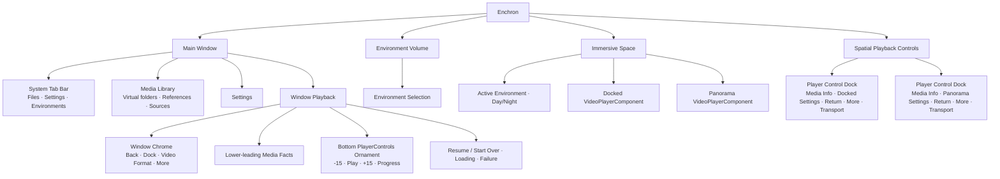
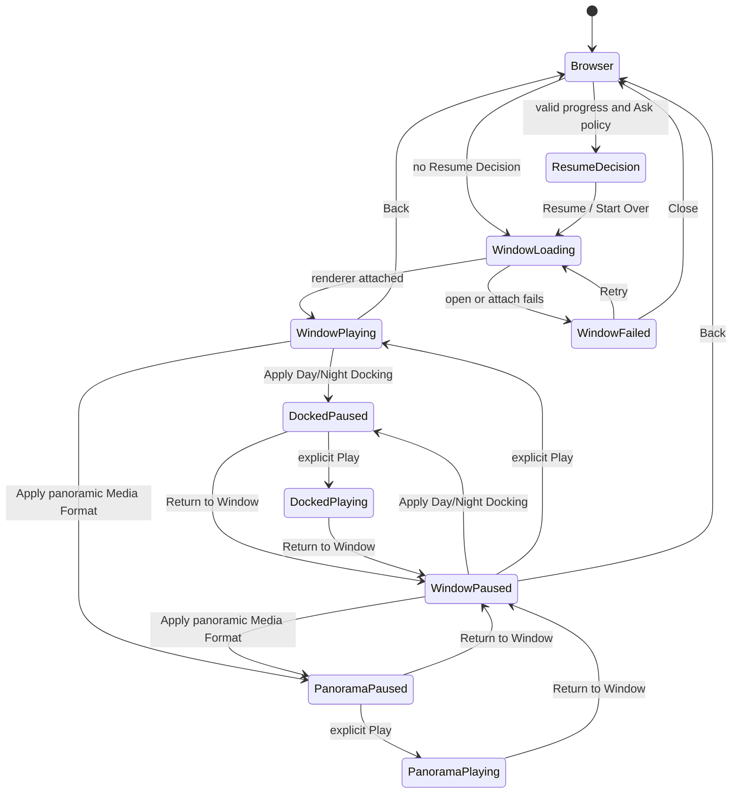

# Enchron UI 结构规格

本文件描述产品 surface 的职责与状态投影。完整行为以 [`../product-requirements.md`](../product-requirements.md) 为准；术语以 [`../../CONTEXT.md`](../../CONTEXT.md) 为准。视觉参数、布局细节与 accessibility identifier 由生产组件表达。

## Surface ownership

- Main Window 始终是同一个使用 `.automatic` 样式的系统 Window；外层玻璃、窗口圆角与窗口边界由 visionOS 拥有，浏览、加载和播放状态不得各自绘制替代外壳。浏览态使用系统 `TabView` 提供 Files、Settings 与 Environments。Files 与 Settings 承载主窗口内容；Environments 只请求激活或聚焦独立 Environment Card Volume，主窗口选择保持在原内容 Tab。
- 播放请求活动期间不挂载浏览 `TabView`，同一个 Window Playback `RealityView` 从加载开始持续挂载到 `videoVisible`。媒体打开或故障恢复等待期间在该 `RealityView` 上显示产品 `LoadingSpinner`；画面达到 `videoVisible` 后才显示 Window Chrome 与底部 PlayerControls Ornament。Presentation Transition 不进入该加载状态。
- Media Library 展示虚拟 Library Folder、Media Reference 与只读 Source Directory。它不拥有媒体字节、播放策略或观看状态写入。
- Window chrome 左上角拥有退出当前媒体，右上角依次放置 Dock、Video Format 与 More。视频画面不叠加媒体标题和格式信息。Dock 使用与 Apple TV 环境菜单相同的信息结构：顶部标题下依次显示 Default Scenic Environment 的 Dark 与 Light 两行入口，每行左侧使用圆形裁切缩略图，分隔线下方显示固定 Skybox Environment；当前目标行使用圆角底色表示选择。Dock 与 Video Format 使用同一个内联二级面板呈现位置，同一时间只显示其中一个。
- Window Playback 的 RealityView 和 Window Chrome 属于 Main Window 内容树；Window 用同一内容树上的透明 SwiftUI 点击层（visionOS 上为 `SpatialTapGesture`）接收画面点击以显隐 Player Controls。该透明层从固定的顶部 Chrome 按钮区域下方开始，顶部按钮不会因二级面板出现而重新排版；Dock 与 Video Format 面板叠在视频点击层之上，各自用完整面板形状接管其范围内的命中，面板空白区域也不会穿透到视频表面。其下的 RealityView 不参与命中。More 的系统 `Menu` 由系统拥有呈现与命中。Window Video Entity 在 Window 下不安装 RealityKit 空间点击碰撞，避免与 Chrome、菜单抢命中。PlayerControls 通过底部 Ornament 附着到该 Window，不进入内容树、RealityView attachment 或独立 Window。Window Ornament 第一行左侧是同尺寸的后退 15 秒、Play/Pause/Replay、前进 15 秒，右侧是可 Hover 的只读 Thick Material 媒体信息区；第二行是普通 Progress Bar 或展开后的 Precision Timeline。Window Ornament 不显示 Settings 与 More。独立的 Spatial Playback Controls Window 只服务 Docked 与 Panorama。
- 浏览态 Settings 提供 Default Scenic Environment，只在三个 Scenic Environment 中选择；选择结果立即更新后续 Dock Menu 的名称与缩略图，但不改变已经活动的 Environment。播放请求活动期间浏览 `TabView` 不挂载，因此用户不能在活动 Media Session 中进入 Settings。空间 Player Controls 的 Settings 展开 Advanced Settings；Docked 提供 Screen Size、Distance、Elevation、Restore Defaults，Panorama 提供 Projection、Stereo Layout、Apply 和 Reset to Flat + Mono。Precision Timeline 由 Progress Bar 的圆形 scrubber 双击打开，与 Settings 互斥展开。
- More 提供 Subtitles、Audio Track、Playback Speed 与 Episodes。Subtitles 统一包含 Off、容器内字幕轨和自动关联的同目录独立字幕轨；用户选择轨道时不需要区分来源，Window、Docked 与 Panorama 使用相同操作。空间 Deck 的只读 Thick Material 信息区在普通状态只显示去掉扩展名的文件名，Hover 时同时显示左右两组一级媒体信息；它不可点击，也没有进一步展开状态。App 不提供 Volume/Mute。
- Docked 与 Panorama 共用 `PlayerControlDock` 外部结构，均提供 Settings、Return to Window、居中的 transport 与 More。双向往回箭头 `PlayerPanel-button-exit-spatial` 是两种空间 Presentation 返回 Window 的正式入口；两者只在 Return 图标和 Settings 展开内容上不同，不提供直接 Back-to-Library。Window 使用独立 Ornament 结构，但三种 Presentation 的 Precision Timeline 展开宽度一致。
- Resume Decision 只有 Resume 与 Start Over。用户选择媒体已经承诺打开，不提供 Cancel。
- Window、Docked、Panorama 共享同一 Media Session 与 renderer；页面不得读取 PlaybackCore 私有对象、建立第二套 lifecycle 或在 fixture 中复制产品行为。
- Window、Docked 与 Panorama 之间转换时，请求接受后 Playback Lifecycle 立即进入 Paused，Core timebase rate 变为零，音频和显示帧停止推进。视觉交接使用 visionOS 系统过渡；转换期间禁用新的 Presentation 请求，源与目标不能同时接受播放界面输入。目标空间内容或 Window 内容、同一个 renderer consumer 与对应播放控件达到成功后置条件后提交目标 Presentation，并保持 Paused；失败时恢复源 Presentation 并保持 Paused。任何情况下都只有用户在当前可见 UI 显式点击 Play 后才恢复时间线、音频和连续画面。

## Interaction constraints

- Progress Bar 拖动期间，圆形 scrubber 与时间标识共同读取本地预览位置并连续跟手，松手后才提交 seek；等待运行时位置追上时继续显示已提交目标。Progress Bar 与前后跳转在结尾之前保持原 playing/paused 意图；Precision Timeline 和逐帧完成后保持暂停；从 ended 通过任一 seek 离开结尾后保持暂停。视频表面输入隐藏整个 Player Controls 时结束 Precision Timeline 的临时展开状态；下一次召唤控件时显示普通 Progress Bar。
- ended 时画面纯黑。召唤 Deck 后显示 Replay；位于结尾时前进与下一帧禁用。
- 从 Panorama 返回 Window 保留 panoramic Media Format，隐藏 Docking，并让 Panorama 按钮直接恢复刚才格式。
- Window、Docked 与 Panorama 的视频表面各自用一次输入显示 Player Controls、下一次输入隐藏、再下一次输入重新显示。Button、Menu 项、Slider 和其它 Player Controls action 只执行自身定义的操作，不调用视频表面的显隐命令。每次 Presentation 转换、回滚或系统恢复后，目标视频表面必须能先完成该显隐循环；目标仍保持 Paused，随后由用户在目标 Player Controls 中显式点击 Play，才恢复时间线、音频和连续画面。
- Docked 与 Panorama 的视频 Entity 通过 `InputTargetComponent`、有效的 `CollisionComponent` 和产品 gesture handler 接收真实 gaze + pinch。Entity 的 `AccessibilityComponent` 为同一显隐命令提供无障碍 Activate，但无障碍语义操作与 gaze + pinch 的空间 hit-test 是两条分别验收的输入路径；任何一条路径收到一次输入都只改变一次 Player Controls 可见性。
- 卡片 Gaze/Hover 的底边进度图只读取文件夹进入后预取的内存 projection，不触发 I/O。
- DesignPreview 只陈列生产组件，不拥有导航、产品状态或平行交互。
