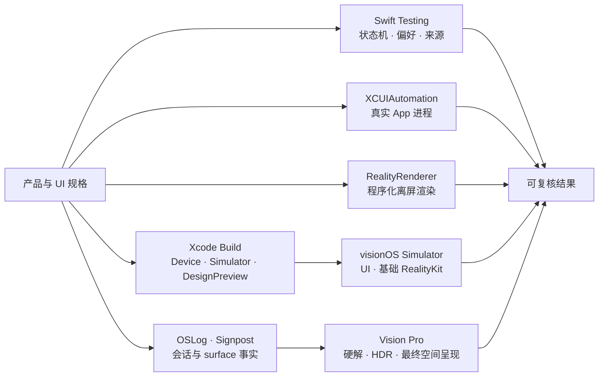

# Enchron V1 验收矩阵

| 边界 | 自动化必须证明 | 最终证据 |
|---|---|---|
| Presentation 状态机 | Window、Docked、Panorama 合法转换；Environment 独立；重复命令、直接空间互转、失败回滚 | Swift Testing |
| 来源与持久化 | 虚拟目录增删改、引用移动、三类 locator 持久化、bookmark 原址解析、搜索与排序；WebDAV 认证、列目录与 Range 读取由可选的真实服务测试验证 | Swift Testing / XCTest |
| 产品组装 | XrPlayer 与 DesignPreview 对 device / Simulator SDK 编译；只链接外部 PlaybackCore | `xcodebuild` |
| Window UI | 启动、媒体目录创建、来源入口、搜索、媒体引用直达播放、transport、Dock 菜单、正交 Video Format 菜单、Settings 分类 | XCUIAutomation / `.xcresult` |
| 空间转换 | Window、Docked、Panorama 的状态转换、Environment Context 保留与失败回退由 Swift Testing 验证；Simulator XCUIAutomation 验证 Window 中可进入的菜单；实际进入 Full Space、空间面板与返回点击只由 Vision Pro 验证 | XCUIAutomation + Swift Testing + OSLog |
| RealityKit 通用渲染 | `RealityRenderer` 在不启动产品 App 时完成 Metal texture 输出；实体与 camera 可由测试程序化构造 | macOS / visionOS Simulator XCTest |
| RealityKit 视频呈现 | PlaybackCore 的同一 `AVSampleBufferVideoRenderer` attach 到 `VideoPlayerComponent`；content type、rendering status、实际 immersive mode 与粗粒度方向图像共同构成组件证据 | 产品 `RealityView` Simulator 集成；最终以 Vision Pro 为准 |
| 媒体质量 | 硬件解码、HDR/EDR、Dolby Vision、音画同步、AIME Fisheye、空间舒适度与性能 | Vision Pro + Instruments / RealityKit Trace |

Simulator 通过不等于设备播放通过；设备不可用时必须把设备行保留为未执行边界，不能用 build、Preview 或请求状态代替。`RealityRenderer` 的 API、当前 Simulator 能力与 VideoPlayerComponent 探针边界记录在 [`docs/research/realityrenderer-programmatic-testing.md`](../research/realityrenderer-programmatic-testing.md)。visionOS 27 Simulator 当前会为 Full Space 内的控件返回全零 Accessibility 激活矩阵，因此 XCUIAutomation 可以确认 Undock / Exit Panorama 控件与语义，但不能代替真机点击返回。

## 2026-07-15 组装结果

| 验证面 | 结果 |
|---|---|
| Enchron 纯逻辑 | 31 项通过：5 项 XCTest、26 项 Swift Testing；另有 1 项真实 WebDAV 测试在未提供环境变量时按设计跳过 |
| WebDAV 外部集成 | 隔离 AList 与真实 AList/夸克均通过认证、目录解析与 1024-byte Range 读取；未提供 `ENCHRON_WEBDAV_TEST_*` 时测试自动跳过 |
| PlaybackCore | 53 项 Swift Testing 通过 |
| visionOS XCUIAutomation | visionOS 27 Simulator 全量 16 项：15 项通过，1 项 Vision Pro 空间验收按设计跳过，0 项失败。结果位于 `/tmp/Enchron-Simulator-Final-20260715-2028.xcresult` |
| Window 播放运行时 | 全量回归发现 5 条 `Modifying state during view update`；修正 `PlaybackVideoSurface` 的 RealityView 状态时序后，全部 5 个受影响入口重新通过且 `runtimeWarnings` 为 0。结果位于 `/tmp/Enchron-PlaybackSurface-Final-20260715-2046.xcresult` |
| RealityRenderer | visionOS Simulator 中 64 × 64 离屏 Metal texture 输出测试通过；`VideoPlayerComponent` 的两个合成 sample 探针会使当前 beta 的 test runner 崩溃，未进入绿色矩阵，见研究文档 |
| XrPlayer Simulator | 构建通过 |
| DesignPreview Simulator | 构建通过；补齐与生产 `SourceSidebar` 共用的 `FileBrowsingDomain.SourceType` target membership 后无预览私有替身 |
| generic visionOS Device | arm64 编译、链接与 bundle 构建通过；未连接或唤醒 Vision Pro，未执行签名安装 |
| Vision Pro | 本轮主动留到有人佩戴时验收，未运行、未抢占焦点 |

产品最低系统为 visionOS 27。Enchron App、DesignPreview、UI Tests、`RealityKitContent`、PlaybackCore package 与 FFmpeg 后续重建 target triple 统一使用 27，不保留 visionOS 26 兼容路径。

统一后，XrPlayer generic visionOS Device、DesignPreview generic visionOS Device 与 Simulator `build-for-testing` 均通过，先前 `RealityKitScripting` 27.0 链接到 26.2 target 的版本警告已经消失。PlaybackCore 以 Swift 6.4、macOS 27 和 visionOS 27 为 package 基线，并使用 audio/video Receiver async enqueue；产品媒体输入始终由 FFmpeg 解封装为 compressed `CMSampleBuffer`，不以 `AVAssetReader` 建立第二条产品路线，也不恢复 visionOS 26 target 来隐藏 API 迁移问题。

## Vision Pro 回归

真机使用同一个 `XrPlayerUITests` target，不建立 Enchron CLI 或设备内命令协议。常规 Simulator 类不进入 Full Space；`VisionProDeviceAcceptanceUITests` 只在物理设备且显式设置 `ENCHRON_VISION_PRO_ACCEPTANCE=1` 时运行，并在一次 App 启动中完成 Window → Docked → Window → Panorama → Window，避免反复安装、重启与抢占焦点。`xcodebuild build-for-testing` 可在佩戴前完成编译，佩戴后只运行这一类；OSLog、截图和 `.xcresult` 保存诊断证据。打印和日志不能代替断言。

Simulator 已覆盖 Window 播放、transport、媒体库、WebDAV/SMB 表单与空间入口菜单；真实 AList WebDAV 另由可选集成测试覆盖。真机自动回归只保留 Docked/Panorama 的一次启动往返，以及 Photos picker、权限和设备特有系统面。硬件解码、HDR/EDR、Dolby Vision、投影几何、立体方向、Fisheye、空间舒适度与 RealityKit 性能仍由设备媒体矩阵和 Instruments 验收，不能根据按钮点击成功自动推断视觉正确。
