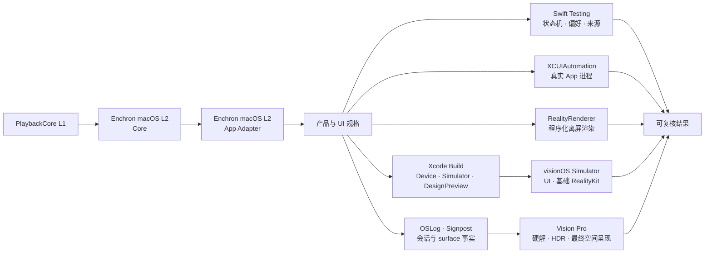

# Enchron V1 验收矩阵

本文件记录产品 UI 用例与阶段性结果；跨 PlaybackCore、macOS App、Simulator 与 Vision Pro 的门槛以 [`../acceptance/verification-system.md`](../acceptance/verification-system.md) 为准。下方 2026-07-15 结果发生在 Receiver/API 迁移之后、Enchron macOS L2 恢复之前，因此只能作为 build、logic、UI 与局部 RealityKit 证据，不能证明当前 PlaybackCore 可持续播放、音频或颜色正确。

| 边界 | 自动化必须证明 | 最终证据 |
|---|---|---|
| PlaybackCore 可播放 | Enchron macOS Core scenario 完成真实视频、音频、控制、颜色/HDR 信令与 RealityKit displayed-frame 矩阵 | macOS L2 evidence |
| App Adapter 等价 | 相同 fixture 与断言经 `PlaybackRuntime` 运行，renderer identity、timeline、控制和颜色不改变 | macOS L2 evidence |
| Presentation 状态机 | Window、Docked、Panorama 合法转换；Environment 独立；重复命令、直接空间互转、失败回滚 | Swift Testing |
| 来源与持久化 | 虚拟目录只管理引用；Media Identity 与 Content Revision 匹配后才读取 Viewing State / Media Format Preference；文件替换使旧记录失效；WebDAV 认证、列目录与 Range 读取由真实服务测试验证 | Swift Testing / XCTest |
| 产品组装 | Enchron 与 DesignPreview 对 device / Simulator SDK 编译；只链接仓库内 `Packages/PlaybackCore` | `xcodebuild` |
| Window UI | Window chrome 拥有 Back、Dock 与 Panorama；Deck 固定为 Settings、后退 10 秒、Play/Pause/Replay、前进 10 秒、More；Panorama 格式采用 Projection × Stereo Layout 后 Apply | XCUIAutomation / `.xcresult` |
| 空间转换 | Swift Testing 验证状态转换与回滚；Simulator 用真实 PlaybackCore session 进入 Docked/Panorama，组合语义点击、截图坐标 fallback、运动截图、Presentation state 与 OSLog；Vision Pro 再验收硬件与最终空间行为 | XCUIAutomation + 截图 + PlaybackCore events + OSLog |
| RealityKit 通用渲染 | `RealityRenderer` 在不启动产品 App 时完成 Metal texture 输出；实体与 camera 可由测试程序化构造 | macOS / visionOS Simulator XCTest |
| RealityKit 视频呈现 | PlaybackCore 的同一 `AVSampleBufferVideoRenderer` attach 到 `VideoPlayerComponent`；content type、rendering status、实际 immersive mode 与粗粒度方向图像共同构成组件证据 | 产品 `RealityView` Simulator 集成；最终以 Vision Pro 为准 |
| 媒体质量 | 硬件解码、HDR/EDR、Dolby Vision、音画同步、AIME Fisheye、空间舒适度与性能 | Vision Pro + Instruments / RealityKit Trace |

Simulator 通过不等于设备播放通过；设备不可用时必须把设备行保留为未执行边界，不能用 build、Preview 或请求状态代替。`RealityRenderer` 的 API、当前 Simulator 能力与 VideoPlayerComponent 探针边界记录在 [`docs/research/realityrenderer-programmatic-testing.md`](../research/realityrenderer-programmatic-testing.md)。Full Space 中 accessibility 元素若存在但不可直接命中，允许先保存截图，再按该元素的语义几何执行坐标 fallback；无人值守测试在全零或缺失几何时失败。交互式 agent 只有在查看当次截图、保存点击前后图并验证同一状态后置条件时，才可进行视觉坐标点击，结果单独标记为 `agent-assisted`。

## Vision Pro 回归

真机使用同一个 `EnchronAppUITests` target，不建立 Enchron CLI 或设备内命令协议。常规 Simulator 类不进入 Full Space；`VisionProDeviceAcceptanceUITests` 只在物理设备且显式设置 `ENCHRON_VISION_PRO_ACCEPTANCE=1` 时运行，并在一次 App 启动中完成 Window → Docked → Window → Panorama → Window，避免反复安装、重启与抢占焦点。`xcodebuild build-for-testing` 可在佩戴前完成编译，佩戴后只运行这一类；OSLog、截图和 `.xcresult` 保存诊断证据。打印和日志不能代替断言。

Simulator 已覆盖 Window 播放、transport、媒体库、WebDAV/SMB 表单与空间入口菜单；真实 AList WebDAV 另由可选集成测试覆盖。真机自动回归只保留 Docked/Panorama 的一次启动往返，以及 Photos picker、权限和设备特有系统面。硬件解码、HDR/EDR、Dolby Vision、投影几何、立体方向、Fisheye、空间舒适度与 RealityKit 性能仍由设备媒体矩阵和 Instruments 验收，不能根据按钮点击成功自动推断视觉正确。
