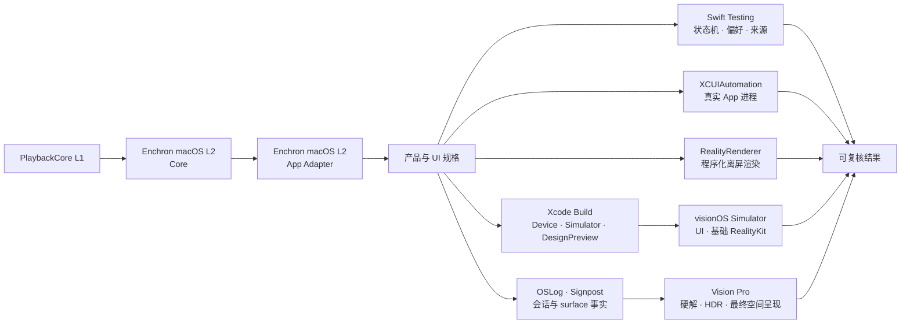

# Enchron V1 验收矩阵

本文件记录产品 UI 用例与阶段性结果；跨 PlaybackCore、macOS App、Simulator 与 Vision Pro 的门槛以 [`../acceptance/verification-system.md`](../acceptance/verification-system.md) 为准。下方 2026-07-15 结果发生在 Receiver/API 迁移之后、Enchron macOS L2 恢复之前，因此只能作为 build、logic、UI 与局部 RealityKit 证据，不能证明当前 PlaybackCore 可持续播放、音频或颜色正确。

| 边界 | 自动化必须证明 | 最终证据 |
|---|---|---|
| PlaybackCore 可播放 | Enchron macOS Core scenario 完成真实视频、音频、控制、颜色/HDR 信令与 RealityKit displayed-frame 矩阵 | macOS L2 evidence |
| App Adapter 等价 | 相同 fixture 与断言经 `PlaybackRuntime` 运行，renderer identity、timeline、控制和颜色不改变 | macOS L2 evidence |
| Presentation 状态机 | Window、Docked、Panorama 合法转换；Environment 独立；重复命令、直接空间互转、失败回滚 | Swift Testing |
| 来源与持久化 | 虚拟目录增删改、引用移动、三类 locator 持久化、bookmark 原址解析、搜索与排序；WebDAV 认证、列目录与 Range 读取由可选的真实服务测试验证 | Swift Testing / XCTest |
| 产品组装 | XrPlayer 与 DesignPreview 对 device / Simulator SDK 编译；只链接仓库内 `Packages/PlaybackCore` | `xcodebuild` |
| Window UI | 启动、媒体目录创建、来源入口、搜索、媒体引用直达播放、transport、Dock 菜单、正交 Video Format 菜单、Settings 分类 | XCUIAutomation / `.xcresult` |
| 空间转换 | Swift Testing 验证状态转换与回滚；Simulator 用真实 PlaybackCore session 进入 Docked/Panorama，组合语义点击、截图坐标 fallback、运动截图、Presentation state 与 OSLog；Vision Pro 再验收硬件与最终空间行为 | XCUIAutomation + 截图 + PlaybackCore events + OSLog |
| RealityKit 通用渲染 | `RealityRenderer` 在不启动产品 App 时完成 Metal texture 输出；实体与 camera 可由测试程序化构造 | macOS / visionOS Simulator XCTest |
| RealityKit 视频呈现 | PlaybackCore 的同一 `AVSampleBufferVideoRenderer` attach 到 `VideoPlayerComponent`；content type、rendering status、实际 immersive mode 与粗粒度方向图像共同构成组件证据 | 产品 `RealityView` Simulator 集成；最终以 Vision Pro 为准 |
| 媒体质量 | 硬件解码、HDR/EDR、Dolby Vision、音画同步、AIME Fisheye、空间舒适度与性能 | Vision Pro + Instruments / RealityKit Trace |

Simulator 通过不等于设备播放通过；设备不可用时必须把设备行保留为未执行边界，不能用 build、Preview 或请求状态代替。`RealityRenderer` 的 API、当前 Simulator 能力与 VideoPlayerComponent 探针边界记录在 [`docs/research/realityrenderer-programmatic-testing.md`](../research/realityrenderer-programmatic-testing.md)。Full Space 中 accessibility 元素若存在但不可直接命中，允许先保存截图，再按该元素的语义几何执行坐标 fallback；无人值守测试在全零或缺失几何时失败。交互式 agent 只有在查看当次截图、保存点击前后图并验证同一状态后置条件时，才可进行视觉坐标点击，结果单独标记为 `agent-assisted`。

## 2026-07-17 macOS 产品验收

| 验证面 | 结果 |
|---|---|
| 本地来源与 transport | 真实 App 可从项目生成 fixture 直达播放；播放/暂停、前后 seek、slider 拖动、Back 与控制自动隐藏通过。seek 期间由 pending target 持有滑块，不再被旧 timeline 回写拉回 |
| 音轨与字幕 | SubRip、ASS、DVB bitmap 均有真实像素差分；文本/ASS 为 libass frame，DVB 保持 bitmap frame；第二音轨与字幕在 Docked 后保持同一 session |
| 空间状态 | 同一启动完成 Window → Docked → Window → Panorama simulation → Window；macOS host 显式报告 Panorama 是 Window consumer simulation，不冒充 visionOS `ImmersiveSpace` |
| 交互回归 | 原生按钮使用共享 press-feedback style，点击不再被无效 primitive button style 吞掉；timeline、字幕安全带、presentation host 与同会话保持均有 focused regression tests |
| 自动化证据 | `/tmp/EnchronMacOSBitmapSubtitle-20260717-1330/result.json` 与 `/tmp/EnchronMacOSTransportPanorama-20260717-1342/result.json` 通过，目录内保留逐步截图与 probe 后置条件 |
| Xcode tests | macOS unit tests 8 项通过；全量和 UI-only 两次均在 UI test runner 建立连接前挂起，分别保存在 `/tmp/EnchronMacOSFull-20260717-1347.xcresult`、`/tmp/EnchronMacOSUIFull-20260717-1353.xcresult`。这是重复的 XCTest infrastructure failure，不是 UI assertion 通过，也不是产品 assertion 失败 |
| 组装与性能 | 独立 Release bundle 嵌入 `AMSMB2.framework` 后可直接启动播放；Release Time Profiler 将 App 自有诊断记录器从 100 ms / 1.736% 降到 49 ms / 0.516% |

macOS 结果是共享 SwiftUI、`PlaybackRuntime`、PlaybackCore 与 RealityKit consumer 的主要产品开发证据，但不能替代 visionOS Simulator 或 Vision Pro。特别是 Panorama simulation 只证明产品状态机、菜单、同一 session 和 Window host 收敛；最终投影几何、空间舒适度、硬件 HDR 与空间音频仍留在 visionOS 对应证据层。

## 2026-07-15 组装结果

| 验证面 | 结果 |
|---|---|
| Enchron 纯逻辑 | 31 项通过：5 项 XCTest、26 项 Swift Testing；另有 1 项真实 WebDAV 测试在未提供环境变量时按设计跳过 |
| WebDAV 外部集成 | 隔离 AList 与真实 AList/夸克均通过认证、目录解析与 1024-byte Range 读取；未提供 `ENCHRON_WEBDAV_TEST_*` 时测试自动跳过 |
| PlaybackCore | 53 项 Swift Testing 通过 |
| visionOS XCUIAutomation | visionOS 27 Simulator 全量 16 项：15 项通过，1 项 Vision Pro 空间验收按设计跳过，0 项失败。结果位于 `/tmp/Enchron-Simulator-Final-20260715-2028.xcresult` |
| Window 播放运行时 | 全量回归发现 5 条 `Modifying state during view update`；修正 `PlaybackVideoSurface` 的 RealityView 状态时序后，全部 5 个受影响入口重新通过且 `runtimeWarnings` 为 0。结果位于 `/tmp/Enchron-PlaybackSurface-Final-20260715-2046.xcresult` |
| RealityRenderer | visionOS Simulator 中 64 × 64 离屏 Metal texture 输出测试通过；`VideoPlayerComponent` 的两个合成 sample 探针会使当前 beta 的 test runner 崩溃，未进入绿色矩阵，见研究文档 |
| XrPlayer Simulator | 构建通过 |
| DesignPreview Simulator | 构建通过；补齐与生产 `SourceSidebar` 共用的 `FileBrowsingDomain.SourceType` target membership 后无预览私有替身 |
| generic visionOS Device | arm64 编译、链接与 bundle 构建通过；未连接或唤醒 Vision Pro，未执行签名安装 |
| Vision Pro | 本轮主动留到有人佩戴时验收，未运行、未抢占焦点 |

产品最低系统为 visionOS 27。Enchron App、DesignPreview、UI Tests、`RealityKitContent`、PlaybackCore package 与 FFmpeg 后续重建 target triple 统一使用 27，不保留 visionOS 26 兼容路径。

统一后，XrPlayer generic visionOS Device、DesignPreview generic visionOS Device 与 Simulator `build-for-testing` 均通过，先前 `RealityKitScripting` 27.0 链接到 26.2 target 的版本警告已经消失。PlaybackCore 以 Swift 6.4、macOS 27 和 visionOS 27 为 package 基线，并使用 audio/video Receiver async enqueue；产品媒体输入始终由 FFmpeg 解封装为 compressed `CMSampleBuffer`，不以 `AVAssetReader` 建立第二条产品路线，也不恢复 visionOS 26 target 来隐藏 API 迁移问题。

## 2026-07-16 Enchron macOS L2 恢复

Enchron 的同一 Xcode 工程已新增 `EnchronMacOS` App target，并提供真实 `RealityView`、`VideoMaterial`、Apple/FFmpeg compressed 对照、播放暂停、seek、前后跳转、倍速、音量、静音、reopen/close 与颜色诊断。`./script/build_and_run.sh --verify` 在 macOS 27 SDK 下完成 build、launch 和进程验证；`--l2-core` 以 fixture ID/hash 运行真实 App 并输出 JSON，任何 route 或断言失败都会以非零状态结束。

同一 HDR10/PQ 样片复现并关闭了五处首失败边界：FFmpeg 构建禁用 codec probing 导致 Provider/sample 丢失 BT.2020/PQ/matrix；sample assembly 没有为 MPEG range 显式写入 `FullRangeVideo=false`；FFmpeg reader copy 可与 cancel/destroy 并发；Receiver task 在持锁状态取消形成锁顺序反转；三个 actor-reentrant seek 可在等待同一旧任务后同时进入 session。修复后 PlaybackCore 66 tests 全部通过，并新增三连 seek 最终请求所有权回归。

`local-hdr10-pq-hevc-aac-001` 在真实 Enchron macOS App 中连续完成三轮 Apple compressed 与 FFmpeg compressed 双路线机器场景。两条路线均通过 Receiver、共享 synchronizer、RealityKit consumer/displayed pixel、audio sample/buffer 推进、3 秒稳定播放、pause/resume、volume/mute、1.5× 与恢复、前后 seek、三次快速连续 seek、cleanup barrier 与 reopen；sample 与 displayed pixel 均保持 BT.2020/PQ/video-range。主 artifact 为 `/tmp/enchron-l2-core-hdr10-after-seek-fix.json`，稳定性复测为 `/tmp/enchron-l2-core-repeat-1.json` 与 `/tmp/enchron-l2-core-repeat-2.json`。

生产 `XrPlayer/App/PlaybackRuntime.swift` 现已作为同一 `EnchronMacOS` target 的源文件参与编译；macOS 只对 visionOS `AVAudioSession` 生命周期做平台空操作，不替换 PlaybackCore audio renderer。`--l2-app` 通过该生产 adapter 运行同一 fixture、RealityKit consumer 和断言，只允许产品 FFmpeg route。主 artifact `/tmp/enchron-l2-app-adapter-hdr10.json` 与复测 `/tmp/enchron-l2-app-adapter-repeat.json` 均通过，并与 Core FFmpeg 一致记录 `receiverAsyncBackpressure`、`platform=macOS`、BT.2020/PQ/video-range、`&xv0`、相同控制结果和最终连续 seek 所有权。Enchron 30 项 Swift Testing 与 5 项 XCTest 通过，1 项外部 WebDAV 测试按设计跳过；generic visionOS device 构建通过。

这仍不是完整 L2/L3 通过。该 fixture 许可未登记且只有单音轨；机器 audio renderer 事实不能替代物理输出上的可听音频与严格音画同步，也没有覆盖 SDR、HLG、Dolby Vision、B-frame、长媒体和扩展稳定性。Simulator 当前 revision 以及 Vision Pro L3 都尚未执行，因此不得由本地 Core/App Adapter 结果推导整个 Enchron 验收通过。

## Vision Pro 回归

真机使用同一个 `XrPlayerUITests` target，不建立 Enchron CLI 或设备内命令协议。常规 Simulator 类不进入 Full Space；`VisionProDeviceAcceptanceUITests` 只在物理设备且显式设置 `ENCHRON_VISION_PRO_ACCEPTANCE=1` 时运行，并在一次 App 启动中完成 Window → Docked → Window → Panorama → Window，避免反复安装、重启与抢占焦点。`xcodebuild build-for-testing` 可在佩戴前完成编译，佩戴后只运行这一类；OSLog、截图和 `.xcresult` 保存诊断证据。打印和日志不能代替断言。

Simulator 已覆盖 Window 播放、transport、媒体库、WebDAV/SMB 表单与空间入口菜单；真实 AList WebDAV 另由可选集成测试覆盖。真机自动回归只保留 Docked/Panorama 的一次启动往返，以及 Photos picker、权限和设备特有系统面。硬件解码、HDR/EDR、Dolby Vision、投影几何、立体方向、Fisheye、空间舒适度与 RealityKit 性能仍由设备媒体矩阵和 Instruments 验收，不能根据按钮点击成功自动推断视觉正确。
