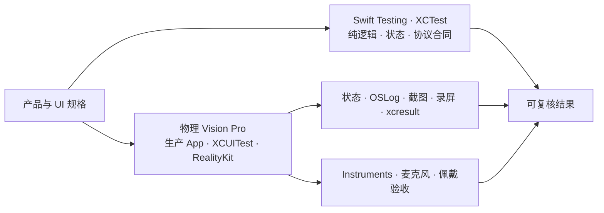

# Enchron V1 验收矩阵

本文件记录产品 UI 用例与阶段性结果；当前产品运行门槛以物理 Vision Pro 为准，完整规则见 [`../acceptance/verification-system.md`](../acceptance/verification-system.md)。历史阶段性结果不能替代当前产品树上的完整验证。

| 边界 | 自动化必须证明 | 最终证据 |
|---|---|---|
| PlaybackCore 可播放 | PlaybackCore 合同验证完成真实视频、音频、控制、颜色/HDR 信令与时间线矩阵 | PlaybackCore test evidence |
| 产品集成等价 | Enchron App 经生产 `PlaybackRuntime` 连接同一媒体与 renderer consumer，状态投影、renderer identity、timeline、控制和颜色符合合同 | 物理 Vision Pro `.xcresult` 与状态附件 |
| Presentation 状态机 | Window、Docked、Panorama 合法转换；Environment 独立；重复命令、直接空间互转、失败回滚 | Swift Testing |
| 来源与持久化 | 虚拟目录只管理引用；Media Identity 与 Content Revision 匹配后才读取 Viewing State / Media Format Preference；文件替换使旧记录失效；WebDAV 认证、列目录与 Range 读取由真实服务测试验证 | Swift Testing / XCTest |
| 产品组装 | Enchron 与 DesignPreview 对 Vision Pro device SDK 编译；只链接仓库内 `Packages/PlaybackCore` | `xcodebuild`；构建成功不构成运行通过 |
| Window UI | Window chrome 拥有 Back、Dock 与 Panorama；Deck 将 Settings 与 More 分置两端，后退 15 秒、Play/Pause/Replay、前进 15 秒组成居中 transport group；Panorama 格式采用 Projection × Stereo Layout 后 Apply | 物理 Vision Pro XCUIAutomation、截图与 `.xcresult` |
| 空间转换 | Swift Testing 验证确定性状态转换；物理 Vision Pro 使用真实 PlaybackCore Session 进入 Docked/Panorama，保存语义操作、运动截图、Presentation state 与 OSLog | 物理 Vision Pro XCUIAutomation、截图、PlaybackCore events 与 OSLog |
| RealityKit 通用渲染 | `RealityRenderer` 在不启动产品 App 时完成 Metal texture 输出；实体与 camera 可由测试程序化构造 | 物理 Vision Pro XCTest；只作为组件隔离证据 |
| RealityKit 视频呈现 | PlaybackCore 的同一 `AVSampleBufferVideoRenderer` attach 到 `VideoPlayerComponent`；content type、rendering status、实际 immersive mode 与方向图像共同构成组件证据 | 物理 Vision Pro 产品 `RealityView` 集成结果 |
| 媒体质量 | 硬件解码、HDR/EDR、Dolby Vision、音画同步、AIME Fisheye、空间舒适度与性能 | Vision Pro + Instruments / RealityKit Trace |

物理 Vision Pro 不可用时，依赖 App、UI、RealityKit 或系统 Scene 的场景保持未评估，不能用 build、Preview 或请求状态代替。正式用户路径要求 Accessibility 元素存在、启用且可命中；控件不可命中时保存 hierarchy 与截图并使该路径失败。根据元素语义几何执行的坐标点击只用于继续取得故障定位证据，不能把该场景改判为通过。交互式 agent 只有在查看当次截图、保存点击前后图并验证同一状态后置条件时，才可进行这种诊断点击，结果单独标记为 `agent-assisted`。

## Vision Pro 回归

真机使用同一个 `EnchronAppUITests` Target，不建立 Enchron CLI 或设备内命令协议。`VisionProDeviceAcceptanceUITests` 只在物理设备且显式设置 `ENCHRON_VISION_PRO_ACCEPTANCE=1` 时运行。`xcodebuild build-for-testing` 可在佩戴前完成编译，设备保持解锁后按场景集执行，避免不必要的反复安装、重启与抢占焦点。OSLog、状态、Accessibility hierarchy、截图与 `.xcresult` 保存在同一结果中；打印和日志不能替代断言。

Window 播放、transport、媒体库、WebDAV/SMB 表单、空间入口菜单、Docked/Panorama 和设备特有系统面全部按 [`../acceptance/regression-matrix.md`](../acceptance/regression-matrix.md) 在物理 Vision Pro 上执行。真实服务器集成测试另外覆盖协议与生产 adapter。硬件解码、HDR/EDR、Dolby Vision、投影几何、立体方向、Fisheye、空间舒适度与 RealityKit 性能使用各自能够直接证明的设备媒体、帧证据、Instruments 或佩戴者验收，不能根据按钮点击成功自动推断正确。
